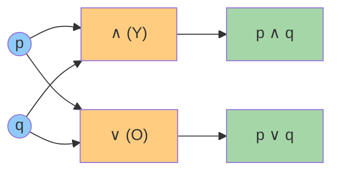
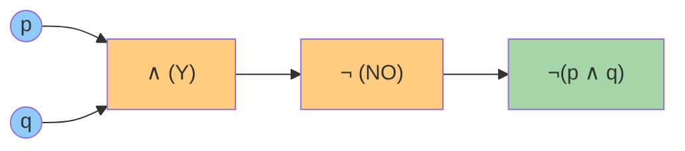
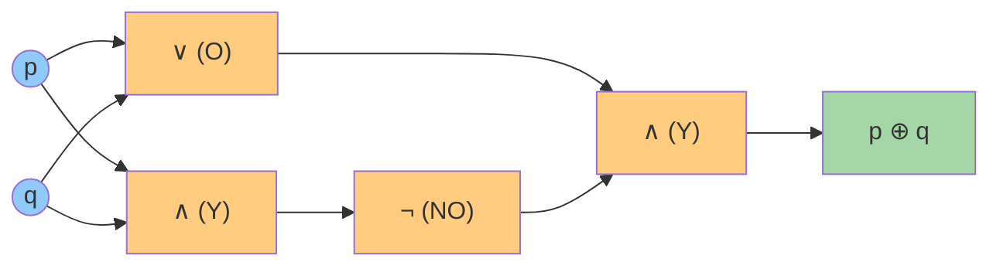
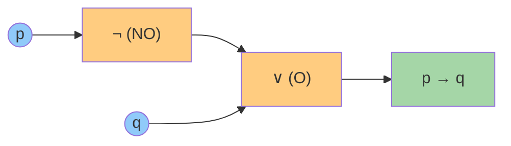
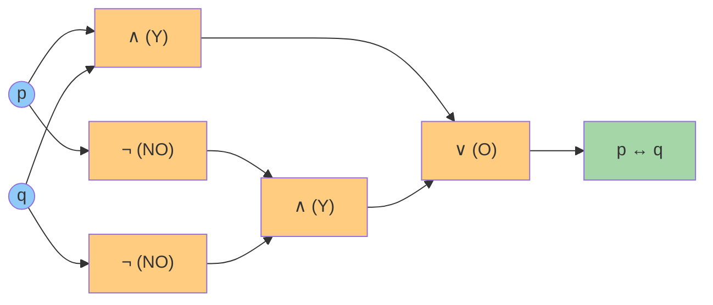

# Lógica

## Proposiciones

Una **proposición** es una oración que **puede ser verdadera o falsa** (aunque no sepamos cuál).

- "Hoy es lunes" → proposición (tiene valor de verdad).
- "¿Qué hora es?" → NO es proposición (pregunta).
- "x + 3 = 5" → NO es proposición (no sabemos qué es x; sin valor definido).

## Conectivos lógicos

| Conectivo     | Símbolo               | Se lee             | Se cumple cuando…                   | Analogía                             |
| ------------- | --------------------- | ------------------ | ----------------------------------- | ------------------------------------ |
| Negación      | $\neg p$              | "no p"             | p es falsa                          | Interruptor apagado                  |
| Conjunción    | $p \land q$           | "p y q"            | **ambos** verdaderos                | Lista de requisitos: necesitas TODOS |
| Disyunción    | $p \lor q$            | "p o q"            | **al menos uno** verdadero          | Menú: puedes elegir uno u otro       |
| Condicional   | $p \to q$             | "si p, entonces q" | falsa solo si p verdadera y q falsa | Promesa: "si estudias, apruebas"     |
| Bicondicional | $p \leftrightarrow q$ | "p si y solo si q" | ambos iguales                       | Términos de un contrato              |

> [!tip] Truco de memoria (¡como tu Anotaciones.md!)
> El **∧** ("y") parece una **V invertida**, y el **∨** ("o") es la V normal. **"La V invertida es el Y"** → la conjunción es el Y. Si la V está normal (apuntando abajo… hacia el *o* abierto), es el *o*. Easy.

## Tabla de verdad (ejemplo)

| $p$ | $q$ | $p \land q$ | $p \lor q$ | $p \to q$ |
| --- | --- | ----------- | ---------- | --------- |
| V   | V   | V           | V          | V         |
| V   | F   | F           | V          | F         |
| F   | V   | F           | V          | V         |
| F   | F   | F           | F          | V         |

> [!warning] El clásico error
> $p \to q$ (condicional) **no significa causa**. "Si llueve, la calle se moja" es verdadera aunque hoy no llueva (si no llueve, no prometimos nada). Solo es falsa si **llueve y NO se moja**.

## Circuitos lógicos (a partir de la tabla de verdad)

Cada columna de la tabla anterior se puede **construir físicamente** con puertas lógicas: el **Y** ($\land$) es una compuerta *AND*, el **O** ($\lor$) es una *OR* y la negación ($\neg$) es una *NOT*. Este circuito genera exactamente las columnas $p \land q$ y $p \lor q$:

**Cómo leerlo con la tabla:** si $p = V$ y $q = F$ (fila 2), la compuerta **Y** exige *ambas* entradas verdaderas, así que su salida es **F**; la compuerta **O** solo exige *una*, así que su salida es **V**. Exactamente la fila 2 de la tabla. ✅

## Ejemplo 1 — Compuerta NAND: $\neg(p \land q)$

La **NAND** es una compuerta **Y** (*AND*) seguida de una **negación** (*NOT*). Es famosa porque es **universal**: con puras NAND se puede construir cualquier circuito, es decir, todas las demás compuertas. Su tabla de verdad:

| $p$ | $q$ | $p \land q$ | $\neg(p \land q)$ |
| --- | --- | ----------- | ----------------- |
| V   | V   | V           | F                 |
| V   | F   | F           | V                 |
| F   | V   | F           | V                 |
| F   | F   | F           | V                 |

**Observación:** solo falla cuando **ambas** entradas son verdaderas → es como un "Y" al revés.

## Ejemplo 2 — O exclusivo (XOR): $p \oplus q$

El **XOR** ("o exclusivo") es verdadero cuando **exactamente una** de las dos entradas es verdadera. Se diferencia del $\lor$ (que admite ambas): es justamente el error clásico que advierte el método de estudio. Se construye con *OR*, *AND* y *NOT*:

$$
p \oplus q \equiv (p \lor q) \land \neg(p \land q)
$$

| $p$ | $q$ | $p \oplus q$ |
| --- | --- | ------------ |
| V   | V   | F            |
| V   | F   | V            |
| F   | V   | V            |
| F   | F   | F            |

**Uso real:** el XOR aparece en casi toda la **criptografía** y en los **circuitos sumadores**. Al sumar dos bits: $0+0=0$, $0+1=1$, $1+0=1$, $1+1=10$ → el bit del resultado es 0 cuando hay acarreo. Es exactamente la tabla del XOR. 

## Ejemplo 3 — Implicación ($p \to q$) y bicondicional ($p \leftrightarrow q$)

Estos dos conectivos ya aparecían en la tabla inicial; aquí se entienden con un ejemplo propio y con su **circuito equivalente**.

### Implicación ($p \to q$): "si p, entonces q"

> [!tip] Analogía — la promesa
> "Si estudias, apruebas". La única forma de que la promesa sea **falsa** es que estudies **y** no apruebes. En cualquier otro caso, la promesa se cumple (o no se puede comprobar: si no estudias, no prometimos nada).

La implicación se puede construir con dos puertas: una negación y un OR:

$$
p \to q \equiv \neg p \lor q
$$

| $p$ | $q$ | $\neg p$ | $\neg p \lor q$ | $p \to q$ |
| --- | --- | -------- | -------------- | -------- |
| V   | V   | F        | V              | V        |
| V   | F   | F        | F              | F        |
| F   | V   | V        | V              | V        |
| F   | F   | V        | V              | V        |

Observa que las columnas $\neg p \lor q$ y $p \to q$ son **idénticas**: son el mismo circuito con otra cara.

### Bicondicional ($p \leftrightarrow q$): "p si y solo si q"

> [!tip] Analogía — los dos interruptores
> Una lámpara con dos interruptores (escalera): la luz está encendida cuando **ambos están en la misma posición** (los dos arriba o los dos abajo). El bicondicional es verdadero cuando **ambos valores coinciden**.

El bicondicional se construye con dos AND y un OR (más sus negaciones): "ambos verdaderos **o** ambos falsos":

$$
p \leftrightarrow q \equiv (p \land q) \lor (\neg p \land \neg q)
$$

| $p$ | $q$ | $p \land q$ | $\neg p \land \neg q$ | $(p \land q) \lor (\neg p \land \neg q)$ | $p \leftrightarrow q$ |
| --- | --- | ----------- | --------------------- | ---------------------------------------- | --------------------- |
| V   | V   | V           | F                     | V                                        | V                     |
| V   | F   | F           | F                     | F                                        | F                     |
| F   | V   | F           | F                     | F                                        | F                     |
| F   | F   | F           | V                     | V                                        | V                     |

> [!success] Para recordar
> - $p \to q$: el **único** caso falso es $V \to F$ (promesa rota).
> - $p \leftrightarrow q$: verdadero cuando **ambos coinciden** (V–V o F–F); falso cuando se llevan la contra (V–F o F–V).

**Uso real:** la implicación modela reglas y contratos ("si pagas, hay envío gratis"); el bicondicional modela **definiciones exactas** ("un número es par **si y solo si** es divisible por 2") y comparaciones de igualdad en programación.

## Cuantificadores

- **Universal** $\forall$: "para todo". "$\forall x \in \mathbb{N},\ x \geq 0$" → todos los naturales son ≥ 0.
- **Existencial** $\exists$: "existe al menos uno". "$\exists x \in \mathbb{N},\ x = 5$" → hay un natural igual a 5.

## Equivalencias útiles: Leyes de De Morgan

$$
\neg(p \land q) \equiv \neg p \lor \neg q \qquad \neg(p \lor q) \equiv \neg p \land \neg q
$$

"No es cierto que llueva **y** haga frío" = "no llueve **o** no hace frío". Siempre se invierte el conectivo.

> [!example] Para practicar
> Escribe en símbolos: "No todos los estudiantes llegaron temprano". Pista: niégale el $\forall$ y verás aparecer un $\exists$ con negación.

## ✅ Evaluación

A continuación se presentan las preguntas de opción múltiple sobre el tema. Se responden en la aplicación `evaluador.py` o directamente en esta página web.

### Pregunta 1

¿Qué operación lógica es verdadera **solo** cuando ambas proposiciones son verdaderas?

a) Disyunción ($p \lor q$)
b) Conjunción ($p \land q$)
c) Implicación ($p \to q$)
d) Negación ($\lnot p$)

> **b) Conjunción ($p \land q$)**

---

### Pregunta 2

En la implicación $p \to q$, la única combinación que la hace **falsa** es:

a) $p$ verdadera y $q$ verdadera
b) $p$ falsa y $q$ falsa
c) $p$ verdadera y $q$ falsa
d) $p$ falsa y $q$ verdadera

> **c) $p$ verdadera y $q$ falsa**

---

### Pregunta 3

Por la ley de De Morgan, la negación de $p \land q$ es:

a) $\lnot p \land \lnot q$
b) $p \lor q$
c) $\lnot p \lor \lnot q$
d) $p \land \lnot q$

> **c) $\lnot p \lor \lnot q$**

---

### Pregunta 4

Una proposición **equivalente** a $p \to q$ es:

a) $\lnot p \lor q$
b) $p \lor q$
c) $\lnot p \land q$
d) $q \to p$

> **a) $\lnot p \lor q$**

---

### Pregunta 5

En un circuito lógico, la compuerta **NAND** equivale a:

a) OR con salida negada
b) AND con salida negada
c) NOT con salida negada
d) XOR con salida negada

> **b) AND con salida negada**

---
