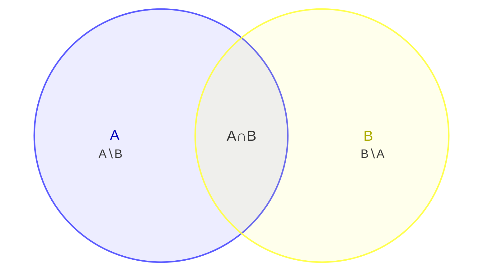

# Conjuntos

## Conjuntos (repaso exprés)

Ya los conoces del curso de estadística: un **conjunto** es una colección bien definida. Símbolos: $\in$ (pertenece), $\subseteq$ (subconjunto), $\cup$ (unión), $\cap$ (intersección), $\emptyset$ (vacío).

## Definir un conjunto: por extensión y por comprensión

Hay **dos formas equivalentes** de especificar un conjunto:

| Forma | Idea | Ejemplo |
|-------|------|---------|
| **Por extensión** | Se **enumeran** todos sus elementos entre llaves | $A = \{1, 2, 3, 4\}$ |
| **Por comprensión** | Se da la **propiedad** que deben cumplir | $A = \{x \mid x \in \mathbb{N},\ x \leq 4\}$ |

La notación por comprensión se lee así: "el conjunto de todos los $x$ **tal que** ($\mid$) $x$ pertenece a los naturales **y** $x$ es menor o igual a 4".

> [!tip] Truco de lectura
> Dentro de las llaves siempre hay **dos partes**: (1) el símbolo del elemento y (2) la condición, separadas por $\mid$ ("tal que"):
> $$\{ \underbrace{x}_{\text{elemento}} \mid \underbrace{x \in \mathbb{N},\ x \leq 4}_{\text{condición}} \}$$

**Reglas importantes:**

- Los elementos **no se repiten**: $\{1, 2, 2, 3\} = \{1, 2, 3\}$.
- El **orden no importa**: $\{1, 2, 3\} = \{3, 1, 2\}$.
- La forma por comprensión es **imprescindible** cuando el conjunto es infinito o enorme: no se puede enumerar a los pares, pero sí escribirlos como $\{x \mid x = 2k,\ k \in \mathbb{N}\}$.

**Ejemplos lado a lado:**

| Por extensión | Por comprensión | Conjunto |
| ------------- | --------------- | -------- |
| $\{a, e, i, o, u\}$ | $\{x \mid x \text{ es vocal}\}$ | Las vocales |
| $\{2, 4, 6, 8\}$ | $\{x \mid x \in \mathbb{N},\ x \text{ es par},\ x \leq 8\}$ | Pares hasta 8 |
| $\{1, 4, 9, 16\}$ | $\{x^2 \mid x \in \mathbb{N},\ 1 \leq x \leq 4\}$ | Cuadrados perfectos pequeños |

> [!info] Conecta con tu curso
> Esta misma distinción aparece en el **tema 01 de tu curso de estadística inferencial** (*Definición de conjunto*). Lo que aquí es teoría de conjuntos, allá se convierte en el lenguaje del espacio muestral y los sucesos.

## Conjuntos especiales

| Conjunto | Símbolo | ¿Qué es? | Ejemplo |
|----------|---------|----------|---------|
| **Vacío** | $\emptyset$ (o $\{\}$) | No tiene elementos | $\{x \mid x \neq x\}$ |
| **Universal** | $\Omega$ (o $U$) | Contiene todo lo que se está considerando | Todos los estudiantes de la clase |
| **Unitario** | $\{a\}$ | Tiene exactamente un elemento | $\{2\}$ |
| **Finito / Infinito** | — | Con número de elementos finito o no | $\{1,2,3\}$ vs $\mathbb{N}$ |
| **Subconjunto** | $A \subseteq B$ | Todo elemento de $A$ está en $B$ | $\{1\} \subseteq \{1,2\}$ |
| **Subconjunto propio** | $A \subset B$ | $A \subseteq B$ pero $A \neq B$ | $\{1\} \subset \{1,2\}$ |
| **Potencia** | $\mathcal{P}(A)$ | El conjunto de **todos** los subconjuntos de $A$ | $A=\{1,2\} \Rightarrow \mathcal{P}(A)=\{\emptyset, \{1\}, \{2\}, \{1,2\}\}$ |

> [!tip] Regla estrella del conjunto potencia
> Si $A$ tiene $n$ elementos, entonces $\mathcal{P}(A)$ tiene **$2^n$** elementos. Es la primera aparición del **exponente 2** en el conteo (volverá con fuerza en combinatoria).

Los **conjuntos numéricos** también son conjuntos: $\mathbb{N}$ (naturales), $\mathbb{Z}$ (enteros), $\mathbb{Q}$ (racionales), $\mathbb{R}$ (reales) y $\mathbb{C}$ (complejos). Cada uno **contiene al anterior**:

$$
\mathbb{N} \subset \mathbb{Z} \subset \mathbb{Q} \subset \mathbb{R} \subset \mathbb{C}
$$

> [!info] Para la matemática discreta
> Se trabaja casi siempre con $\mathbb{N}$ y $\mathbb{Z}$ (lo contable), y con $\mathbb{Q}$ para razones y probabilidades. Los reales $\mathbb{R}$ se dejan para el cálculo (lo continuo).

## Operaciones entre conjuntos

Con $A = \{1, 2, 3\}$, $B = \{3, 4, 5\}$ y universo $\Omega = \{1, 2, 3, 4, 5, 6\}$:

| Operación | Símbolo | Resultado | Ejemplo | Analogía |
|-----------|---------|-----------|---------|----------|
| **Unión** | $A \cup B$ | Elementos de $A$ o de $B$ (o ambos) | $\{1,2,3,4,5\}$ | El menú: eliges uno u otro |
| **Intersección** | $A \cap B$ | Elementos comunes a ambos | $\{3\}$ | Requisitos: necesitas TODOS |
| **Diferencia** | $A \setminus B$ | De $A$ que **no** están en $B$ | $\{1,2\}$ | Lo tuyo sin lo compartido |
| **Complemento** | $A^c$ (o $\bar{A}$) | Del universo que **no** están en $A$ | $\{4,5,6\}$ | "Todo lo demás" (depende de $\Omega$) |
| **Diferencia simétrica** | $A \triangle B$ | En uno u otro, pero **no en ambos** | $\{1,2,4,5\}$ | El **XOR** de la Unidad 1 aplicado a conjuntos |
| **Producto cartesiano** | $A \times B$ | Todos los pares ordenados $(a,b)$ | $\{(1,3),(1,4),...,(3,5)\}$ (9 pares) | Coordenadas (fila, columna) |

## Diagrama de Venn: las operaciones de un vistazo

Un **diagrama de Venn** dibuja los conjuntos como círculos: cada **región** del dibujo es una combinación distinta de pertenencias (estar en $A$, en $B$, en ambos o en ninguno). Con dos conjuntos hay 4 regiones:

**Lectura de las regiones (con $A=\{1,2,3\}$, $B=\{3,4,5\}$, $\Omega=\{1,...,6\}$):**

| Región del dibujo | Contiene | Operación que la "prende" |
|-------------------|----------|---------------------------|
| Solo dentro de $A$ ($A \setminus B$) | $\{1,2\}$ | **Diferencia** $A \setminus B$ |
| Solape de ambos ($A \cap B$) | $\{3\}$ | **Intersección** $A \cap B$ |
| Solo dentro de $B$ ($B \setminus A$) | $\{4,5\}$ | **Diferencia** $B \setminus A$ |
| Fuera de ambos círculos | $\{6\}$ | **Complemento** $(A \cup B)^c$ |

Cada **operación** enciende una combinación de regiones:

| Operación | Regiones que toma | Resultado ($A=\{1,2,3\}$, $B=\{3,4,5\}$) |
|-----------|-------------------|------------------------------------------|
| **Unión** $A \cup B$ | A∖B + A∩B + B∖A (todo lo de ambos círculos) | $\{1,2,3,4,5\}$ |
| **Intersección** $A \cap B$ | Solo el solape | $\{3\}$ |
| **Diferencia** $A \setminus B$ | Solo A∖B | $\{1,2\}$ |
| **Diferencia simétrica** $A \triangle B$ | A∖B + B∖A (todo menos el solape) | $\{1,2,4,5\}$ |
| **Complemento** $A^c$ | Todo lo que queda **fuera** del círculo de $A$ | $\{4,5,6\}$ |

> [!note] Sobre la versión
> Los diagramas de Venn de Mermaid usan la sintaxis `venn-beta` (disponible desde Mermaid **v11.12.3**). El sitio mkdocs ya carga Mermaid v11; en Obsidian solo se verán si tu instalación es reciente y trae Mermaid 11.

**Cardinalidad** $|A|$ = número de elementos. Para contar una unión sin contar dos veces lo repetido:

$$
|A \cup B| = |A| + |B| - |A \cap B|
$$

(Este es el **principio de inclusión-exclusión**, que retomaremos en la Unidad 5.)

> [!warning] Cuidado con el complemento
> $A^c$ **depende del universo** elegido. Si $\Omega = \{1,2,3\}$, entonces $\{1,2\}^c = \{3\}$; pero si $\Omega = \{1,2,3,4,5,6\}$, entonces $\{1,2\}^c = \{3,4,5,6\}$. Siempre pregunta: ¿cuál es el universo?

**Propiedades útiles (así se simplifican expresiones):**

| Propiedad | Fórmula |
|-----------|---------|
| De Morgan | $(A \cup B)^c = A^c \cap B^c$ y $(A \cap B)^c = A^c \cup B^c$ |
| Distributiva | $A \cap (B \cup C) = (A \cap B) \cup (A \cap C)$ |
| Doble complemento | $(A^c)^c = A$ |
| Con el universo y el vacío | $A \cup A^c = \Omega$ y $A \cap A^c = \emptyset$ |

> [!example] Para practicar
> Con $A = \{1,2,3\}$, $B = \{3,4,5\}$ y $\Omega = \{1,2,3,4,5,6\}$: calcula $A \triangle B$ y verifica que $(A \cup B)^c = \{6\}$. Pista: primero $A \cup B = \{1,2,3,4,5\}$, luego su complemento es lo que falta para llegar a $\Omega$.

## Métodos de demostración

Demostrar una afirmación es **convencer sin dejar dudas**, con reglas, no con opiniones.

| Método | Idea | Analogía |
|--------|------|----------|
| **Directa** | Partes de lo que sabes y encadenas pasos hasta la conclusión | Seguir una receta paso a paso |
| **Contrapositiva** | En lugar de probar "si p entonces q", pruebas "si no q entonces no p" (equivalente) | Si no ves humo, es que no hay fuego (equivale a: si hay fuego, hay humo) |
| **Contradicción** | Supones lo contrario y llegas a un absurdo | En un juicio: "supongamos que el sospechoso es inocente… pero eso contradice la evidencia" |
| **Inducción** | Pruebas el primer caso y luego que si un caso vale, el siguiente también | **Dominó**: si cae la primera ficha y cada ficha tumba a la siguiente, caen TODAS |

> [!example] Demostración directa mínima
> Afirmación: "Si $n$ es par, entonces $n^2$ es par".
> Como $n$ es par, $n = 2k$. Entonces $n^2 = (2k)^2 = 4k^2 = 2(2k^2)$, que es par. ✅

## ✅ Evaluación

A continuación se presentan las preguntas de opción múltiple sobre el tema. Se responden en la aplicación `evaluador.py` o directamente en esta página web.

### Pregunta 1

El conjunto $A = \{x \mid x \in \mathbb{N},\ x \leq 3\}$ expresado **por extensión** es:

a) $\{1, 2, 3\}$
b) $\{0, 1, 2, 3\}$
c) $\{1, 2, 3, 4\}$
d) $\{-1, 0, 1, 2\}$

> **a) $\{1, 2, 3\}$**

---

### Pregunta 2

Si $|A| = 3$, la cardinalidad del **conjunto potencia** $\mathcal{P}(A)$ es:

a) 3
b) 6
c) 8
d) 9

> **c) 8**

---

### Pregunta 3

Con $A = \{1,2,3\}$ y $B = \{3,4\}$, la **diferencia** $A \setminus B$ es:

a) $\{1,2\}$
b) $\{3\}$
c) $\{1,2,3,4\}$
d) $\{4\}$

> **a) $\{1,2\}$**

---

### Pregunta 4

La **unión** de $A = \{1,2\}$ y $B = \{2,3\}$ es:

a) $\{1,2,3\}$
b) $\{1,2,2,3\}$
c) $\{2\}$
d) $\{1,3\}$

> **a) $\{1,2,3\}$**

---

### Pregunta 5

Por De Morgan para conjuntos, $(A \cap B)^c$ es:

a) $A^c \cap B^c$
b) $A^c \cup B^c$
c) $(A \cup B)^c$
d) $A \setminus B$

> **b) $A^c \cup B^c$**

---
