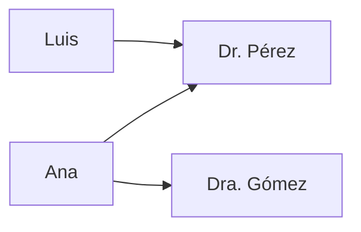
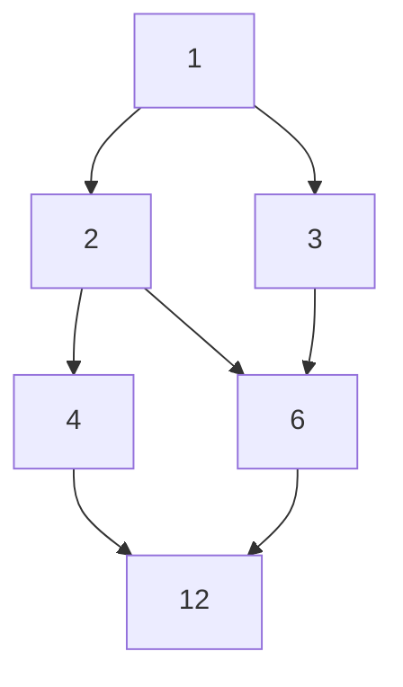

# Relaciones y funciones

> [!abstract] ¿De qué trata esta unidad?
> Las relaciones capturan **vínculos** entre elementos ("quién con quién", "qué es subconjunto de qué"). Las funciones son el caso especial donde cada entrada tiene **una sola** salida. Esta unidad conecta directo con conjuntos (U2): una relación *es* un subconjunto del producto cartesiano.

## 3.1 Pares ordenados y producto cartesiano

Un **par ordenado** $(a, b)$ es un par donde **el orden importa**: $(a,b) 
eq (b,a)$ salvo que $a=b$.

El **producto cartesiano** $A \times B$ es el conjunto de *todos* los pares ordenados con primera componente en $A$ y segunda en $B$:

$$A \times B = \{ (a,b) \mid a \in A,\ b \in B \}$$

> [!example] Con $A = \{1, 2\}$ y $B = \{x, y\}$:
> $A \times B = \{(1,x), (1,y), (2,x), (2,y)\}$ → **4 pares** = $|A| \cdot |B| = 2 \cdot 2 = 4$

| Propiedad | Fórmula | Intuición |
|-----------|---------|-----------|
| Cardinalidad | $\|A \times B\| = \|A\| \cdot \|B\|$ | Cada elemento de $A$ se combina con cada uno de $B$ |
| No conmutativo | $A \times B \neq B \times A$ (gral.) | El orden de los pares cambia |
| Producto con el vacío | $A \times \emptyset = \emptyset$ | No hay con qué formar pares |

> [!tip] Analogía
> Un producto cartesiano es como un **menú combinado**: si hay 3 sopas y 4 platos fuertes, hay $3 \times 4 = 12$ menús posibles. Cada menú es un par ordenado (sopa, plato fuerte).

---

## 3.2 Relaciones: definición formal

Una **relación** $R$ de $A$ a $B$ es un subconjunto del producto cartesiano:

$$R \subseteq A \times B$$

Si $(a, b) \in R$, escribimos $a\,R\,b$ y decimos que "$a$ está relacionado con $b$".

> [!example] En la base de datos de un hospital:
> - $A$ = pacientes, $B$ = doctores
> - $R = \{ (Ana, Dr. Pérez), (Ana, Dra. Gómez), (Luis, Dr. Pérez) \}$
> - Ana está relacionada con dos doctores; Luis con uno.
> - Cada fila de la tabla "citas" **es** un par de la relación.

Relación | Pares | ¿Qué significa?
---------|-------|----------------
$\leq$ en $\mathbb{N}$ | $(1,1),(1,2),(2,2),(1,3)\dots$ | "es menor o igual que"
$\|$ en $\mathbb{N}$ | $(2,4),(3,9),(2,6)\dots$ | "divide a"
$\subseteq$ en $\mathcal{P}(X)$ | $(\emptyset, \emptyset),(\{1\},\{1,2\})\dots$ | "es subconjunto de"

---

## 3.3 Representaciones de una relación

**1) Matriz de adyacencia** (útil para computador): filas = elementos de $A$, columnas = elementos de $B$, y un $1$ si están relacionados (0 si no).

> [!example] Con $A=\{1,2,3\}$, $B=\{a,b\}$ y $R=\{(1,a),(2,a),(2,b)\}$:
>
> | $R$ | $a$ | $b$ |
> |-----|-----|-----|
> | **1** | 1 | 0 |
> | **2** | 1 | 1 |
> | **3** | 0 | 0 |

**2) Digrafo** (diagrama de flechas): nodos = elementos de $A$, una flecha $x \to y$ por cada par $(x,y) \in R$.

---

## 3.4 Propiedades de una relación (en un mismo conjunto)

Decimos que $R$ es una relación **sobre** $A$ cuando $R \subseteq A \times A$.

| Propiedad | Definición | Ejemplo cotidiano |
|-----------|------------|-------------------|
| **Reflexiva** | $\forall a:\; a\,R\,a$ | "$x \leq x$" siempre |
| **Simétrica** | $a\,R\,b \Rightarrow b\,R\,a$ | Amistad: si soy tu amigo, tú eres el mío |
| **Antisimétrica** | $a\,R\,b \land b\,R\,a \Rightarrow a=b$ | Orden: si $a \leq b$ y $b \leq a$, entonces $a=b$ |
| **Transitiva** | $a\,R\,b \land b\,R\,c \Rightarrow a\,R\,c$ | Edad: Ana < Beto y Beto < Carlos ⇒ Ana < Carlos |

> [!warning] Errores comunes
> - **Simétrica ≠ antisimétrica**: no son opuestas. "$\leq$" es antisimétrica (y no simétrica); "=" es ambas a la vez.
> - **Antisimétrica no pide** que $a\,R\,b$ y $b\,R\,a$ existan: solo dice que *si* existen ambos, entonces $a=b$.

**Relación de equivalencia** = reflexiva + simétrica + transitiva. Divide a $A$ en **clases de equivalencia** (grupos disjuntos cuya unión es $A$).

> [!example] "Tener el mismo resto al dividir por 3" ($a \equiv b \mod 3$)
> - Clases: $\{0,3,6,\dots\}$, $\{1,4,7,\dots\}$, $\{2,5,8,\dots\}$
> - Refleja el **concepto de módulo**: la base de los relojes ($\bmod 12$), días de la semana ($\bmod 7$).

**Orden parcial** = reflexiva + antisimétrica + transitiva. Ejemplo: "$\subseteq$" ordena conjuntos como cajas anidadas.

---

## 3.5 Diagrama de Hasse (orden parcial)

Un **diagrama de Hasse** dibuja un orden parcial omitiendo: lazos (reflexiva), flechas deducibles (transitiva) y el orden obvio. Para el orden por divisibilidad en $\{1,2,3,4,6,12\}$ ($a \preceq b$ si $a \mid b$):

El **máximo** (si existe) es el $12$; el **mínimo** es el $1$. Elementos como $2$ y $3$ son **incomparables** (ni $2 \mid 3$ ni $3 \mid 2$).

---

## 3.6 Funciones

Una **función** $f: A \to B$ asigna a cada elemento de $A$ **exactamente un** elemento de $B$. La diferencia clave con una relación: **no puede haber dos flechas distintas saliendo del mismo elemento**.

| Tipo | Definición | Analogía |
|------|------------|----------|
| **Inyectiva** (uno a uno) | $f(a_1)=f(a_2) \Rightarrow a_1=a_2$ | DNI: cada persona tiene número distinto |
| **Sobreyectiva** (sobre) | $\forall b \in B,\; \exists a \in A: f(a)=b$ | Cada asiento del cine está ocupado |
| **Biyectiva** | Inyectiva + sobreyectiva | Casilleros: cada persona su casillero y viceversa (tiene inversa) |

> [!example] $f: \mathbb{N} \to \mathbb{N}$ con $f(n) = n^2$
> - **Inyectiva** ✅: si $n^2 = m^2$ entonces $n = m$.
> - **Sobreyectiva** ❌: $5$ no es un cuadrado perfecto, nadie lo "produce".
>
> $f: \mathbb{Z} \to \mathbb{Z}$, $f(n) = n+1$ es **biyectiva**: cada entero tiene exactamente un predecesor y sucesor.

**Conteo de funciones** (con $|A|=m$, $|B|=n$):

| Tipo | Cantidad | Ejemplo ($m=3$, $n=2$) |
|------|----------|------------------------|
| Cualquier función | $n^m$ | $2^3 = 8$ |
| Inyectivas | $n(n-1)\cdots(n-m+1)$ | $2 \cdot 1 = 2$ (solo si $m \leq n$) |
| Biyectivas | $n!$ | solo si $m = n$ → $3! = 6$ |

---

## 3.7 Composición e inversa

**Composición**: $(g \circ f)(x) = g(f(x))$ — primero se aplica $f$, luego $g$.

> [!example] $f(n) = n+1$ y $g(n) = 3n$:
> - $(g \circ f)(n) = 3(n+1) = 3n+3$
> - $(f \circ g)(n) = (3n)+1 = 3n+1$ → **la composición no es conmutativa** ($f \circ g \neq g \circ f$).

**Inversa**: solo las funciones **biyectivas** tienen inversa $f^{-1}$, que deshace a $f$: $f^{-1}(f(x)) = x$.

> [!tip] En programación
> La composición de funciones es la base del *pipeline* (encadenar operaciones) y de los *decorators*. La inversa aparece en criptografía RSA: una función (cifrar) y su inversa (descifrar) usando claves.

---

## 3.8 Aplicaciones en computación

- **Bases de datos relacionales**: cada tabla es una relación; las *joins* son composiciones de relaciones.
- **Grafos y redes**: un grafo dirigido es una relación $\text{nodos} \times \text{nodos}$; la matriz de adyacencia es su representación computable.
- **Tablas hash**: una función $\text{clave} \to \text{índice}$; si no es inyectiva hay *colisiones* (dos claves al mismo índice).
- **Lenguajes de programación**: los *tipos* son conjuntos y las *funciones* van de tipos a tipos (base de la verificación de tipos).

## ✅ Evaluación

A continuación se presentan las preguntas de opción múltiple sobre el tema. Se responden en la aplicación `evaluador.py` o directamente en esta página web.

### Pregunta 1

El **producto cartesiano** $A \times B$ con $|A|=2$ y $|B|=3$ tiene:

a) 2 pares
b) 3 pares
c) 5 pares
d) 6 pares

> **d) 6 pares**

---

### Pregunta 2

Una relación de **equivalencia** debe ser:

a) Reflexiva, simétrica y transitiva
b) Reflexiva, antisimétrica y transitiva
c) Simétrica y sobreyectiva
d) Inyectiva y transitiva

> **a) Reflexiva, simétrica y transitiva**

---

### Pregunta 3

Una función $f: A \to B$ es **sobreyectiva** cuando:

a) Cada elemento de $A$ tiene una imagen distinta
b) Todo elemento de $B$ es imagen de algún elemento de $A$
c) Tiene inversa
d) $|A| = |B|$

> **b) Todo elemento de $B$ es imagen de algún elemento de $A$**

---

### Pregunta 4

¿Cuál de estas funciones $f: \mathbb{N} \to \mathbb{N}$ es **inyectiva pero no sobreyectiva**?

a) $f(n) = n+1$
b) $f(n) = n^2$
c) $f(n) = 0$
d) $f(n) = n$

> **b) $f(n) = n^2$**

---

### Pregunta 5

La función inversa $f^{-1}$ existe **solo** si $f$ es:

a) Inyectiva
b) Sobreyectiva
c) Biyectiva
d) Constante

> **c) Biyectiva**

---
