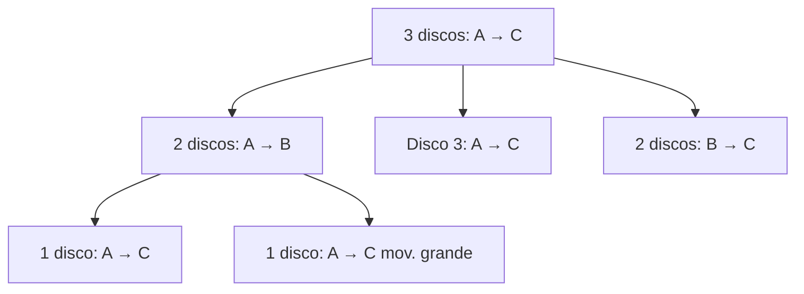

# Inducción y recursión

> [!abstract] ¿De qué trata esta unidad?
> La **inducción** es el método estrella para demostrar que una propiedad vale para *todos* los naturales. La **recursión** define objetos (y algoritmos) en términos de sí mismos. Son dos caras de la misma moneda: la inducción demuestra, la recursión construye.

## 4.1 Inducción simple (primer principio)

Para probar que una propiedad $P(n)$ vale para **todos** los $n \geq n_0$:

1. **Base:** verificas $P(n_0)$.
2. **Paso inductivo:** supón $P(k)$ (hipótesis inductiva) y demuestra $P(k+1)$.

> [!example] La suma clásica
> $1 + 2 + 3 + \cdots + n = \dfrac{n(n+1)}{2}$
> - **Base**: $1 = 1(2)/2 = 1$ ✅
> - **Paso**: si vale para $n$, entonces $(1 + \cdots + n) + (n+1) = \frac{n(n+1)}{2} + (n+1) = \frac{(n+1)(n+2)}{2}$ ✅
> ¡Y así para todos los naturales!

> [!tip] Analogía de las fichas de dominó
> La base es **derribar la primera ficha**; el paso inductivo es probar que **cada ficha derriba a la siguiente**. Si ambas cosas funcionan, caen todas.

**Otros ejemplos clásicos de inducción:**

| Proposición | Base | Truco del paso |
|-------------|------|----------------|
| Suma de impares: $1+3+\cdots+(2n-1)=n^2$ | $n=1$: $1=1^2$ | El siguiente impar agrega $2n+1$: $n^2+2n+1=(n+1)^2$ |
| $2^n > n$ | $n=1$: $2>1$ | De $2^n>n$ se sigue $2^{n+1}>2n\geq n+1$ (para $n\geq1$) |
| $3 \mid n^3 - n$ | $n=1$: $0$ divisible | Factoriza $(k+1)^3-(k+1)$ usando $k^3-k$ |

---

## 4.2 Inducción fuerte (segundo principio)

En el paso inductivo puedes suponer que la propiedad vale para **todos** los valores anteriores, no solo $k$:

$$P(n_0), P(n_0+1), \ldots, P(k) \Rightarrow P(k+1)$$

> [!example] Todo número $n \geq 2$ es producto de primos (teorema fundamental de la aritmética)
> - **Base**: $n=2$ es primo ✅
> - **Paso**: si $n$ es compuesto, $n = a \cdot b$ con $2 \leq a,b < n$. Por hipótesis fuerte, $a$ y $b$ ya son productos de primos, así que $n$ también. ✅

> [!warning] ¿Cuándo usar inducción fuerte?
> Cuando el paso inductivo necesita un valor **más atrás** que $k$ (como en $n=a\cdot b$, donde necesitas $a$ y $b$, no solo $n-1$). Fibonacci, divisibilidad y teoremas de existencia son casos típicos.

---

## 4.3 Recursión

Un objeto es **recursivo** si se define en términos de sí mismo, pero con un **caso base** que detiene la recursión.

- **Factorial:** $n! = n \cdot (n-1)!$, con $0! = 1$.
- **Fibonacci:** $F_n = F_{n-1} + F_{n-2}$, con $F_0 = 0$, $F_1 = 1$ (¡el famoso problema de los conejos!).

> [!tip] Analogía
> La recursión es como las **muñecas rusas**: abres una y dentro hay otra más pequeña, hasta llegar a la más chica (el caso base). Luego vas cerrando de regreso.

Una **recurrencia** es la versión con ecuaciones: expresa un término en función de los anteriores. Ejemplo: $T(n) = T(n-1) + 1$ con $T(1)=1$ describe los pasos de un algoritmo que recorre $n$ elementos.

---

## 4.4 Torre de Hanoi: la recursión clásica

Reglas: mueve $n$ discos de la estaca A a la C, usando B como auxiliar, **uno a la vez** y **sin poner un disco grande sobre uno pequeño**.

La solución recursiva:
1. Mueve $n-1$ discos de A a B (usando C).
2. Mueve el disco grande de A a C (1 movimiento).
3. Mueve los $n-1$ discos de B a C (usando A).

$$T(n) = 2\,T(n-1) + 1, \qquad T(1) = 1 \quad \Rightarrow \quad T(n) = 2^n - 1$$

> [!example] Con 3 discos: $2^3 - 1 = 7$ movimientos
> La leyenda dice que los monjes de Benarés mueven 64 discos de oro y el mundo terminará cuando terminen: $2^{64}-1 \approx 1.8 \times 10^{19}$ movimientos... ¡a un movimiento por segundo serían ~584 mil millones de años!

---

## 4.5 Recursión vs iteración en programación

| Aspecto | Recursión | Iteración (bucle) |
|---------|-----------|-------------------|
| Definición | La función se llama a sí misma | Un `while`/`for` se repite |
| Estado | Cada llamada tiene su propio *stack frame* | Una variable de control compartida |
| Claridad | Ideal para estructuras anidadas (árboles, grafos) | Más directa para secuencias planas |
| Riesgo | *Stack overflow* si falta caso base | Bucle infinito si la condición no avanza |
| Costo | Cada llamada consume memoria | Menos memoria en general |

> [!warning] El caso base es obligatorio
> Sin caso base, la recursión se desborda: `stack overflow`. Es como las muñecas rusas sin la más pequeña: nunca terminas de abrir.

---

## 4.6 Recurrencias y divide y vencerás

Muchos algoritmos importantes siguen el patrón: **dividir** el problema, **resolver** las partes (recursivamente) y **combinar** los resultados.

| Algoritmo | Recurrencia | Complejidad resultante |
|-----------|-------------|------------------------|
| Recorrido lineal | $T(n)=T(n-1)+1$ | $O(n)$ |
| Búsqueda binaria | $T(n)=T(n/2)+1$ | $O(\log n)$ |
| Merge sort | $T(n)=2T(n/2)+n$ | $O(n \log n)$ |
| Insertion sort | $T(n)=T(n-1)+n$ | $O(n^2)$ |

> [!tip] Memoria visual
> $O(n)$, $O(\log n)$, $O(n\log n)$ y $O(n^2)$ son las **cuatro complejidades que dominan la vida real**. Cuando veas un algoritmo, pregúntate en cuál cae: esa es la diferencia entre un programa que "aguanta" y uno que "muere" con datos grandes.

---

## 4.7 Inducción estructural (avanzado)

Cuando la definición de un objeto es recursiva (como los árboles o las listas), la inducción se aplica **sobre la estructura** del objeto, no sobre un número:

- **Base**: la propiedad vale para los casos atómicos (hoja, lista vacía).
- **Paso**: si vale para las partes, vale para el objeto construido con ellas.

> [!example] En un árbol binario completo, $\text{hojas} = \text{nodos internos} + 1$
> - **Base**: árbol de un solo nodo → 1 hoja, 0 internos: $1 = 0+1$ ✅
> - **Paso**: un árbol con raíz y dos subárboles $T_1, T_2$: $\text{hojas}=\text{hojas}_1+\text{hojas}_2 = (\text{int}_1+1)+(\text{int}_2+1) = (\text{int}_1+\text{int}_2+1)+1 = \text{int}+1$ ✅

> [!tip] En la práctica
> Cada vez que escribes una función sobre un árbol o una lista enlazada, estás haciendo inducción estructural: un caso para la base (lista vacía / hoja) y otro que combina el resto.

## ✅ Evaluación

A continuación se presentan las preguntas de opción múltiple sobre el tema. Se responden en la aplicación `evaluador.py` o directamente en esta página web.

### Pregunta 1

En la inducción, para probar $1+2+\cdots+n = \frac{n(n+1)}{2}$ el **caso base** es:

a) $n=0$
b) $n=1$
c) $n=2$
d) $n=\infty$

> **b) $n=1$**

---

### Pregunta 2

Con $F_0=0$ y $F_1=1$, el término $F_5$ de Fibonacci es:

a) 3
b) 5
c) 8
d) 13

> **b) 5**

---

### Pregunta 3

La **Torre de Hanoi** con 3 discos requiere exactamente:

a) 3 movimientos
b) 5 movimientos
c) 7 movimientos
d) 8 movimientos

> **c) 7 movimientos**

---

### Pregunta 4

La complejidad del **merge sort** (divide y vencerás) es:

a) $O(n)$
b) $O(\log n)$
c) $O(n \log n)$
d) $O(n^2)$

> **c) $O(n \log n)$**

---

### Pregunta 5

Toda función **recursiva** necesita, para no desbordarse:

a) Un bucle
b) Un caso base
c) Una variable global
d) Punteros

> **b) Un caso base**

---
