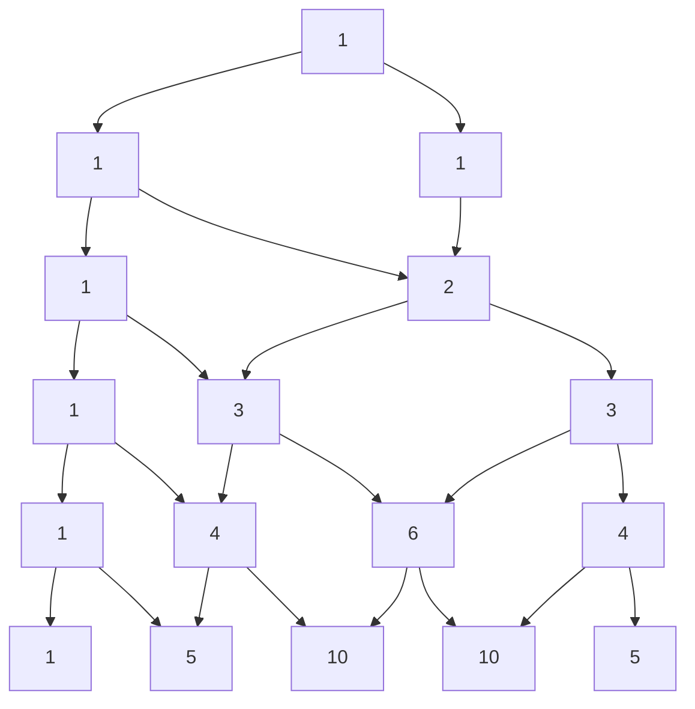

# Combinatoria y probabilidad discreta

> [!abstract] ¿De qué trata esta unidad?
> La combinatoria responde "**¿cuántas formas hay?**". Es la base para calcular probabilidades en espacios discretos (cada resultado igualmente probable) y aparece en algoritmos, contraseñas, loterías y análisis de complejidad.

## 5.1 Los dos principios básicos

- **Principio de la suma:** si hay $m$ formas de hacer A y $n$ formas de hacer B (excluyentes), hay $m + n$ formas de hacer A **o** B.
- **Principio del producto:** si hay $m$ formas de hacer A y luego $n$ formas de hacer B, hay $m \times n$ formas de hacer A **y** B.

> [!example] Menú del almuerzo
> - 3 sopas + 4 platos fuertes + 2 postres → $3 \times 4 \times 2 = 24$ menús posibles (principio del producto).
> - Si además hay café **o** té (2 bebidas): $24 \times 2 = 48$.
> - "Voy a la cafetería o a la tienda" con $4$ y $3$ opciones → $4+3=7$ caminos (principio de la suma).

---

## 5.2 Permutaciones y combinaciones

| Concepto | Fórmula | ¿Cuándo? | Ejemplo |
|----------|---------|----------|---------|
| **Permutación** $P(n,k)$ | $\dfrac{n!}{(n-k)!}$ | Orden **importa**, sin repetición | Podios de carrera (1°, 2°, 3°) |
| **Combinación** $C(n,k)$ | $\binom{n}{k} = \dfrac{n!}{k!(n-k)!}$ | Orden **no importa** | Elegir 3 amigos de 5 |
| **Permutación con repetición** | $n^k$ | Orden importa, se puede repetir | Claves de 4 dígitos: $10^4=10000$ |
| **Permutación de todos** $P(n,n)$ | $n!$ | Ordenar $n$ objetos distintos | Ordenar 5 libros: $5! = 120$ |

> [!tip] La regla de oro
> Pregúntate: **¿cambia el resultado si intercambio dos elementos?** Sí → permutación (orden importa). No → combinación.

> [!example] Equipo de 2 de entre 4 personas (Ana, Beto, Carla, Dany)
> - Con orden (capitán, vice): $P(4,2) = 4 \cdot 3 = 12$ opciones.
> - Sin orden (solo el equipo): $C(4,2) = \frac{4!}{2!2!} = 6$ opciones: AB, AC, AD, BC, BD, CD.

**Propiedades útiles de $\binom{n}{k}$:**
$$\binom{n}{k} = \binom{n}{n-k}, \qquad \binom{n}{0} = \binom{n}{n} = 1, \qquad \binom{n+1}{k} = \binom{n}{k-1} + \binom{n}{k}$$

La última es la **identidad de Pascal**: cada número del triángulo de Pascal es la suma de los dos de arriba.

---

## 5.3 Triángulo de Pascal y binomio de Newton

El **triángulo de Pascal** ordena los coeficientes $\binom{n}{k}$:

**Binomio de Newton:**
$$(x+y)^n = \sum_{k=0}^{n} \binom{n}{k}\, x^{n-k} y^k$$

> [!example] $(x+y)^3 = x^3 + 3x^2y + 3xy^2 + y^3$
> Los coeficientes $1,3,3,1$ son la fila 3 del triángulo de Pascal. Con $x=y=1$: $2^3 = 1+3+3+1 = 8$ ✅

---

## 5.4 Principio del palomar

Si tienes más **palomas** que **nidos**, al menos un nido tiene dos palomas.

> [!example] Ejemplos clásicos
> - En un grupo de **13 personas**, al menos dos nacieron el mismo mes (13 palomas, 12 nidos).
> - Entre **367 personas**, al menos dos comparten cumpleaños (días del año).
> - En una ciudad con más de 400,000 habitantes, al menos dos tienen el mismo teléfono (pues hay solo $10^6 \times$ prefijos... en general: $n$ objetos > $m$ cajas).

**Versión generalizada:** si repartes $n$ objetos en $k$ cajas, alguna caja tiene al menos $\lceil n/k \rceil$ objetos.

---

## 5.5 Inclusión-exclusión

Para contar uniones sin contar dos veces lo repetido:

$$|A \cup B| = |A| + |B| - |A \cap B|$$

Con tres conjuntos:

$$|A \cup B \cup C| = |A|+|B|+|C| - |A\cap B| - |A\cap C| - |B\cap C| + |A\cap B\cap C|$$

> [!example] Encuesta
> 60 leen el diario A, 40 el diario B, 20 ambos → $|A \cup B| = 60+40-20 = 80$ personas leen al menos uno.

---

## 5.6 Probabilidad discreta

En un espacio con resultados **igualmente probables**:

$$P(\text{evento}) = \frac{\text{casos favorables}}{\text{casos posibles}}$$

> [!example] Dado de 6 caras
> - $P(\text{par}) = 3/6 = 1/2$.
> - $P(\text{mayor que 4}) = 2/6 = 1/3$.
> - $P(\text{par y mayor que 4}) = P(\{6\}) = 1/6$.
> - $P(\text{par o mayor que 4}) = 3/6 + 2/6 - 1/6 = 4/6 = 2/3$ (inclusión-exclusión).

**Probabilidad con combinaciones:** en una lotería de $n$ números, escogiendo $k$:

$$P(\text{ganar}) = \frac{1}{\binom{n}{k}}$$

> [!tip] En la práctica
> La probabilidad de ganar la lotería de 6 de 49 es $1/\binom{49}{6} \approx 1/13{,}983{,}816$: más probable que te caiga un rayo. La combinatoria te deja *ver* esos números antes de comprar el billete.

---

## 5.7 Principios avanzados (vistazo)

- **Principio de inclusión-exclusión generalizado** para $n$ conjuntos: alterna sumas y restas de intersecciones.
- **Permutaciones con repetición de objetos iguales:** con $n$ objetos donde hay $n_1$ iguales, $n_2$ iguales...: $\dfrac{n!}{n_1!\,n_2!\cdots}$ (anagramas de "MISSISSIPPI").
- **Coeficientes multinomiales:** $\dfrac{n!}{n_1!\,n_2!\cdots n_k!}$ reparten $n$ objetos en $k$ grupos de tamaños dados.

> [!example] Anagramas de "SOL"
> Las 3 letras distintas: $3! = 6$ palabras (SOL, SLO, OSL, OLS, LSO, LOS). Con letras repetidas se divide: "ANANÁ" tiene $6!/3! = 120$ anagramas distintos (las 3 A son indistinguibles).

## ✅ Evaluación

A continuación se presentan las preguntas de opción múltiple sobre el tema. Se responden en la aplicación `evaluador.py` o directamente en esta página web.

### Pregunta 1

Si hay 3 sopas y 4 platos fuertes, el número de menús posibles (suma de opciones independientes) es:

a) 7
b) 12
c) 3
d) 4

> **b) 12**

---

### Pregunta 2

La permutación $P(5,2)$ (orden importa) vale:

a) 10
b) 20
c) 60
d) 120

> **b) 20**

---

### Pregunta 3

La combinación $\binom{5}{3}$ (orden no importa) vale:

a) 10
b) 15
c) 20
d) 60

> **a) 10**

---

### Pregunta 4

Por el **principio del palomar**, en un grupo de 13 personas:

a) Al menos 2 nacieron el mismo mes
b) Exactamente 2 nacieron el mismo mes
c) Ninguna comparte mes
d) Al menos 12 nacieron el mismo mes

> **a) Al menos 2 nacieron el mismo mes**

---

### Pregunta 5

El coeficiente de $x^2y$ en el desarrollo de $(x+y)^3$ es:

a) 1
b) 2
c) 3
d) 6

> **c) 3**

---
