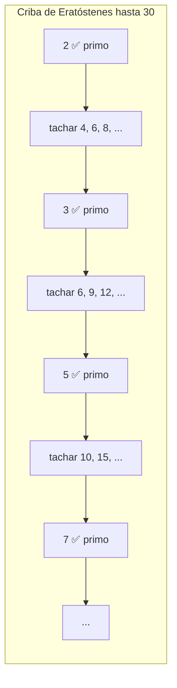
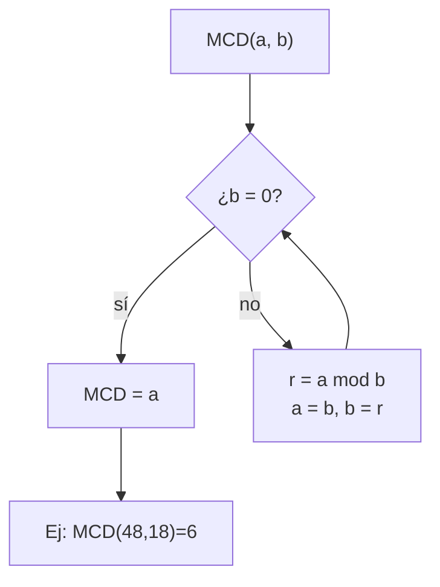
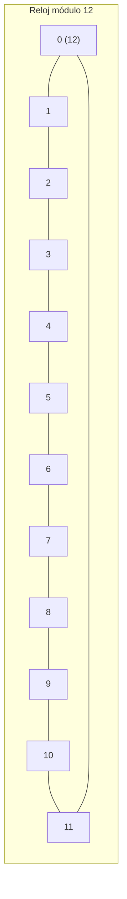

# Teoría de números

La teoría de números estudia los **enteros**: divisores, primos y restos. Es la rama más antigua de las matemáticas y, hoy, la base de la **criptografía moderna** (tu conexión HTTPS, tu tarjeta, tu WhatsApp).

> [!tip] ¿Para qué sirve esta unidad?
> - Cifrar mensajes (RSA, Diffie-Hellman) — sin esto no habría comercio electrónico.
> - Validar identificadores: ISBN de libros, tarjetas de crédito, cédulas (dígito verificador).
> - Relojes, calendarios y cualquier cosa cíclica (aritmética modular).

---

## 8.1 Divisibilidad

$a$ **divide** a $b$ (escribimos $a \mid b$) si existe un entero $k$ tal que $b = a \cdot k$.

- $4 \mid 12$ porque $12 = 4 \cdot 3$. ✔
- $5 \nmid 12$ porque $12 = 5 \cdot k$ **no** tiene solución entera. ✘
- **Propiedades útiles:**
  - Si $a \mid b$ y $b \mid c$, entonces $a \mid c$ (transitiva).
  - Si $a \mid b$ y $a \mid c$, entonces $a \mid (b+c)$ y $a \mid (b-c)$.
  - Todo entero divide a $0$ ($a \mid 0$ para todo $a \neq 0$), y $1$ y $-1$ dividen a todo entero.

> [!example] Divisible por 9
> Un número es divisible por 9 si la suma de sus dígitos es divisible por 9: $123456 \to 1+2+3+4+5+6 = 21 \to 2+1=3$, no divisible.

---

## 8.2 Números primos y el Teorema Fundamental de la Aritmética

Un **primo** es un entero $> 1$ divisible solo por 1 y por sí mismo. Los primeros: $2, 3, 5, 7, 11, 13, 17, 19, \dots$

> [!abstract] Teorema Fundamental de la Aritmética
> Todo entero $n > 1$ se factoriza en primos de **forma única** (salvo el orden):
> $$n = p_1^{e_1} \cdot p_2^{e_2} \cdots p_k^{e_k}$$
>
> Ejemplo: $360 = 2^3 \cdot 3^2 \cdot 5$. No hay otra forma de escribirlo.

**Criba de Eratóstenes** (para hallar primos hasta $n$): tacha los múltiplos de cada primo, lo que queda son primos. Así se encontraron los primos a mano durante siglos.

> [!info] ¿Cuántos primos hay?
> **Infinitos** (Euclides lo demostró hace 2300 años: si fueran finitos, el producto de todos más 1 sería un número nuevo sin divisor primo conocido). Todo algoritmo de cifrado serio depende de que **encontrar primos grandes es fácil pero factorizar su producto es difícil**.

---

## 8.3 Máximo común divisor (MCD) y algoritmo de Euclides

El **MCD** de $a$ y $b$ es el divisor más grande que comparten. Ejemplo: $\text{MCD}(48, 18) = 6$.

El **algoritmo de Euclides** (el más antiguo que se conserva) divide y usa el residuo:

$$
48 = 18 \cdot 2 + 12 \qquad 18 = 12 \cdot 1 + 6 \qquad 12 = 6 \cdot 2 + 0
$$

El último residuo no nulo es el MCD: **6**. Es rapidísimo, incluso con números de cientos de dígitos.

> [!tip] MCD por factorización
> Alternativa: factorizar y tomar los **factores comunes con menor exponente**.
> $48 = 2^4 \cdot 3$, $18 = 2 \cdot 3^2$ → común $2^1 \cdot 3^1 = 6$. Igual resultado, pero factorizar es lento y Euclides no.

**Mínimo común múltiplo (mcm):** el múltiplo más pequeño que comparten. Relación clave: $\text{MCD}(a,b) \cdot \text{mcm}(a,b) = a \cdot b$.
Ejemplo: $\text{mcm}(48,18) = \frac{48 \cdot 18}{6} = 144$.

---

## 8.4 Aritmética modular (los "restos")

Trabajar con **residuos**: "el reloj da vueltas". Las 25:00 son las 1:00 (módulo 24). Escribimos $25 \equiv 1 \ (\text{mod } 24)$.

**Definición formal:** $a \equiv b \ (\text{mod } m)$ si $m \mid (a - b)$, es decir, $a$ y $b$ dejan el mismo resto al dividir por $m$.

**Reglas de cálculo** (igual que las ecuaciones normales):

- Suma: $a \bmod m + b \bmod m = (a+b) \bmod m$
- Multiplicación: $a \bmod m \cdot b \bmod m = (a \cdot b) \bmod m$
- Potencia: se puede reducir la base antes de elevar.

> [!example] Último dígito de $7^{2026}$
> Como $7^2 = 49 \equiv 9$, $7^4 \equiv 9^2 = 81 \equiv 1 \pmod{10}$, y $2026 = 4 \cdot 506 + 2$: $7^{2026} \equiv 7^2 \equiv 9$. **El último dígito es 9.**

---

## 8.5 Inversos modulares y congruencias lineales

El **inverso de $a$ módulo $m$** es el número $a^{-1}$ tal que $a \cdot a^{-1} \equiv 1 \ (\text{mod } m)$. **Existe si y solo si $\text{MCD}(a,m)=1$.**

Ejemplo: inverso de 3 módulo 7. Probamos $3 \cdot x \equiv 1$:
- $3 \cdot 5 = 15 \equiv 1 \pmod{7}$ → $3^{-1} \equiv 5$.

**Ecuación $a x \equiv b \ (\text{mod } m)$:**
- Si $\text{MCD}(a,m)=1$: multiplica por el inverso: $x \equiv a^{-1} \cdot b$.
- Si no: puede no tener solución o tener varias.

> [!warning] Cuidado
> $2x \equiv 4 \ (\text{mod } 6)$ no se resuelve dividiendo: $x=2$ y $x=5$ son soluciones (dos, porque hay 2 raíces por cada divisor común). La división normal **no es válida** en módulos.

---

## 8.6 Criptografía RSA (aplicación estrella)

RSA cifra mensajes con dos claves (pública y privada). Pasos con números pequeños:

1. **Elige dos primos** $p=17$, $q=11$ → $n = p \cdot q = 187$.
2. Calcula $\varphi(n) = (p-1)(q-1) = 16 \cdot 10 = 160$ (función de Euler).
3. **Clave pública** $e$: primo relativo con $\varphi(n)$, p. ej. $e=7$.
4. **Clave privada** $d$: el inverso de $e$ módulo $\varphi(n)$: $7 \cdot d \equiv 1 \pmod{160}$ → $d=23$ (porque $7 \cdot 23 = 161 = 160+1$).

**Cifrar** un mensaje numérico $M$: $C = M^e \bmod n$. **Descifrar**: $M = C^d \bmod n$.

> [!abstract] ¿Por qué es seguro?
> Conocer $n$ y $e$ (públicos) no basta: para hallar $d$ hay que factorizar $n$. Con primos de 300 dígitos, factorizar toma **miles de años** con computadoras actuales. La seguridad está en la **dificultad de factorizar**.

---

## 8.7 Aplicaciones del mundo real

| Aplicación | Idea matemática |
|------------|-----------------|
| **ISBN-13 / tarjetas de crédito** | Dígito verificador con aritmética módulo 10 (algoritmo de Luhn) |
| **Cédula / DNI** | Un dígito extra calculado con módulo 11 detecta errores de escritura |
| **Criptografía (RSA, ElGamal)** | Primos enormes, inversos modulares, exponenciación módulo $n$ |
| **Calendarios** | El año bisiesto: divisible por 4, no por 100, salvo por 400 (¡módulo 400!) |
| **Hashing / checksums** | Reducir datos enormes a un resto módulo un número (como `crc32`) |

> [!tip] Para practicar
> - Calcula $\text{MCD}(252, 105)$ con Euclides en 3 divisiones.
> - Halla el inverso de 5 módulo 12 (pista: $\text{MCD}(5,12)=1$).
> - Cifra el mensaje $M=5$ con RSA usando $p=3, q=11, e=3$ (hazlo a mano, ¡funciona!).

## ✅ Evaluación

A continuación se presentan las preguntas de opción múltiple sobre el tema. Se responden en la aplicación `evaluador.py` o directamente en esta página web.

### Pregunta 1

El **máximo común divisor** $\text{MCD}(48, 18)$ es:

a) 3
b) 6
c) 9
d) 12

> **b) 6**

---

### Pregunta 2

En aritmética modular, $25 \equiv x \ (\text{mod } 24)$ con $0 \leq x < 24$ da:

a) $x=0$
b) $x=1$
c) $x=24$
d) $x=25$

> **b) $x=1$**

---

### Pregunta 3

Un número **primo** es aquel que:

a) Es par
b) Tiene exactamente dos divisores: 1 y él mismo
c) Termina en 0 o 5
d) Es divisible por todos los números

> **b) Tiene exactamente dos divisores: 1 y él mismo**

---

### Pregunta 4

El **algoritmo de Euclides** calcula el MCD usando:

a) Restas sucesivas
b) Divisiones con residuo
c) Factorización en primos
d) Tablas de multiplicar

> **b) Divisiones con residuo**

---

### Pregunta 5

El **teorema fundamental de la aritmética** afirma que todo número $n \geq 2$:

a) Es primo
b) Se factoriza en primos de forma única (salvo el orden)
c) Es divisible por 2
d) Es un cuadrado perfecto

> **b) Se factoriza en primos de forma única (salvo el orden)**

---
