# Grafos y árboles

> [!abstract] ¿De qué trata esta unidad?
> Un **grafo** es un conjunto de **vértices** (puntos) conectados por **aristas** (líneas). Es un mapa abstracto de conexiones: redes sociales, calles, cables, páginas web, moléculas, procesos y tareas.

> [!tip] Analogía
> Una **red social**: cada persona es un vértice y cada amistad una arista. Un grafo también modela calles, cables, páginas web, moléculas, procesos y tareas.

## 7.1 Definición formal

Un grafo es un par $G = (V, E)$, donde:
- $V$ = conjunto de **vértices** (nodos).
- $E$ = conjunto de **aristas** (conexiones entre pares de vértices).

| Concepto | Notación | Ejemplo |
|----------|----------|---------|
| Vértices | $V = \{A, B, C\}$ | 3 nodos |
| Arista | $(A,B) \in E$ | Conexión entre A y B |
| Grado de un vértice | $\deg(A)$ | Número de aristas que tocan a A |
| Grafo completo con $n$ vértices | $K_n$ | $\binom{n}{2}$ aristas (todos conectados con todos) |

> [!example] Suma de grados
> En cualquier grafo, la suma de los grados es el **doble** de las aristas: $\sum \deg(v) = 2|E|$.
> Por eso en un grafo con 4 aristas la suma de grados es 8: ¡cada arista "cuenta" en sus dos extremos!

---

## 7.2 Tipos de grafos (con diagramas)

### 1. Grafo simple (no dirigido)

Las aristas son de **dos vías** (amistad de Facebook: si A es amigo de B, B es amigo de A). Sin lazos ni aristas múltiples.

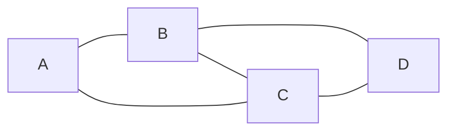

> Amistades: A—B, A—C, B—C, B—D, C—D. Todos los grados: $\deg(A)=2$, $\deg(B)=3$, $\deg(C)=3$, $\deg(D)=2$. Suma $10 = 2 \cdot 5$ aristas ✅

### 2. Grafo dirigido (digrafo)

Las aristas tienen **flecha** (Instagram: tú sigues a alguien, no al revés). El orden del par importa: $(u,v) \neq (v,u)$.

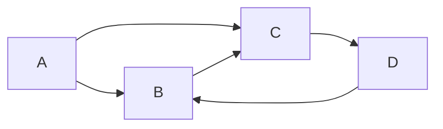

> Aristas: $A \to B$, $A \to C$, $B \to C$, $C \to D$, $D \to B$. Ahora distinguimos **grado de entrada** (flechas que llegan) y **grado de salida** (flechas que salen): $\deg^-(B)=2$ (llegan de A y D), $\deg^+(B)=1$ (sale a C).

### 3. Grafo ponderado

Cada arista tiene un **peso** (kilómetros, costo, tiempo). Es el modelo de los mapas de navegación y rutas.

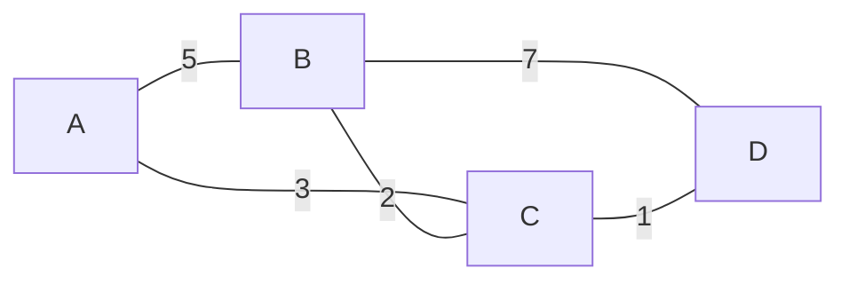

> La ruta más barata de A a D es $A \to C \to D$ con $3+1=4$, ¡más corta que $A \to B \to D$ ($5+7=12$)!

### 4. Grafo completo $K_n$

Cada vértice está conectado con **todos** los demás. Con $n$ vértices tiene $\binom{n}{2}$ aristas.

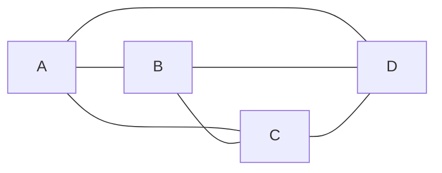

> $K_4$: 4 vértices, $\binom{4}{2} = 6$ aristas. Cada vértice tiene grado $n-1 = 3$.

### 5. Grafo bipartito

Los vértices se dividen en **dos grupos** (por ejemplo, trabajadores y tareas) y las aristas **solo** conectan un grupo con el otro.

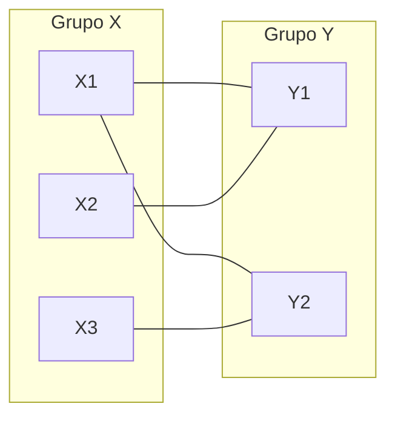

> Modela asignaciones: 3 trabajadores, 2 tareas. Ninguna arista conecta dos personas entre sí ni dos tareas entre sí.

### 6. Grafo conexo vs. no conexo

- **Conexo:** desde cualquier vértice se llega a cualquier otro (un solo "pedazo").
- **No conexo:** tiene dos o más **componentes** separadas.

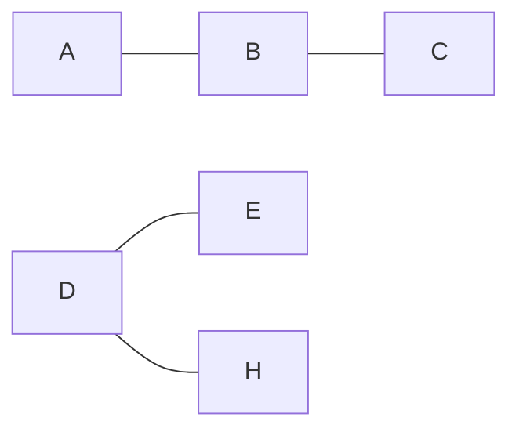

> Este grafo es **no conexo**: la componente $\{A,B,C\}$ y la componente $\{D,E,H\}$ están aisladas. No hay camino de A a D.

### 7. Ciclo y camino

- Un **camino** recorre vértices distintos sin repetir.
- Un **ciclo** es un camino que empieza y termina en el mismo vértice sin repetir otros.

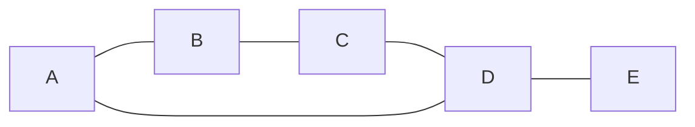

> $A \to B \to C \to D \to A$ es un **ciclo** de longitud 4. $A \to B \to C \to D \to E$ es un **camino** simple.

### 8. Grafo con lazo (bucle)

Un **lazo** es una arista que conecta un vértice **consigo mismo**. (En mermaid se dibuja una flecha que regresa al mismo nodo.)

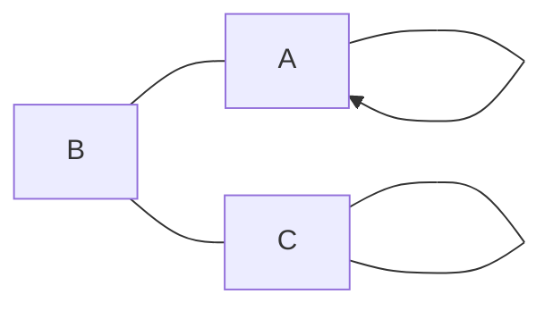

> El vértice A tiene un lazo ($A \to A$) y B tiene otro. Un lazo aporta **2** al grado del vértice.

**Resumen rápido de tipos:**

| Tipo | ¿Flechas? | ¿Pesos? | Ejemplo real |
|------|-----------|---------|--------------|
| Simple | No | No | Mapa de amistades |
| Dirigido | Sí | No | Red social de seguidores |
| Ponderado | Según caso | Sí | GPS / rutas |
| Completo | No | No | Torneo round-robin (todos contra todos) |
| Bipartito | No | No | Asignación trabajador–tarea |
| Conexo / no conexo | Según caso | Según caso | Red de fibra óptica |

---

## 7.3 Representaciones computables

**1) Matriz de adyacencia:** tabla $n \times n$ con $1$ si hay arista, $0$ si no.

> [!example] Para el grafo simple $A-B$, $A-C$ (con vértices A, B, C):
>
> | | A | B | C |
> |---|---|---|---|
> | **A** | 0 | 1 | 1 |
> | **B** | 1 | 0 | 0 |
> | **C** | 1 | 0 | 0 |

**2) Lista de adyacencia:** cada vértice guarda la lista de sus vecinos.

$$A: [B, C],\quad B: [A],\quad C: [A]$$

> [!tip] ¿Matriz o lista?
> **Matriz** → rápida para preguntar "¿hay arista entre u y v?" pero ocupa $O(n^2)$ memoria. **Lista** → ahorra memoria en grafos dispersos (pocas aristas) y es la estándar en DFS/BFS.

---

## 7.4 Caminos, cadenas y ciclos

> [!abstract] Tres tipos de recorridos
> Un **camino**, una **cadena** y un **ciclo** son distintas formas de "recorrer" un grafo. La diferencia está en **qué se permite repetir**: vértices, aristas, o ninguna de las dos.

### 7.4.1 Longitud de un recorrido

La **longitud** de un recorrido es el número de **aristas** que usa (no de vértices). Un recorrido de $A$ a $D$ por las aristas $(A,B), (B,C), (C,D)$ tiene **longitud 3**.

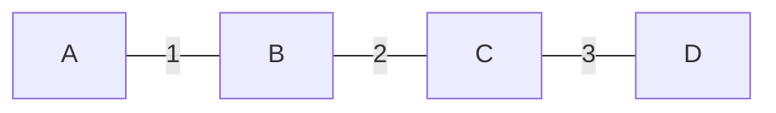

> El recorrido $A \to B \to C \to D$ tiene longitud 3: usa 3 aristas para visitar 4 vértices.

---

### 7.4.2 Camino (path)

Un **camino** es un recorrido que **no repite vértices** (y por tanto tampoco aristas). Es la forma "limpia" de ir de un punto a otro sin dar vueltas.

| Propiedad | Valor |
|-----------|-------|
| ¿Repite vértices? | ❌ No |
| ¿Repite aristas? | ❌ No |
| Ejemplo | $A \to B \to C \to D$ |

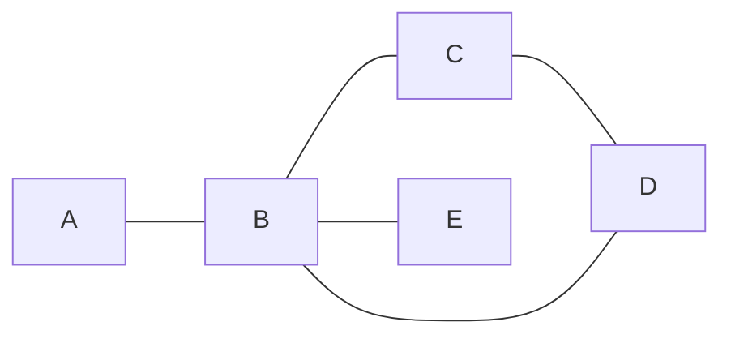

> El camino $A \to B \to C \to D$ usa 3 aristas y **4 vértices distintos**. No puede volver a pasar por B (ya lo visitó).

> [!tip] Camino más corto
> En Google Maps, la ruta sugerida es el **camino más corto** entre dos vértices en un grafo ponderado: el algoritmo de Dijkstra lo encuentra en tiempo $O(E \log V)$.

---

### 7.4.3 Cadena (trail)

Una **cadena** es un recorrido que **no repite aristas**, pero **puede repetir vértices**. Es más permisiva que un camino.

| Propiedad | Valor |
|-----------|-------|
| ¿Repite vértices? | ✅ Sí (permitido) |
| ¿Repite aristas? | ❌ No |
| Ejemplo | $A \to B \to C \to B \to D$ |

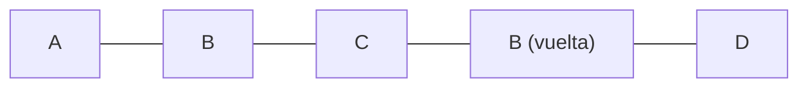

> La cadena $A \to B \to C \to B \to D$ **repasa el vértice B** (dos veces), pero cada arista se usa **una sola vez**. Su longitud es 4.

> [!example] En la vida real
> Un cartero que reparte cartas puede **pasar dos veces por la misma esquina** (vértice) pero no debe **recorrer la misma cuadra** (arista) dos veces en un mismo trayecto. Eso es una cadena.

---

### 7.4.4 Ciclo (cycle)

Un **ciclo** es un camino **cerrado**: empieza y termina en el mismo vértice, sin repetir otros vértices. En un grafo simple, un ciclo tiene longitud **al menos 3**.

| Propiedad | Valor |
|-----------|-------|
| Inicio = final | ✅ Sí |
| ¿Repite vértices? | Solo el primero/último |
| Longitud mínima | 3 (grafo simple) |

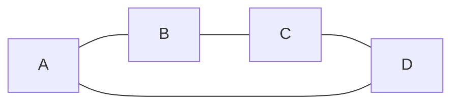

> El ciclo $A \to B \to C \to D \to A$ tiene longitud 4: cada vértice se visita **una sola vez** y se regresa al punto de partida.

**Ciclo simple vs circuito:**

| Concepto | Definición |
|----------|------------|
| **Ciclo** | Camino cerrado que **no repite vértices** (salvo el inicial = final) |
| **Circuito** | Cadena cerrada que puede repetir vértices pero **no aristas** (recorrido euleriano cerrado) |

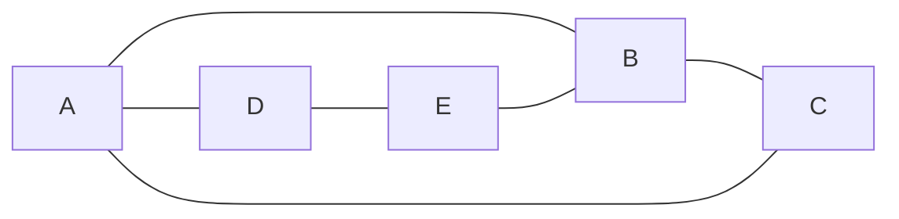

> Recorrido $A \to B \to C \to A \to D \to E \to B \to A$: es un **circuito** (repasa A y B, pero ninguna arista se usa dos veces). No es un ciclo porque repite A y B.

> [!warning] Error común
> Un **ciclo no es "cerrar un camino cualquiera"**: debe empezar y terminar en el mismo vértice **sin repetir otros en el medio**. $A \to B \to C \to A$ es ciclo; $A \to B \to C \to B \to A$ no lo es (B se repite).

---

### 7.4.5 Resumen de recorridos

| Recorrido | ¿Repite vértices? | ¿Repite aristas? | ¿Cerrado? |
|-----------|:-----------------:|:----------------:|:---------:|
| **Paseo** (walk) | ✅ | ✅ | Opcional |
| **Cadena** (trail) | ✅ | ❌ | Opcional |
| **Camino** (path) | ❌ | ❌ | Opcional |
| **Circuito** | ✅ | ❌ | ✅ |
| **Ciclo** (cycle) | ❌ (salvo inicio=final) | ❌ | ✅ |

> [!tip] Cadena de memoria
> **Camino** = no repito vértices → es el más "limpio". **Cadena** = no repito aristas → puedo volver a un vértice. **Ciclo** = camino cerrado → regreso al inicio.

---

### 7.4.6 Caminos y ciclos eulerianos y hamiltonianos

Los dos problemas más famosos de la teoría de grafos preguntan por recorridos especiales:

> [!abstract] La gran diferencia
> - **Euleriano:** recorre cada **arista** exactamente una vez (como pintar todas las líneas sin levantar el lápiz).
> - **Hamiltoniano:** visita cada **vértice** exactamente una vez (como recorrer todas las ciudades sin repetir ninguna).

---

### 7.4.7 Camino y ciclo euleriano

Un **camino euleriano** recorre **cada arista una sola vez**. Si además empieza y termina en el mismo vértice, se llama **ciclo euleriano** (o circuito euleriano).

> [!tip] Criterio de Euler (fácil de verificar)
> En un grafo **conexo**:
> - Hay **ciclo euleriano** si **todos** los vértices tienen grado **par**.
> - Hay **camino euleriano** (abierto) si hay **exactamente 0 o 2** vértices con grado **impar**.

**Ejemplo de ciclo euleriano** (todos los grados pares):

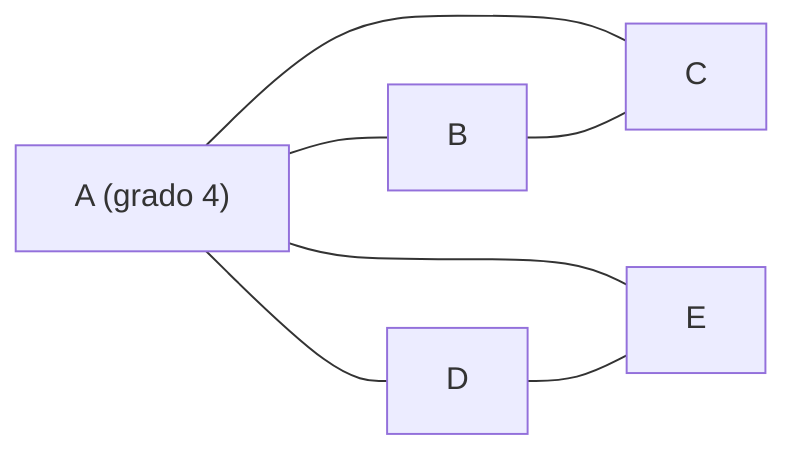

> Grados: $\\deg(A)=4$, $\\deg(B)=2$, $\\deg(C)=2$, $\\deg(D)=2$, $\\deg(E)=2$ — **todos pares**, así que hay ciclo euleriano. Por ejemplo: $A \\to B \\to C \\to A \\to D \\to E \\to A$. Cada arista se usa una vez.

**Ejemplo de camino euleriano** (exactamente 2 impares):

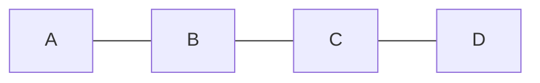

> Grados: $\\deg(A)=1$ (impar), $\\deg(B)=2$, $\\deg(C)=2$, $\\deg(D)=1$ (impar). Hay camino euleriano de $A$ a $D$: $A \\to B \\to C \\to D$. Como hay 2 impares, el camino **empieza en uno y termina en el otro**.

> [!warning] El problema de los puentes de Königsberg
> La ciudad tenía 4 zonas (orillas e isla) conectadas por 7 puentes. El grafo tiene grados **3, 3, 3, 5**: los **cuatro impares**. Como se necesitan 0 o 2 impares, **no existe** recorrido que cruce cada puente exactamente una vez. Este problema dio origen a la teoría de grafos (Euler, 1736).

---

### 7.4.8 Camino y ciclo hamiltoniano

Un **camino hamiltoniano** visita **cada vértice exactamente una vez**. Un **ciclo hamiltoniano** vuelve al inicio al final (visita todos los vértices una vez y cierra).

> [!example] Ciclo hamiltoniano
>
> ```mermaid
> flowchart LR
>     A --- B
>     B --- C
>     C --- D
>     D --- E
>     E --- A
> ```
>
> El recorrido $A \\to B \\to C \\to D \\to E \\to A$ visita los 5 vértices una sola vez y regresa al inicio: es un **ciclo hamiltoniano**.

**Problema del vendedor viajero (TSP):** encontrar el ciclo hamiltoniano de **costo mínimo** en un grafo ponderado. Aparece en logística (rutas de reparto), diseño de circuitos y planificación.

> [!warning] A diferencia de Euler, no hay criterio simple
> Decidir si un grafo tiene ciclo hamiltoniano es un problema **NP-completo**: no se conoce algoritmo rápido y, en la práctica, hay que probar muchas combinaciones (casi $n!$ rutas posibles). Hay criterios **suficientes** (Dirac, Ore) que garantizan su existencia en ciertos casos, pero son condiciones fuertes:
>
> - **Teorema de Dirac:** si $n \\geq 3$ y todo vértice tiene grado $\\geq n/2$, hay ciclo hamiltoniano.
> - **Teorema de Ore:** si para todo par de vértices no adyacentes $\\deg(u)+\\deg(v) \\geq n$, hay ciclo hamiltoniano.

---

### 7.4.9 Comparativa final: Euler vs Hamilton

| Criterio | Euleriano | Hamiltoniano |
|----------|-----------|--------------|
| Qué recorre | Cada **arista** una vez | Cada **vértice** una vez |
| Versión cerrada | Ciclo euleriano | Ciclo hamiltoniano |
| Criterio fácil | Sí: contar grados pares/impares | No: NP-completo |
| Problema famoso | Puentes de Königsberg | Vendedor viajero (TSP) |
| Analogía | Pintar un dibujo sin levantar el lápiz | Tour que visita todas las ciudades |
| Complejidad de decisión | Polinomial (fácil) | NP-completo (difícil) |

> [!tip] Regla práctica
> - ¿El grafo es conexo y tiene **0 o 2 grados impares**? → hay Euler: busca el recorrido con confianza.
> - ¿Necesitas visitar todas las **ciudades** sin repetir? → es Hamilton: no prometas un algoritmo rápido, usa heurísticas (vecino más cercano, 2-opt).
---

## 7.5 Árboles

Un **árbol** es un grafo **conexo sin ciclos** (no hay "círculos" de conexiones). Es la estructura natural de las **jerarquías**.

> [!example] Propiedades equivalentes de un árbol con $n$ vértices
> 1. Es conexo y sin ciclos.
> 2. Tiene exactamente $n-1$ aristas.
> 3. Entre cualquier par de vértices hay **un único** camino.

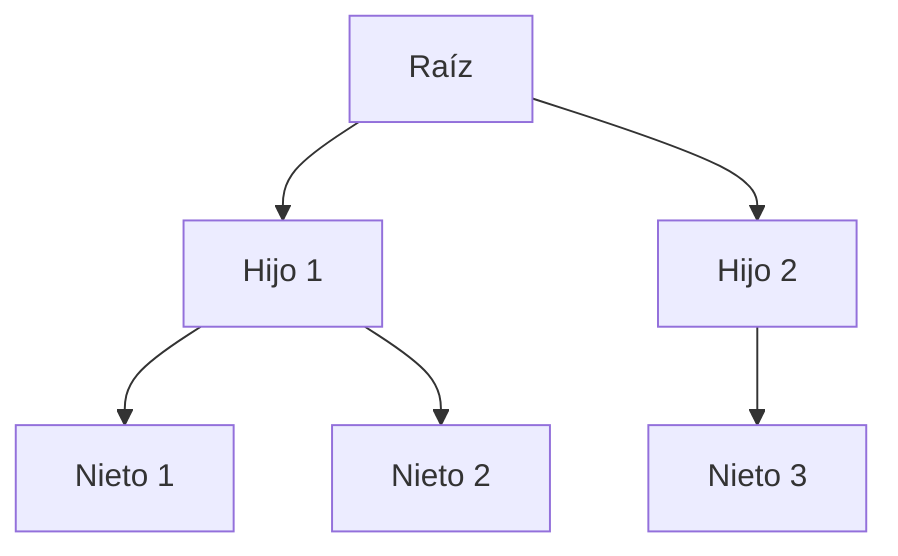

> Un **árbol binario** (2 hijos máximos por nodo) es la base de árboles de búsqueda, montículos (*heaps*), y el DOM de una página web.

- Árbol genealógico, sistema de archivos, torneos deportivos.
- **Recorridos:** BFS (por niveles, como olas) y DFS (por ramas, hasta el fondo). Son la base de búsquedas en mapas y redes.

---

## 7.6 Aplicaciones en el mundo real

- **Google Maps:** grafo ponderado de calles + algoritmo de Dijkstra (ruta más corta).
- **Redes sociales:** grafos dirigidos/no dirigidos; "amigos en común" son vecindades compartidas.
- **Internet:** la web es un digrafo donde cada página enlaza a otras; el *PageRank* usa su estructura.
- **Bases de datos:** las relaciones clave–foránea forman un grafo de dependencias.
- **Optimización:** árbol de expansión mínima (cableado con el menor costo total).

## ✅ Evaluación

A continuación se presentan las preguntas de opción múltiple sobre el tema. Se responden en la aplicación `evaluador.py` o directamente en esta página web.

### Pregunta 1

Un grafo en el que **las aristas tienen dirección** se llama:

a) Grafo simple
b) Grafo dirigido (digrafo)
c) Grafo bipartito
d) Árbol

> **b) Grafo dirigido (digrafo)**

---

### Pregunta 2

En cualquier grafo, la suma de los grados de todos los vértices es:

a) Igual al número de aristas
b) El doble del número de aristas
c) La mitad del número de aristas
d) Siempre 0

> **b) El doble del número de aristas**

---

### Pregunta 3

Un **camino** (path) es un recorrido que:

a) Puede repetir aristas
b) No repite vértices
c) Puede repetir vértices
d) Empieza y termina en el mismo vértice

> **b) No repite vértices**

---

### Pregunta 4

Un **ciclo** es:

a) Un camino cerrado que no repite vértices (salvo inicio=final)
b) Una cadena abierta
c) Un vértice aislado
d) Un grafo sin aristas

> **a) Un camino cerrado que no repite vértices (salvo inicio=final)**

---

### Pregunta 5

El **grafo completo** $K_4$ tiene exactamente:

a) 4 aristas
b) 5 aristas
c) 6 aristas
d) 8 aristas

> **c) 6 aristas**

---
