# Grafos y árboles

> [!abstract] ¿De qué trata esta unidad?
> Un **grafo** es un conjunto de **vértices** (puntos) conectados por **aristas** (líneas). Es un mapa abstracto de conexiones: redes sociales, calles, cables, páginas web, moléculas, procesos y tareas.

> [!tip] Analogía
> Una **red social**: cada persona es un vértice y cada amistad una arista. Un grafo también modela calles, cables, páginas web, moléculas, procesos y tareas.

## 7.1 Definición formal

Un grafo es un par $G = (V, E)$, donde:
- $V$ = conjunto de **vértices** (nodos).
- $E$ = conjunto de **aristas** (conexiones entre pares de vértices).

| Concepto | Notación | Ejemplo |
|----------|----------|---------|
| Vértices | $V = \{A, B, C\}$ | 3 nodos |
| Arista | $(A,B) \in E$ | Conexión entre A y B |
| Grado de un vértice | $\deg(A)$ | Número de aristas que tocan a A |
| Grafo completo con $n$ vértices | $K_n$ | $\binom{n}{2}$ aristas (todos conectados con todos) |

> [!example] Suma de grados
> En cualquier grafo, la suma de los grados es el **doble** de las aristas: $\sum \deg(v) = 2|E|$.
> Por eso en un grafo con 4 aristas la suma de grados es 8: ¡cada arista "cuenta" en sus dos extremos!

---

## 7.2 Tipos de grafos (con diagramas)

### 1. Grafo simple (no dirigido)

Las aristas son de **dos vías** (amistad de Facebook: si A es amigo de B, B es amigo de A). Sin lazos ni aristas múltiples.

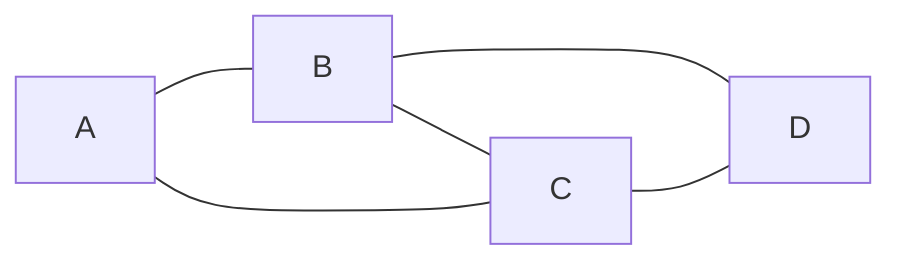

> Amistades: A—B, A—C, B—C, B—D, C—D. Todos los grados: $\deg(A)=2$, $\deg(B)=3$, $\deg(C)=3$, $\deg(D)=2$. Suma $10 = 2 \cdot 5$ aristas ✅

### 2. Grafo dirigido (digrafo)

Las aristas tienen **flecha** (Instagram: tú sigues a alguien, no al revés). El orden del par importa: $(u,v) \neq (v,u)$.

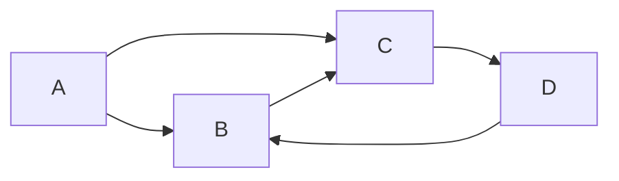

> Aristas: $A \to B$, $A \to C$, $B \to C$, $C \to D$, $D \to B$. Ahora distinguimos **grado de entrada** (flechas que llegan) y **grado de salida** (flechas que salen): $\deg^-(B)=2$ (llegan de A y D), $\deg^+(B)=1$ (sale a C).

### 3. Grafo ponderado

Cada arista tiene un **peso** (kilómetros, costo, tiempo). Es el modelo de los mapas de navegación y rutas.

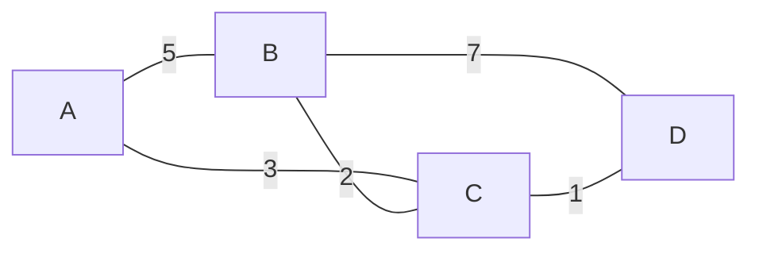

> La ruta más barata de A a D es $A \to C \to D$ con $3+1=4$, ¡más corta que $A \to B \to D$ ($5+7=12$)!

### 4. Grafo completo $K_n$

Cada vértice está conectado con **todos** los demás. Con $n$ vértices tiene $\binom{n}{2}$ aristas.

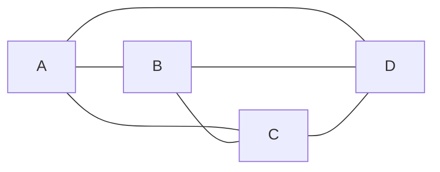

> $K_4$: 4 vértices, $\binom{4}{2} = 6$ aristas. Cada vértice tiene grado $n-1 = 3$.

### 5. Grafo bipartito

Los vértices se dividen en **dos grupos** (por ejemplo, trabajadores y tareas) y las aristas **solo** conectan un grupo con el otro.

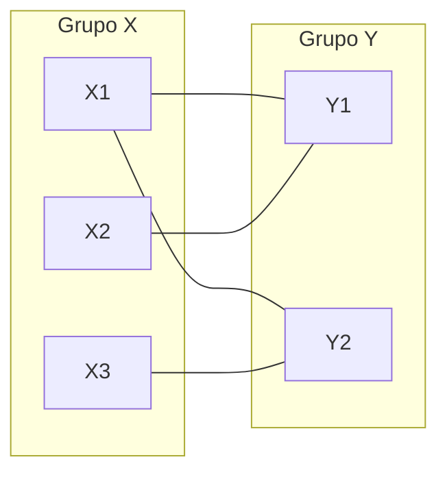

> Modela asignaciones: 3 trabajadores, 2 tareas. Ninguna arista conecta dos personas entre sí ni dos tareas entre sí.

### 6. Grafo conexo vs. no conexo

- **Conexo:** desde cualquier vértice se llega a cualquier otro (un solo "pedazo").
- **No conexo:** tiene dos o más **componentes** separadas.

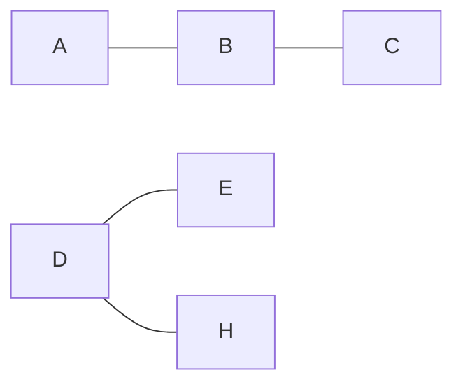

> Este grafo es **no conexo**: la componente $\{A,B,C\}$ y la componente $\{D,E,H\}$ están aisladas. No hay camino de A a D.

### 7. Ciclo y camino

- Un **camino** recorre vértices distintos sin repetir.
- Un **ciclo** es un camino que empieza y termina en el mismo vértice sin repetir otros.

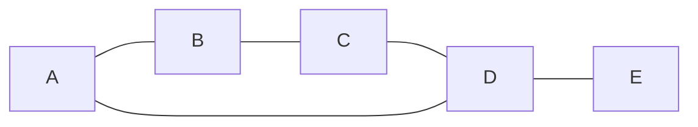

> $A \to B \to C \to D \to A$ es un **ciclo** de longitud 4. $A \to B \to C \to D \to E$ es un **camino** simple.

### 8. Grafo con lazo (bucle)

Un **lazo** es una arista que conecta un vértice **consigo mismo**. (En mermaid se dibuja una flecha que regresa al mismo nodo.)

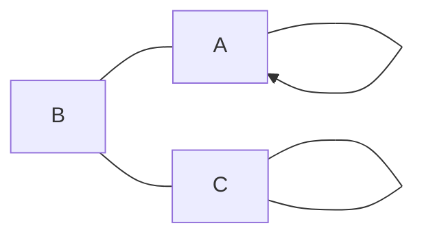

> El vértice A tiene un lazo ($A \to A$) y B tiene otro. Un lazo aporta **2** al grado del vértice.

**Resumen rápido de tipos:**

| Tipo | ¿Flechas? | ¿Pesos? | Ejemplo real |
|------|-----------|---------|--------------|
| Simple | No | No | Mapa de amistades |
| Dirigido | Sí | No | Red social de seguidores |
| Ponderado | Según caso | Sí | GPS / rutas |
| Completo | No | No | Torneo round-robin (todos contra todos) |
| Bipartito | No | No | Asignación trabajador–tarea |
| Conexo / no conexo | Según caso | Según caso | Red de fibra óptica |

---

## 7.3 Representaciones computables

**1) Matriz de adyacencia:** tabla $n \times n$ con $1$ si hay arista, $0$ si no.

> [!example] Para el grafo simple $A-B$, $A-C$ (con vértices A, B, C):
>
> | | A | B | C |
> |---|---|---|---|
> | **A** | 0 | 1 | 1 |
> | **B** | 1 | 0 | 0 |
> | **C** | 1 | 0 | 0 |

**2) Lista de adyacencia:** cada vértice guarda la lista de sus vecinos.

$$A: [B, C],\quad B: [A],\quad C: [A]$$

> [!tip] ¿Matriz o lista?
> **Matriz** → rápida para preguntar "¿hay arista entre u y v?" pero ocupa $O(n^2)$ memoria. **Lista** → ahorra memoria en grafos dispersos (pocas aristas) y es la estándar en DFS/BFS.

---

## 7.4 Caminos, cadenas y ciclos

> [!abstract] Tres tipos de recorridos
> Un **camino**, una **cadena** y un **ciclo** son distintas formas de "recorrer" un grafo. La diferencia está en **qué se permite repetir**: vértices, aristas, o ninguna de las dos.

### 7.4.1 Longitud de un recorrido

La **longitud** de un recorrido es el número de **aristas** que usa (no de vértices). Un recorrido de $A$ a $D$ por las aristas $(A,B), (B,C), (C,D)$ tiene **longitud 3**.

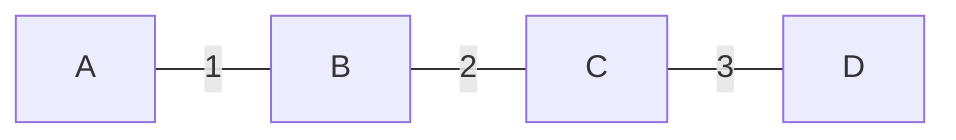

> El recorrido $A \to B \to C \to D$ tiene longitud 3: usa 3 aristas para visitar 4 vértices.

---

### 7.4.2 Camino (path)

Un **camino** es un recorrido que **no repite vértices** (y por tanto tampoco aristas). Es la forma "limpia" de ir de un punto a otro sin dar vueltas.

| Propiedad | Valor |
|-----------|-------|
| ¿Repite vértices? | ❌ No |
| ¿Repite aristas? | ❌ No |
| Ejemplo | $A \to B \to C \to D$ |

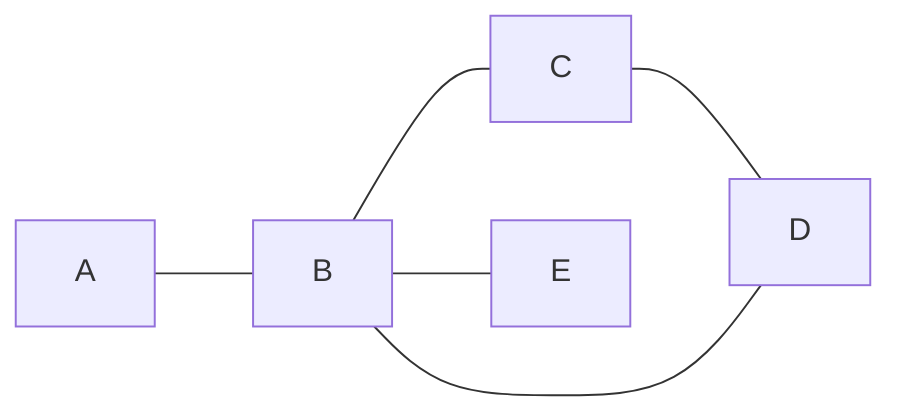

> El camino $A \to B \to C \to D$ usa 3 aristas y **4 vértices distintos**. No puede volver a pasar por B (ya lo visitó).

> [!tip] Camino más corto
> En Google Maps, la ruta sugerida es el **camino más corto** entre dos vértices en un grafo ponderado: el algoritmo de Dijkstra lo encuentra en tiempo $O(E \log V)$.

---

### 7.4.3 Cadena (trail)

Una **cadena** es un recorrido que **no repite aristas**, pero **puede repetir vértices**. Es más permisiva que un camino.

| Propiedad | Valor |
|-----------|-------|
| ¿Repite vértices? | ✅ Sí (permitido) |
| ¿Repite aristas? | ❌ No |
| Ejemplo | $A \to B \to C \to B \to D$ |

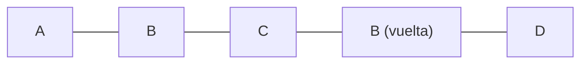

> La cadena $A \to B \to C \to B \to D$ **repasa el vértice B** (dos veces), pero cada arista se usa **una sola vez**. Su longitud es 4.

> [!example] En la vida real
> Un cartero que reparte cartas puede **pasar dos veces por la misma esquina** (vértice) pero no debe **recorrer la misma cuadra** (arista) dos veces en un mismo trayecto. Eso es una cadena.

---

### 7.4.4 Ciclo (cycle)

Un **ciclo** es un camino **cerrado**: empieza y termina en el mismo vértice, sin repetir otros vértices. En un grafo simple, un ciclo tiene longitud **al menos 3**.

| Propiedad | Valor |
|-----------|-------|
| Inicio = final | ✅ Sí |
| ¿Repite vértices? | Solo el primero/último |
| Longitud mínima | 3 (grafo simple) |

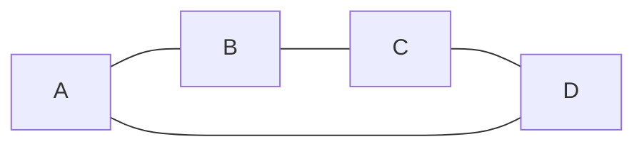

> El ciclo $A \to B \to C \to D \to A$ tiene longitud 4: cada vértice se visita **una sola vez** y se regresa al punto de partida.

**Ciclo simple vs circuito:**

| Concepto | Definición |
|----------|------------|
| **Ciclo** | Camino cerrado que **no repite vértices** (salvo el inicial = final) |
| **Circuito** | Cadena cerrada que puede repetir vértices pero **no aristas** (recorrido euleriano cerrado) |

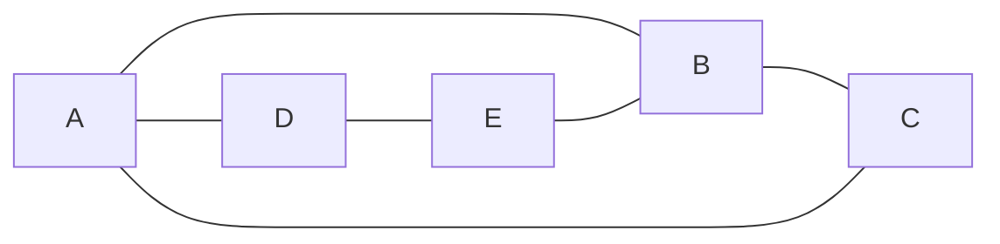

> Recorrido $A \to B \to C \to A \to D \to E \to B \to A$: es un **circuito** (repasa A y B, pero ninguna arista se usa dos veces). No es un ciclo porque repite A y B.

> [!warning] Error común
> Un **ciclo no es "cerrar un camino cualquiera"**: debe empezar y terminar en el mismo vértice **sin repetir otros en el medio**. $A \to B \to C \to A$ es ciclo; $A \to B \to C \to B \to A$ no lo es (B se repite).

---

### 7.4.5 Resumen de recorridos

| Recorrido | ¿Repite vértices? | ¿Repite aristas? | ¿Cerrado? |
|-----------|:-----------------:|:----------------:|:---------:|
| **Paseo** (walk) | ✅ | ✅ | Opcional |
| **Cadena** (trail) | ✅ | ❌ | Opcional |
| **Camino** (path) | ❌ | ❌ | Opcional |
| **Circuito** | ✅ | ❌ | ✅ |
| **Ciclo** (cycle) | ❌ (salvo inicio=final) | ❌ | ✅ |

> [!tip] Cadena de memoria
> **Camino** = no repito vértices → es el más "limpio". **Cadena** = no repito aristas → puedo volver a un vértice. **Ciclo** = camino cerrado → regreso al inicio.

---

### 7.4.6 Caminos y ciclos eulerianos y hamiltonianos

Los dos problemas más famosos de la teoría de grafos preguntan por recorridos especiales:

> [!abstract] La gran diferencia
> - **Euleriano:** recorre cada **arista** exactamente una vez (como pintar todas las líneas sin levantar el lápiz).
> - **Hamiltoniano:** visita cada **vértice** exactamente una vez (como recorrer todas las ciudades sin repetir ninguna).

---

### 7.4.7 Camino y ciclo euleriano

Un **camino euleriano** recorre **cada arista una sola vez**. Si además empieza y termina en el mismo vértice, se llama **ciclo euleriano** (o circuito euleriano).

> [!tip] Criterio de Euler (fácil de verificar)
> En un grafo **conexo**:
> - Hay **ciclo euleriano** si **todos** los vértices tienen grado **par**.
> - Hay **camino euleriano** (abierto) si hay **exactamente 0 o 2** vértices con grado **impar**.

**Ejemplo de ciclo euleriano** (todos los grados pares):

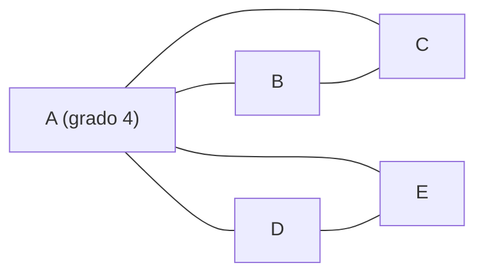

> Grados: $\\deg(A)=4$, $\\deg(B)=2$, $\\deg(C)=2$, $\\deg(D)=2$, $\\deg(E)=2$ — **todos pares**, así que hay ciclo euleriano. Por ejemplo: $A \\to B \\to C \\to A \\to D \\to E \\to A$. Cada arista se usa una vez.

**Ejemplo de camino euleriano** (exactamente 2 impares):

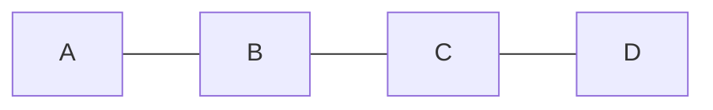

> Grados: $\\deg(A)=1$ (impar), $\\deg(B)=2$, $\\deg(C)=2$, $\\deg(D)=1$ (impar). Hay camino euleriano de $A$ a $D$: $A \\to B \\to C \\to D$. Como hay 2 impares, el camino **empieza en uno y termina en el otro**.

> [!warning] El problema de los puentes de Königsberg
> La ciudad tenía 4 zonas (orillas e isla) conectadas por 7 puentes. El grafo tiene grados **3, 3, 3, 5**: los **cuatro impares**. Como se necesitan 0 o 2 impares, **no existe** recorrido que cruce cada puente exactamente una vez. Este problema dio origen a la teoría de grafos (Euler, 1736).

---

### 7.4.8 Camino y ciclo hamiltoniano

Un **camino hamiltoniano** visita **cada vértice exactamente una vez**. Un **ciclo hamiltoniano** vuelve al inicio al final (visita todos los vértices una vez y cierra).

> [!example] Ciclo hamiltoniano
>
> ```mermaid
> flowchart LR
>     A --- B
>     B --- C
>     C --- D
>     D --- E
>     E --- A
> ```
>
> El recorrido $A \\to B \\to C \\to D \\to E \\to A$ visita los 5 vértices una sola vez y regresa al inicio: es un **ciclo hamiltoniano**.

**Problema del vendedor viajero (TSP):** encontrar el ciclo hamiltoniano de **costo mínimo** en un grafo ponderado. Aparece en logística (rutas de reparto), diseño de circuitos y planificación.

> [!warning] A diferencia de Euler, no hay criterio simple
> Decidir si un grafo tiene ciclo hamiltoniano es un problema **NP-completo**: no se conoce algoritmo rápido y, en la práctica, hay que probar muchas combinaciones (casi $n!$ rutas posibles). Hay criterios **suficientes** (Dirac, Ore) que garantizan su existencia en ciertos casos, pero son condiciones fuertes:
>
> - **Teorema de Dirac:** si $n \\geq 3$ y todo vértice tiene grado $\\geq n/2$, hay ciclo hamiltoniano.
> - **Teorema de Ore:** si para todo par de vértices no adyacentes $\\deg(u)+\\deg(v) \\geq n$, hay ciclo hamiltoniano.

---

### 7.4.9 Comparativa final: Euler vs Hamilton

| Criterio | Euleriano | Hamiltoniano |
|----------|-----------|--------------|
| Qué recorre | Cada **arista** una vez | Cada **vértice** una vez |
| Versión cerrada | Ciclo euleriano | Ciclo hamiltoniano |
| Criterio fácil | Sí: contar grados pares/impares | No: NP-completo |
| Problema famoso | Puentes de Königsberg | Vendedor viajero (TSP) |
| Analogía | Pintar un dibujo sin levantar el lápiz | Tour que visita todas las ciudades |
| Complejidad de decisión | Polinomial (fácil) | NP-completo (difícil) |

> [!tip] Regla práctica
> - ¿El grafo es conexo y tiene **0 o 2 grados impares**? → hay Euler: busca el recorrido con confianza.
> - ¿Necesitas visitar todas las **ciudades** sin repetir? → es Hamilton: no prometas un algoritmo rápido, usa heurísticas (vecino más cercano, 2-opt).
---

### 7.4.10 El algoritmo de Dijkstra: la ruta más corta 👟

**(Estructura de datos: grafo ponderado con pesos **no negativos**)**

Dijkstra (1959) responde la pregunta estrella de Google Maps:

> *"¿Cuál es el camino **más barato** (menor costo total) desde mi origen **s** hasta cada otro vértice?"*

**Analogía:** cada vértice es una ciudad y cada arista, un vuelo con su precio. Dijkstra empieza con la maleta en la ciudad de salida (distancia 0) y va *desbloqueando* la ciudad más barata de alcanzar; al desbloquear una ciudad, revisa si los vuelos que salen de ella **mejoran** el precio de llegar a las vecinas. Ese ajuste se llama **relajamiento** de la etiqueta.

**Las tres reglas del juego** (se parece a Prim, pero minimiza **distancia desde el origen**, no el costo del árbol):

1. Mantén una etiqueta `d[v]` = mejor distancia conocida desde `s` (∞ al inicio, 0 en `s`).
2. En cada paso **finaliza** el vértice no etiquetado con **menor** `d`: su distancia es *definitiva*.
3. Al finalizar `u`, **relaja** cada arista `(u,v)`: si `d[u] + peso(u,v) < d[v]`, actualiza `d[v]` y guarda a `u` como el *padre* de `v`.

> [!warning] ¿Por qué pesos no negativos?
> Si una arista pesara **-5**, "tardar más" podría *mejorar* el precio (llegar a v y volver a u sale más barato). La regla 2 ("la menor es definitiva") dejaría de ser cierta. Por eso Dijkstra exige pesos ≥ 0.

Usaremos el **mismo grafo de las 7 casas** del MST (los pesos no cambiaron):

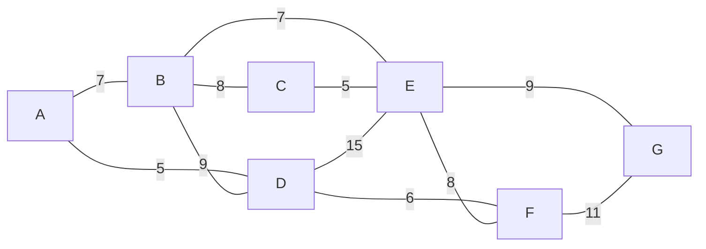

**Paso a paso desde A** (las celdas en negrita son las definitivas):

| Paso | Finalizado | d[A] | d[B] | d[C] | d[D] | d[E] | d[F] | d[G] | Arista al SPT |
|------|------------|------|------|------|------|------|------|------|---------------|
| 0 | — | **0** | ∞ | ∞ | ∞ | ∞ | ∞ | ∞ | — |
| 1 | A (0) · relaja A-B, A-D | 0 | 7 | ∞ | 5 | ∞ | ∞ | ∞ | — |
| 2 | **D (5)** · relaja D-F, D-E | 0 | 7 | ∞ | **5** | 20 | 11 | ∞ | A-D |
| 3 | **B (7)** · relaja B-C, B-E | 0 | **7** | 15 | 5 | 14 | 11 | ∞ | A-B |
| 4 | **F (11)** · relaja F-G | 0 | 7 | 15 | 5 | 14 | **11** | 22 | D-F |
| 5 | **E (14)** · relaja E-G (no mejora) | 0 | 7 | 15 | 5 | **14** | 11 | 22 | B-E |
| 6 | **C (15)** · sin mejoras | 0 | 7 | **15** | 5 | 14 | 11 | 22 | B-C |
| 7 | **G (22)** | 0 | 7 | 15 | 5 | 14 | 11 | **22** | F-G |

> [!tip] La ruta a G
> Siguiendo los padres: `G ← F ← D ← A`, o sea **A → D → F → G = 5 + 6 + 11 = 22**. La alternativa A → B → E → G daba 23, por eso Dijkstra prefiere la del sur. 🗺️

El árbol de caminos más cortos (SPT) resultante:

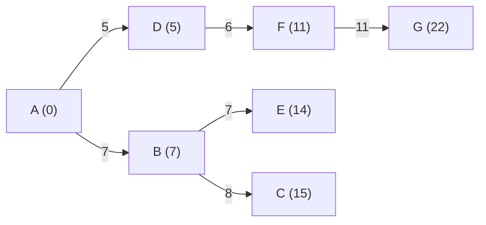

**Pseudo-código:**

```text
función dijkstra(grafo G, origen s):
    d[s] = 0, d[resto] = ∞
    padre[s] = None
    Q = cola de prioridad con todos los vértices (por d)
    mientras Q no esté vacía:
        u = Q.extraer_min()          # vértice con menor d → definitivo
        para cada (v, peso) en vecinos(u):
            si d[u] + peso < d[v]:   # relajamiento
                d[v] = d[u] + peso
                padre[v] = u
                Q.reducir_clave(v, d[v])
    devolver d, padre
```

**Implementación en Python (con heap):**

```python
import heapq

def dijkstra(grafo, origen):
    dist = {v: float("inf") for v in grafo}
    padre = {v: None for v in grafo}
    dist[origen] = 0
    cola = [(0, origen)]
    while cola:
        d, u = heapq.heappop(cola)
        if d > dist[u]:
            continue              # etiqueta obsoleta, no finalizar u otra vez
        for v, w in grafo[u]:
            nueva = d + w
            if nueva < dist[v]:
                dist[v] = nueva
                padre[v] = u
                heapq.heappush(cola, (nueva, v))
    return dist, padre

# El mismo grafo de las 7 casas
G = {
    "A": [("B", 7), ("D", 5)],
    "B": [("A", 7), ("C", 8), ("D", 9), ("E", 7)],
    "C": [("B", 8), ("E", 5)],
    "D": [("A", 5), ("B", 9), ("E", 15), ("F", 6)],
    "E": [("B", 7), ("C", 5), ("D", 15), ("F", 8), ("G", 9)],
    "F": [("D", 6), ("E", 8), ("G", 11)],
    "G": [("E", 9), ("F", 11)],
}
dist, padre = dijkstra(G, "A")
print(dist["G"])                  # 22  → ruta A → D → F → G
```

**Complejidad:** con heap, cada vértice se extrae una vez y cada relajamiento hace un push: **O((n + m) log n)**. Sin heap (buscando el mínimo a mano) sería O(n²), aceptable en grafos densos.

> 🎮 **Ahora practica tú:** haz clic sobre las **aristas** en el orden en que Dijkstra las agrega a su árbol de caminos más cortos (finalizando siempre el vértice de menor distancia). Empieza con la semilla A; con 💡 Ayuda verás la pista.

<div class="grafo-ejercicio" data-tipo="dijkstra" data-nodos="A,B,C,D,E,F,G" data-semilla="A" data-aristas="A-B:7,A-D:5,B-C:8,B-D:9,B-E:7,C-E:5,D-E:15,D-F:6,E-F:8,E-G:9,F-G:11">

### Precisa los clics: orden de Dijkstra

Haz **clic sobre una arista** que conecte un vértice ya finalizado con el **vértice no finalizado de menor distancia**. Si aciertas, la arista se pone verde y el vértice se finaliza mostrando su distancia real desde A. ¡Termina con la ruta A→D→F→G = 22!

</div>

---

## 7.5 Árboles

Un **árbol** es un grafo **conexo sin ciclos**. Es la estructura natural de las **jerarquías**: sistemas de archivos, DOM de una página, árboles genealógicos, y los árboles de decisión de machine learning.

> [!abstract] Propiedades equivalentes de un árbol con $n$ vértices
> Se dice que las siguientes afirmaciones son equivalentes (si una se cumple, se cumplen todas):
> 1. Es conexo y sin ciclos.
> 2. Tiene exactamente $n-1$ aristas.
> 3. Entre cualquier par de vértices hay **un único** camino.
> 4. Es conexo, pero si quitas una arista cualquiera, se desconecta.

---

### 7.5.1 Terminología de árboles

- **Raíz:** nodo especial (designado o elegido) que está "arriba" de todo.
- **Padre / Hijo:** si hay arista de $u$ a $v$, el padre de $v$ es $u$.
- **Hermanos:** nodos con el mismo padre.
- **Hoja (nodo hoja):** nodo sin hijos.
- **Nodo interno:** al menos un hijo.
- **Profundidad (nivel):** distancia desde la raíz ($d=0$).
- **Altura:** la mayor profundidad de cualquier nodo (un árbol con un solo nodo tiene altura 0).

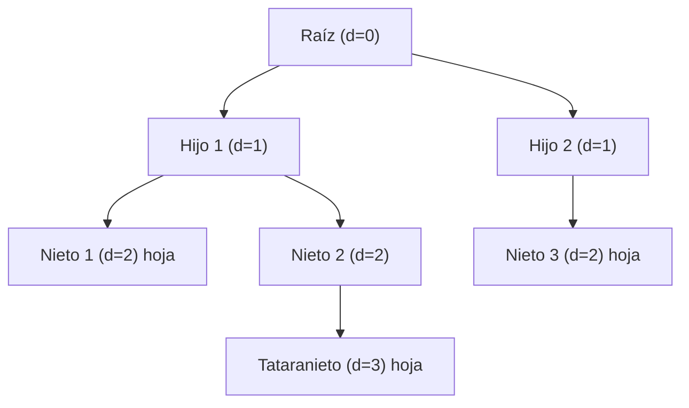

---

### 7.5.2 Tipos de árboles

**Árbol binario:** cada nodo tiene **a lo sumo 2 hijos** (izquierdo y derecho). Es el más usado en programación.

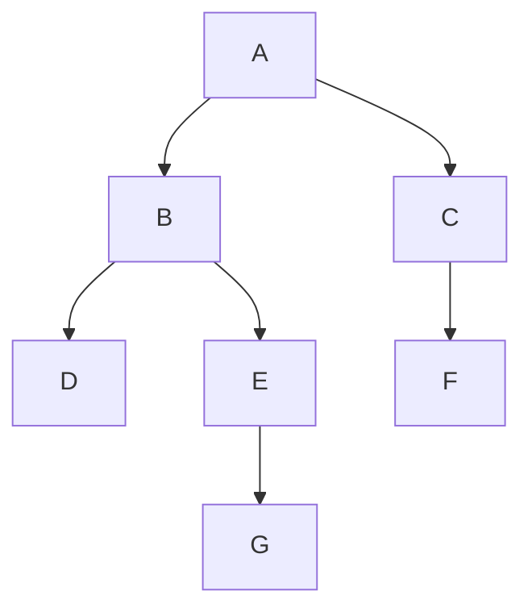

**Árbol binario de búsqueda (BST):** árbol binario con regla: izquierdo < nodo < derecho. Permite buscar en $O(\log n)$ si está balanceado.

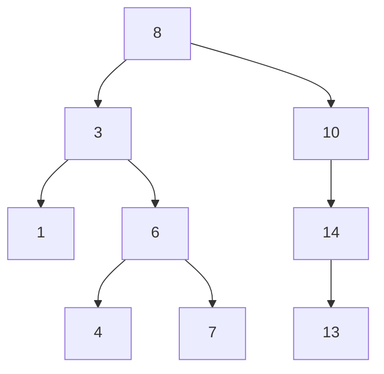

> [!example] Búsqueda en BST
> Para buscar 7: 8→3→6→7 ✓. Cada paso descarta la mitad (igual que búsqueda binaria en vector ordenado). Complejidad: $O(h)$ donde $h$ es la altura; $h = \log n$ si está balanceado.

**Árbol AVL:** BST que se **re-balancea** automáticamente después de cada inserción/eliminación. Garantiza $h \leq 1.44 \log_2(n+2)$, así que búsqueda siempre $O(\log n)$.

**Árbol N-ario:** cada nodo tiene hasta $N$ hijos (ej. árbol de directorios).

**Montículo (heap):** árbol binario completo (todos los niveles llenos salvo quizás el último, rellenado de izq. a der.) donde el padre es siempre ≥ (max-heap) o ≤ (min-heap) sus hijos. Base de **colas de prioridad**.

**Árbol B:** árbol N-ario balanceado usado en **bases de datos** y sistemas de archivos (ext4, NTFS). Cada nodo contiene varias claves y garantiza altura baja con millones de registros.

---

### 7.5.3 Recorridos de árboles (DFS y BFS)

En árboles, el recorrido DFS tiene tres variantes según **cuándo se visita** el nodo actual:

```mermaid
flowchart TB
    A["1"] --> B["2"]
    A --> C["3"]
    B --> D["4"]
    B --> E["5"]
    C --> F["6"]
    C --> G["7"]
```

| Recorrido | Orden | Resultado |
|-----------|-------|-----------|
| **Preorden** | Padre → Izq → Der | 1, 2, 4, 5, 3, 6, 7 |
| **Inorden** | Izq → Padre → Der | 4, 2, 5, 1, 6, 3, 7 |
| **Postorden** | Izq → Der → Padre | 4, 5, 2, 6, 7, 3, 1 |
| **Por niveles (BFS)** | Nivel 0, nivel 1, … | 1, 2, 3, 4, 5, 6, 7 |

> [!example] ¿Para qué sirve cada recorrido?
> - **Preorden:** copiar/serializar un árbol (el padre va primero, así lo reconstruyes después).
> - **Inorden:** en un BST, produce los valores **ordenados de menor a mayor**.
> - **Postorden:** borrar un árbol (borras hijos antes del padre) o calcular tamaño de carpetas.

```python
# Preorden (recursivo)
def preorden(nodo):
    if nodo is None: return
    print(nodo.valor)    # visitar padre
    preorden(nodo.izq)
    preorden(nodo.der)

# Inorden (recursivo)
def inorden(nodo):
    if nodo is None: return
    inorden(nodo.izq)
    print(nodo.valor)    # padre entre hijos
    inorden(nodo.der)

# Postorden (recursivo)
def postorden(nodo):
    if nodo is None: return
    postorden(nodo.izq)
    postorden(nodo.der)
    print(nodo.valor)    # padre después
```

**Recorrido por niveles (BFS):** usa una **cola (queue)**, no recursión:

```python
from collections import deque

def bfs(raiz):
    if not raiz: return
    cola = deque([raiz])
    while cola:
        nodo = cola.popleft()
        print(nodo.valor)
        if nodo.izq: cola.append(nodo.izq)
        if nodo.der: cola.append(nodo.der)
```

---

### 7.5.4 Árboles de expansión mínima (MST)

Dado un grafo **ponderado y conexo**, un **árbol de expansión mínima (MST)** es un subconjunto de aristas que conecta todos los vértices con el **menor costo total**, sin ciclos. Tiene exactamente $n-1$ aristas.

> [!abstract] Propiedad clave
> Si todas las aristas tienen pesos diferentes, el MST es **único**. Si hay empates, puede haber varios MST.

Los dos algoritmos clásicos para encontrarlo son **Kruskal** y **Prim**. Ambos son *greedy* (avaros): en cada paso eligen la mejor opción local con la esperanza de lograr el óptimo global — y en este problema esa estrategia **sí funciona** (se puede demostrar con la propiedad del corte).

---

### 7.5.4.1 Algoritmo de Prim: crecer un árbol desde una semilla 🪴

**La idea en una frase:** Prim **crece un árbol poco a poco** — empieza en un vértice cualquiera (la *semilla*) y en cada paso agrega la **arista más barata** que conecta el árbol que ya tiene con un vértice que todavía no está dentro. Asociado a un ejemplo del mundo real:

> [!example] Analogía: cablear una colonia 🏘️
> Imagina que hay 7 casas (A–G) y quieres conectarlas a internet con fibra óptica gastando lo **mínimo posible**. Solo puedes tender cables entre casas específicas (las aristas) y cada cable tiene un costo (el peso).
>
> **Kruskal** diría: "pongamos todos los cables posibles, y ordenémoslos de barato a caro; vamos tendiendo el más barato que no forme un ciclo".
> **Prim** diría: "empecemos en mi casa A; desde ahí, tendamos el cable más barato que salga de *mi red actual* hacia una casa nueva, y así hasta cubrir todas".

---

**El grafo de ejemplo (7 casas, 11 cables posibles):**

```mermaid
flowchart LR
    A ---|"7"| B
    A ---|"5"| D
    B ---|"8"| C
    B ---|"9"| D
    B ---|"7"| E
    C ---|"5"| E
    D ---|"15"| E
    D ---|"6"| F
    E ---|"8"| F
    E ---|"9"| G
    F ---|"11"| G
```

**Reglas del juego (los 3 pasos de Prim):**

1. **Elige la semilla** — un vértice inicial cualquiera. (Tomaremos **A**.)
2. **Mira la frontera** — observa todas las aristas que salen del árbol actual y llegan a un vértice **todavía no incluido**. Elige la de **menor peso**.
3. **Agrega** ese vértice y esa arista al árbol. **Repite** el paso 2 hasta incluir los $n$ vértices (tendrás $n-1$ aristas).

> [!warning] Regla de oro
> Nunca agregues una arista que **cierre un ciclo**. Si ambos extremos ya están en el árbol, esa arista sobra (crearía un círculo) → descártala aunque sea barata.

---

**Prim paso a paso (sigue las casillas amarillas 👉):**

| Paso | Árbol actual | ¿Cuál es la arista más barata hacia afuera? | Se agrega | Costo acumulado |
|------|--------------|---------------------------------------------|-----------|-----------------|
| 1 | {A} | A-D = 5 (más barata que A-B = 7) | **A-D** | 5 |
| 2 | {A, D} | D-F = 6 (más barata que A-B=7, D-B=9, D-E=15) | **D-F** | 11 |
| 3 | {A, D, F} | A-B = 7 (D-B=9, F-E=8, F-G=11) | **A-B** | 18 |
| 4 | {A, D, F, B} | B-E = 7 (B-C=8, F-E=8, F-G=11, D-B→ciclo ✘, D-E=15) | **B-E** | 25 |
| 5 | {A, D, F, B, E} | E-C = 5 (más barata que B-C=8, F-G=11, E-G=9) | **E-C** | 30 |
| 6 | {A, D, F, B, E, C} | E-G = 9 (más barata que F-G = 11) | **E-G** | 39 |

**Resultado:** el MST es {A-D, D-F, A-B, B-E, E-C, E-G} con **costo total = 39**. Es el mismo costo que obtendrías con Kruskal (¡debe coincidir! si el MST es único, ambos algoritmos llegan a las mismas aristas).

**Visualización del crecimiento (pasos 1-6):**

```mermaid
flowchart LR
    P1["Paso 1: A-D (5)"] --> P2["Paso 2: +D-F (6)"]
    P2 --> P3["Paso 3: +A-B (7)"]
    P3 --> P4["Paso 4: +B-E (7)"]
    P4 --> P5["Paso 5: +E-C (5)"]
    P5 --> P6["Paso 6: +E-G (9) = 39"]
```

**Pseudo-código:**

```
Prim(grafo, semilla):
    árbol = {semilla}
    aristas_MST = []
    mientras árbol no contenga todos los vértices:
        # arista de menor peso con un extremo dentro y otro fuera
        e = min{ (u,v) con peso w  |  u ∈ árbol  y  v ∉ árbol }
        agregar e a aristas_MST
        agregar v al árbol
    devolver aristas_MST
```

**Implementación en Python (con cola de prioridad):**

```python
import heapq

def prim(grafo, semilla):
    """
    grafo: dict {vértice: [(vecino, peso), ...]}
    Devuelve el costo total del MST y las aristas elegidas.
    """
    visitados = {semilla}
    # frontera: (costo, u, v) con u dentro, v fuera
    frontera = [(w, semilla, v) for v, w in grafo[semilla]]
    heapq.heapify(frontera)
    aristas = []
    costo_total = 0

    while frontera:
        w, u, v = heapq.heappop(frontera)
        if v in visitados:
            continue            # crearía ciclo → descartar
        visitados.add(v)
        aristas.append((u, v, w))
        costo_total += w
        for vecino, peso in grafo[v]:
            if vecino not in visitados:
                heapq.heappush(frontera, (peso, v, vecino))
    return costo_total, aristas

# Grafo del ejemplo (7 casas)
G = {
    "A": [("B",7), ("D",5)],
    "B": [("A",7), ("C",8), ("D",9), ("E",7)],
    "C": [("B",8), ("E",5)],
    "D": [("A",5), ("B",9), ("E",15), ("F",6)],
    "E": [("B",7), ("C",5), ("D",15), ("F",8), ("G",9)],
    "F": [("D",6), ("E",8), ("G",11)],
    "G": [("E",9), ("F",11)],
}
print(prim(G, "A"))   # (39, [('A','D',5), ('D','F',6), ('A','B',7), ...])
```

> 🎮 **Ahora practica tú:** el ejercicio interactivo de abajo usa el **mismo grafo de las 7 casas**. Haz clic en las aristas **en el orden que Prim las elegiría** (empieza en la semilla A). El sistema te dirá si vas bien, y con 💡 Ayuda verás la frontera actual.

<div class="grafo-ejercicio" data-tipo="prim" data-nodos="A,B,C,D,E,F,G" data-semilla="A" data-aristas="A-B:7,A-D:5,B-C:8,B-D:9,B-E:7,C-E:5,D-E:15,D-F:6,E-F:8,E-G:9,F-G:11">

### Precisa los clics: orden de Prim

Haz **clic sobre una arista** de la frontera (las que salen de tu árbol a un vértice nuevo). Prim siempre elige la **más barata** de esa frontera: si aciertas, la arista se pone verde y el árbol crece. ¡Consigue el costo total 39!

</div>


> [!tip] ¿Por qué funciona Prim? (la propiedad del corte)
> En cualquier momento, el árbol en crecimiento está "dentro" de un corte y el resto del grafo "afuera". El MST global **tiene que** incluir la arista más barata que cruza ese corte (si no la tuviera, cambiarla por esa arista no aumentaría el costo). Prim simplemente toma siempre esa arista → cuando termina, es el MST. Esta misma idea demuestra que Kruskal también es correcto.

**Complejidad:** con una cola de prioridad (heap), cada vértice se inserta y extrae una vez, y cada arista se mira una vez: **O(m log n)**, donde m = aristas y n = vértices.

---

> [!tip] Kruskal vs Prim
> - **Kruskal:** ordena aristas y agrega las baratas si no forman ciclo. Mejor para grafos **dispersos** (pocas aristas relativas a vértices). Complejidad O(m log m).
> - **Prim:** crece un árbol desde una semilla tomando la frontera más barata. Mejor para grafos **densos** (muchas aristas, pocos vértices). Complejidad O(m log n).
> - Ambos son *greedy*, ambos dan el MST correcto, y con los mismos pesos del ejemplo llegan al **mismo costo (39)**.

### 7.5.4.2 Algoritmo de Kruskal: la estrategia global 🧩

Si Prim es *"crece un árbol desde tu casa"*, **Kruskal** es *"tende los cables de barato a caro en todo el vecindario a la vez"*:

> **Kruskal** ordena **todas** las aristas por peso y las recorre de menor a mayor, agregando cada una **solo si no forma un ciclo**.

**Analogía:** imagina que eres la empresa de fibra y en vez de salir de una casa, compras los tramos por lotes: primero los 5 más baratos, luego los 6, los 7... pero **nunca aceptas un tramo que conecte dos casas que ya quedaron unidas** (eso cerraría un ciclo y gastarías cable de más). Al final todas las casas quedan conectadas con el menor gasto posible. 🧩

**Las tres reglas del juego:**

1. Ordena todas las aristas por peso, de menor a mayor.
2. Recorre la lista y **agrega** la arista si NO forma ciclo (une dos componentes distintas).
3. Cuando hay n−1 aristas agregadas (n = vértices), tienes el MST.

Usamos el **mismo grafo de las 7 casas**. Aristas ordenadas por peso:

> A-D(5), C-E(5), D-F(6), A-B(7), B-E(7), B-C(8), E-F(8), B-D(9), E-G(9), F-G(11), D-E(15)

**Paso a paso (vigilando los ciclos con *union-find*):**

| Paso | Arista (peso) | ¿Ciclo? | Qué une | Componentes |
|------|---------------|---------|---------|-------------|
| 1 | A-D (5) | No | {A} ∪ {D} | {A,D} |
| 2 | C-E (5) | No | {C} ∪ {E} | {A,D}, {C,E} |
| 3 | D-F (6) | No | {A,D} ∪ {F} | {A,D,F}, {C,E} |
| 4 | A-B (7) | No | {A,D,F} ∪ {B} | {A,B,D,F}, {C,E} |
| 5 | B-E (7) | No | {A,B,D,F} ∪ {C,E} | {A,B,C,D,E,F} |
| 6 | B-C (8) | **Sí** | — | (se salta) |
| 7 | E-F (8) | **Sí** | — | (se salta) |
| 8 | B-D (9) | **Sí** | — | (se salta) |
| 9 | E-G (9) | No | {A,B,C,D,E,F} ∪ {G} | ¡todos! |

**Costo total = 5 + 5 + 6 + 7 + 7 + 9 = 39** — el mismo que Prim (¡el MST es único, así que ambas estrategias deben coincidir!).

```mermaid
flowchart LR
    A["A"] ---|"5"| D["D"]
    D ---|"6"| F["F"]
    A ---|"7"| B["B"]
    B ---|"7"| E["E"]
    C["C"] ---|"5"| E
    E ---|"9"| G["G"]
    B -. "8 ✗ ciclo" .- C
    E -. "8 ✗ ciclo" .- F
    B -. "9 ✗ ciclo" .- D
    F -. "11 ✗ ciclo" .- G
    D -. "15 ✗ ciclo" .- E
```

> [!tip] ¿Cómo saber si "forma ciclo" sin dibujar? (union-find)
> Lleva el registro de qué casa pertenece a qué componente. Para una arista (u,v): si u y v **ya están en la misma componente**, agregarla formaría un ciclo → se descarta. Si están en componentes distintas, se **unen** (union) y la arista entra al MST. Esa estructura se llama **union-find** (o DSU) y hace que Kruskal sea muy rápido.

**Pseudo-código:**

```text
función kruskal(nodos, aristas):
    ordenar aristas por peso (menor → mayor)
    crear union-find con los nodos (cada uno en su componente)
    mst = []
    para cada (u, v, peso) en aristas_ordenadas:
        si encontrar(u) ≠ encontrar(v):     # no forman ciclo
            unir(u, v)
            mst.agregar((u, v, peso))
        si mst tiene n−1 aristas:
            parar
    devolver mst
```

**Implementación en Python (con union-find):**

```python
def kruskal(nodos, aristas):
    # aristas = [(u, v, peso), ...]
    padre = {v: v for v in nodos}

    def encontrar(x):
        while padre[x] != x:
            padre[x] = padre[padre[x]]   # compresión de ruta
            x = padre[x]
        return x

    def unir(a, b):
        ra, rb = encontrar(a), encontrar(b)
        if ra != rb:
            padre[ra] = rb
            return True                   # se unieron (no había ciclo)
        return False                      # ya estaban unidos (ciclo)

    mst = []
    costo = 0
    for u, v, w in sorted(aristas, key=lambda e: e[2]):
        if unir(u, v):
            mst.append((u, v, w))
            costo += w
    return costo, mst

# Los 11 tramos de cable del ejemplo
cables = [
    ("A", "B", 7), ("A", "D", 5), ("B", "C", 8), ("B", "D", 9),
    ("B", "E", 7), ("C", "E", 5), ("D", "E", 15), ("D", "F", 6),
    ("E", "F", 8), ("E", "G", 9), ("F", "G", 11),
]
print(kruskal("ABCDEFG", cables))   # (39, [...A-D, C-E, D-F, A-B, B-E, E-G])
```

**Complejidad:** ordenar cuesta **O(m log m)** y las operaciones union-find son casi O(1) cada una → **O(m log m)** en total. Para grafos **dispersos** (m ≈ n), Kruskal suele ganarle a Prim.

> 🎮 **Ahora practica tú:** selecciona las aristas **en el orden que Kruskal las agregaría** (de menor peso a mayor, sin formar ciclos). El sistema acepta cualquier arista del peso mínimo actual que no cierre ciclo.

<div class="grafo-ejercicio" data-tipo="kruskal" data-nodos="A,B,C,D,E,F,G" data-aristas="A-B:7,A-D:5,B-C:8,B-D:9,B-E:7,C-E:5,D-E:15,D-F:6,E-F:8,E-G:9,F-G:11">

### Precisa los clics: orden de Kruskal

Haz **clic sobre una arista** para agregarla al MST: primero las de peso 5, luego la de 6, luego las de 7... pero **nunca una que forme un ciclo** (el sistema lo detecta). ¡Consigue el mismo costo total 39 que con Prim!

</div>

### 7.5.5 Aplicaciones de los árboles

| Árbol | Aplicación |
|-------|------------|
| **BST / AVL** | Búsqueda e inserción rápida en colecciones ordenadas |
| **Heap (montículo)** | Colas de prioridad, Dijkstra, heapsort |
| **Árbol B / B+** | Índices en bases de datos (millones de registros en disco) |
| **AST (árbol de sintaxis)** | Compiladores: representar expresiones `(+ (* 2 3) 4)` |
| **DOM (HTML)** | El navegador interpreta el árbol del documento |
| **Directorios (ext4)** | Sistema de archivos en tu computadora |
| **Huffman** | Compresión de datos (ZIP, JPEG, MP3) |
| **Decision Tree** | Machine Learning (Random Forest = muchos árboles) |

> [!tip] Para practicar
> - Dibuja el BST que resulta de insertar: 5, 3, 7, 1, 4, 6, 8.
> - Escribe los recorridos preorden, inorden y postorden de ese BST.
> - Aplica Kruskal al grafo $K_4$ con pesos 1,2,3,4,5,6 y calcula el costo del MST.

## 7.6 Aplicaciones en el mundo real

- **Google Maps:** grafo ponderado de calles + algoritmo de Dijkstra (ruta más corta).
- **Redes sociales:** grafos dirigidos/no dirigidos; "amigos en común" son vecindades compartidas.
- **Internet:** la web es un digrafo donde cada página enlaza a otras; el *PageRank* usa su estructura.
- **Bases de datos:** las relaciones clave–foránea forman un grafo de dependencias.
- **Optimización:** árbol de expansión mínima (cableado con el menor costo total).

## 7.7 🧪 Ejercicios interactivos: matrices de adyacencia e incidencia

> [!tip] ¿Cómo funcionan?
> Se muestra una **matriz** (de adyacencia o de incidencia) en la tabla y debes **conectar los nodos** haciendo clic sobre ellos para que el grafo coincida con la matriz. Pulsa **Comprobar** para verificar tu respuesta. Todo ocurre en tu navegador con Cytoscape.js.

---

### 🎯 Ejercicio 1 — Matriz de adyacencia (5 vértices)

Conecta los nodos **A–E** de forma que la **matriz de adyacencia** de la tabla coincida con el grafo. Recuerda: un `1` en la fila i, columna j significa que existe la arista entre el vértice i y el vértice j.

<div class="grafo-ejercicio" data-tipo="adyacencia" data-nodos="A,B,C,D,E" data-matriz="0,1,1,0,0|1,0,1,0,0|1,1,0,1,1|0,0,1,0,1|0,0,1,1,0"></div>

---

### 🎯 Ejercicio 2 — Matriz de incidencia (4 vértices, 5 aristas)

Cada fila `e1 … e5` de la tabla representa una **arista**; las columnas **A–D** son los vértices. Un `1` indica que esa arista toca a ese vértice. Conecta el grafo para que coincida con la matriz de incidencia.

<div class="grafo-ejercicio" data-tipo="incidencia" data-nodos="A,B,C,D" data-matriz="1,1,0,0|1,0,1,0|0,1,1,0|0,0,1,1|1,0,0,1"></div>

---

### 🎯 Ejercicio 3 — Matriz de adyacencia (4 vértices)

Un segundo ejemplo, esta vez con 4 vértices. Interpreta la matriz y conecta las aristas correspondientes.

<div class="grafo-ejercicio" data-tipo="adyacencia" data-nodos="A,B,C,D" data-matriz="0,1,0,1|1,0,1,1|0,1,0,1|1,1,1,0"></div>


## 7.8 El algoritmo de Floyd-Warshall: todas las rutas de una vez 🔄

**(Estructura de datos: grafo ponderado dirigido; admite pesos negativos si no hay ciclos negativos)**

Dijkstra da la ruta más corta **desde un solo origen**. Floyd-Warshall (1962) responde la pregunta completa:

> *"Dame la distancia más corta entre **cualquier** par de vértices, de una sola vez."*

**Analogía:** tienes el catálogo de vuelos entre todas las ciudades. Descubres que, en vez de volar directo (caro o inexistente), a veces conviene **hacer escala**: A → B → C sale más barato que A → C. Floyd prueba **todas las posibles escalas** y anota el mejor precio de cada par en una tabla.

**La idea (programación dinámica):**
Sea `D[i][j]` la distancia mínima de `i` a `j` usando **solo los primeros k vértices como posibles escalas**. Para pasar de k−1 a k:

```
D[i][j] = min( D[i][j] ,  D[i][k] + D[k][j] )
            (sin usar k)   (usando k como escala)
```

**Ejemplo:** 4 ciudades con vuelos:

```mermaid
flowchart LR
    A["A"] -->|"4"| B["B"]
    B -->|"3"| C["C"]
    C -->|"2"| D["D"]
    A -.->|"11 ✗"| C
    B -.->|"9 ✗"| D
    A -.->|"20 ✗"| D
```

| Distancia | Directo | Mejor con escala |
|-----------|---------|------------------|
| A → C | 11 | **7** = A→B→C |
| A → D | 20 | **9** = A→B→C→D |
| B → D | 9 | **5** = B→C→D |

**Matriz paso a paso** (∞ = no hay vuelo directo):

`D₀` (solo aristas directas):

| D₀ | A | B | C | D |
|----|---|---|---|---|
| A | 0 | 4 | 11 | 20 |
| B | ∞ | 0 | 3 | 9 |
| C | ∞ | ∞ | 0 | 2 |
| D | ∞ | ∞ | ∞ | 0 |

`D_B` (B como escala): A→C mejora a 4+3=**7**; A→D mejora a 4+9=**13**.

| D_B | A | B | C | D |
|-----|---|---|---|---|
| A | 0 | 4 | **7** | **13** |
| B | ∞ | 0 | 3 | 9 |
| C | ∞ | ∞ | 0 | 2 |
| D | ∞ | ∞ | ∞ | 0 |

`D_C` (C como escala): A→D mejora a 7+2=**9**; B→D mejora a 3+2=**5**.

| D_C | A | B | C | D |
|-----|---|---|---|---|
| A | 0 | 4 | 7 | **9** |
| B | ∞ | 0 | 3 | **5** |
| C | ∞ | ∞ | 0 | 2 |
| D | ∞ | ∞ | ∞ | 0 |

`D_D` (D como escala): no mejora nada (D no sale a ningún lado). **Este es el resultado final.**

> [!tip] El atajo mágico 🏆
> A → D **directo cuesta 20**, pero pasando por B y C cuesta 9. Floyd encuentra ese atajo aunque nadie le diga qué escalas usar: prueba todas en orden y conserva el mínimo.

**Pseudo-código:**

```text
función floyd_warshall(nodos, aristas):
    n = tamaño de nodos
    D = matriz n×n llena de ∞
    D[i][i] = 0 para todo i
    para cada (u, v, peso) en aristas:
        D[u][v] = min(D[u][v], peso)
    para k en 1..n:                    # vértice escala
        para i en 1..n:
            para j en 1..n:
                D[i][j] = min(D[i][j], D[i][k] + D[k][j])
    devolver D
```

**Implementación en Python:**

```python
def floyd_warshall(nodos, aristas):
    n = len(nodos)
    idx = {v: i for i, v in enumerate(nodos)}
    INF = float("inf")
    D = [[INF] * n for _ in range(n)]
    for i in range(n):
        D[i][i] = 0
    for u, v, w in aristas:
        D[idx[u]][idx[v]] = min(D[idx[u]][idx[v]], w)
    for k in range(n):                 # vértice escala
        for i in range(n):
            for j in range(n):
                D[i][j] = min(D[i][j], D[i][k] + D[k][j])
    return D

v = ["A", "B", "C", "D"]
e = [("A","B",4), ("A","C",11), ("A","D",20), ("B","C",3), ("B","D",9), ("C","D",2)]
D = floyd_warshall(v, e)
print(D)          # D[A][D] = 9, D[A][C] = 7, D[B][D] = 5, ...
```

**Complejidad:** tres bucles anidados → **O(n³)** en tiempo y **O(n²)** en memoria. Es simple de programar y brutalmente efectivo para grafos con pocos cientos de nodos (todas las distancias de un mapa de carreteras regional caben sin problema).

> 🎮 **Ahora practica tú:** construye la ruta más corta entre cada par de ciudades haciendo clic en las **aristas** (dirigidas). El grafo es el mismo del ejemplo: A→B→C→D = 9, A→B→C = 7, B→C→D = 5.

<div class="grafo-ejercicio" data-tipo="floyd" data-nodos="A,B,C,D" data-aristas="A-B:4,A-C:11,A-D:20,B-C:3,B-D:9,C-D:2" data-pares="A-D,A-C,B-D">

### Precisa los clics: la ruta de Floyd

Haz **clic sobre una arista** para avanzar de ciudad en ciudad desde el origen hasta el destino (la arista debe salir de la ciudad donde estás). Si llegas con el costo mínimo, Floyd dirá que es óptima y pasamos al siguiente par. ¡Cuidado con A→D: directo cuesta 20, pero hay un atajo por B y C!

</div>

---

## 7.9 Flujo máximo en redes dirigidas 🚰

**(Estructura de datos: red dirigida capacitada: cada arista tiene una capacidad > 0)**

**El problema:** una red de tuberías (o de internet 📡: enlaces con ancho de banda). Todo empieza en un **origen `s`** y termina en un **sumidero `t`**. ¿Cuál es la mayor cantidad de flujo (agua/datos) que puede pasar de s a t **respetando la capacidad de cada tubería**?

**Analogía:** el acueducto de una ciudad. El agua sale de la planta (s), viaja por tuberías con diámetro distinto y llega al tanque (t). En cada cruce (nodo), el agua que entra **debe salir** (ley de conservación). El "flujo máximo" es cuánta agua puedes bombear sin reventar ninguna tubería. 🚰

**Definiciones clave:**

| Concepto | Significado |
|----------|-------------|
| **Capacidad** c(u,v) | Cuánto puede llevar la tubería u→v (etiqueta de la arista) |
| **Flujo** f(u,v) | Cuánto lleva realmente (0 ≤ f ≤ c) |
| **Conservación** | En todo nodo (salvo s y t): lo que entra = lo que sale |
| **Valor del flujo** | Total de agua que sale de s (y llega a t) |
| **Corte (s,t)** | Partir los nodos en dos: S (contiene s) y T (contiene t). Su **capacidad** = suma de capacidades de aristas S→T |
| **Corte mínimo** | El corte de menor capacidad |

> [!tip] **Teorema de Ford-Fulkerson (1956)**
> El **flujo máximo = capacidad del corte mínimo**. Es el resultado más famoso de teoría de redes: si puedes encontrar un "tapón" de capacidad 4, nunca podrás bombear más de 4, sin importar cómo lo intentes.

**La idea del algoritmo (Ford-Fulkerson):**
1. Empieza con flujo 0.
2. Busca un **camino aumentante** s → t usando solo aristas con **capacidad residual** > 0.
3. Por ese camino envía todo lo que el cuello de botella permita (la capacidad residual mínima del camino).
4. Repite hasta que no exista camino aumentante. ¡Ahí terminaste: el flujo es máximo!

**Ejemplo:** red con 5 nodos:

```mermaid
flowchart LR
    s["s (origen)"] -->|"3"| a["a"]
    s -->|"2"| b["b"]
    a -->|"3"| c["c"]
    b -->|"1"| c
    c -->|"4"| t["t (sumidero)"]
```

**Paso a paso:**

| Paso | Camino aumentante | Cuello de botella | Flujo total |
|------|-------------------|-------------------|-------------|
| 1 | s → a → c → t | min(3,3,4) = **3** | 3 |
| 2 | s → b → c → t | min(2,1,1) = **1** | **4** |
| 3 | ¿Queda algún camino s→t? No (c→t quedó saturado). | — | 🏁 máx = **4** |

El corte mínimo: **S = {s, a, b}**, T = {c, t}: las aristas S→T son a→c (3) y b→c (1) → **capacidad 4**. Coincide con el flujo máximo (¡teorema de Ford-Fulkerson!).

> [!warning] ¿Por qué el flujo máximo no es 5 (3+2)?
> s puede *emitir* hasta 5, pero ambas rutas se encuentran en el **cuello de botella c→t (capacidad 4)**. Todo lo que pase por c (venga de a o de b) debe cruzar esa única tubería de salida. Por eso el máximo es 4. El arte del problema es detectar estos *tapones*.

**Pseudo-código (con BFS = Edmonds-Karp, garantiza terminar rápido):**

```text
función flujo_maximo(red, s, t):
    flujo = 0
    mientras exista camino aumentante s→t con residual > 0 (BFS):
        cuello = mínimo residual a lo largo del camino
        para cada arista (u,v) del camino:
            flujo(u,v) += cuello           # adelante
            flujo(v,u) -= cuello           # capacidad residual invertida
        flujo += cuello
    devolver flujo
```

> [!tip] Las aristas residuales hacia atrás
> Cuando envías flujo por u→v, queda **menos** capacidad adelante, pero se crea capacidad *ficticia* v→u (devolver el agua). Esto permite que algoritmos posteriores "corrijan" una mala decisión inicial. Es la clave mágica de Ford-Fulkerson.

**Implementación en Python (Edmonds-Karp con BFS):**

```python
from collections import deque

def flujo_maximo(grafo, s, t):
    # grafo[u][v] = capacidad residual de u→v
    flujo_total = 0
    while True:
        # 1. BFS para encontrar un camino aumentante
        padre = {s: None}
        cola = deque([s])
        while cola and t not in padre:
            u = cola.popleft()
            for v, cap in grafo[u].items():
                if cap > 0 and v not in padre:
                    padre[v] = u
                    cola.append(v)
        if t not in padre:
            break                          # no hay más caminos → máximo
        # 2. cuello de botella
        cuello = float("inf")
        v = t
        while padre[v] is not None:
            u = padre[v]
            cuello = min(cuello, grafo[u][v])
            v = u
        # 3. aplicar el flujo (adelante y atrás)
        v = t
        while padre[v] is not None:
            u = padre[v]
            grafo[u][v] -= cuello
            grafo[v][u] = grafo.get(v, {}).get(u, 0) + cuello
            v = u
        flujo_total += cuello
    return flujo_total

# red del ejemplo: capacidades (incluye residuales 0 iniciales)
g = {u: {} for u in "sabct"}
for u, v, c in [("s","a",3),("s","b",2),("a","c",3),("b","c",1),("c","t",4)]:
    g[u][v] = c
print(flujo_maximo(g, "s", "t"))   # 4
```

**Complejidad:** cada BFS cuesta O(E), y con capacidades enteras acaba en O(V·E²). Para capacidades grandes se usa el algoritmo de preflujo (Dinic, O(V²·E)).

> 🎮 **Ahora practica tú:** elige **caminos aumentantes** de s a t haciendo clic en las aristas (dirigidas). El sistema calcula el cuello de botella de tu camino y lo agrega al flujo. Cuando ya no exista camino aumentante, ¡habrás encontrado el flujo máximo!

<div class="grafo-ejercicio" data-tipo="flujo" data-nodos="s,a,b,c,t" data-fuente="s" data-sumidero="t" data-aristas="s-a:3,s-b:2,a-c:3,b-c:1,c-t:4">

### Precisa los clics: caminos aumentantes

Haz **clic sobre las aristas** para construir un camino desde s hasta t usando tuberías con capacidad disponible. Al llegar a t, el sistema envía el flujo máximo posible por ese camino (el cuello de botella) y lo muestra en la arista. Intenta llegar al máximo de **4** — ¡ojo con el cuello de botella c→t!

</div>

## ✅ Evaluación

A continuación se presentan las preguntas de opción múltiple sobre el tema. Se responden en la aplicación `evaluador.py` o directamente en esta página web.

### Pregunta 1

Un grafo en el que **las aristas tienen dirección** se llama:

a) Grafo simple
b) Grafo dirigido (digrafo)
c) Grafo bipartito
d) Árbol

> **b) Grafo dirigido (digrafo)**

---

### Pregunta 2

En cualquier grafo, la suma de los grados de todos los vértices es:

a) Igual al número de aristas
b) El doble del número de aristas
c) La mitad del número de aristas
d) Siempre 0

> **b) El doble del número de aristas**

---

### Pregunta 3

Un **camino** (path) es un recorrido que:

a) Puede repetir aristas
b) No repite vértices
c) Puede repetir vértices
d) Empieza y termina en el mismo vértice

> **b) No repite vértices**

---

### Pregunta 4

Un **ciclo** es:

a) Un camino cerrado que no repite vértices (salvo inicio=final)
b) Una cadena abierta
c) Un vértice aislado
d) Un grafo sin aristas

> **a) Un camino cerrado que no repite vértices (salvo inicio=final)**

---

### Pregunta 5

El **grafo completo** $K_4$ tiene exactamente:

a) 4 aristas
b) 5 aristas
c) 6 aristas
d) 8 aristas

> **c) 6 aristas**

---
