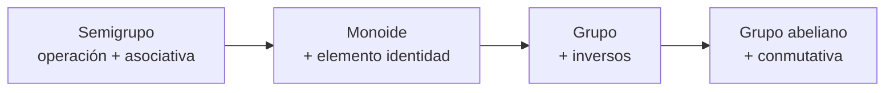
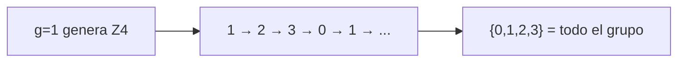
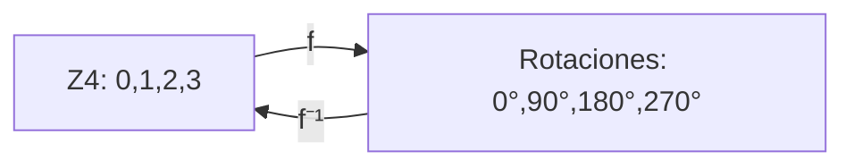

# Estructuras algebraicas

Una **estructura algebraica** es un conjunto con una o más operaciones y reglas. Es el lenguaje con el que las matemáticas describen **patrones y simetrías**: desde los movimientos de un cubo de Rubik hasta los códigos que protegen tus datos.

> [!tip] ¿Para qué sirve esta unidad?
> - Criptografía moderna (curvas elípticas, Diffie-Hellman) vive dentro de **grupos**.
> - Códigos detectores y correctores de errores (el ISBN, los códigos QR) usan estructuras algebraicas.
> - Los **isomorfismos** revelan cuándo dos sistemas "son el mismo" con otro nombre.

---

## 10.1 Operación binaria y sus propiedades

Una **operación binaria** $\ast$ en un conjunto $S$ combina dos elementos de $S$ y produce otro de $S$ (clausura): $a \ast b \in S$ para todo $a, b \in S$.

Propiedades que puede tener:

| Propiedad | Definición | Ejemplo (suma en $\mathbb{Z}$) |
|-----------|------------|-------------------------------|
| **Clausura** | $a \ast b \in S$ siempre | $2+3 = 5 \in \mathbb{Z}$ ✔ |
| **Asociativa** | $(a \ast b) \ast c = a \ast (b \ast c)$ | $(2+3)+4 = 2+(3+4)$ ✔ |
| **Conmutativa** | $a \ast b = b \ast a$ | $2+3 = 3+2$ ✔ |
| **Elemento identidad** | $\exists e: a \ast e = e \ast a = a$ | $a + 0 = a$ → $e=0$ ✔ |
| **Inverso** | $\forall a, \exists b: a \ast b = b \ast a = e$ | $a + (-a) = 0$ ✔ |

> [!warning] No todas las operaciones son conmutativas
> La resta en $\mathbb{Z}$ es asociativa solo con cuidado: $8-(3-2) \neq (8-3)-2$ ($7 \neq 3$). La **multiplicación de matrices** no es conmutativa: $AB \neq BA$ en general.

---

## 10.2 Semigrupo, monoide y grupo

Cada estructura añade reglas:

- **Semigrupo:** $S$ con operación asociativa (p. ej. $\mathbb{Z}^{+}$ con la suma: sí asociativa, sin neutro ni inversos).
- **Monoide:** semigrupo con identidad (p. ej. $\mathbb{Z}$ con la multiplicación: $e=1$, pero sin inversos).
- **Grupo:** monoide con inversos.
- **Grupo abeliano** (o conmutativo): grupo donde la operación conmuta.

> [!example] El grupo más familiar
> Los enteros con la suma $(\mathbb{Z}, +)$ forman un **grupo abeliano**:
> $e=0$, inverso de $a$ es $-a$, y $a+b=b+a$.
> Los enteros con la multiplicación $(\mathbb{Z}, \cdot)$ **no** son grupo: el 2 no tiene inverso entero (1/2 no es entero).

---

## 10.3 Tablas de Cayley

Una **tabla de Cayley** muestra el resultado de operar cada par. La del grupo $(\mathbb{Z}_4, +)$ módulo 4:

| $+$ | 0 | 1 | 2 | 3 |
|-----|---|---|---|---|
| **0** | 0 | 1 | 2 | 3 |
| **1** | 1 | 2 | 3 | 0 |
| **2** | 2 | 3 | 0 | 1 |
| **3** | 3 | 0 | 1 | 2 |

> [!tip] Cómo "leer" una tabla de Cayley
> - La fila del **identidad** (0) y la columna del 0 repiten el otro operando: ahí se ve $e$.
> - Si la tabla es **simétrica** por la diagonal, el grupo es abeliano (esta lo es ✔).
> - Cada fila/columna es una **permutación** de los elementos: señal de que hay inversos.

---

## 10.4 Subgrupos, orden y grupos cíclicos

**Subgrupo:** un subconjunto $H \subseteq G$ que es grupo con la misma operación. Ejemplo: los pares $\{0, 2, 4, \dots\}$ forman un subgrupo de $(\mathbb{Z}, +)$.

**Orden de un elemento:** el menor $k > 0$ tal que $a^k = e$. En $(\mathbb{Z}_4, +)$, el elemento 2 tiene orden 2 (porque $2+2 = 0$).

**Grupo cíclico:** un grupo donde existe un elemento $g$ (el **generador**) tal que sus potencias producen todo el grupo: $G = \{g^0, g^1, \dots, g^{n-1}\}$.

> [!info] Los grupos cíclicos son la llave de la criptografía
> El grupo $\mathbb{Z}_p^*$ (enteros no nulos módulo un primo grande) es cíclico. El **logaritmo discreto** (dado $g$ y $g^x$, hallar $x$) es fácil de calcular pero **difícil de invertir**, y de ahí nacen Diffie-Hellman y ElGamal.

---

## 10.5 Anillos, cuerpos y dominios

| Estructura | Dos operaciones | Ejemplo |
|------------|-----------------|---------|
| **Anillo** | $(R,+,\cdot)$: suma abeliana + multiplicación asociativa y distributiva | $\mathbb{Z}$ con + y · |
| **Dominio íntegro** | Anillo conmutativo sin divisores de cero ($ab=0 \Rightarrow a=0$ o $b=0$) | $\mathbb{Z}$ no tiene divisores de cero |
| **Cuerpo (campo)** | Anillo donde todo elemento $\neq 0$ tiene inverso multiplicativo | $\mathbb{Q}$, $\mathbb{R}$, $\mathbb{Z}_p$ con primos |

> [!abstract] Propiedad clave de los cuerpos
> En un cuerpo se puede **dividir**. $\mathbb{Z}_p = \{0,1,\dots,p-1\}$ con la aritmética módulo $p$ es un cuerpo **si y solo si** $p$ es primo. Por eso RSA usa primos: para poder calcular inversos $e^{-1}$.
>
> Ejemplo: en $\mathbb{Z}_7$, el inverso de 3 es 5 porque $3 \cdot 5 = 15 \equiv 1$.

---

## 10.6 Homomorfismos e isomorfismos

Un **homomorfismo** es una función que "respeta" la operación: $f(a \ast b) = f(a) \cdot f(b)$.

Un **isomorfismo** es un homomorfismo biyectivo: los dos grupos son **estructuralmente iguales**, solo cambian los nombres.

> [!example] El mismo grupo con otro nombre
> $(\mathbb{Z}_4, +)$ y las **rotaciones de un cuadrado** (90°, 180°, 270°, 0°) son isomorfos:
> - $-f(1) = \text{rotar } 90°$, $f(2) = 180°$, etc.
> - Girar 90° + girar 180° = girar 270° ↔ $1 + 2 = 3 \pmod{4}$. **Las tablas de Cayley coinciden.**

> [!tip] ¿Para qué sirven los isomorfismos?
> Si ya entiendes una estructura, **todas sus isomorfas** se comportan igual. Los códigos de corrección de errores y la teoría de Galois (¿se puede resolver una ecuación con radicales?) viven de esta idea.

---

## 10.7 Aplicaciones

| Aplicación | Estructura usada |
|------------|------------------|
| **Curvas elípticas / ECC** | Grupos de puntos sobre cuerpos finitos |
| **Códigos QR / Reed-Solomon** | Cuerpos $GF(2^m)$ (Extensión de campos) |
| **Verificación ISBN** | Aritmética módulo 11 |
| **Cubo de Rubik** | Grupo de permutaciones (¡43 trillones de posiciones!) |
| **Cristalografía** | Grupos de simetrías |

> [!tip] Para practicar
> - Construye la tabla de Cayley de $\mathbb{Z}_5$ con la suma y verifica que cada fila sea una permutación.
> - Verifica que los pares forman un subgrupo de $(\mathbb{Z}, +)$ probando las 4 propiedades.
> - Decide si $\{0, 2, 4\}$ es un grupo módulo 6 (pista: 2 tiene inverso? 2·? ≡ 1).

## ✅ Evaluación

A continuación se presentan las preguntas de opción múltiple sobre el tema. Se responden en la aplicación `evaluador.py` o directamente en esta página web.

### Pregunta 1

Un **grupo** $(G, *)$ debe cumplir:

a) Clausura, asociatividad, identidad e inversos
b) Solo conmutatividad
c) Unicidad de elementos
d) Distributividad

> **a) Clausura, asociatividad, identidad e inversos**

---

### Pregunta 2

Los enteros con la **suma** forman un grupo porque:

a) Todo entero tiene inverso (su opuesto)
b) Todo entero tiene inverso multiplicativo
c) No hay identidad
d) La suma no es asociativa

> **a) Todo entero tiene inverso (su opuesto)**

---

### Pregunta 3

Los enteros con la **multiplicación** NO forman un grupo porque:

a) No hay identidad
b) El 2 no tiene inverso entero
c) La multiplicación no es asociativa
d) No hay clausura

> **b) El 2 no tiene inverso entero**

---

### Pregunta 4

El **elemento identidad** de la suma en $\mathbb{Z}$ es:

a) 1
b) 0
c) $-1$
d) No existe

> **b) 0**

---

### Pregunta 5

Los grupos se usan, entre otras cosas, para:

a) Estudiar simetrías y criptografía
b) Solo para sumar números
c) Dibujar grafos
d) Contar combinaciones

> **a) Estudiar simetrías y criptografía**

---
