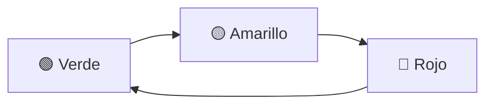
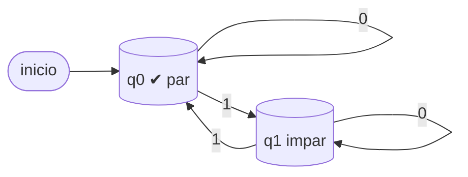
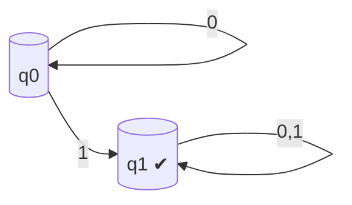
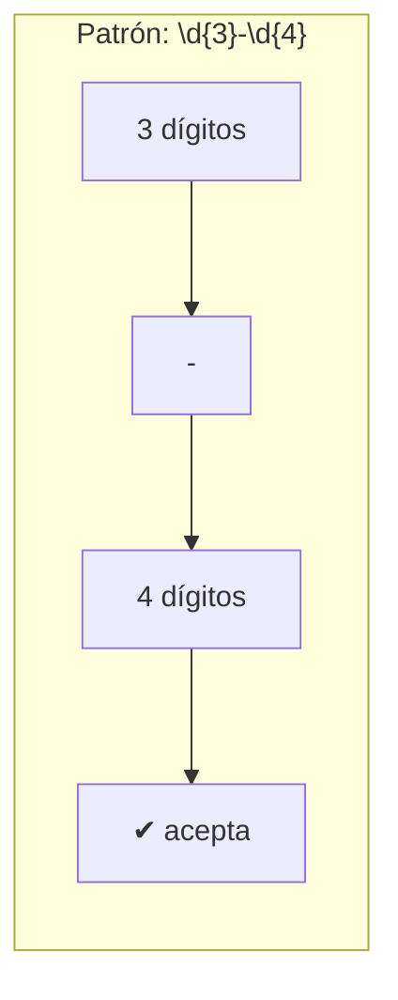
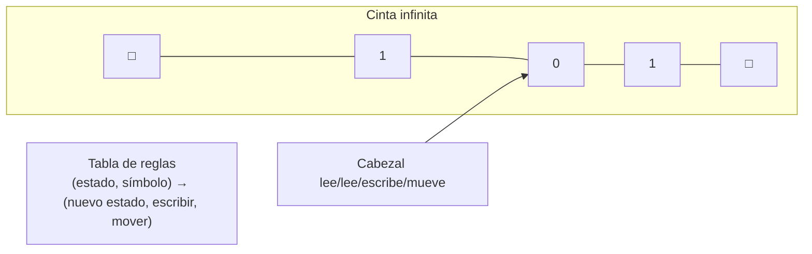

# Autómatas y lenguajes

Un **autómata finito** es una máquina abstracta con un número finito de **estados** que cambia según la **entrada**. Está en el corazón de los compiladores, la validación de formularios, los buscadores y hasta el semáforo de la calle.

> [!tip] ¿Para qué sirve esta unidad?
> - Los **compiladores** de C, Python o Java usan autómatas y gramáticas para entender tu código.
> - Cada vez que validas un email o un teléfono con `regex`, usas un autómata.
> - La **máquina de Turing** define qué puede (y qué **no**) calcular una computadora.

---

## 11.1 Autómata finito determinista (DFA)

Un **DFA** (Deterministic Finite Automaton) es una quíntupla $(Q, \Sigma, \delta, q_0, F)$:

- $Q$: conjunto finito de **estados**.
- $\Sigma$: **alfabeto** (símbolos de entrada).
- $\delta$: **función de transición** (estado + símbolo → estado).
- $q_0$: **estado inicial**.
- $F$: **estados de aceptación** (finales).

> [!example] El semáforo
> Estados: {🟢, 🟡, 🔴}. Alfabeto: {tick} (el tiempo avanza). Aceptación: no hay (nunca "termina").



---

## 11.2 Reconocimiento de cadenas

El autómata **lee** la cadena símbolo a símbolo. Si al terminar está en un estado de aceptación, la **acepta**; si no, la **rechaza**.

> [!example] Paridad de unos (detector de número par de 1s)
> Estados: $q_0$ (par), $q_1$ (impar). Alfabeto $\{0, 1\}$. Aceptación: $q_0$.



- Cadena `1101`: $q_0 \xrightarrow{1} q_1 \xrightarrow{1} q_0 \xrightarrow{0} q_0 \xrightarrow{1} q_1$ → termina en $q_1$ → **rechaza** (3 unos = impar).
- Cadena `1010`: termina en $q_0$ → **acepta** (2 unos = par).

> [!note] Lenguaje aceptado
> El **lenguaje** $L(M)$ de un autómata es el conjunto de todas las cadenas que acepta. Los lenguajes que acepta un DFA se llaman **lenguajes regulares**.

---

## 11.3 NFA y equivalencia con DFA

Un **NFA** (autómata finito no determinista) puede tener **varias transiciones** para el mismo símbolo (o transiciones $\varepsilon$ sin consumir símbolo). "Adivina" o explora todos los caminos a la vez.



> [!abstract] Teorema clave
> **Todo NFA se puede convertir a un DFA equivalente** (construcción de subconjuntos). Los NFA no añaden poder, solo **comodidad**: son más fáciles de diseñar y los DFA más fáciles de implementar. Ambos reconocen exactamente los **lenguajes regulares**.

---

## 11.4 Expresiones regulares (regex)

Una **expresión regular** es una forma compacta de describir un lenguaje regular. Con ellas se construyen los autómatas automáticamente.

| Operador | Significado | Ejemplo |
|----------|-------------|---------|
| $\mid$ (unión) | "o" | `ab\|cd` acepta `ab` o `cd` |
| $\ast$ (estrella) | 0 o más veces | `ab*` acepta `a`, `ab`, `abb`, ... |
| $+$ | 1 o más veces | `a+` acepta `a`, `aa`, ... |
| `?` | 0 o 1 vez | `colou?r` acepta `color`, `colour` |

> [!example] Teléfono
> `^\d{3}-\d{4}$` acepta `555-1234` pero rechaza `5551234`, `555-123`, `abc-defg`. El `\d` significa "dígito" y `{3}` "exactamente 3".



> [!warning] Regex no puede "contar"
> No existe una regex que acepte exactamente las cadenas con el **mismo número** de `a` y `b` (`aⁿbⁿ`). Ese lenguaje no es regular: se necesitan **gramáticas** más potentes (context-free).

---

## 11.5 Gramáticas formales y jerarquía de Chomsky

Una **gramática** $G = (V, \Sigma, P, S)$ genera cadenas aplicando **reglas de producción**. Ejemplo para un teléfono:

```
<S>  →  <d> <d> <d> "-" <d> <d> <d> <d>
<d>  →  0 | 1 | 2 | ... | 9
```

Aplicando las reglas: `<S>` → `555-1234`. ✔

**Jerarquía de Chomsky** (poder creciente):

| Tipo | Nombre | Reconocido por | Ejemplo |
|------|--------|----------------|---------|
| 3 | **Regular** | Autómatas finitos / regex | `ab*c` |
| 2 | **Libre de contexto** | Autómatas con pila | `aⁿbⁿ` |
| 1 | **Sensible al contexto** | Autómatas lineales acotados | `aⁿbⁿcⁿ` |
| 0 | **Recursivamente enumerable** | Máquina de Turing | Lenguajes de programación |

> [!info] ¿Dónde entran los lenguajes de programación?
> Python, C, Java son **libres de contexto** en su sintaxis (esto permite escribir sus **compiladores** con herramientas como Yacc/Bison). Las **reglas de tipos** (que `int + string` sea error) van más allá y necesitan análisis semántico adicional.

---

## 11.6 Máquina de Turing

La **máquina de Turing** (1936) es el modelo más general de computación: una cinta infinita, un cabezal lector/escritor y una tabla de reglas. Es el "abuelo" de las computadoras.



> [!abstract] Tesis de Church–Turing
> **Toda** función computable puede calcularla una máquina de Turing. Y existen problemas **indecidibles**: el problema de la **parada** (¿termina este programa alguna vez?) no tiene algoritmo que lo resuelva para todos los programas. Es la frontera de lo que una computadora puede hacer.

---

## 11.7 Aplicaciones

| Aplicación | Autómata / gramática |
|------------|----------------------|
| **Compiladores** | Analizadores léxico (DFA) + sintáctico (gramática libre de contexto) |
| **Buscadores / regex** | Autómatas finitos (librerías `re`, `grep`, validación web) |
| **Protocolos de red** | Autómatas de estados (TCP: SYN → SYN-ACK → ACK...) |
| **IA conversacional** | Máquinas de estados para diálogos |
| **Teoría de la computación** | Máquina de Turing, problemas indecidibles |

> [!tip] Para practicar
> - Diseña un DFA que acepte cadenas que **terminen en `01`** (pista: 3 estados).
> - Escribe la regex para un correo simplificado: `usuario@dominio.ext`.
> - Explica por qué `aⁿbⁿ` **no** se puede reconocer con un autómata finito.


## ✅ Evaluación

A continuación se presentan las preguntas de opción múltiple sobre el tema. Se responden en la aplicación `evaluador.py` o directamente en esta página web.

### Pregunta 1

Un **autómata finito** cambia de estado según:

a) El azar
b) La entrada que recibe
c) El número de estados
d) La memoria del computador

> **b) La entrada que recibe**

---

### Pregunta 2

La expresión regular que valida un teléfono tipo 555-1234 es:

a) `^\d{3}-\d{4}$`
b) `^\d{4}-\d{3}$`
c) `^a-z$`
d) `[0-9]`

> **a) `^\d{3}-\d{4}$`**

---

### Pregunta 3

La **máquina de Turing** es:

a) Un modelo de computación general
b) Un tipo de memoria
c) Un lenguaje de programación
d) Un autómata sin estados

> **a) Un modelo de computación general**

---

### Pregunta 4

Un semáforo (rojo → amarillo → verde) es un ejemplo de:

a) Expresión regular
b) Autómata finito
c) Gramática
d) Grafo completo

> **b) Autómata finito**

---

### Pregunta 5

Las **gramáticas formales** se usan principalmente para:

a) Construir compiladores y analizar lenguajes
b) Dibujar diagramas
c) Calcular MCD
d) Ordenar listas

> **a) Construir compiladores y analizar lenguajes**

---
