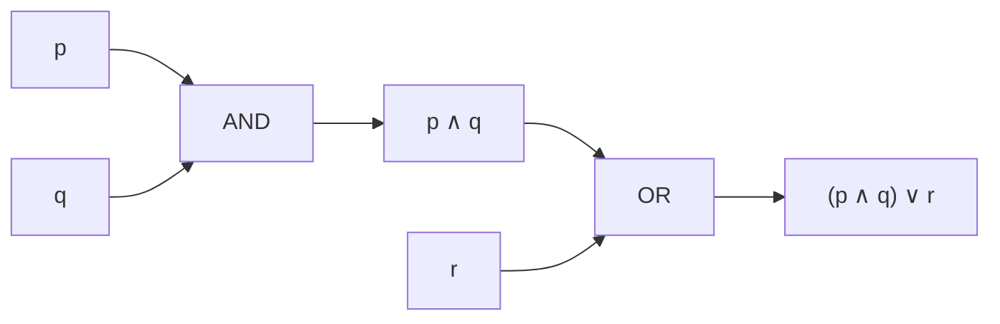

# 📐 Matemática Discreta — Guía Didáctica

> [!note] ¿Para quién es esta guía?
> Para quien quiere **entender de qué trata la matemática discreta y por qué importa**, antes de meterse a fondo en cada tema. Aquí está el **mapa general**: qué estudia cada área, con qué idea cotidiana se relaciona y un primer ejemplo. No sustituye a un curso completo: es la **brújula** para recorrerlo.

---

## 🧭 1. ¿Qué es la matemática discreta?

**Discreto** significa *separado, contable, que avanza a pasos*. Lo contrario es **continuo** (algo que fluye sin saltos).

> [!tip] Analogía rápida
> Un **semáforo** es discreto: cambia por estados (rojo → amarillo → verde). Un **termostato** es continuo: la temperatura sube y baja sin saltos. La matemática discreta estudia lo del semáforo; el cálculo tradicional estudia lo del termostato.

La matemática discreta estudia **estructuras que se cuentan y se separan**: números enteros, proposiciones lógicas, conjuntos, grafos, algoritmos, cadenas de texto. Es la **base de la computación**, porque un computador trabaja con *bits* (0 o 1): todo en él es discreto.

**¿Dónde la usas sin darte cuenta?**
- Algoritmos de búsqueda y ordenamiento (Google, tus listas).
- Criptografía (tu conexión https, el WhatsApp cifrado).
- Redes y rutas (el GPS, las conexiones entre servidores).
- Bases de datos (consultas, llaves, relaciones).
- Inteligencia artificial (grafos de conocimiento, autómatas).

```chart
type: bar
labels: ["Lógica", "Conjuntos", "Relaciones y funciones", "Inducción", "Combinatoria", "Teoría de números", "Grafos y árboles"]
series:
  - title: "Conceptos clave introducidos en esta guía"
    data: [5, 4, 5, 4, 6, 6, 6]
width: 90%
beginAtZero: true
```


---

## 🗺️ 2. Mapa del temario (hoja de ruta)

| # | Unidad | ¿Qué estudia? | ¿Para qué sirve? |
|---|--------|---------------|------------------|
| 1 | **Lógica** | Proposiciones, conectivos, tablas de verdad, cuantificadores | Razonar con rigor, demostrar, circuitos, consultas SQL |
| 2 | **Conjuntos y demostraciones** | Conjuntos, operaciones, métodos de demostración | Fundamento de todo; validar afirmaciones matemáticas |
| 3 | **Relaciones y funciones** | Propiedades, equivalencias, órdenes, funciones | Bases de datos, jerarquías, modelado |
| 4 | **Inducción y recursión** | Inducción, recursividad, recurrencias | Algoritmos recursivos, análisis de complejidad |
| 5 | **Combinatoria y probabilidad discreta** | Conteo, permutaciones, combinaciones, palomar | Probabilidad, criptografía, optimización |
| 6 | **Teoría de números** | Divisibilidad, primos, aritmética modular | Criptografía (RSA), códigos de verificación |
| 7 | **Grafos y árboles** | Vértices, aristas, caminos, árboles | Redes, rutas, jerarquías, mapas |
| 8 | **Estructuras algebraicas** *(avanzado)* | Grupos, anillos, cuerpos | Álgebra abstracta, criptografía avanzada |
| 9 | **Autómatas y lenguajes** *(avanzado)* | Autómatas, expresiones regulares, gramáticas | Compiladores, validación de formatos, IA |

> [!info] Orden sugerido
> Las unidades 1–4 son el **cimientos**: sin lógica y conjuntos, las demás se entienden a medias. Las unidades 5–7 son el **corazón práctico** (los problemas clásicos). Las 8–9 son **nivel avanzado** para después.

---

## 🔤 3. Unidad 1 — Lógica

### Proposiciones

Una **proposición** es una oración que **puede ser verdadera o falsa** (aunque no sepamos cuál).

- "Hoy es lunes" → proposición (tiene valor de verdad).
- "¿Qué hora es?" → NO es proposición (pregunta).
- "x + 3 = 5" → NO es proposición (no sabemos qué es x; sin valor definido).

### Conectivos lógicos

| Conectivo | Símbolo | Se lee | Se cumple cuando… | Analogía |
|-----------|---------|--------|-------------------|----------|
| Negación | $\neg p$ | "no p" | p es falsa | Interruptor apagado |
| Conjunción | $p \land q$ | "p y q" | **ambos** verdaderos | Lista de requisitos: necesitas TODOS |
| Disyunción | $p \lor q$ | "p o q" | **al menos uno** verdadero | Menú: puedes elegir uno u otro |
| Condicional | $p \to q$ | "si p, entonces q" | falsa solo si p verdadera y q falsa | Promesa: "si estudias, apruebas" |
| Bicondicional | $p \leftrightarrow q$ | "p si y solo si q" | ambos iguales | Términos de un contrato |

> [!tip] Truco de memoria (¡como tu Anotaciones.md!)
> El **∧** ("y") parece una **V invertida**, y el **∨** ("o") es la V normal. **"La V invertida es el Y"** → la conjunción es el Y. Si la V está normal (apuntando abajo… hacia el *o* abierto), es el *o*. Easy.

### Tabla de verdad (ejemplo)

| $p$ | $q$ | $p \land q$ | $p \lor q$ | $p \to q$ |
| --- | --- | ----------- | ---------- | --------- |
| V   | V   | V           | V          | V         |
| V   | F   | F           | V          | F         |
| F   | V   | F           | V          | V         |
| F   | F   | F           | F          | V         |

> [!warning] El clásico error
> $p \to q$ (condicional) **no significa causa**. "Si llueve, la calle se moja" es verdadera aunque hoy no llueva (si no llueve, no prometimos nada). Solo es falsa si **llueve y NO se moja**.

### Cuantificadores

- **Universal** $\forall$: "para todo". "$\forall x \in \mathbb{N},\ x \geq 0$" → todos los naturales son ≥ 0.
- **Existencial** $\exists$: "existe al menos uno". "$\exists x \in \mathbb{N},\ x = 5$" → hay un natural igual a 5.

### Equivalencias útiles: Leyes de De Morgan

$$
\neg(p \land q) \equiv \neg p \lor \neg q \qquad \neg(p \lor q) \equiv \neg p \land \neg q
$$

"No es cierto que llueva **y** haga frío" = "no llueve **o** no hace frío". Siempre se invierte el conectivo.

> [!example] Para practicar
> Escribe en símbolos: "No todos los estudiantes llegaron temprano". Pista: niégale el $\forall$ y verás aparecer un $\exists$ con negación.

---

## 🧩 4. Unidad 2 — Conjuntos y demostraciones

### Conjuntos (repaso exprés)

Ya los conoces del curso de estadística: un **conjunto** es una colección bien definida. Símbolos: $\in$ (pertenece), $\subseteq$ (subconjunto), $\cup$ (unión), $\cap$ (intersección), $\emptyset$ (vacío).

### Métodos de demostración

Demostrar una afirmación es **convencer sin dejar dudas**, con reglas, no con opiniones.

| Método | Idea | Analogía |
|--------|------|----------|
| **Directa** | Partes de lo que sabes y encadenas pasos hasta la conclusión | Seguir una receta paso a paso |
| **Contrapositiva** | En lugar de probar "si p entonces q", pruebas "si no q entonces no p" (equivalente) | Si no ves humo, es que no hay fuego (equivale a: si hay fuego, hay humo) |
| **Contradicción** | Supones lo contrario y llegas a un absurdo | En un juicio: "supongamos que el sospechoso es inocente… pero eso contradice la evidencia" |
| **Inducción** | Pruebas el primer caso y luego que si un caso vale, el siguiente también | **Dominó**: si cae la primera ficha y cada ficha tumba a la siguiente, caen TODAS |

> [!example] Demostración directa mínima
> Afirmación: "Si $n$ es par, entonces $n^2$ es par".
> Como $n$ es par, $n = 2k$. Entonces $n^2 = (2k)^2 = 4k^2 = 2(2k^2)$, que es par. ✅

---

## 🔗 5. Unidad 3 — Relaciones y funciones

### Relaciones

Una **relación** entre dos conjuntos $A$ y $B$ es un vínculo entre sus elementos. En una base de datos, cada fila de una tabla es una relación (quién está asignado a qué proyecto).

**Propiedades:**
- **Reflexiva:** todo elemento está relacionado consigo mismo ("$x \leq x$" siempre).
- **Simétrica:** si $a$ está con $b$, entonces $b$ con $a$ (amistad: si yo soy tu amigo, tú eres el mío).
- **Transitiva:** si $a$ con $b$ y $b$ con $c$, entonces $a$ con $c$ (edad: si Ana < Beto y Beto < Carlos, entonces Ana < Carlos).

- **Relación de equivalencia** = reflexiva + simétrica + transitiva. Divide al conjunto en **clases** (grupos). Ejemplo: "tener la misma edad" agrupa a las personas por edad.
- **Orden parcial** = reflexiva + antisimétrica + transitiva. Ejemplo: "ser subconjunto de" ($\subseteq$) ordena conjuntos como cajas anidadas.

### Funciones

Una **función** $f: A \to B$ asigna a cada elemento de $A$ **exactamente un** elemento de $B$.

| Tipo | Significado | Analogo |
|------|-------------|---------|
| **Inyectiva** | Cada salida tiene una sola entrada | DNI: cada persona tiene un número distinto |
| **Sobreyectiva** | Se usan todas las salidas posibles | Cada asiento del cine está ocupado |
| **Biyectiva** | Inyectiva + sobreyectiva | Casilleros: cada persona su casillero y viceversa (tiene inversa) |

---

## 🪜 6. Unidad 4 — Inducción y recursión

### Inducción

Para probar que una propiedad vale para **todos** los naturales:

1. **Base:** vale para $n = 1$.
2. **Paso inductivo:** suponiendo que vale para $n$, demuestras que vale para $n+1$.

> [!example] La suma clásica
> $1 + 2 + 3 + \cdots + n = \dfrac{n(n+1)}{2}$
> - Base: $1 = 1(2)/2 = 1$ ✅
> - Paso: si vale para $n$, entonces $(1 + \cdots + n) + (n+1) = \frac{n(n+1)}{2} + (n+1) = \frac{(n+1)(n+2)}{2}$ ✅
> ¡Y así para todos los naturales!

### Recursión

Un objeto es **recursivo** si se define en términos de sí mismo, pero con un **caso base** que detiene la recursión.

- **Factorial:** $n! = n \cdot (n-1)!$, con $0! = 1$.
- **Fibonacci:** $F_n = F_{n-1} + F_{n-2}$, con $F_0 = 0$, $F_1 = 1$ (¡el famoso problema de los conejos!).

> [!tip] Analogía
> La recursión es como las **muñecas rusas**: abres una y dentro hay otra más pequeña, hasta llegar a la más chica (el caso base). Luego vas cerrando de regreso.

Una **recurrencia** es la versión con ecuaciones: expresa un término en función de los anteriores. Ejemplo: $T(n) = T(n-1) + 1$ con $T(1)=1$ describe los pasos de un algoritmo que recorre $n$ elementos.

---

## 🧮 7. Unidad 5 — Combinatoria y probabilidad discreta

Este tema **ya lo tocas en estadística** (permutaciones, combinaciones, $C(n,k)$). Aquí está la visión general:

- **Principio de la suma:** si hay $m$ formas de hacer A y $n$ formas de hacer B (y son excluyentes), hay $m + n$ formas de hacer A **o** B.
- **Principio del producto:** si hay $m$ formas de hacer A y luego $n$ formas de hacer B, hay $m \times n$ formas de hacer A **y** B.

| Concepto | Fórmula | Ejemplo |
|----------|---------|---------|
| Permutación (orden importa) | $P(n,k) = \dfrac{n!}{(n-k)!}$ | Podios de carrera (1°, 2°, 3°) |
| Combinación (orden no importa) | $C(n,k) = \binom{n}{k} = \dfrac{n!}{k!(n-k)!}$ | Elegir 3 amigos de 5 |
| Binomio de Newton | $(x+y)^n = \sum_{k=0}^{n} \binom{n}{k}\, x^{n-k} y^k$ | Coeficientes del triángulo de Pascal |

**Principio del palomar:** si tienes más palomas que nidos, al menos un nido tiene dos palomas. Ejemplo: en un grupo de 13 personas, al menos dos nacieron el mismo mes.

**Inclusión-exclusión:** para contar uniones sin contar dos veces lo repetido:

$$
|A \cup B| = |A| + |B| - |A \cap B|
$$

---

## 🔢 8. Unidad 6 — Teoría de números

### Divisibilidad y primos

- $a$ divide a $b$ ($a \mid b$) si $b = a \cdot k$ para algún entero $k$: "4 divide a 12" porque $12 = 4 \cdot 3$.
- **Primo:** divisible solo por 1 y por sí mismo (2, 3, 5, 7, 11…). Los primos son los **"átomos"** de los números: todo número se factoriza en primos de forma única (Teorema Fundamental de la Aritmética).

### MCD y algoritmo de Euclides

El **máximo común divisor (MCD)** de $a$ y $b$ es el divisor más grande que comparten.
- Ejemplo: $\text{MCD}(48, 18) = 6$ porque $48 = 2^4 \cdot 3$ y $18 = 2 \cdot 3^2$; lo común es $2 \cdot 3 = 6$.

**Algoritmo de Euclides** (el más antiguo que se conserva): divide y usa el residuo:

$$
48 = 18 \cdot 2 + 12 \qquad 18 = 12 \cdot 1 + 6 \qquad 12 = 6 \cdot 2 + 0
$$

El último residuo no nulo es el MCD: **6**. Rápido y eficiente, ideal para computadoras.

### Aritmética modular

Trabajar con **residuos**: "el reloj da vueltas". Las 25:00 horas son las 1:00 (módulo 24). Escribimos $25 \equiv 1 \ (\text{mod } 24)$.

- Sirve para: calendarios, códigos de barras, validación de tarjetas, y **cierta criptografía**.
- RSA (lo que cifra tu conexión) usa números muy grandes y sus restos módulo otro número. La seguridad está en que **factorizar primos grandes es difícil**.

> [!example] Módulo divertido
> ¿Qué día de la semana será en 10 días si hoy es lunes? $10 \equiv 3 \ (\text{mod } 7)$ → jueves.

---

## 🕸️ 9. Unidad 7 — Grafos y árboles

### Grafos

Un **grafo** es un conjunto de **vértices** (puntos) conectados por **aristas** (líneas). Es un mapa abstracto de conexiones.

> [!tip] Analogía
> Una **red social**: cada persona es un vértice y cada amistad una arista. Un grafo también modela calles, cables, páginas web, moléculas, procesos y tareas.

- **Dirigido:** las aristas tienen flecha (Instagram: tú sigues a alguien, no al revés).
- **No dirigido:** las aristas son de dos vías (amistad de Facebook).
- **Ponderado:** las aristas tienen peso (kilómetros, costo, tiempo).

**Conectividad:** dos vértices están conectados si hay un camino entre ellos. El problema clásico de los **puentes de Königsberg** (¿se puede cruzar cada puente exactamente una vez?) dio origen a la teoría de grafos.

- Un grafo tiene un **camino euleriano** si puedes recorrer cada arista una sola vez (el problema de los puentes).
- Un **camino hamiltoniano** visita cada vértice una sola vez (problema del vendedor viajero: la ruta más barata visitando todas las ciudades).

### Árboles

Un **árbol** es un grafo **conexo sin ciclos** (no hay "círculos" de conexiones). Es la estructura natural de las **jerarquías**.

- Árbol genealógico, sistema de archivos, torneos deportivos.
- **Recorridos:** BFS (por niveles, como olas) y DFS (por ramas, hasta el fondo). Son la base de búsquedas en mapas y redes.

---

## 🧬 10. Unidad 8 — Estructuras algebraicas *(avanzado)*

Una **estructura algebraica** es un conjunto con una o más operaciones y reglas. La más importante: el **grupo**.

**Grupo** $(G, *)$: un conjunto con una operación que cumple:
1. **Clausura:** operar dos elementos da otro del conjunto.
2. **Asociatividad:** $(a * b) * c = a * (b * c)$.
3. **Identidad:** existe un elemento neutro (el 0 en la suma, el 1 en la multiplicación).
4. **Inversos:** cada elemento tiene su "opuesto" (suma: $-a$; mult: $1/a$).

Ejemplo: los enteros con la suma forman un grupo. Los enteros con la multiplicación **no** (el 2 no tiene inverso entero).

> [!info] ¿Para qué?
> Los grupos estudian **simetrías** (movimientos de un cubo, patrones), y son la base matemática de criptografía y códigos. Si te apasionan, este es el puente entre lo discreto y el álgebra moderna.

---

## 🤖 11. Unidad 9 — Autómatas y lenguajes *(avanzado)*

Un **autómata finito** es una máquina con un número finito de **estados** que cambia según la **entrada**. El semáforo de la introducción es un autómata (rojo → amarillo → verde).

- **Expresiones regulares (regex):** patrones para validar textos. Ejemplo: `^\d{3}-\d{4}$` valida un teléfono tipo "555-1234".
- **Gramáticas:** reglas para construir lenguajes (de programación o naturales). Con ellas se hacen los **compiladores**.
- **Máquina de Turing:** el modelo de computación más general; lo que un algoritmo puede (o no puede) hacer.

> [!example] Validar un correo
> Un autómata puede decidir si "usuario@dominio.com" es válido: pasa por estados (usuario → @ → dominio → extensión) y acepta o rechaza al final. Eso haces cada vez que llenas un formulario web.

---

## 🎯 12. Cómo estudiar matemática discreta (método)

1. **Un concepto → un ejemplo propio.** No repitas el del libro; invéntate uno (tu deporte, tu música, tu trabajo).
2. **Dibuja.** Los grafos, conjuntos y tablas de verdad se entienden dibujando. Lápiz y papel > leer.
3. **Practica en espiral.** Repasa cada unidad a los 1, 3 y 7 días. La matemática discreta se olvida rápido si no se usa.
4. **Técnica Feynman:** explica el tema en voz alta como si se lo enseñaras a alguien. Si te trabas, es que falta entender.
5. **Errores comunes que debes evitar:**
   - Confundir el "o" inclusivo ($\lor$) con el "o" excluyente (o uno u otro, pero no ambos).
   - Creer que $p \to q$ es lo mismo que "p causa q".
   - Usar inducción sin verificar la **base** (el dominó sin primera ficha no cae).
   - Llamar "árbol" a cualquier grafo (un árbol **no tiene ciclos**).
   - Olvidar restar la intersección al contar uniones (inclusión-exclusión).

---

## ✅ 13. Autoevaluación general

A continuación se presentan las preguntas de opción múltiple sobre la guía. En la web se responden de forma interactiva (quiz.js).

### Pregunta 1

¿Cuál de los siguientes enunciados es una **proposición**?

a) ¡Cierra la puerta!
b) 2 + 2 = 5
c) x + 3
d) ¿Qué hora es?
> **b) 2 + 2 = 5** — es una oración con valor de verdad (falso, pero lo tiene). Las preguntas, órdenes y expresiones con variables no son proposiciones.

### Pregunta 2

La expresión $p \lor q$ es verdadera cuando…

a) Solo cuando p y q son verdaderas
b) Al menos una de las dos es verdadera
c) Solo cuando ambas son falsas
d) Nunca es verdadera
> **b)** — $\lor$ es el "o" inclusivo: basta con que una sea verdadera (o ambas).

### Pregunta 3

"Todos los estudiantes aprobaron" se escribe correctamente como…

a) $\exists x\ \text{Estudiante}(x) \land \text{Aprobó}(x)$
b) $\forall x\ \text{Estudiante}(x) \to \text{Aprobó}(x)$
c) $\forall x\ \text{Estudiante}(x) \land \text{Aprobó}(x)$
d) $\exists x\ \text{Estudiante}(x) \to \text{Aprobó}(x)$
> **b)** — el cuantificador universal $\forall$ con condicional: "para todo x, si es estudiante entonces aprobó".

### Pregunta 4

¿Qué dos partes necesita siempre una demostración por **inducción**?

a) La base y el paso inductivo
b) Solo la base
c) Solo el paso inductivo
d) Ninguna, se hace por intuición
> **a)** — base (primera ficha del dominó) + paso inductivo (cada ficha tumba a la siguiente).

### Pregunta 5

Un **árbol** en teoría de grafos es…

a) Un grafo con ciclos
b) Un grafo conexo sin ciclos
c) Cualquier conjunto de puntos conectados
d) Un grafo con aristas dirigidas
> **b)** — conexo (todo está comunicado) y sin ciclos (no hay "círculos").

### Pregunta 6

El **MCD** de 48 y 18 es…

a) 6
b) 3
c) 12
d) 2
> **a)** — $48 = 2^4 \cdot 3$, $18 = 2 \cdot 3^2$; lo común es $2 \cdot 3 = 6$. También sale con el algoritmo de Euclides.

---

## 🔣 14. Glosario de símbolos

| Símbolo | Significado |
|---------|-------------|
| $\neg p$ | Negación: "no p" |
| $p \land q$ | Conjunción: "p y q" |
| $p \lor q$ | Disyunción: "p o q" |
| $p \to q$ | Condicional: "si p, entonces q" |
| $p \leftrightarrow q$ | Bicondicional: "p si y solo si q" |
| $\forall$ | Cuantificador universal: "para todo" |
| $\exists$ | Cuantificador existencial: "existe" |
| $\in$, $\notin$ | Pertenece / no pertenece |
| $\subseteq$ | Subconjunto |
| $\cup$, $\cap$ | Unión, intersección |
| $\emptyset$ | Conjunto vacío |
| $\mathbb{N}, \mathbb{Z}, \mathbb{Q}, \mathbb{R}$ | Naturales, enteros, racionales, reales |
| $a \mid b$ | "a divide a b" |
| $\text{MCD}(a,b)$ | Máximo común divisor |
| $a \equiv b \ (\text{mod } n)$ | Congruencia módulo n (mismo residuo) |
| $O(f(n))$ | Notación de complejidad: "del orden de" |
| $\binom{n}{k}$ | Combinación: $C(n,k)$ |

---

## 📚 15. Recursos recomendados

- **Kenneth Rosen** — *Matemática Discreta y sus Aplicaciones* (el clásico completo; ideal como libro de cabecera).
- **Ralph Grimaldi** — *Matemáticas Discreta y Combinatoria* (buena profundidad en combinatoria).
- **Seymour Lipschutz** — *Matemáticas Discretas* (serie Schaum; muchos ejercicios resueltos).
- **Cursos en video**: busca "discrete mathematics" en plataformas abiertas; los temas 1–7 suelen estar cubiertos en listas de reproducción gratuitas, igual que tu curso de estadística.
- **Práctica online**: sitios de problemas de lógica y combinatoria de nivel introductorio.

> [!success] Siguiente paso
> Cuando domines el mapa general, elige una unidad y conviértela en tu primer tema profundo. La **lógica** (Unidad 1) es la mejor puerta de entrada: corta, concreta y te sirve para todo lo demás.
