# 📐 Matemática Discreta — Guía Didáctica

> [!note] ¿Para quién es esta guía?
> Para quien quiere **entender de qué trata la matemática discreta y por qué importa**, antes de meterse a fondo en cada tema. Aquí está el **mapa general**: qué estudia cada área, con qué idea cotidiana se relaciona y un primer ejemplo. No sustituye a un curso completo: es la **brújula** para recorrerlo.

---

## 🧭 1. ¿Qué es la matemática discreta?

**Discreto** significa *separado, contable, que avanza a pasos*. Lo contrario es **continuo** (algo que fluye sin saltos).

> [!tip] Analogía rápida
> Un **semáforo** es discreto: cambia por estados (rojo → amarillo → verde). Un **termostato** es continuo: la temperatura sube y baja sin saltos. La matemática discreta estudia lo del semáforo; el cálculo tradicional estudia lo del termostato.

La matemática discreta estudia **estructuras que se cuentan y se separan**: números enteros, proposiciones lógicas, conjuntos, grafos, algoritmos, cadenas de texto. Es la **base de la computación**, porque un computador trabaja con *bits* (0 o 1): todo en él es discreto.

**¿Dónde la usas sin darte cuenta?**
- Algoritmos de búsqueda y ordenamiento (Google, tus listas).
- Criptografía (tu conexión https, el WhatsApp cifrado).
- Redes y rutas (el GPS, las conexiones entre servidores).
- Bases de datos (consultas, llaves, relaciones).
- Inteligencia artificial (grafos de conocimiento, autómatas).

```chart
type: bar
labels: ["Lógica", "Conjuntos", "Relaciones y funciones", "Inducción", "Combinatoria", "Teoría de números", "Grafos y árboles"]
series:
  - title: "Conceptos clave introducidos en esta guía"
    data: [5, 4, 5, 4, 6, 6, 6]
width: 90%
beginAtZero: true
```

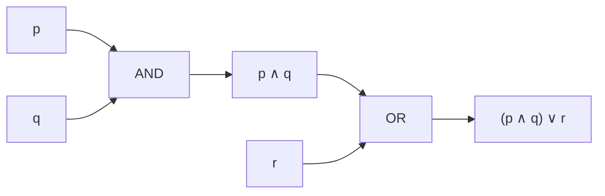

## 🗺️ 2. Mapa del temario (hoja de ruta)

| # | Unidad | ¿Qué estudia? | ¿Para qué sirve? |
|---|--------|---------------|------------------|
| 1 | **Lógica** | Proposiciones, conectivos, tablas de verdad, cuantificadores | Razonar con rigor, demostrar, circuitos, consultas SQL |
| 2 | **Conjuntos y demostraciones** | Conjuntos, operaciones, métodos de demostración | Fundamento de todo; validar afirmaciones matemáticas |
| 3 | **Relaciones y funciones** | Propiedades, equivalencias, órdenes, funciones | Bases de datos, jerarquías, modelado |
| 4 | **Inducción y recursión** | Inducción, recursividad, recurrencias | Algoritmos recursivos, análisis de complejidad |
| 5 | **Combinatoria y probabilidad discreta** | Conteo, permutaciones, combinaciones, palomar | Probabilidad, criptografía, optimización |
| 6 | **Teoría de números** | Divisibilidad, primos, aritmética modular | Criptografía (RSA), códigos de verificación |
| 7 | **Grafos y árboles** | Vértices, aristas, caminos, árboles | Redes, rutas, jerarquías, mapas |
| 8 | **Estructuras algebraicas** *(avanzado)* | Grupos, anillos, cuerpos | Álgebra abstracta, criptografía avanzada |
| 9 | **Autómatas y lenguajes** *(avanzado)* | Autómatas, expresiones regulares, gramáticas | Compiladores, validación de formatos, IA |

> [!info] Orden sugerido
> Las unidades 1–4 son el **cimientos**: sin lógica y conjuntos, las demás se entienden a medias. Las unidades 5–7 son el **corazón práctico** (los problemas clásicos). Las 8–9 son **nivel avanzado** para después.

---

## 🔤 3. Unidad 1 — Lógica

### Proposiciones

Una **proposición** es una oración que **puede ser verdadera o falsa** (aunque no sepamos cuál).

- "Hoy es lunes" → proposición (tiene valor de verdad).
- "¿Qué hora es?" → NO es proposición (pregunta).
- "x + 3 = 5" → NO es proposición (no sabemos qué es x; sin valor definido).

### Conectivos lógicos

| Conectivo | Símbolo | Se lee | Se cumple cuando… | Analogía |
|-----------|---------|--------|-------------------|----------|
| Negación | $\neg p$ | "no p" | p es falsa | Interruptor apagado |
| Conjunción | $p \land q$ | "p y q" | **ambos** verdaderos | Lista de requisitos: necesitas TODOS |
| Disyunción | $p \lor q$ | "p o q" | **al menos uno** verdadero | Menú: puedes elegir uno u otro |
| Condicional | $p \to q$ | "si p, entonces q" | falsa solo si p verdadera y q falsa | Promesa: "si estudias, apruebas" |
| Bicondicional | $p \leftrightarrow q$ | "p si y solo si q" | ambos iguales | Términos de un contrato |

> [!tip] Truco de memoria (¡como tu Anotaciones.md!)
> El **∧** ("y") parece una **V invertida**, y el **∨** ("o") es la V normal. **"La V invertida es el Y"** → la conjunción es el Y. Si la V está normal (apuntando abajo… hacia el *o* abierto), es el *o*. Easy.

### Tabla de verdad (ejemplo)

| $p$ | $q$ | $p \land q$ | $p \lor q$ | $p \to q$ |
| --- | --- | ----------- | ---------- | --------- |
| V   | V   | V           | V          | V         |
| V   | F   | F           | V          | F         |
| F   | V   | F           | V          | V         |
| F   | F   | F           | F          | V         |

> [!warning] El clásico error
> $p \to q$ (condicional) **no significa causa**. "Si llueve, la calle se moja" es verdadera aunque hoy no llueva (si no llueve, no prometimos nada). Solo es falsa si **llueve y NO se moja**.

### Circuitos lógicos (a partir de la tabla de verdad)

Cada columna de la tabla anterior se puede **construir físicamente** con puertas lógicas: el **Y** ($\land$) es una compuerta *AND*, el **O** ($\lor$) es una *OR* y la negación ($\neg$) es una *NOT*. Este circuito genera exactamente las columnas $p \land q$ y $p \lor q$:

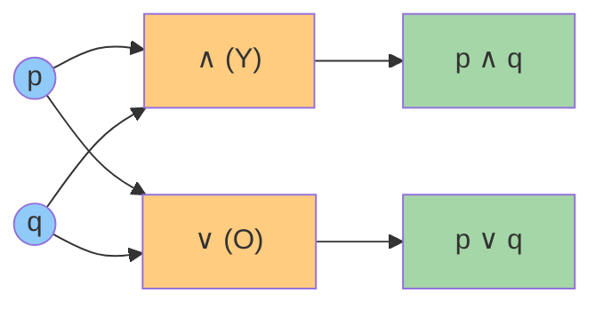

**Cómo leerlo con la tabla:** si $p = V$ y $q = F$ (fila 2), la compuerta **Y** exige *ambas* entradas verdaderas, así que su salida es **F**; la compuerta **O** solo exige *una*, así que su salida es **V**. Exactamente la fila 2 de la tabla. ✅

### Ejemplo 1 — Compuerta NAND: $\neg(p \land q)$

La **NAND** es una compuerta **Y** (*AND*) seguida de una **negación** (*NOT*). Es famosa porque es **universal**: con puras NAND se puede construir cualquier circuito, es decir, todas las demás compuertas. Su tabla de verdad:

| $p$ | $q$ | $p \land q$ | $\neg(p \land q)$ |
| --- | --- | ----------- | ----------------- |
| V   | V   | V           | F                 |
| V   | F   | F           | V                 |
| F   | V   | F           | V                 |
| F   | F   | F           | V                 |

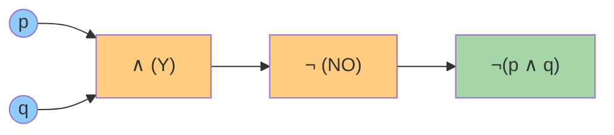

**Observación:** solo falla cuando **ambas** entradas son verdaderas → es como un "Y" al revés.

### Ejemplo 2 — O exclusivo (XOR): $p \oplus q$

El **XOR** ("o exclusivo") es verdadero cuando **exactamente una** de las dos entradas es verdadera. Se diferencia del $\lor$ (que admite ambas): es justamente el error clásico que advierte el método de estudio. Se construye con *OR*, *AND* y *NOT*:

$$
p \oplus q \equiv (p \lor q) \land \neg(p \land q)
$$

| $p$ | $q$ | $p \oplus q$ |
| --- | --- | ------------ |
| V   | V   | F            |
| V   | F   | V            |
| F   | V   | V            |
| F   | F   | F            |

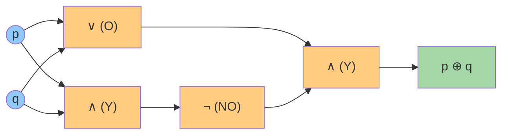

**Uso real:** el XOR aparece en casi toda la **criptografía** y en los **circuitos sumadores**. Al sumar dos bits: $0+0=0$, $0+1=1$, $1+0=1$, $1+1=10$ → el bit del resultado es 0 cuando hay acarreo. Es exactamente la tabla del XOR. 

### Ejemplo 3 — Implicación ($p \to q$) y bicondicional ($p \leftrightarrow q$)

Estos dos conectivos ya aparecían en la tabla inicial; aquí se entienden con un ejemplo propio y con su **circuito equivalente**.

#### Implicación ($p \to q$): "si p, entonces q"

> [!tip] Analogía — la promesa
> "Si estudias, apruebas". La única forma de que la promesa sea **falsa** es que estudies **y** no apruebes. En cualquier otro caso, la promesa se cumple (o no se puede comprobar: si no estudias, no prometimos nada).

La implicación se puede construir con dos puertas: una negación y un OR:

$$
p \to q \equiv \neg p \lor q
$$

| $p$ | $q$ | $\neg p$ | $\neg p \lor q$ | $p \to q$ |
| --- | --- | -------- | -------------- | -------- |
| V   | V   | F        | V              | V        |
| V   | F   | F        | F              | F        |
| F   | V   | V        | V              | V        |
| F   | F   | V        | V              | V        |

Observa que las columnas $\neg p \lor q$ y $p \to q$ son **idénticas**: son el mismo circuito con otra cara.

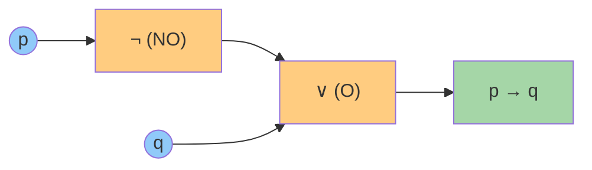

#### Bicondicional ($p \leftrightarrow q$): "p si y solo si q"

> [!tip] Analogía — los dos interruptores
> Una lámpara con dos interruptores (escalera): la luz está encendida cuando **ambos están en la misma posición** (los dos arriba o los dos abajo). El bicondicional es verdadero cuando **ambos valores coinciden**.

El bicondicional se construye con dos AND y un OR (más sus negaciones): "ambos verdaderos **o** ambos falsos":

$$
p \leftrightarrow q \equiv (p \land q) \lor (\neg p \land \neg q)
$$

| $p$ | $q$ | $p \land q$ | $\neg p \land \neg q$ | $(p \land q) \lor (\neg p \land \neg q)$ | $p \leftrightarrow q$ |
| --- | --- | ----------- | --------------------- | ---------------------------------------- | --------------------- |
| V   | V   | V           | F                     | V                                        | V                     |
| V   | F   | F           | F                     | F                                        | F                     |
| F   | V   | F           | F                     | F                                        | F                     |
| F   | F   | F           | V                     | V                                        | V                     |

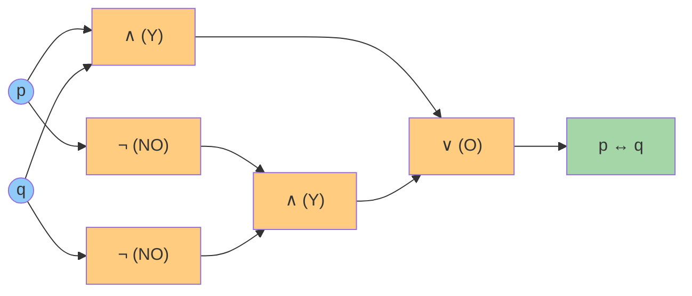

> [!success] Para recordar
> - $p \to q$: el **único** caso falso es $V \to F$ (promesa rota).
> - $p \leftrightarrow q$: verdadero cuando **ambos coinciden** (V–V o F–F); falso cuando se llevan la contra (V–F o F–V).

**Uso real:** la implicación modela reglas y contratos ("si pagas, hay envío gratis"); el bicondicional modela **definiciones exactas** ("un número es par **si y solo si** es divisible por 2") y comparaciones de igualdad en programación.

### Cuantificadores

- **Universal** $\forall$: "para todo". "$\forall x \in \mathbb{N},\ x \geq 0$" → todos los naturales son ≥ 0.
- **Existencial** $\exists$: "existe al menos uno". "$\exists x \in \mathbb{N},\ x = 5$" → hay un natural igual a 5.

### Equivalencias útiles: Leyes de De Morgan

$$
\neg(p \land q) \equiv \neg p \lor \neg q \qquad \neg(p \lor q) \equiv \neg p \land \neg q
$$

"No es cierto que llueva **y** haga frío" = "no llueve **o** no hace frío". Siempre se invierte el conectivo.

> [!example] Para practicar
> Escribe en símbolos: "No todos los estudiantes llegaron temprano". Pista: niégale el $\forall$ y verás aparecer un $\exists$ con negación.

---

## 🧩 4. Unidad 2 — Conjuntos y demostraciones

### Conjuntos (repaso exprés)

Ya los conoces del curso de estadística: un **conjunto** es una colección bien definida. Símbolos: $\in$ (pertenece), $\subseteq$ (subconjunto), $\cup$ (unión), $\cap$ (intersección), $\emptyset$ (vacío).

### Definir un conjunto: por extensión y por comprensión

Hay **dos formas equivalentes** de especificar un conjunto:

| Forma | Idea | Ejemplo |
|-------|------|---------|
| **Por extensión** | Se **enumeran** todos sus elementos entre llaves | $A = \{1, 2, 3, 4\}$ |
| **Por comprensión** | Se da la **propiedad** que deben cumplir | $A = \{x \mid x \in \mathbb{N},\ x \leq 4\}$ |

La notación por comprensión se lee así: "el conjunto de todos los $x$ **tal que** ($\mid$) $x$ pertenece a los naturales **y** $x$ es menor o igual a 4".

> [!tip] Truco de lectura
> Dentro de las llaves siempre hay **dos partes**: (1) el símbolo del elemento y (2) la condición, separadas por $\mid$ ("tal que"):
> $$\{ \underbrace{x}_{\text{elemento}} \mid \underbrace{x \in \mathbb{N},\ x \leq 4}_{\text{condición}} \}$$

**Reglas importantes:**

- Los elementos **no se repiten**: $\{1, 2, 2, 3\} = \{1, 2, 3\}$.
- El **orden no importa**: $\{1, 2, 3\} = \{3, 1, 2\}$.
- La forma por comprensión es **imprescindible** cuando el conjunto es infinito o enorme: no se puede enumerar a los pares, pero sí escribirlos como $\{x \mid x = 2k,\ k \in \mathbb{N}\}$.

**Ejemplos lado a lado:**

| Por extensión | Por comprensión | Conjunto |
| ------------- | --------------- | -------- |
| $\{a, e, i, o, u\}$ | $\{x \mid x \text{ es vocal}\}$ | Las vocales |
| $\{2, 4, 6, 8\}$ | $\{x \mid x \in \mathbb{N},\ x \text{ es par},\ x \leq 8\}$ | Pares hasta 8 |
| $\{1, 4, 9, 16\}$ | $\{x^2 \mid x \in \mathbb{N},\ 1 \leq x \leq 4\}$ | Cuadrados perfectos pequeños |

> [!info] Conecta con tu curso
> Esta misma distinción aparece en el **tema 01 de tu curso de estadística inferencial** (*Definición de conjunto*). Lo que aquí es teoría de conjuntos, allá se convierte en el lenguaje del espacio muestral y los sucesos.

### Conjuntos especiales

| Conjunto | Símbolo | ¿Qué es? | Ejemplo |
|----------|---------|----------|---------|
| **Vacío** | $\emptyset$ (o $\{\}$) | No tiene elementos | $\{x \mid x \neq x\}$ |
| **Universal** | $\Omega$ (o $U$) | Contiene todo lo que se está considerando | Todos los estudiantes de la clase |
| **Unitario** | $\{a\}$ | Tiene exactamente un elemento | $\{2\}$ |
| **Finito / Infinito** | — | Con número de elementos finito o no | $\{1,2,3\}$ vs $\mathbb{N}$ |
| **Subconjunto** | $A \subseteq B$ | Todo elemento de $A$ está en $B$ | $\{1\} \subseteq \{1,2\}$ |
| **Subconjunto propio** | $A \subset B$ | $A \subseteq B$ pero $A \neq B$ | $\{1\} \subset \{1,2\}$ |
| **Potencia** | $\mathcal{P}(A)$ | El conjunto de **todos** los subconjuntos de $A$ | $A=\{1,2\} \Rightarrow \mathcal{P}(A)=\{\emptyset, \{1\}, \{2\}, \{1,2\}\}$ |

> [!tip] Regla estrella del conjunto potencia
> Si $A$ tiene $n$ elementos, entonces $\mathcal{P}(A)$ tiene **$2^n$** elementos. Es la primera aparición del **exponente 2** en el conteo (volverá con fuerza en combinatoria).

Los **conjuntos numéricos** también son conjuntos: $\mathbb{N}$ (naturales), $\mathbb{Z}$ (enteros), $\mathbb{Q}$ (racionales), $\mathbb{R}$ (reales) y $\mathbb{C}$ (complejos). Cada uno **contiene al anterior**:

$$
\mathbb{N} \subset \mathbb{Z} \subset \mathbb{Q} \subset \mathbb{R} \subset \mathbb{C}
$$

> [!info] Para la matemática discreta
> Se trabaja casi siempre con $\mathbb{N}$ y $\mathbb{Z}$ (lo contable), y con $\mathbb{Q}$ para razones y probabilidades. Los reales $\mathbb{R}$ se dejan para el cálculo (lo continuo).

### Operaciones entre conjuntos

Con $A = \{1, 2, 3\}$, $B = \{3, 4, 5\}$ y universo $\Omega = \{1, 2, 3, 4, 5, 6\}$:

| Operación | Símbolo | Resultado | Ejemplo | Analogía |
|-----------|---------|-----------|---------|----------|
| **Unión** | $A \cup B$ | Elementos de $A$ o de $B$ (o ambos) | $\{1,2,3,4,5\}$ | El menú: eliges uno u otro |
| **Intersección** | $A \cap B$ | Elementos comunes a ambos | $\{3\}$ | Requisitos: necesitas TODOS |
| **Diferencia** | $A \setminus B$ | De $A$ que **no** están en $B$ | $\{1,2\}$ | Lo tuyo sin lo compartido |
| **Complemento** | $A^c$ (o $\bar{A}$) | Del universo que **no** están en $A$ | $\{4,5,6\}$ | "Todo lo demás" (depende de $\Omega$) |
| **Diferencia simétrica** | $A \triangle B$ | En uno u otro, pero **no en ambos** | $\{1,2,4,5\}$ | El **XOR** de la Unidad 1 aplicado a conjuntos |
| **Producto cartesiano** | $A \times B$ | Todos los pares ordenados $(a,b)$ | $\{(1,3),(1,4),...,(3,5)\}$ (9 pares) | Coordenadas (fila, columna) |

### Diagrama de Venn: las operaciones de un vistazo

Un **diagrama de Venn** dibuja los conjuntos como círculos: cada **región** del dibujo es una combinación distinta de pertenencias (estar en $A$, en $B$, en ambos o en ninguno). Con dos conjuntos hay 4 regiones:

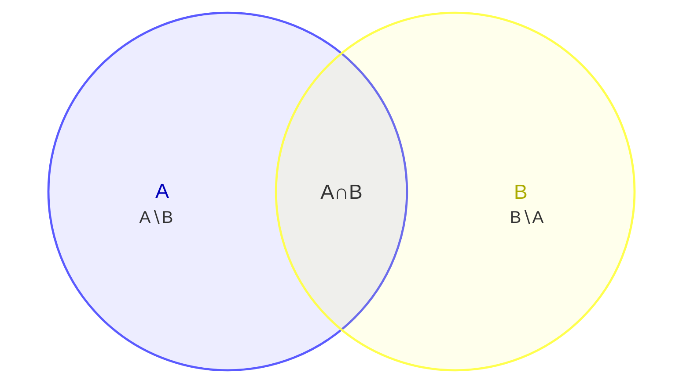

**Lectura de las regiones (con $A=\{1,2,3\}$, $B=\{3,4,5\}$, $\Omega=\{1,...,6\}$):**

| Región del dibujo | Contiene | Operación que la "prende" |
|-------------------|----------|---------------------------|
| Solo dentro de $A$ ($A \setminus B$) | $\{1,2\}$ | **Diferencia** $A \setminus B$ |
| Solape de ambos ($A \cap B$) | $\{3\}$ | **Intersección** $A \cap B$ |
| Solo dentro de $B$ ($B \setminus A$) | $\{4,5\}$ | **Diferencia** $B \setminus A$ |
| Fuera de ambos círculos | $\{6\}$ | **Complemento** $(A \cup B)^c$ |

Cada **operación** enciende una combinación de regiones:

| Operación | Regiones que toma | Resultado ($A=\{1,2,3\}$, $B=\{3,4,5\}$) |
|-----------|-------------------|------------------------------------------|
| **Unión** $A \cup B$ | A∖B + A∩B + B∖A (todo lo de ambos círculos) | $\{1,2,3,4,5\}$ |
| **Intersección** $A \cap B$ | Solo el solape | $\{3\}$ |
| **Diferencia** $A \setminus B$ | Solo A∖B | $\{1,2\}$ |
| **Diferencia simétrica** $A \triangle B$ | A∖B + B∖A (todo menos el solape) | $\{1,2,4,5\}$ |
| **Complemento** $A^c$ | Todo lo que queda **fuera** del círculo de $A$ | $\{4,5,6\}$ |

> [!note] Sobre la versión
> Los diagramas de Venn de Mermaid usan la sintaxis `venn-beta` (disponible desde Mermaid **v11.12.3**). El sitio mkdocs ya carga Mermaid v11; en Obsidian solo se verán si tu instalación es reciente y trae Mermaid 11.

**Cardinalidad** $|A|$ = número de elementos. Para contar una unión sin contar dos veces lo repetido:

$$
|A \cup B| = |A| + |B| - |A \cap B|
$$

(Este es el **principio de inclusión-exclusión**, que retomaremos en la Unidad 5.)

> [!warning] Cuidado con el complemento
> $A^c$ **depende del universo** elegido. Si $\Omega = \{1,2,3\}$, entonces $\{1,2\}^c = \{3\}$; pero si $\Omega = \{1,2,3,4,5,6\}$, entonces $\{1,2\}^c = \{3,4,5,6\}$. Siempre pregunta: ¿cuál es el universo?

**Propiedades útiles (así se simplifican expresiones):**

| Propiedad | Fórmula |
|-----------|---------|
| De Morgan | $(A \cup B)^c = A^c \cap B^c$ y $(A \cap B)^c = A^c \cup B^c$ |
| Distributiva | $A \cap (B \cup C) = (A \cap B) \cup (A \cap C)$ |
| Doble complemento | $(A^c)^c = A$ |
| Con el universo y el vacío | $A \cup A^c = \Omega$ y $A \cap A^c = \emptyset$ |

> [!example] Para practicar
> Con $A = \{1,2,3\}$, $B = \{3,4,5\}$ y $\Omega = \{1,2,3,4,5,6\}$: calcula $A \triangle B$ y verifica que $(A \cup B)^c = \{6\}$. Pista: primero $A \cup B = \{1,2,3,4,5\}$, luego su complemento es lo que falta para llegar a $\Omega$.

### Métodos de demostración

Demostrar una afirmación es **convencer sin dejar dudas**, con reglas, no con opiniones.

| Método | Idea | Analogía |
|--------|------|----------|
| **Directa** | Partes de lo que sabes y encadenas pasos hasta la conclusión | Seguir una receta paso a paso |
| **Contrapositiva** | En lugar de probar "si p entonces q", pruebas "si no q entonces no p" (equivalente) | Si no ves humo, es que no hay fuego (equivale a: si hay fuego, hay humo) |
| **Contradicción** | Supones lo contrario y llegas a un absurdo | En un juicio: "supongamos que el sospechoso es inocente… pero eso contradice la evidencia" |
| **Inducción** | Pruebas el primer caso y luego que si un caso vale, el siguiente también | **Dominó**: si cae la primera ficha y cada ficha tumba a la siguiente, caen TODAS |

> [!example] Demostración directa mínima
> Afirmación: "Si $n$ es par, entonces $n^2$ es par".
> Como $n$ es par, $n = 2k$. Entonces $n^2 = (2k)^2 = 4k^2 = 2(2k^2)$, que es par. ✅


---

## 🔗 5. Unidad 3 — Relaciones y funciones

> [!abstract] ¿De qué trata esta unidad?
> Las relaciones capturan **vínculos** entre elementos ("quién con quién", "qué es subconjunto de qué"). Las funciones son el caso especial donde cada entrada tiene **una sola** salida. Esta unidad conecta directo con conjuntos (U2): una relación *es* un subconjunto del producto cartesiano.

### 3.1 Pares ordenados y producto cartesiano

Un **par ordenado** $(a, b)$ es un par donde **el orden importa**: $(a,b) 
eq (b,a)$ salvo que $a=b$.

El **producto cartesiano** $A \times B$ es el conjunto de *todos* los pares ordenados con primera componente en $A$ y segunda en $B$:

$$A \times B = \{ (a,b) \mid a \in A,\ b \in B \}$$

> [!example] Con $A = \{1, 2\}$ y $B = \{x, y\}$:
> $A \times B = \{(1,x), (1,y), (2,x), (2,y)\}$ → **4 pares** = $|A| \cdot |B| = 2 \cdot 2 = 4$

| Propiedad | Fórmula | Intuición |
|-----------|---------|-----------|
| Cardinalidad | $\|A \times B\| = \|A\| \cdot \|B\|$ | Cada elemento de $A$ se combina con cada uno de $B$ |
| No conmutativo | $A \times B \neq B \times A$ (gral.) | El orden de los pares cambia |
| Producto con el vacío | $A \times \emptyset = \emptyset$ | No hay con qué formar pares |

> [!tip] Analogía
> Un producto cartesiano es como un **menú combinado**: si hay 3 sopas y 4 platos fuertes, hay $3 \times 4 = 12$ menús posibles. Cada menú es un par ordenado (sopa, plato fuerte).

---

### 3.2 Relaciones: definición formal

Una **relación** $R$ de $A$ a $B$ es un subconjunto del producto cartesiano:

$$R \subseteq A \times B$$

Si $(a, b) \in R$, escribimos $a\,R\,b$ y decimos que "$a$ está relacionado con $b$".

> [!example] En la base de datos de un hospital:
> - $A$ = pacientes, $B$ = doctores
> - $R = \{ (Ana, Dr. Pérez), (Ana, Dra. Gómez), (Luis, Dr. Pérez) \}$
> - Ana está relacionada con dos doctores; Luis con uno.
> - Cada fila de la tabla "citas" **es** un par de la relación.

Relación | Pares | ¿Qué significa?
---------|-------|----------------
$\leq$ en $\mathbb{N}$ | $(1,1),(1,2),(2,2),(1,3)\dots$ | "es menor o igual que"
$\|$ en $\mathbb{N}$ | $(2,4),(3,9),(2,6)\dots$ | "divide a"
$\subseteq$ en $\mathcal{P}(X)$ | $(\emptyset, \emptyset),(\{1\},\{1,2\})\dots$ | "es subconjunto de"

---

### 3.3 Representaciones de una relación

**1) Matriz de adyacencia** (útil para computador): filas = elementos de $A$, columnas = elementos de $B$, y un $1$ si están relacionados (0 si no).

> [!example] Con $A=\{1,2,3\}$, $B=\{a,b\}$ y $R=\{(1,a),(2,a),(2,b)\}$:
>
> | $R$ | $a$ | $b$ |
> |-----|-----|-----|
> | **1** | 1 | 0 |
> | **2** | 1 | 1 |
> | **3** | 0 | 0 |

**2) Digrafo** (diagrama de flechas): nodos = elementos de $A$, una flecha $x \to y$ por cada par $(x,y) \in R$.

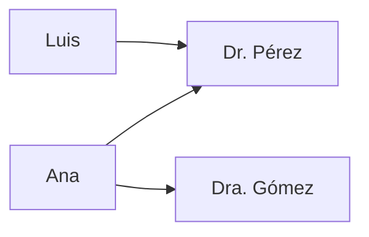

---

### 3.4 Propiedades de una relación (en un mismo conjunto)

Decimos que $R$ es una relación **sobre** $A$ cuando $R \subseteq A \times A$.

| Propiedad | Definición | Ejemplo cotidiano |
|-----------|------------|-------------------|
| **Reflexiva** | $\forall a:\; a\,R\,a$ | "$x \leq x$" siempre |
| **Simétrica** | $a\,R\,b \Rightarrow b\,R\,a$ | Amistad: si soy tu amigo, tú eres el mío |
| **Antisimétrica** | $a\,R\,b \land b\,R\,a \Rightarrow a=b$ | Orden: si $a \leq b$ y $b \leq a$, entonces $a=b$ |
| **Transitiva** | $a\,R\,b \land b\,R\,c \Rightarrow a\,R\,c$ | Edad: Ana < Beto y Beto < Carlos ⇒ Ana < Carlos |

> [!warning] Errores comunes
> - **Simétrica ≠ antisimétrica**: no son opuestas. "$\leq$" es antisimétrica (y no simétrica); "=" es ambas a la vez.
> - **Antisimétrica no pide** que $a\,R\,b$ y $b\,R\,a$ existan: solo dice que *si* existen ambos, entonces $a=b$.

**Relación de equivalencia** = reflexiva + simétrica + transitiva. Divide a $A$ en **clases de equivalencia** (grupos disjuntos cuya unión es $A$).

> [!example] "Tener el mismo resto al dividir por 3" ($a \equiv b \mod 3$)
> - Clases: $\{0,3,6,\dots\}$, $\{1,4,7,\dots\}$, $\{2,5,8,\dots\}$
> - Refleja el **concepto de módulo**: la base de los relojes ($\bmod 12$), días de la semana ($\bmod 7$).

**Orden parcial** = reflexiva + antisimétrica + transitiva. Ejemplo: "$\subseteq$" ordena conjuntos como cajas anidadas.

---

### 3.5 Diagrama de Hasse (orden parcial)

Un **diagrama de Hasse** dibuja un orden parcial omitiendo: lazos (reflexiva), flechas deducibles (transitiva) y el orden obvio. Para el orden por divisibilidad en $\{1,2,3,4,6,12\}$ ($a \preceq b$ si $a \mid b$):

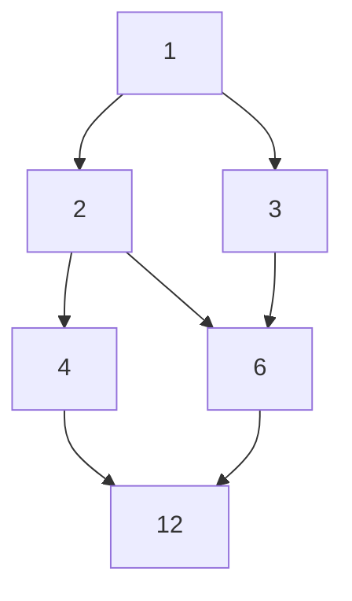

El **máximo** (si existe) es el $12$; el **mínimo** es el $1$. Elementos como $2$ y $3$ son **incomparables** (ni $2 \mid 3$ ni $3 \mid 2$).

---

### 3.6 Funciones

Una **función** $f: A \to B$ asigna a cada elemento de $A$ **exactamente un** elemento de $B$. La diferencia clave con una relación: **no puede haber dos flechas distintas saliendo del mismo elemento**.

| Tipo | Definición | Analogía |
|------|------------|----------|
| **Inyectiva** (uno a uno) | $f(a_1)=f(a_2) \Rightarrow a_1=a_2$ | DNI: cada persona tiene número distinto |
| **Sobreyectiva** (sobre) | $\forall b \in B,\; \exists a \in A: f(a)=b$ | Cada asiento del cine está ocupado |
| **Biyectiva** | Inyectiva + sobreyectiva | Casilleros: cada persona su casillero y viceversa (tiene inversa) |

> [!example] $f: \mathbb{N} \to \mathbb{N}$ con $f(n) = n^2$
> - **Inyectiva** ✅: si $n^2 = m^2$ entonces $n = m$.
> - **Sobreyectiva** ❌: $5$ no es un cuadrado perfecto, nadie lo "produce".
>
> $f: \mathbb{Z} \to \mathbb{Z}$, $f(n) = n+1$ es **biyectiva**: cada entero tiene exactamente un predecesor y sucesor.

**Conteo de funciones** (con $|A|=m$, $|B|=n$):

| Tipo | Cantidad | Ejemplo ($m=3$, $n=2$) |
|------|----------|------------------------|
| Cualquier función | $n^m$ | $2^3 = 8$ |
| Inyectivas | $n(n-1)\cdots(n-m+1)$ | $2 \cdot 1 = 2$ (solo si $m \leq n$) |
| Biyectivas | $n!$ | solo si $m = n$ → $3! = 6$ |

---

### 3.7 Composición e inversa

**Composición**: $(g \circ f)(x) = g(f(x))$ — primero se aplica $f$, luego $g$.

> [!example] $f(n) = n+1$ y $g(n) = 3n$:
> - $(g \circ f)(n) = 3(n+1) = 3n+3$
> - $(f \circ g)(n) = (3n)+1 = 3n+1$ → **la composición no es conmutativa** ($f \circ g \neq g \circ f$).

**Inversa**: solo las funciones **biyectivas** tienen inversa $f^{-1}$, que deshace a $f$: $f^{-1}(f(x)) = x$.

> [!tip] En programación
> La composición de funciones es la base del *pipeline* (encadenar operaciones) y de los *decorators*. La inversa aparece en criptografía RSA: una función (cifrar) y su inversa (descifrar) usando claves.

---

### 3.8 Aplicaciones en computación

- **Bases de datos relacionales**: cada tabla es una relación; las *joins* son composiciones de relaciones.
- **Grafos y redes**: un grafo dirigido es una relación $\text{nodos} \times \text{nodos}$; la matriz de adyacencia es su representación computable.
- **Tablas hash**: una función $\text{clave} \to \text{índice}$; si no es inyectiva hay *colisiones* (dos claves al mismo índice).
- **Lenguajes de programación**: los *tipos* son conjuntos y las *funciones* van de tipos a tipos (base de la verificación de tipos).

## 🪜 6. Unidad 4 — Inducción y recursión

> [!abstract] ¿De qué trata esta unidad?
> La **inducción** es el método estrella para demostrar que una propiedad vale para *todos* los naturales. La **recursión** define objetos (y algoritmos) en términos de sí mismos. Son dos caras de la misma moneda: la inducción demuestra, la recursión construye.

### 4.1 Inducción simple (primer principio)

Para probar que una propiedad $P(n)$ vale para **todos** los $n \geq n_0$:

1. **Base:** verificas $P(n_0)$.
2. **Paso inductivo:** supón $P(k)$ (hipótesis inductiva) y demuestra $P(k+1)$.

> [!example] La suma clásica
> $1 + 2 + 3 + \cdots + n = \dfrac{n(n+1)}{2}$
> - **Base**: $1 = 1(2)/2 = 1$ ✅
> - **Paso**: si vale para $n$, entonces $(1 + \cdots + n) + (n+1) = \frac{n(n+1)}{2} + (n+1) = \frac{(n+1)(n+2)}{2}$ ✅
> ¡Y así para todos los naturales!

> [!tip] Analogía de las fichas de dominó
> La base es **derribar la primera ficha**; el paso inductivo es probar que **cada ficha derriba a la siguiente**. Si ambas cosas funcionan, caen todas.

**Otros ejemplos clásicos de inducción:**

| Proposición | Base | Truco del paso |
|-------------|------|----------------|
| Suma de impares: $1+3+\cdots+(2n-1)=n^2$ | $n=1$: $1=1^2$ | El siguiente impar agrega $2n+1$: $n^2+2n+1=(n+1)^2$ |
| $2^n > n$ | $n=1$: $2>1$ | De $2^n>n$ se sigue $2^{n+1}>2n\geq n+1$ (para $n\geq1$) |
| $3 \mid n^3 - n$ | $n=1$: $0$ divisible | Factoriza $(k+1)^3-(k+1)$ usando $k^3-k$ |

---

### 4.2 Inducción fuerte (segundo principio)

En el paso inductivo puedes suponer que la propiedad vale para **todos** los valores anteriores, no solo $k$:

$$P(n_0), P(n_0+1), \ldots, P(k) \Rightarrow P(k+1)$$

> [!example] Todo número $n \geq 2$ es producto de primos (teorema fundamental de la aritmética)
> - **Base**: $n=2$ es primo ✅
> - **Paso**: si $n$ es compuesto, $n = a \cdot b$ con $2 \leq a,b < n$. Por hipótesis fuerte, $a$ y $b$ ya son productos de primos, así que $n$ también. ✅

> [!warning] ¿Cuándo usar inducción fuerte?
> Cuando el paso inductivo necesita un valor **más atrás** que $k$ (como en $n=a\cdot b$, donde necesitas $a$ y $b$, no solo $n-1$). Fibonacci, divisibilidad y teoremas de existencia son casos típicos.

---

### 4.3 Recursión

Un objeto es **recursivo** si se define en términos de sí mismo, pero con un **caso base** que detiene la recursión.

- **Factorial:** $n! = n \cdot (n-1)!$, con $0! = 1$.
- **Fibonacci:** $F_n = F_{n-1} + F_{n-2}$, con $F_0 = 0$, $F_1 = 1$ (¡el famoso problema de los conejos!).

> [!tip] Analogía
> La recursión es como las **muñecas rusas**: abres una y dentro hay otra más pequeña, hasta llegar a la más chica (el caso base). Luego vas cerrando de regreso.

Una **recurrencia** es la versión con ecuaciones: expresa un término en función de los anteriores. Ejemplo: $T(n) = T(n-1) + 1$ con $T(1)=1$ describe los pasos de un algoritmo que recorre $n$ elementos.

---

### 4.4 Torre de Hanoi: la recursión clásica

Reglas: mueve $n$ discos de la estaca A a la C, usando B como auxiliar, **uno a la vez** y **sin poner un disco grande sobre uno pequeño**.

La solución recursiva:
1. Mueve $n-1$ discos de A a B (usando C).
2. Mueve el disco grande de A a C (1 movimiento).
3. Mueve los $n-1$ discos de B a C (usando A).

$$T(n) = 2\,T(n-1) + 1, \qquad T(1) = 1 \quad \Rightarrow \quad T(n) = 2^n - 1$$

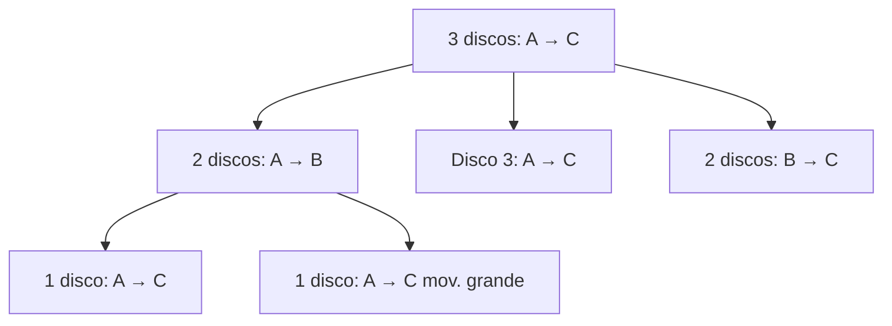

> [!example] Con 3 discos: $2^3 - 1 = 7$ movimientos
> La leyenda dice que los monjes de Benarés mueven 64 discos de oro y el mundo terminará cuando terminen: $2^{64}-1 \approx 1.8 \times 10^{19}$ movimientos... ¡a un movimiento por segundo serían ~584 mil millones de años!

---

### 4.5 Recursión vs iteración en programación

| Aspecto | Recursión | Iteración (bucle) |
|---------|-----------|-------------------|
| Definición | La función se llama a sí misma | Un `while`/`for` se repite |
| Estado | Cada llamada tiene su propio *stack frame* | Una variable de control compartida |
| Claridad | Ideal para estructuras anidadas (árboles, grafos) | Más directa para secuencias planas |
| Riesgo | *Stack overflow* si falta caso base | Bucle infinito si la condición no avanza |
| Costo | Cada llamada consume memoria | Menos memoria en general |

> [!warning] El caso base es obligatorio
> Sin caso base, la recursión se desborda: `stack overflow`. Es como las muñecas rusas sin la más pequeña: nunca terminas de abrir.

---

### 4.6 Recurrencias y divide y vencerás

Muchos algoritmos importantes siguen el patrón: **dividir** el problema, **resolver** las partes (recursivamente) y **combinar** los resultados.

| Algoritmo | Recurrencia | Complejidad resultante |
|-----------|-------------|------------------------|
| Recorrido lineal | $T(n)=T(n-1)+1$ | $O(n)$ |
| Búsqueda binaria | $T(n)=T(n/2)+1$ | $O(\log n)$ |
| Merge sort | $T(n)=2T(n/2)+n$ | $O(n \log n)$ |
| Insertion sort | $T(n)=T(n-1)+n$ | $O(n^2)$ |

> [!tip] Memoria visual
> $O(n)$, $O(\log n)$, $O(n\log n)$ y $O(n^2)$ son las **cuatro complejidades que dominan la vida real**. Cuando veas un algoritmo, pregúntate en cuál cae: esa es la diferencia entre un programa que "aguanta" y uno que "muere" con datos grandes.

---

### 4.7 Inducción estructural (avanzado)

Cuando la definición de un objeto es recursiva (como los árboles o las listas), la inducción se aplica **sobre la estructura** del objeto, no sobre un número:

- **Base**: la propiedad vale para los casos atómicos (hoja, lista vacía).
- **Paso**: si vale para las partes, vale para el objeto construido con ellas.

> [!example] En un árbol binario completo, $\text{hojas} = \text{nodos internos} + 1$
> - **Base**: árbol de un solo nodo → 1 hoja, 0 internos: $1 = 0+1$ ✅
> - **Paso**: un árbol con raíz y dos subárboles $T_1, T_2$: $\text{hojas}=\text{hojas}_1+\text{hojas}_2 = (\text{int}_1+1)+(\text{int}_2+1) = (\text{int}_1+\text{int}_2+1)+1 = \text{int}+1$ ✅

> [!tip] En la práctica
> Cada vez que escribes una función sobre un árbol o una lista enlazada, estás haciendo inducción estructural: un caso para la base (lista vacía / hoja) y otro que combina el resto.

## 🧮 7. Unidad 5 — Combinatoria y probabilidad discreta

> [!abstract] ¿De qué trata esta unidad?
> La combinatoria responde "**¿cuántas formas hay?**". Es la base para calcular probabilidades en espacios discretos (cada resultado igualmente probable) y aparece en algoritmos, contraseñas, loterías y análisis de complejidad.

### 5.1 Los dos principios básicos

- **Principio de la suma:** si hay $m$ formas de hacer A y $n$ formas de hacer B (excluyentes), hay $m + n$ formas de hacer A **o** B.
- **Principio del producto:** si hay $m$ formas de hacer A y luego $n$ formas de hacer B, hay $m \times n$ formas de hacer A **y** B.

> [!example] Menú del almuerzo
> - 3 sopas + 4 platos fuertes + 2 postres → $3 \times 4 \times 2 = 24$ menús posibles (principio del producto).
> - Si además hay café **o** té (2 bebidas): $24 \times 2 = 48$.
> - "Voy a la cafetería o a la tienda" con $4$ y $3$ opciones → $4+3=7$ caminos (principio de la suma).

---

### 5.2 Permutaciones y combinaciones

| Concepto | Fórmula | ¿Cuándo? | Ejemplo |
|----------|---------|----------|---------|
| **Permutación** $P(n,k)$ | $\dfrac{n!}{(n-k)!}$ | Orden **importa**, sin repetición | Podios de carrera (1°, 2°, 3°) |
| **Combinación** $C(n,k)$ | $\binom{n}{k} = \dfrac{n!}{k!(n-k)!}$ | Orden **no importa** | Elegir 3 amigos de 5 |
| **Permutación con repetición** | $n^k$ | Orden importa, se puede repetir | Claves de 4 dígitos: $10^4=10000$ |
| **Permutación de todos** $P(n,n)$ | $n!$ | Ordenar $n$ objetos distintos | Ordenar 5 libros: $5! = 120$ |

> [!tip] La regla de oro
> Pregúntate: **¿cambia el resultado si intercambio dos elementos?** Sí → permutación (orden importa). No → combinación.

> [!example] Equipo de 2 de entre 4 personas (Ana, Beto, Carla, Dany)
> - Con orden (capitán, vice): $P(4,2) = 4 \cdot 3 = 12$ opciones.
> - Sin orden (solo el equipo): $C(4,2) = \frac{4!}{2!2!} = 6$ opciones: AB, AC, AD, BC, BD, CD.

**Propiedades útiles de $\binom{n}{k}$:**
$$\binom{n}{k} = \binom{n}{n-k}, \qquad \binom{n}{0} = \binom{n}{n} = 1, \qquad \binom{n+1}{k} = \binom{n}{k-1} + \binom{n}{k}$$

La última es la **identidad de Pascal**: cada número del triángulo de Pascal es la suma de los dos de arriba.

---

### 5.3 Triángulo de Pascal y binomio de Newton

El **triángulo de Pascal** ordena los coeficientes $\binom{n}{k}$:

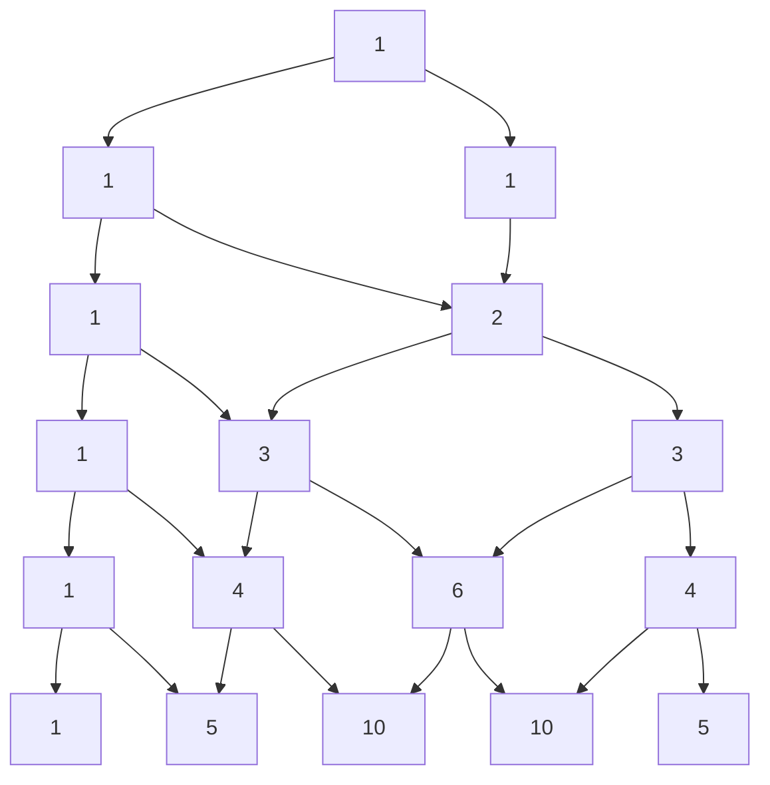

**Binomio de Newton:**
$$(x+y)^n = \sum_{k=0}^{n} \binom{n}{k}\, x^{n-k} y^k$$

> [!example] $(x+y)^3 = x^3 + 3x^2y + 3xy^2 + y^3$
> Los coeficientes $1,3,3,1$ son la fila 3 del triángulo de Pascal. Con $x=y=1$: $2^3 = 1+3+3+1 = 8$ ✅

---

### 5.4 Principio del palomar

Si tienes más **palomas** que **nidos**, al menos un nido tiene dos palomas.

> [!example] Ejemplos clásicos
> - En un grupo de **13 personas**, al menos dos nacieron el mismo mes (13 palomas, 12 nidos).
> - Entre **367 personas**, al menos dos comparten cumpleaños (días del año).
> - En una ciudad con más de 400,000 habitantes, al menos dos tienen el mismo teléfono (pues hay solo $10^6 \times$ prefijos... en general: $n$ objetos > $m$ cajas).

**Versión generalizada:** si repartes $n$ objetos en $k$ cajas, alguna caja tiene al menos $\lceil n/k \rceil$ objetos.

---

### 5.5 Inclusión-exclusión

Para contar uniones sin contar dos veces lo repetido:

$$|A \cup B| = |A| + |B| - |A \cap B|$$

Con tres conjuntos:

$$|A \cup B \cup C| = |A|+|B|+|C| - |A\cap B| - |A\cap C| - |B\cap C| + |A\cap B\cap C|$$

> [!example] Encuesta
> 60 leen el diario A, 40 el diario B, 20 ambos → $|A \cup B| = 60+40-20 = 80$ personas leen al menos uno.

---

### 5.6 Probabilidad discreta

En un espacio con resultados **igualmente probables**:

$$P(\text{evento}) = \frac{\text{casos favorables}}{\text{casos posibles}}$$

> [!example] Dado de 6 caras
> - $P(\text{par}) = 3/6 = 1/2$.
> - $P(\text{mayor que 4}) = 2/6 = 1/3$.
> - $P(\text{par y mayor que 4}) = P(\{6\}) = 1/6$.
> - $P(\text{par o mayor que 4}) = 3/6 + 2/6 - 1/6 = 4/6 = 2/3$ (inclusión-exclusión).

**Probabilidad con combinaciones:** en una lotería de $n$ números, escogiendo $k$:

$$P(\text{ganar}) = \frac{1}{\binom{n}{k}}$$

> [!tip] En la práctica
> La probabilidad de ganar la lotería de 6 de 49 es $1/\binom{49}{6} \approx 1/13{,}983{,}816$: más probable que te caiga un rayo. La combinatoria te deja *ver* esos números antes de comprar el billete.

---

### 5.7 Principios avanzados (vistazo)

- **Principio de inclusión-exclusión generalizado** para $n$ conjuntos: alterna sumas y restas de intersecciones.
- **Permutaciones con repetición de objetos iguales:** con $n$ objetos donde hay $n_1$ iguales, $n_2$ iguales...: $\dfrac{n!}{n_1!\,n_2!\cdots}$ (anagramas de "MISSISSIPPI").
- **Coeficientes multinomiales:** $\dfrac{n!}{n_1!\,n_2!\cdots n_k!}$ reparten $n$ objetos en $k$ grupos de tamaños dados.

> [!example] Anagramas de "SOL"
> Las 3 letras distintas: $3! = 6$ palabras (SOL, SLO, OSL, OLS, LSO, LOS). Con letras repetidas se divide: "ANANÁ" tiene $6!/3! = 120$ anagramas distintos (las 3 A son indistinguibles).

## 🔢 8. Unidad 6 — Teoría de números

### Divisibilidad y primos

- $a$ divide a $b$ ($a \mid b$) si $b = a \cdot k$ para algún entero $k$: "4 divide a 12" porque $12 = 4 \cdot 3$.
- **Primo:** divisible solo por 1 y por sí mismo (2, 3, 5, 7, 11…). Los primos son los **"átomos"** de los números: todo número se factoriza en primos de forma única (Teorema Fundamental de la Aritmética).

### MCD y algoritmo de Euclides

El **máximo común divisor (MCD)** de $a$ y $b$ es el divisor más grande que comparten.
- Ejemplo: $\text{MCD}(48, 18) = 6$ porque $48 = 2^4 \cdot 3$ y $18 = 2 \cdot 3^2$; lo común es $2 \cdot 3 = 6$.

**Algoritmo de Euclides** (el más antiguo que se conserva): divide y usa el residuo:

$$
48 = 18 \cdot 2 + 12 \qquad 18 = 12 \cdot 1 + 6 \qquad 12 = 6 \cdot 2 + 0
$$

El último residuo no nulo es el MCD: **6**. Rápido y eficiente, ideal para computadoras.

### Aritmética modular

Trabajar con **residuos**: "el reloj da vueltas". Las 25:00 horas son las 1:00 (módulo 24). Escribimos $25 \equiv 1 \ (\text{mod } 24)$.

- Sirve para: calendarios, códigos de barras, validación de tarjetas, y **cierta criptografía**.
- RSA (lo que cifra tu conexión) usa números muy grandes y sus restos módulo otro número. La seguridad está en que **factorizar primos grandes es difícil**.

> [!example] Módulo divertido
> ¿Qué día de la semana será en 10 días si hoy es lunes? $10 \equiv 3 \ (\text{mod } 7)$ → jueves.

---

## 🕸️ 9. Unidad 7 — Grafos y árboles

> [!abstract] ¿De qué trata esta unidad?
> Un **grafo** es un conjunto de **vértices** (puntos) conectados por **aristas** (líneas). Es un mapa abstracto de conexiones: redes sociales, calles, cables, páginas web, moléculas, procesos y tareas.

> [!tip] Analogía
> Una **red social**: cada persona es un vértice y cada amistad una arista. Un grafo también modela calles, cables, páginas web, moléculas, procesos y tareas.

### 7.1 Definición formal

Un grafo es un par $G = (V, E)$, donde:
- $V$ = conjunto de **vértices** (nodos).
- $E$ = conjunto de **aristas** (conexiones entre pares de vértices).

| Concepto | Notación | Ejemplo |
|----------|----------|---------|
| Vértices | $V = \{A, B, C\}$ | 3 nodos |
| Arista | $(A,B) \in E$ | Conexión entre A y B |
| Grado de un vértice | $\deg(A)$ | Número de aristas que tocan a A |
| Grafo completo con $n$ vértices | $K_n$ | $\binom{n}{2}$ aristas (todos conectados con todos) |

> [!example] Suma de grados
> En cualquier grafo, la suma de los grados es el **doble** de las aristas: $\sum \deg(v) = 2|E|$.
> Por eso en un grafo con 4 aristas la suma de grados es 8: ¡cada arista "cuenta" en sus dos extremos!

---

### 7.2 Tipos de grafos (con diagramas)

#### 1. Grafo simple (no dirigido)

Las aristas son de **dos vías** (amistad de Facebook: si A es amigo de B, B es amigo de A). Sin lazos ni aristas múltiples.

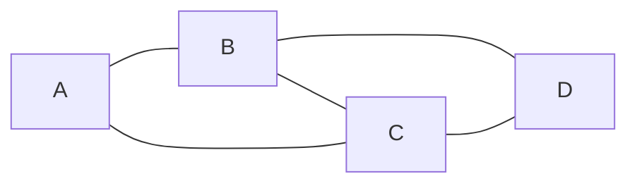

> Amistades: A—B, A—C, B—C, B—D, C—D. Todos los grados: $\deg(A)=2$, $\deg(B)=3$, $\deg(C)=3$, $\deg(D)=2$. Suma $10 = 2 \cdot 5$ aristas ✅

#### 2. Grafo dirigido (digrafo)

Las aristas tienen **flecha** (Instagram: tú sigues a alguien, no al revés). El orden del par importa: $(u,v) \neq (v,u)$.

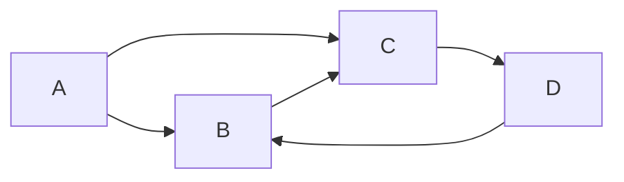

> Aristas: $A \to B$, $A \to C$, $B \to C$, $C \to D$, $D \to B$. Ahora distinguimos **grado de entrada** (flechas que llegan) y **grado de salida** (flechas que salen): $\deg^-(B)=2$ (llegan de A y D), $\deg^+(B)=1$ (sale a C).

#### 3. Grafo ponderado

Cada arista tiene un **peso** (kilómetros, costo, tiempo). Es el modelo de los mapas de navegación y rutas.

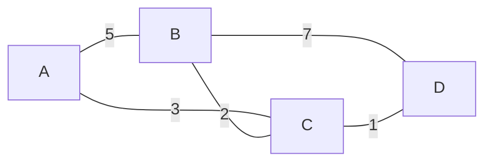

> La ruta más barata de A a D es $A \to C \to D$ con $3+1=4$, ¡más corta que $A \to B \to D$ ($5+7=12$)!

#### 4. Grafo completo $K_n$

Cada vértice está conectado con **todos** los demás. Con $n$ vértices tiene $\binom{n}{2}$ aristas.

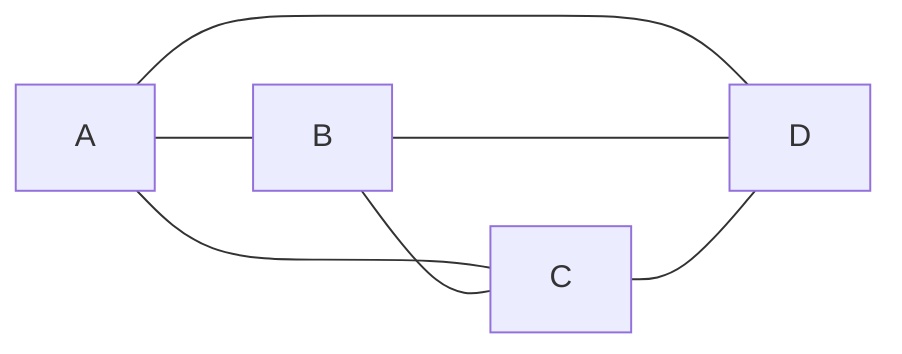

> $K_4$: 4 vértices, $\binom{4}{2} = 6$ aristas. Cada vértice tiene grado $n-1 = 3$.

#### 5. Grafo bipartito

Los vértices se dividen en **dos grupos** (por ejemplo, trabajadores y tareas) y las aristas **solo** conectan un grupo con el otro.

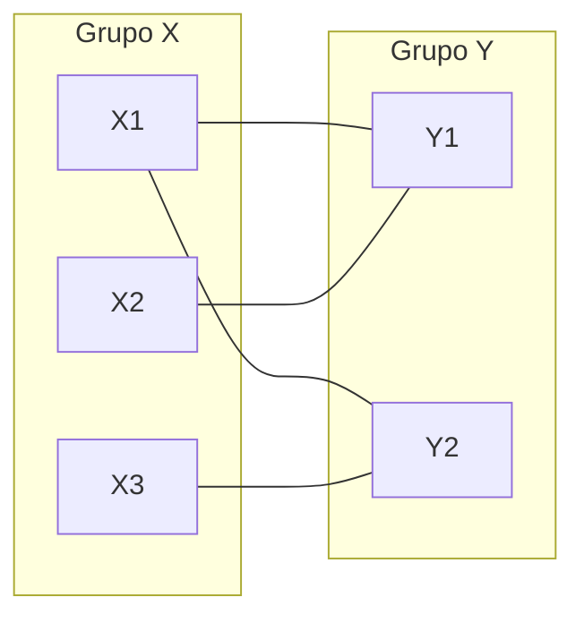

> Modela asignaciones: 3 trabajadores, 2 tareas. Ninguna arista conecta dos personas entre sí ni dos tareas entre sí.

#### 6. Grafo conexo vs. no conexo

- **Conexo:** desde cualquier vértice se llega a cualquier otro (un solo "pedazo").
- **No conexo:** tiene dos o más **componentes** separadas.

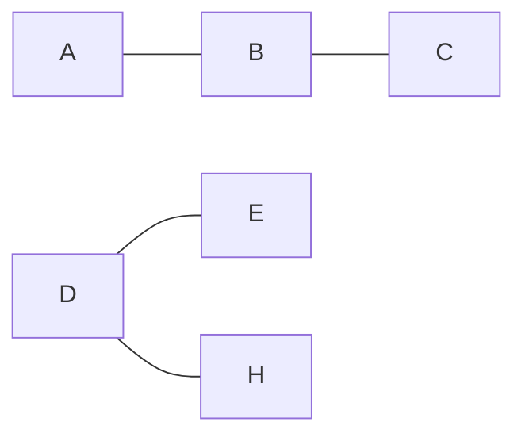

> Este grafo es **no conexo**: la componente $\{A,B,C\}$ y la componente $\{D,E,H\}$ están aisladas. No hay camino de A a D.

#### 7. Ciclo y camino

- Un **camino** recorre vértices distintos sin repetir.
- Un **ciclo** es un camino que empieza y termina en el mismo vértice sin repetir otros.

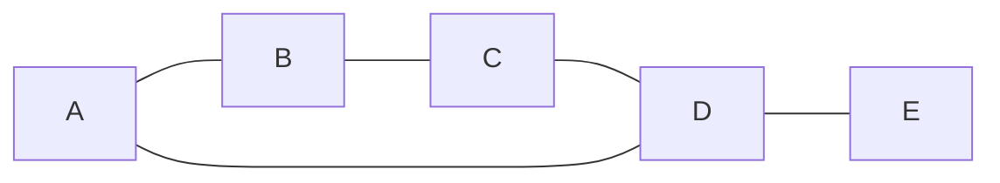

> $A \to B \to C \to D \to A$ es un **ciclo** de longitud 4. $A \to B \to C \to D \to E$ es un **camino** simple.

#### 8. Grafo con lazo (bucle)

Un **lazo** es una arista que conecta un vértice **consigo mismo**. (En mermaid se dibuja una flecha que regresa al mismo nodo.)

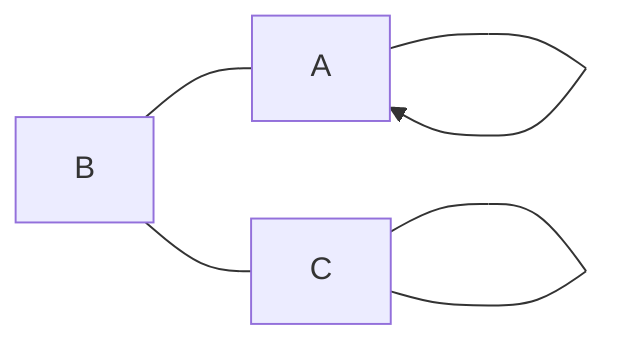

> El vértice A tiene un lazo ($A \to A$) y B tiene otro. Un lazo aporta **2** al grado del vértice.

**Resumen rápido de tipos:**

| Tipo | ¿Flechas? | ¿Pesos? | Ejemplo real |
|------|-----------|---------|--------------|
| Simple | No | No | Mapa de amistades |
| Dirigido | Sí | No | Red social de seguidores |
| Ponderado | Según caso | Sí | GPS / rutas |
| Completo | No | No | Torneo round-robin (todos contra todos) |
| Bipartito | No | No | Asignación trabajador–tarea |
| Conexo / no conexo | Según caso | Según caso | Red de fibra óptica |

---

### 7.3 Representaciones computables

**1) Matriz de adyacencia:** tabla $n \times n$ con $1$ si hay arista, $0$ si no.

> [!example] Para el grafo simple $A-B$, $A-C$ (con vértices A, B, C):
>
> | | A | B | C |
> |---|---|---|---|
> | **A** | 0 | 1 | 1 |
> | **B** | 1 | 0 | 0 |
> | **C** | 1 | 0 | 0 |

**2) Lista de adyacencia:** cada vértice guarda la lista de sus vecinos.

$$A: [B, C],\quad B: [A],\quad C: [A]$$

> [!tip] ¿Matriz o lista?
> **Matriz** → rápida para preguntar "¿hay arista entre u y v?" pero ocupa $O(n^2)$ memoria. **Lista** → ahorra memoria en grafos dispersos (pocas aristas) y es la estándar en DFS/BFS.

---

### 7.4 Caminos y problemas clásicos

**Conectividad:** dos vértices están conectados si hay un camino entre ellos. El problema clásico de los **puentes de Königsberg** (¿se puede cruzar cada puente exactamente una vez?) dio origen a la teoría de grafos.

- Un grafo tiene un **camino euleriano** si puedes recorrer cada arista una sola vez (el problema de los puentes): existe si a lo sumo 0 o 2 vértices tienen grado impar.
- Un **camino hamiltoniano** visita cada vértice una sola vez (problema del vendedor viajero: la ruta más barata visitando todas las ciudades).

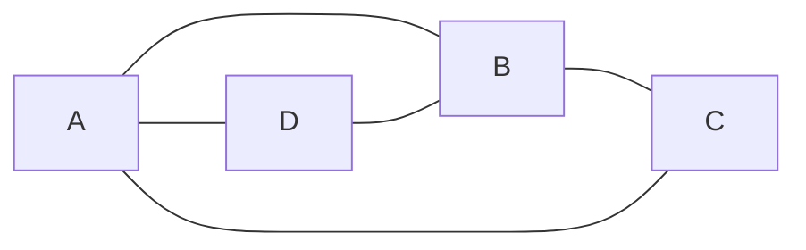

> Puente de Königsberg: 4 vértices (orillas/islas) con grados 3, 3, 3, 5 — todos impares, por eso **no hay** recorrido euleriano (se necesitan 0 o 2 impares).

---

### 7.5 Árboles

Un **árbol** es un grafo **conexo sin ciclos** (no hay "círculos" de conexiones). Es la estructura natural de las **jerarquías**.

> [!example] Propiedades equivalentes de un árbol con $n$ vértices
> 1. Es conexo y sin ciclos.
> 2. Tiene exactamente $n-1$ aristas.
> 3. Entre cualquier par de vértices hay **un único** camino.

```mermaid
flowchart TB
    raiz["Raíz"] --> h1["Hijo 1"]
    raiz --> h2["Hijo 2"]
    h1 --> n1["Nieto 1"]
    h1 --> n2["Nieto 2"]
    h2 --> n3["Nieto 3"]
```

> Un **árbol binario** (2 hijos máximos por nodo) es la base de árboles de búsqueda, montículos (*heaps*), y el DOM de una página web.

- Árbol genealógico, sistema de archivos, torneos deportivos.
- **Recorridos:** BFS (por niveles, como olas) y DFS (por ramas, hasta el fondo). Son la base de búsquedas en mapas y redes.

---

### 7.6 Aplicaciones en el mundo real

- **Google Maps:** grafo ponderado de calles + algoritmo de Dijkstra (ruta más corta).
- **Redes sociales:** grafos dirigidos/no dirigidos; "amigos en común" son vecindades compartidas.
- **Internet:** la web es un digrafo donde cada página enlaza a otras; el *PageRank* usa su estructura.
- **Bases de datos:** las relaciones clave–foránea forman un grafo de dependencias.
- **Optimización:** árbol de expansión mínima (cableado con el menor costo total).

## 🧬 10. Unidad 8 — Estructuras algebraicas *(avanzado)*

Una **estructura algebraica** es un conjunto con una o más operaciones y reglas. La más importante: el **grupo**.

**Grupo** $(G, *)$: un conjunto con una operación que cumple:
1. **Clausura:** operar dos elementos da otro del conjunto.
2. **Asociatividad:** $(a * b) * c = a * (b * c)$.
3. **Identidad:** existe un elemento neutro (el 0 en la suma, el 1 en la multiplicación).
4. **Inversos:** cada elemento tiene su "opuesto" (suma: $-a$; mult: $1/a$).

Ejemplo: los enteros con la suma forman un grupo. Los enteros con la multiplicación **no** (el 2 no tiene inverso entero).

> [!info] ¿Para qué?
> Los grupos estudian **simetrías** (movimientos de un cubo, patrones), y son la base matemática de criptografía y códigos. Si te apasionan, este es el puente entre lo discreto y el álgebra moderna.

---

## 🤖 11. Unidad 9 — Autómatas y lenguajes *(avanzado)*

Un **autómata finito** es una máquina con un número finito de **estados** que cambia según la **entrada**. El semáforo de la introducción es un autómata (rojo → amarillo → verde).

- **Expresiones regulares (regex):** patrones para validar textos. Ejemplo: `^\d{3}-\d{4}$` valida un teléfono tipo "555-1234".
- **Gramáticas:** reglas para construir lenguajes (de programación o naturales). Con ellas se hacen los **compiladores**.
- **Máquina de Turing:** el modelo de computación más general; lo que un algoritmo puede (o no puede) hacer.

> [!example] Validar un correo
> Un autómata puede decidir si "usuario@dominio.com" es válido: pasa por estados (usuario → @ → dominio → extensión) y acepta o rechaza al final. Eso haces cada vez que llenas un formulario web.

---

## 🎯 12. Cómo estudiar matemática discreta (método)

1. **Un concepto → un ejemplo propio.** No repitas el del libro; invéntate uno (tu deporte, tu música, tu trabajo).
2. **Dibuja.** Los grafos, conjuntos y tablas de verdad se entienden dibujando. Lápiz y papel > leer.
3. **Practica en espiral.** Repasa cada unidad a los 1, 3 y 7 días. La matemática discreta se olvida rápido si no se usa.
4. **Técnica Feynman:** explica el tema en voz alta como si se lo enseñaras a alguien. Si te trabas, es que falta entender.
5. **Errores comunes que debes evitar:**
   - Confundir el "o" inclusivo ($\lor$) con el "o" excluyente (o uno u otro, pero no ambos).
   - Creer que $p \to q$ es lo mismo que "p causa q".
   - Usar inducción sin verificar la **base** (el dominó sin primera ficha no cae).
   - Llamar "árbol" a cualquier grafo (un árbol **no tiene ciclos**).
   - Olvidar restar la intersección al contar uniones (inclusión-exclusión).

---

## ✅ 13. Autoevaluación general

A continuación se presentan las preguntas de opción múltiple sobre la guía. En la web se responden de forma interactiva (quiz.js).

### Pregunta 1

¿Cuál de los siguientes enunciados es una **proposición**?

a) ¡Cierra la puerta!
b) 2 + 2 = 5
c) x + 3
d) ¿Qué hora es?
> **b) 2 + 2 = 5** — es una oración con valor de verdad (falso, pero lo tiene). Las preguntas, órdenes y expresiones con variables no son proposiciones.

### Pregunta 2

La expresión $p \lor q$ es verdadera cuando…

a) Solo cuando p y q son verdaderas
b) Al menos una de las dos es verdadera
c) Solo cuando ambas son falsas
d) Nunca es verdadera
> **b)** — $\lor$ es el "o" inclusivo: basta con que una sea verdadera (o ambas).

### Pregunta 3

"Todos los estudiantes aprobaron" se escribe correctamente como…

a) $\exists x\ \text{Estudiante}(x) \land \text{Aprobó}(x)$
b) $\forall x\ \text{Estudiante}(x) \to \text{Aprobó}(x)$
c) $\forall x\ \text{Estudiante}(x) \land \text{Aprobó}(x)$
d) $\exists x\ \text{Estudiante}(x) \to \text{Aprobó}(x)$
> **b)** — el cuantificador universal $\forall$ con condicional: "para todo x, si es estudiante entonces aprobó".

### Pregunta 4

¿Qué dos partes necesita siempre una demostración por **inducción**?

a) La base y el paso inductivo
b) Solo la base
c) Solo el paso inductivo
d) Ninguna, se hace por intuición
> **a)** — base (primera ficha del dominó) + paso inductivo (cada ficha tumba a la siguiente).

### Pregunta 5

Un **árbol** en teoría de grafos es…

a) Un grafo con ciclos
b) Un grafo conexo sin ciclos
c) Cualquier conjunto de puntos conectados
d) Un grafo con aristas dirigidas
> **b)** — conexo (todo está comunicado) y sin ciclos (no hay "círculos").

### Pregunta 6

El **MCD** de 48 y 18 es…

a) 6
b) 3
c) 12
d) 2
> **a)** — $48 = 2^4 \cdot 3$, $18 = 2 \cdot 3^2$; lo común es $2 \cdot 3 = 6$. También sale con el algoritmo de Euclides.

---

## 🔣 14. Glosario de símbolos

| Símbolo | Significado |
|---------|-------------|
| $\neg p$ | Negación: "no p" |
| $p \land q$ | Conjunción: "p y q" |
| $p \lor q$ | Disyunción: "p o q" |
| $p \to q$ | Condicional: "si p, entonces q" |
| $p \leftrightarrow q$ | Bicondicional: "p si y solo si q" |
| $\forall$ | Cuantificador universal: "para todo" |
| $\exists$ | Cuantificador existencial: "existe" |
| $\in$, $\notin$ | Pertenece / no pertenece |
| $\subseteq$ | Subconjunto |
| $\cup$, $\cap$ | Unión, intersección |
| $A \setminus B$ | Diferencia: elementos de A que no están en B |
| $A^c$ (o $\bar{A}$) | Complemento respecto al universo |
| $A \triangle B$ | Diferencia simétrica (en uno u otro, no en ambos) |
| $\mathcal{P}(A)$ | Conjunto potencia (todos los subconjuntos de A) |
| $\Omega$ | Conjunto universal |
| $\emptyset$ | Conjunto vacío |
| $\mathbb{N}, \mathbb{Z}, \mathbb{Q}, \mathbb{R}$ | Naturales, enteros, racionales, reales |
| $a \mid b$ | "a divide a b" |
| $\text{MCD}(a,b)$ | Máximo común divisor |
| $a \equiv b \ (\text{mod } n)$ | Congruencia módulo n (mismo residuo) |
| $O(f(n))$ | Notación de complejidad: "del orden de" |
| $p \oplus q$ | O exclusivo (XOR): verdadero con exactamente una entrada verdadera |
| $\binom{n}{k}$ | Combinación: $C(n,k)$ |

---

## 📚 15. Recursos recomendados

- **Kenneth Rosen** — *Matemática Discreta y sus Aplicaciones* (el clásico completo; ideal como libro de cabecera).
- **Ralph Grimaldi** — *Matemáticas Discreta y Combinatoria* (buena profundidad en combinatoria).
- **Seymour Lipschutz** — *Matemáticas Discretas* (serie Schaum; muchos ejercicios resueltos).
- **Cursos en video**: busca "discrete mathematics" en plataformas abiertas; los temas 1–7 suelen estar cubiertos en listas de reproducción gratuitas, igual que tu curso de estadística.
- **Práctica online**: sitios de problemas de lógica y combinatoria de nivel introductorio.

> [!success] Siguiente paso
> Cuando domines el mapa general, elige una unidad y conviértela en tu primer tema profundo. La **lógica** (Unidad 1) es la mejor puerta de entrada: corta, concreta y te sirve para todo lo demás.
