# 📐 Matemática Discreta — Guía Didáctica

> [!note] ¿Para quién es esta guía?
> Para quien quiere **entender de qué trata la matemática discreta y por qué importa**, antes de meterse a fondo en cada tema. Aquí está el **mapa general**: qué estudia cada área, con qué idea cotidiana se relaciona y un primer ejemplo. No sustituye a un curso completo: es la **brújula** para recorrerlo.

---

## 🧭 1. ¿Qué es la matemática discreta?

**Discreto** significa *separado, contable, que avanza a pasos*. Lo contrario es **continuo** (algo que fluye sin saltos).

> [!tip] Analogía rápida
> Un **semáforo** es discreto: cambia por estados (rojo → amarillo → verde). Un **termostato** es continuo: la temperatura sube y baja sin saltos. La matemática discreta estudia lo del semáforo; el cálculo tradicional estudia lo del termostato.

La matemática discreta estudia **estructuras que se cuentan y se separan**: números enteros, proposiciones lógicas, conjuntos, grafos, algoritmos, cadenas de texto. Es la **base de la computación**, porque un computador trabaja con *bits* (0 o 1): todo en él es discreto.

**¿Dónde la usas sin darte cuenta?**
- Algoritmos de búsqueda y ordenamiento (Google, tus listas).
- Criptografía (tu conexión https, el WhatsApp cifrado).
- Redes y rutas (el GPS, las conexiones entre servidores).
- Bases de datos (consultas, llaves, relaciones).
- Inteligencia artificial (grafos de conocimiento, autómatas).

```chart
type: bar
labels: ["Lógica", "Conjuntos", "Relaciones y funciones", "Inducción", "Combinatoria", "Teoría de números", "Grafos y árboles"]
series:
  - title: "Conceptos clave introducidos en esta guía"
    data: [5, 4, 5, 4, 6, 6, 6]
width: 90%
beginAtZero: true
```

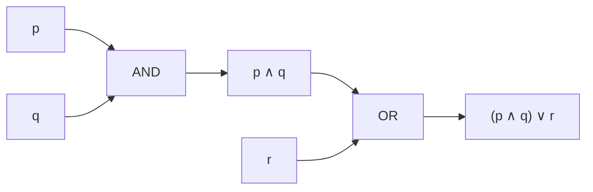

## 🗺️ 2. Mapa del temario (hoja de ruta)

| # | Unidad | ¿Qué estudia? | ¿Para qué sirve? |
|---|--------|---------------|------------------|
| 1 | **Lógica** | Proposiciones, conectivos, tablas de verdad, cuantificadores | Razonar con rigor, demostrar, circuitos, consultas SQL |
| 2 | **Conjuntos y demostraciones** | Conjuntos, operaciones, métodos de demostración | Fundamento de todo; validar afirmaciones matemáticas |
| 3 | **Relaciones y funciones** | Propiedades, equivalencias, órdenes, funciones | Bases de datos, jerarquías, modelado |
| 4 | **Inducción y recursión** | Inducción, recursividad, recurrencias | Algoritmos recursivos, análisis de complejidad |
| 5 | **Combinatoria y probabilidad discreta** | Conteo, permutaciones, combinaciones, palomar | Probabilidad, criptografía, optimización |
| 6 | **Teoría de números** | Divisibilidad, primos, aritmética modular | Criptografía (RSA), códigos de verificación |
| 7 | **Grafos y árboles** | Vértices, aristas, caminos, árboles | Redes, rutas, jerarquías, mapas |
| 8 | **Estructuras algebraicas** *(avanzado)* | Grupos, anillos, cuerpos | Álgebra abstracta, criptografía avanzada |
| 9 | **Autómatas y lenguajes** *(avanzado)* | Autómatas, expresiones regulares, gramáticas | Compiladores, validación de formatos, IA |

> [!info] Orden sugerido
> Las unidades 1–4 son el **cimientos**: sin lógica y conjuntos, las demás se entienden a medias. Las unidades 5–7 son el **corazón práctico** (los problemas clásicos). Las 8–9 son **nivel avanzado** para después.


> [!tip] 📁 Temas por separado
> Cada unidad tiene su propio archivo con el contenido completo y **5 preguntas de autoevaluación** interactivas:
>
> | Carpeta | Tema |
> |---------|------|
> | [`01_logica/01_logica.md`](01_logica/01_logica.md) | Lógica |
> | [`02_conjuntos/02_conjuntos.md`](02_conjuntos/02_conjuntos.md) | Conjuntos y demostraciones |
> | [`03_relaciones_funciones/03_relaciones_funciones.md`](03_relaciones_funciones/03_relaciones_funciones.md) | Relaciones y funciones |
> | [`04_induccion_recursion/04_induccion_recursion.md`](04_induccion_recursion/04_induccion_recursion.md) | Inducción y recursión |
> | [`05_combinatoria/05_combinatoria.md`](05_combinatoria/05_combinatoria.md) | Combinatoria y probabilidad discreta |
> | [`06_teoria_numeros/06_teoria_numeros.md`](06_teoria_numeros/06_teoria_numeros.md) | Teoría de números |
> | [`07_grafos/07_grafos.md`](07_grafos/07_grafos.md) | Grafos y árboles |
> | [`08_estructuras_algebraicas/08_estructuras_algebraicas.md`](08_estructuras_algebraicas/08_estructuras_algebraicas.md) | Estructuras algebraicas |
> | [`09_automatas/09_automatas.md`](09_automatas/09_automatas.md) | Autómatas y lenguajes |
>
> En la web, cada archivo se abre como una página con su quiz interactivo.
---

## 🔤 3. Unidad 1 — Lógica

### Proposiciones

Una **proposición** es una oración que **puede ser verdadera o falsa** (aunque no sepamos cuál).

- "Hoy es lunes" → proposición (tiene valor de verdad).
- "¿Qué hora es?" → NO es proposición (pregunta).
- "x + 3 = 5" → NO es proposición (no sabemos qué es x; sin valor definido).

### Conectivos lógicos

| Conectivo | Símbolo | Se lee | Se cumple cuando… | Analogía |
|-----------|---------|--------|-------------------|----------|
| Negación | $\neg p$ | "no p" | p es falsa | Interruptor apagado |
| Conjunción | $p \land q$ | "p y q" | **ambos** verdaderos | Lista de requisitos: necesitas TODOS |
| Disyunción | $p \lor q$ | "p o q" | **al menos uno** verdadero | Menú: puedes elegir uno u otro |
| Condicional | $p \to q$ | "si p, entonces q" | falsa solo si p verdadera y q falsa | Promesa: "si estudias, apruebas" |
| Bicondicional | $p \leftrightarrow q$ | "p si y solo si q" | ambos iguales | Términos de un contrato |

> [!tip] Truco de memoria (¡como tu Anotaciones.md!)
> El **∧** ("y") parece una **V invertida**, y el **∨** ("o") es la V normal. **"La V invertida es el Y"** → la conjunción es el Y. Si la V está normal (apuntando abajo… hacia el *o* abierto), es el *o*. Easy.

### Tabla de verdad (ejemplo)

| $p$ | $q$ | $p \land q$ | $p \lor q$ | $p \to q$ |
| --- | --- | ----------- | ---------- | --------- |
| V   | V   | V           | V          | V         |
| V   | F   | F           | V          | F         |
| F   | V   | F           | V          | V         |
| F   | F   | F           | F          | V         |

> [!warning] El clásico error
> $p \to q$ (condicional) **no significa causa**. "Si llueve, la calle se moja" es verdadera aunque hoy no llueva (si no llueve, no prometimos nada). Solo es falsa si **llueve y NO se moja**.

### Tautología, contradicción y contingencia 🧭

Cada fórmula lógica, al completar su tabla de verdad, queda en **una de tres cajas**. Mirar la **columna final** (el resultado) lo dice todo:

| Tipo | La columna final... | Ejemplo clásico | Apodo |
|------|---------------------|-----------------|-------|
| **Tautología** | es **toda V** (verdadera pase lo que pase) | $p \lor \neg p$ | "siempre gana" 🏆 |
| **Contradicción** | es **toda F** (falsa pase lo que pase) | $p \land \neg p$ | "siempre pierde" 💀 |
| **Contingencia** | **mezcla V y F** (depende de los valores) | $p \land q$ | "a veces gana, a veces no" 🤷 |

> [!tip] La regla del pulgar (sin hacer TODA la tabla)
> Para clasificar una fórmula, solo necesitas **dos miradas**:
> - ¿Hay **alguna** fila con F? → *no* es tautología.
> - ¿Hay **alguna** fila con V? → *no* es contradicción.
> - Si tiene ambas → es contingencia. ¡No necesitas rellenar 16 filas para darte cuenta!

**1) Tautología: $p \lor \neg p$ (ley del tercero excluido)**

"O llueve o no llueve" — siempre es cierto, no hay tercera opción.

| $p$ | $\neg p$ | $p \lor \neg p$ |
| --- | -------- | --------------- |
| V   | F        | **V**           |
| F   | V        | **V**           |

La última columna es **V en todas las filas** → **tautología**. Son las "leyes" de la lógica: se cumplen siempre, como plantillas que nunca fallan.

**2) Contradicción: $p \land \neg p$**

"Está lloviendo y NO está lloviendo" — imposible en cualquier mundo.

| $p$ | $\neg p$ | $p \land \neg p$ |
| --- | -------- | ---------------- |
| V   | F        | **F**            |
| F   | V        | **F**            |

La última columna es **F en todas las filas** → **contradicción**. En programación, una condición contradictoria es un *dead code*: el bloque nunca se ejecuta. En demostraciones, llegar a una contradicción es la señal de que la hipótesis era falsa (demostración por reducción al absurdo).

**3) Contingencia: $p \land q$**

"Dos requisitos a la vez": el resultado depende de los valores de entrada.

| $p$ | $q$ | $p \land q$ |
| --- | --- | ----------- |
| V   | V   | **V**       |
| V   | F   | **F**       |
| F   | V   | **F**       |
| F   | F   | **F**       |

La última columna **mezcla V y F** → **contingencia**. La mayoría de las fórmulas "normales" (condicionales, AND, OR cuando dependen de sus entradas) son contingencias.

> [!success] Truco: la fórmula $p \to q$ es contingencia
> Mira su columna final: V, F, V, V → tiene V y F → **contingencia**. Solo las fórmulas "especiales" (como $p \lor \neg p$) se escapan de la contingencia.

**Ejemplos extra para practicar:**

| Fórmula | Última columna | Clasificación |
|---------|----------------|---------------|
| $(p \to q) \lor (q \to p)$ | V, V, V, V | **Tautología** |
| $p \leftrightarrow \neg p$ | F, F | **Contradicción** |
| $p \land \neg q$ | F, V, F, F | **Contingencia** |
| $(p \lor q) \leftrightarrow (q \lor p)$ | V, V, V, V | **Tautología** (la OR conmuta) |

> [!example] En el mundo real
> - **Tautología** = una cláusula de contrato que no se puede romper ("el que firma, acepta los términos").
> - **Contradicción** = un requisito imposible ("este software es 100% seguro y acepta cualquier contraseña").
> - **Contingencia** = la condición típica de un `if`: depende de los datos del momento.

> 🎮 **Ahora practica tú:** en el ejercicio de abajo, clasifica cada fórmula mirando su última columna de la tabla de verdad. El sistema te explica cada fallo.

<div class="grafo-ejercicio" data-tipo="tabla" data-formulas="p ∨ ¬p|V,V|Tautología;p ∧ ¬p|F,F|Contradicción;p ∧ q|V,F,F,F|Contingencia;p → q|V,F,V,V|Contingencia;(p → q) ∨ (q → p)|V,V,V,V|Tautología;p ∧ ¬q|F,V,F,F|Contingencia;p ↔ ¬p|F,F|Contradicción;(p ∨ q) ↔ (q ∨ p)|V,V,V,V|Tautología">

#### Precisa la clasificación

Se muestra una fórmula y los valores de su **última columna** (fila por fila). Haz clic en **Tautología**, **Contradicción** o **Contingencia** según corresponda. ¡Hay 3 tautologías, 2 contradicciones y 3 contingencias escondidas!

</div>

### Circuitos lógicos (a partir de la tabla de verdad)

Cada columna de la tabla anterior se puede **construir físicamente** con puertas lógicas: el **Y** ($\land$) es una compuerta *AND*, el **O** ($\lor$) es una *OR* y la negación ($\neg$) es una *NOT*. Este circuito genera exactamente las columnas $p \land q$ y $p \lor q$:

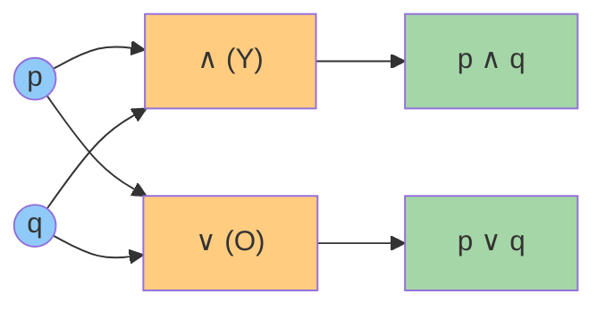

**Cómo leerlo con la tabla:** si $p = V$ y $q = F$ (fila 2), la compuerta **Y** exige *ambas* entradas verdaderas, así que su salida es **F**; la compuerta **O** solo exige *una*, así que su salida es **V**. Exactamente la fila 2 de la tabla. ✅

### Ejemplo 1 — Compuerta NAND: $\neg(p \land q)$

La **NAND** es una compuerta **Y** (*AND*) seguida de una **negación** (*NOT*). Es famosa porque es **universal**: con puras NAND se puede construir cualquier circuito, es decir, todas las demás compuertas. Su tabla de verdad:

| $p$ | $q$ | $p \land q$ | $\neg(p \land q)$ |
| --- | --- | ----------- | ----------------- |
| V   | V   | V           | F                 |
| V   | F   | F           | V                 |
| F   | V   | F           | V                 |
| F   | F   | F           | V                 |

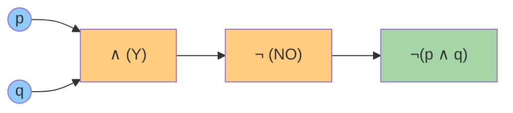

**Observación:** solo falla cuando **ambas** entradas son verdaderas → es como un "Y" al revés.

### Ejemplo 2 — O exclusivo (XOR): $p \oplus q$

El **XOR** ("o exclusivo") es verdadero cuando **exactamente una** de las dos entradas es verdadera. Se diferencia del $\lor$ (que admite ambas): es justamente el error clásico que advierte el método de estudio. Se construye con *OR*, *AND* y *NOT*:

$$
p \oplus q \equiv (p \lor q) \land \neg(p \land q)
$$

| $p$ | $q$ | $p \oplus q$ |
| --- | --- | ------------ |
| V   | V   | F            |
| V   | F   | V            |
| F   | V   | V            |
| F   | F   | F            |

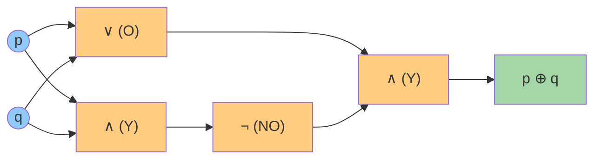

**Uso real:** el XOR aparece en casi toda la **criptografía** y en los **circuitos sumadores**. Al sumar dos bits: $0+0=0$, $0+1=1$, $1+0=1$, $1+1=10$ → el bit del resultado es 0 cuando hay acarreo. Es exactamente la tabla del XOR. 

### Ejemplo 3 — Implicación ($p \to q$) y bicondicional ($p \leftrightarrow q$)

Estos dos conectivos ya aparecían en la tabla inicial; aquí se entienden con un ejemplo propio y con su **circuito equivalente**.

#### Implicación ($p \to q$): "si p, entonces q"

> [!tip] Analogía — la promesa
> "Si estudias, apruebas". La única forma de que la promesa sea **falsa** es que estudies **y** no apruebes. En cualquier otro caso, la promesa se cumple (o no se puede comprobar: si no estudias, no prometimos nada).

La implicación se puede construir con dos puertas: una negación y un OR:

$$
p \to q \equiv \neg p \lor q
$$

| $p$ | $q$ | $\neg p$ | $\neg p \lor q$ | $p \to q$ |
| --- | --- | -------- | -------------- | -------- |
| V   | V   | F        | V              | V        |
| V   | F   | F        | F              | F        |
| F   | V   | V        | V              | V        |
| F   | F   | V        | V              | V        |

Observa que las columnas $\neg p \lor q$ y $p \to q$ son **idénticas**: son el mismo circuito con otra cara.

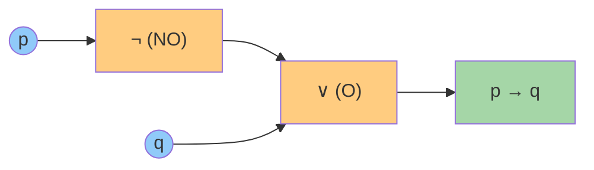

#### Bicondicional ($p \leftrightarrow q$): "p si y solo si q"

> [!tip] Analogía — los dos interruptores
> Una lámpara con dos interruptores (escalera): la luz está encendida cuando **ambos están en la misma posición** (los dos arriba o los dos abajo). El bicondicional es verdadero cuando **ambos valores coinciden**.

El bicondicional se construye con dos AND y un OR (más sus negaciones): "ambos verdaderos **o** ambos falsos":

$$
p \leftrightarrow q \equiv (p \land q) \lor (\neg p \land \neg q)
$$

| $p$ | $q$ | $p \land q$ | $\neg p \land \neg q$ | $(p \land q) \lor (\neg p \land \neg q)$ | $p \leftrightarrow q$ |
| --- | --- | ----------- | --------------------- | ---------------------------------------- | --------------------- |
| V   | V   | V           | F                     | V                                        | V                     |
| V   | F   | F           | F                     | F                                        | F                     |
| F   | V   | F           | F                     | F                                        | F                     |
| F   | F   | F           | V                     | V                                        | V                     |

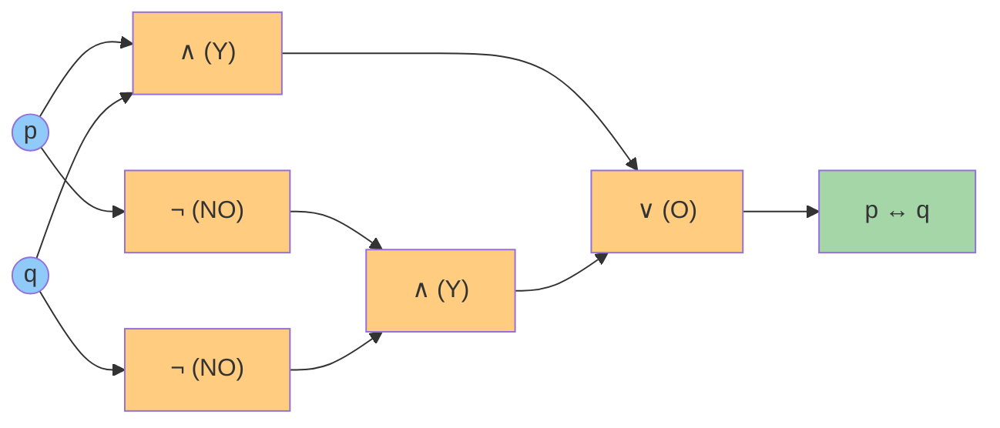

> [!success] Para recordar
> - $p \to q$: el **único** caso falso es $V \to F$ (promesa rota).
> - $p \leftrightarrow q$: verdadero cuando **ambos coinciden** (V–V o F–F); falso cuando se llevan la contra (V–F o F–V).

**Uso real:** la implicación modela reglas y contratos ("si pagas, hay envío gratis"); el bicondicional modela **definiciones exactas** ("un número es par **si y solo si** es divisible por 2") y comparaciones de igualdad en programación.

### Cuantificadores

- **Universal** $\forall$: "para todo". "$\forall x \in \mathbb{N},\ x \geq 0$" → todos los naturales son ≥ 0.
- **Existencial** $\exists$: "existe al menos uno". "$\exists x \in \mathbb{N},\ x = 5$" → hay un natural igual a 5.

### Equivalencias útiles: Leyes de De Morgan

$$
\neg(p \land q) \equiv \neg p \lor \neg q \qquad \neg(p \lor q) \equiv \neg p \land \neg q
$$

"No es cierto que llueva **y** haga frío" = "no llueve **o** no hace frío". Siempre se invierte el conectivo.

> [!example] Para practicar
> Escribe en símbolos: "No todos los estudiantes llegaron temprano". Pista: niégale el $\forall$ y verás aparecer un $\exists$ con negación.

---

## 🧩 4. Unidad 2 — Conjuntos y demostraciones

### Conjuntos (repaso exprés)

Ya los conoces del curso de estadística: un **conjunto** es una colección bien definida. Símbolos: $\in$ (pertenece), $\subseteq$ (subconjunto), $\cup$ (unión), $\cap$ (intersección), $\emptyset$ (vacío).

### Definir un conjunto: por extensión y por comprensión

Hay **dos formas equivalentes** de especificar un conjunto:

| Forma | Idea | Ejemplo |
|-------|------|---------|
| **Por extensión** | Se **enumeran** todos sus elementos entre llaves | $A = \{1, 2, 3, 4\}$ |
| **Por comprensión** | Se da la **propiedad** que deben cumplir | $A = \{x \mid x \in \mathbb{N},\ x \leq 4\}$ |

La notación por comprensión se lee así: "el conjunto de todos los $x$ **tal que** ($\mid$) $x$ pertenece a los naturales **y** $x$ es menor o igual a 4".

> [!tip] Truco de lectura
> Dentro de las llaves siempre hay **dos partes**: (1) el símbolo del elemento y (2) la condición, separadas por $\mid$ ("tal que"):
> $$\{ \underbrace{x}_{\text{elemento}} \mid \underbrace{x \in \mathbb{N},\ x \leq 4}_{\text{condición}} \}$$

**Reglas importantes:**

- Los elementos **no se repiten**: $\{1, 2, 2, 3\} = \{1, 2, 3\}$.
- El **orden no importa**: $\{1, 2, 3\} = \{3, 1, 2\}$.
- La forma por comprensión es **imprescindible** cuando el conjunto es infinito o enorme: no se puede enumerar a los pares, pero sí escribirlos como $\{x \mid x = 2k,\ k \in \mathbb{N}\}$.

**Ejemplos lado a lado:**

| Por extensión | Por comprensión | Conjunto |
| ------------- | --------------- | -------- |
| $\{a, e, i, o, u\}$ | $\{x \mid x \text{ es vocal}\}$ | Las vocales |
| $\{2, 4, 6, 8\}$ | $\{x \mid x \in \mathbb{N},\ x \text{ es par},\ x \leq 8\}$ | Pares hasta 8 |
| $\{1, 4, 9, 16\}$ | $\{x^2 \mid x \in \mathbb{N},\ 1 \leq x \leq 4\}$ | Cuadrados perfectos pequeños |

> [!info] Conecta con tu curso
> Esta misma distinción aparece en el **tema 01 de tu curso de estadística inferencial** (*Definición de conjunto*). Lo que aquí es teoría de conjuntos, allá se convierte en el lenguaje del espacio muestral y los sucesos.

### Conjuntos especiales

| Conjunto | Símbolo | ¿Qué es? | Ejemplo |
|----------|---------|----------|---------|
| **Vacío** | $\emptyset$ (o $\{\}$) | No tiene elementos | $\{x \mid x \neq x\}$ |
| **Universal** | $\Omega$ (o $U$) | Contiene todo lo que se está considerando | Todos los estudiantes de la clase |
| **Unitario** | $\{a\}$ | Tiene exactamente un elemento | $\{2\}$ |
| **Finito / Infinito** | — | Con número de elementos finito o no | $\{1,2,3\}$ vs $\mathbb{N}$ |
| **Subconjunto** | $A \subseteq B$ | Todo elemento de $A$ está en $B$ | $\{1\} \subseteq \{1,2\}$ |
| **Subconjunto propio** | $A \subset B$ | $A \subseteq B$ pero $A \neq B$ | $\{1\} \subset \{1,2\}$ |
| **Potencia** | $\mathcal{P}(A)$ | El conjunto de **todos** los subconjuntos de $A$ | $A=\{1,2\} \Rightarrow \mathcal{P}(A)=\{\emptyset, \{1\}, \{2\}, \{1,2\}\}$ |

> [!tip] Regla estrella del conjunto potencia
> Si $A$ tiene $n$ elementos, entonces $\mathcal{P}(A)$ tiene **$2^n$** elementos. Es la primera aparición del **exponente 2** en el conteo (volverá con fuerza en combinatoria).

Los **conjuntos numéricos** también son conjuntos: $\mathbb{N}$ (naturales), $\mathbb{Z}$ (enteros), $\mathbb{Q}$ (racionales), $\mathbb{R}$ (reales) y $\mathbb{C}$ (complejos). Cada uno **contiene al anterior**:

$$
\mathbb{N} \subset \mathbb{Z} \subset \mathbb{Q} \subset \mathbb{R} \subset \mathbb{C}
$$

> [!info] Para la matemática discreta
> Se trabaja casi siempre con $\mathbb{N}$ y $\mathbb{Z}$ (lo contable), y con $\mathbb{Q}$ para razones y probabilidades. Los reales $\mathbb{R}$ se dejan para el cálculo (lo continuo).

### Operaciones entre conjuntos

Con $A = \{1, 2, 3\}$, $B = \{3, 4, 5\}$ y universo $\Omega = \{1, 2, 3, 4, 5, 6\}$:

| Operación | Símbolo | Resultado | Ejemplo | Analogía |
|-----------|---------|-----------|---------|----------|
| **Unión** | $A \cup B$ | Elementos de $A$ o de $B$ (o ambos) | $\{1,2,3,4,5\}$ | El menú: eliges uno u otro |
| **Intersección** | $A \cap B$ | Elementos comunes a ambos | $\{3\}$ | Requisitos: necesitas TODOS |
| **Diferencia** | $A \setminus B$ | De $A$ que **no** están en $B$ | $\{1,2\}$ | Lo tuyo sin lo compartido |
| **Complemento** | $A^c$ (o $\bar{A}$) | Del universo que **no** están en $A$ | $\{4,5,6\}$ | "Todo lo demás" (depende de $\Omega$) |
| **Diferencia simétrica** | $A \triangle B$ | En uno u otro, pero **no en ambos** | $\{1,2,4,5\}$ | El **XOR** de la Unidad 1 aplicado a conjuntos |
| **Producto cartesiano** | $A \times B$ | Todos los pares ordenados $(a,b)$ | $\{(1,3),(1,4),...,(3,5)\}$ (9 pares) | Coordenadas (fila, columna) |

### Diagrama de Venn: las operaciones de un vistazo

Un **diagrama de Venn** dibuja los conjuntos como círculos: cada **región** del dibujo es una combinación distinta de pertenencias (estar en $A$, en $B$, en ambos o en ninguno). Con dos conjuntos hay 4 regiones:

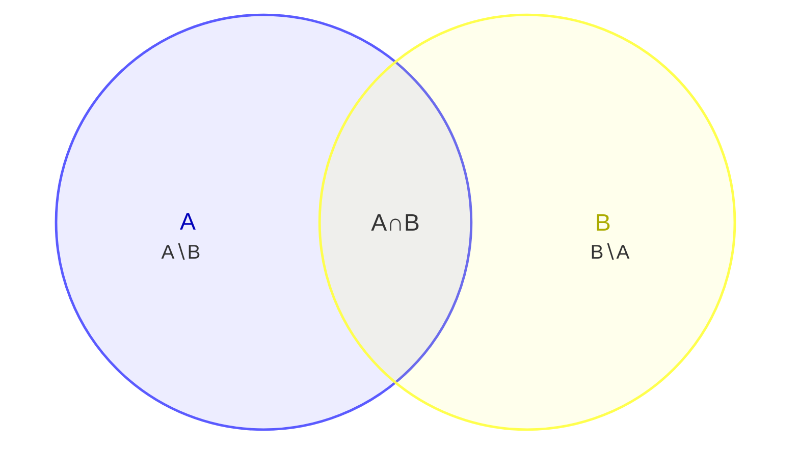

**Lectura de las regiones (con $A=\{1,2,3\}$, $B=\{3,4,5\}$, $\Omega=\{1,...,6\}$):**

| Región del dibujo | Contiene | Operación que la "prende" |
|-------------------|----------|---------------------------|
| Solo dentro de $A$ ($A \setminus B$) | $\{1,2\}$ | **Diferencia** $A \setminus B$ |
| Solape de ambos ($A \cap B$) | $\{3\}$ | **Intersección** $A \cap B$ |
| Solo dentro de $B$ ($B \setminus A$) | $\{4,5\}$ | **Diferencia** $B \setminus A$ |
| Fuera de ambos círculos | $\{6\}$ | **Complemento** $(A \cup B)^c$ |

Cada **operación** enciende una combinación de regiones:

| Operación | Regiones que toma | Resultado ($A=\{1,2,3\}$, $B=\{3,4,5\}$) |
|-----------|-------------------|------------------------------------------|
| **Unión** $A \cup B$ | A∖B + A∩B + B∖A (todo lo de ambos círculos) | $\{1,2,3,4,5\}$ |
| **Intersección** $A \cap B$ | Solo el solape | $\{3\}$ |
| **Diferencia** $A \setminus B$ | Solo A∖B | $\{1,2\}$ |
| **Diferencia simétrica** $A \triangle B$ | A∖B + B∖A (todo menos el solape) | $\{1,2,4,5\}$ |
| **Complemento** $A^c$ | Todo lo que queda **fuera** del círculo de $A$ | $\{4,5,6\}$ |

> [!note] Sobre la versión
> Los diagramas de Venn de Mermaid usan la sintaxis `venn-beta` (disponible desde Mermaid **v11.12.3**). El sitio mkdocs ya carga Mermaid v11; en Obsidian solo se verán si tu instalación es reciente y trae Mermaid 11.

**Cardinalidad** $|A|$ = número de elementos. Para contar una unión sin contar dos veces lo repetido:

$$
|A \cup B| = |A| + |B| - |A \cap B|
$$

(Este es el **principio de inclusión-exclusión**, que retomaremos en la Unidad 5.)

> [!warning] Cuidado con el complemento
> $A^c$ **depende del universo** elegido. Si $\Omega = \{1,2,3\}$, entonces $\{1,2\}^c = \{3\}$; pero si $\Omega = \{1,2,3,4,5,6\}$, entonces $\{1,2\}^c = \{3,4,5,6\}$. Siempre pregunta: ¿cuál es el universo?

**Propiedades útiles (así se simplifican expresiones):**

| Propiedad | Fórmula |
|-----------|---------|
| De Morgan | $(A \cup B)^c = A^c \cap B^c$ y $(A \cap B)^c = A^c \cup B^c$ |
| Distributiva | $A \cap (B \cup C) = (A \cap B) \cup (A \cap C)$ |
| Doble complemento | $(A^c)^c = A$ |
| Con el universo y el vacío | $A \cup A^c = \Omega$ y $A \cap A^c = \emptyset$ |

> [!example] Para practicar
> Con $A = \{1,2,3\}$, $B = \{3,4,5\}$ y $\Omega = \{1,2,3,4,5,6\}$: calcula $A \triangle B$ y verifica que $(A \cup B)^c = \{6\}$. Pista: primero $A \cup B = \{1,2,3,4,5\}$, luego su complemento es lo que falta para llegar a $\Omega$.

### Métodos de demostración

Demostrar una afirmación es **convencer sin dejar dudas**, con reglas, no con opiniones.

| Método | Idea | Analogía |
|--------|------|----------|
| **Directa** | Partes de lo que sabes y encadenas pasos hasta la conclusión | Seguir una receta paso a paso |
| **Contrapositiva** | En lugar de probar "si p entonces q", pruebas "si no q entonces no p" (equivalente) | Si no ves humo, es que no hay fuego (equivale a: si hay fuego, hay humo) |
| **Contradicción** | Supones lo contrario y llegas a un absurdo | En un juicio: "supongamos que el sospechoso es inocente… pero eso contradice la evidencia" |
| **Inducción** | Pruebas el primer caso y luego que si un caso vale, el siguiente también | **Dominó**: si cae la primera ficha y cada ficha tumba a la siguiente, caen TODAS |

> [!example] Demostración directa mínima
> Afirmación: "Si $n$ es par, entonces $n^2$ es par".
> Como $n$ es par, $n = 2k$. Entonces $n^2 = (2k)^2 = 4k^2 = 2(2k^2)$, que es par. ✅


---

## 🔗 5. Unidad 3 — Relaciones y funciones

> [!abstract] ¿De qué trata esta unidad?
> Las relaciones capturan **vínculos** entre elementos ("quién con quién", "qué es subconjunto de qué"). Las funciones son el caso especial donde cada entrada tiene **una sola** salida. Esta unidad conecta directo con conjuntos (U2): una relación *es* un subconjunto del producto cartesiano.

### 3.1 Pares ordenados y producto cartesiano

Un **par ordenado** $(a, b)$ es un par donde **el orden importa**: $(a,b) 
eq (b,a)$ salvo que $a=b$.

El **producto cartesiano** $A \times B$ es el conjunto de *todos* los pares ordenados con primera componente en $A$ y segunda en $B$:

$$A \times B = \{ (a,b) \mid a \in A,\ b \in B \}$$

> [!example] Con $A = \{1, 2\}$ y $B = \{x, y\}$:
> $A \times B = \{(1,x), (1,y), (2,x), (2,y)\}$ → **4 pares** = $|A| \cdot |B| = 2 \cdot 2 = 4$

| Propiedad | Fórmula | Intuición |
|-----------|---------|-----------|
| Cardinalidad | $\|A \times B\| = \|A\| \cdot \|B\|$ | Cada elemento de $A$ se combina con cada uno de $B$ |
| No conmutativo | $A \times B \neq B \times A$ (gral.) | El orden de los pares cambia |
| Producto con el vacío | $A \times \emptyset = \emptyset$ | No hay con qué formar pares |

> [!tip] Analogía
> Un producto cartesiano es como un **menú combinado**: si hay 3 sopas y 4 platos fuertes, hay $3 \times 4 = 12$ menús posibles. Cada menú es un par ordenado (sopa, plato fuerte).

---

### 3.2 Relaciones: definición formal

Una **relación** $R$ de $A$ a $B$ es un subconjunto del producto cartesiano:

$$R \subseteq A \times B$$

Si $(a, b) \in R$, escribimos $a\,R\,b$ y decimos que "$a$ está relacionado con $b$".

> [!example] En la base de datos de un hospital:
> - $A$ = pacientes, $B$ = doctores
> - $R = \{ (Ana, Dr. Pérez), (Ana, Dra. Gómez), (Luis, Dr. Pérez) \}$
> - Ana está relacionada con dos doctores; Luis con uno.
> - Cada fila de la tabla "citas" **es** un par de la relación.

Relación | Pares | ¿Qué significa?
---------|-------|----------------
$\leq$ en $\mathbb{N}$ | $(1,1),(1,2),(2,2),(1,3)\dots$ | "es menor o igual que"
$\|$ en $\mathbb{N}$ | $(2,4),(3,9),(2,6)\dots$ | "divide a"
$\subseteq$ en $\mathcal{P}(X)$ | $(\emptyset, \emptyset),(\{1\},\{1,2\})\dots$ | "es subconjunto de"

---

### 3.3 Representaciones de una relación

**1) Matriz de adyacencia** (útil para computador): filas = elementos de $A$, columnas = elementos de $B$, y un $1$ si están relacionados (0 si no).

> [!example] Con $A=\{1,2,3\}$, $B=\{a,b\}$ y $R=\{(1,a),(2,a),(2,b)\}$:
>
> | $R$ | $a$ | $b$ |
> |-----|-----|-----|
> | **1** | 1 | 0 |
> | **2** | 1 | 1 |
> | **3** | 0 | 0 |

**2) Digrafo** (diagrama de flechas): nodos = elementos de $A$, una flecha $x \to y$ por cada par $(x,y) \in R$.

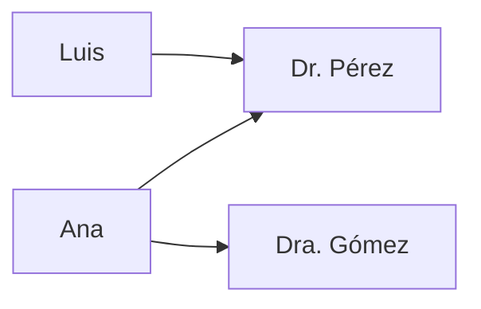

---

### 3.4 Propiedades de una relación (en un mismo conjunto)

Decimos que $R$ es una relación **sobre** $A$ cuando $R \subseteq A \times A$.

| Propiedad | Definición | Ejemplo cotidiano |
|-----------|------------|-------------------|
| **Reflexiva** | $\forall a:\; a\,R\,a$ | "$x \leq x$" siempre |
| **Simétrica** | $a\,R\,b \Rightarrow b\,R\,a$ | Amistad: si soy tu amigo, tú eres el mío |
| **Antisimétrica** | $a\,R\,b \land b\,R\,a \Rightarrow a=b$ | Orden: si $a \leq b$ y $b \leq a$, entonces $a=b$ |
| **Transitiva** | $a\,R\,b \land b\,R\,c \Rightarrow a\,R\,c$ | Edad: Ana < Beto y Beto < Carlos ⇒ Ana < Carlos |

> [!warning] Errores comunes
> - **Simétrica ≠ antisimétrica**: no son opuestas. "$\leq$" es antisimétrica (y no simétrica); "=" es ambas a la vez.
> - **Antisimétrica no pide** que $a\,R\,b$ y $b\,R\,a$ existan: solo dice que *si* existen ambos, entonces $a=b$.

**Relación de equivalencia** = reflexiva + simétrica + transitiva. Divide a $A$ en **clases de equivalencia** (grupos disjuntos cuya unión es $A$).

> [!example] "Tener el mismo resto al dividir por 3" ($a \equiv b \mod 3$)
> - Clases: $\{0,3,6,\dots\}$, $\{1,4,7,\dots\}$, $\{2,5,8,\dots\}$
> - Refleja el **concepto de módulo**: la base de los relojes ($\bmod 12$), días de la semana ($\bmod 7$).

**Orden parcial** = reflexiva + antisimétrica + transitiva. Ejemplo: "$\subseteq$" ordena conjuntos como cajas anidadas.

---

### 3.5 Diagrama de Hasse (orden parcial)

Un **diagrama de Hasse** dibuja un orden parcial omitiendo: lazos (reflexiva), flechas deducibles (transitiva) y el orden obvio. Para el orden por divisibilidad en $\{1,2,3,4,6,12\}$ ($a \preceq b$ si $a \mid b$):

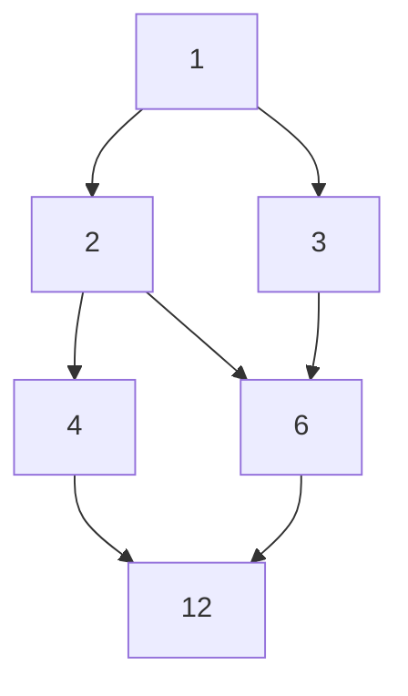

El **máximo** (si existe) es el $12$; el **mínimo** es el $1$. Elementos como $2$ y $3$ son **incomparables** (ni $2 \mid 3$ ni $3 \mid 2$).

---

### 3.6 Funciones

Una **función** $f: A \to B$ asigna a cada elemento de $A$ **exactamente un** elemento de $B$. La diferencia clave con una relación: **no puede haber dos flechas distintas saliendo del mismo elemento**.

| Tipo | Definición | Analogía |
|------|------------|----------|
| **Inyectiva** (uno a uno) | $f(a_1)=f(a_2) \Rightarrow a_1=a_2$ | DNI: cada persona tiene número distinto |
| **Sobreyectiva** (sobre) | $\forall b \in B,\; \exists a \in A: f(a)=b$ | Cada asiento del cine está ocupado |
| **Biyectiva** | Inyectiva + sobreyectiva | Casilleros: cada persona su casillero y viceversa (tiene inversa) |

> [!example] $f: \mathbb{N} \to \mathbb{N}$ con $f(n) = n^2$
> - **Inyectiva** ✅: si $n^2 = m^2$ entonces $n = m$.
> - **Sobreyectiva** ❌: $5$ no es un cuadrado perfecto, nadie lo "produce".
>
> $f: \mathbb{Z} \to \mathbb{Z}$, $f(n) = n+1$ es **biyectiva**: cada entero tiene exactamente un predecesor y sucesor.

**Conteo de funciones** (con $|A|=m$, $|B|=n$):

| Tipo | Cantidad | Ejemplo ($m=3$, $n=2$) |
|------|----------|------------------------|
| Cualquier función | $n^m$ | $2^3 = 8$ |
| Inyectivas | $n(n-1)\cdots(n-m+1)$ | $2 \cdot 1 = 2$ (solo si $m \leq n$) |
| Biyectivas | $n!$ | solo si $m = n$ → $3! = 6$ |

---

### 3.7 Composición e inversa

**Composición**: $(g \circ f)(x) = g(f(x))$ — primero se aplica $f$, luego $g$.

> [!example] $f(n) = n+1$ y $g(n) = 3n$:
> - $(g \circ f)(n) = 3(n+1) = 3n+3$
> - $(f \circ g)(n) = (3n)+1 = 3n+1$ → **la composición no es conmutativa** ($f \circ g \neq g \circ f$).

**Inversa**: solo las funciones **biyectivas** tienen inversa $f^{-1}$, que deshace a $f$: $f^{-1}(f(x)) = x$.

> [!tip] En programación
> La composición de funciones es la base del *pipeline* (encadenar operaciones) y de los *decorators*. La inversa aparece en criptografía RSA: una función (cifrar) y su inversa (descifrar) usando claves.

---

### 3.8 Aplicaciones en computación

- **Bases de datos relacionales**: cada tabla es una relación; las *joins* son composiciones de relaciones.
- **Grafos y redes**: un grafo dirigido es una relación $\text{nodos} \times \text{nodos}$; la matriz de adyacencia es su representación computable.
- **Tablas hash**: una función $\text{clave} \to \text{índice}$; si no es inyectiva hay *colisiones* (dos claves al mismo índice).
- **Lenguajes de programación**: los *tipos* son conjuntos y las *funciones* van de tipos a tipos (base de la verificación de tipos).

## 🪜 6. Unidad 4 — Inducción y recursión

> [!abstract] ¿De qué trata esta unidad?
> La **inducción** es el método estrella para demostrar que una propiedad vale para *todos* los naturales. La **recursión** define objetos (y algoritmos) en términos de sí mismos. Son dos caras de la misma moneda: la inducción demuestra, la recursión construye.

### 4.1 Inducción simple (primer principio)

Para probar que una propiedad $P(n)$ vale para **todos** los $n \geq n_0$:

1. **Base:** verificas $P(n_0)$.
2. **Paso inductivo:** supón $P(k)$ (hipótesis inductiva) y demuestra $P(k+1)$.

> [!example] La suma clásica
> $1 + 2 + 3 + \cdots + n = \dfrac{n(n+1)}{2}$
> - **Base**: $1 = 1(2)/2 = 1$ ✅
> - **Paso**: si vale para $n$, entonces $(1 + \cdots + n) + (n+1) = \frac{n(n+1)}{2} + (n+1) = \frac{(n+1)(n+2)}{2}$ ✅
> ¡Y así para todos los naturales!

> [!tip] Analogía de las fichas de dominó
> La base es **derribar la primera ficha**; el paso inductivo es probar que **cada ficha derriba a la siguiente**. Si ambas cosas funcionan, caen todas.

**Otros ejemplos clásicos de inducción:**

| Proposición | Base | Truco del paso |
|-------------|------|----------------|
| Suma de impares: $1+3+\cdots+(2n-1)=n^2$ | $n=1$: $1=1^2$ | El siguiente impar agrega $2n+1$: $n^2+2n+1=(n+1)^2$ |
| $2^n > n$ | $n=1$: $2>1$ | De $2^n>n$ se sigue $2^{n+1}>2n\geq n+1$ (para $n\geq1$) |
| $3 \mid n^3 - n$ | $n=1$: $0$ divisible | Factoriza $(k+1)^3-(k+1)$ usando $k^3-k$ |

---

### 4.2 Inducción fuerte (segundo principio)

En el paso inductivo puedes suponer que la propiedad vale para **todos** los valores anteriores, no solo $k$:

$$P(n_0), P(n_0+1), \ldots, P(k) \Rightarrow P(k+1)$$

> [!example] Todo número $n \geq 2$ es producto de primos (teorema fundamental de la aritmética)
> - **Base**: $n=2$ es primo ✅
> - **Paso**: si $n$ es compuesto, $n = a \cdot b$ con $2 \leq a,b < n$. Por hipótesis fuerte, $a$ y $b$ ya son productos de primos, así que $n$ también. ✅

> [!warning] ¿Cuándo usar inducción fuerte?
> Cuando el paso inductivo necesita un valor **más atrás** que $k$ (como en $n=a\cdot b$, donde necesitas $a$ y $b$, no solo $n-1$). Fibonacci, divisibilidad y teoremas de existencia son casos típicos.

---

### 4.3 Recursión

Un objeto es **recursivo** si se define en términos de sí mismo, pero con un **caso base** que detiene la recursión.

- **Factorial:** $n! = n \cdot (n-1)!$, con $0! = 1$.
- **Fibonacci:** $F_n = F_{n-1} + F_{n-2}$, con $F_0 = 0$, $F_1 = 1$ (¡el famoso problema de los conejos!).

> [!tip] Analogía
> La recursión es como las **muñecas rusas**: abres una y dentro hay otra más pequeña, hasta llegar a la más chica (el caso base). Luego vas cerrando de regreso.

Una **recurrencia** es la versión con ecuaciones: expresa un término en función de los anteriores. Ejemplo: $T(n) = T(n-1) + 1$ con $T(1)=1$ describe los pasos de un algoritmo que recorre $n$ elementos.

---

### 4.4 Torre de Hanoi: la recursión clásica

Reglas: mueve $n$ discos de la estaca A a la C, usando B como auxiliar, **uno a la vez** y **sin poner un disco grande sobre uno pequeño**.

La solución recursiva:
1. Mueve $n-1$ discos de A a B (usando C).
2. Mueve el disco grande de A a C (1 movimiento).
3. Mueve los $n-1$ discos de B a C (usando A).

$$T(n) = 2\,T(n-1) + 1, \qquad T(1) = 1 \quad \Rightarrow \quad T(n) = 2^n - 1$$

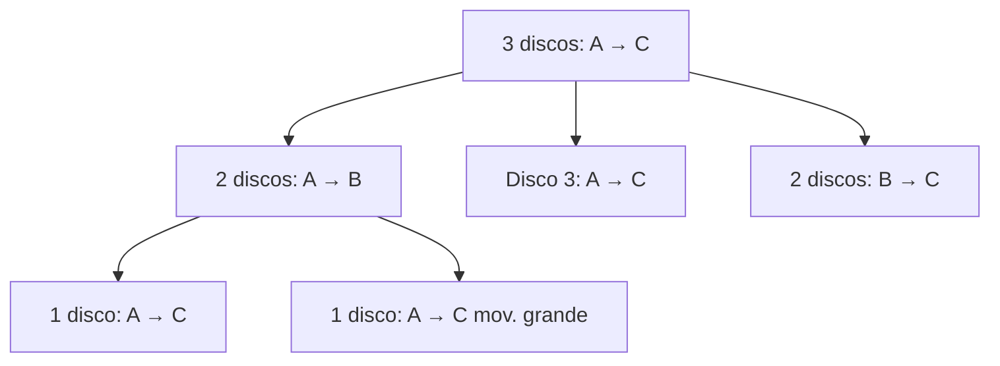

> [!example] Con 3 discos: $2^3 - 1 = 7$ movimientos
> La leyenda dice que los monjes de Benarés mueven 64 discos de oro y el mundo terminará cuando terminen: $2^{64}-1 \approx 1.8 \times 10^{19}$ movimientos... ¡a un movimiento por segundo serían ~584 mil millones de años!

---

### 4.5 Recursión vs iteración en programación

| Aspecto | Recursión | Iteración (bucle) |
|---------|-----------|-------------------|
| Definición | La función se llama a sí misma | Un `while`/`for` se repite |
| Estado | Cada llamada tiene su propio *stack frame* | Una variable de control compartida |
| Claridad | Ideal para estructuras anidadas (árboles, grafos) | Más directa para secuencias planas |
| Riesgo | *Stack overflow* si falta caso base | Bucle infinito si la condición no avanza |
| Costo | Cada llamada consume memoria | Menos memoria en general |

> [!warning] El caso base es obligatorio
> Sin caso base, la recursión se desborda: `stack overflow`. Es como las muñecas rusas sin la más pequeña: nunca terminas de abrir.

---

### 4.6 Recurrencias y divide y vencerás

Muchos algoritmos importantes siguen el patrón: **dividir** el problema, **resolver** las partes (recursivamente) y **combinar** los resultados.

| Algoritmo | Recurrencia | Complejidad resultante |
|-----------|-------------|------------------------|
| Recorrido lineal | $T(n)=T(n-1)+1$ | $O(n)$ |
| Búsqueda binaria | $T(n)=T(n/2)+1$ | $O(\log n)$ |
| Merge sort | $T(n)=2T(n/2)+n$ | $O(n \log n)$ |
| Insertion sort | $T(n)=T(n-1)+n$ | $O(n^2)$ |

> [!tip] Memoria visual
> $O(n)$, $O(\log n)$, $O(n\log n)$ y $O(n^2)$ son las **cuatro complejidades que dominan la vida real**. Cuando veas un algoritmo, pregúntate en cuál cae: esa es la diferencia entre un programa que "aguanta" y uno que "muere" con datos grandes.

---

### 4.7 Inducción estructural (avanzado)

Cuando la definición de un objeto es recursiva (como los árboles o las listas), la inducción se aplica **sobre la estructura** del objeto, no sobre un número:

- **Base**: la propiedad vale para los casos atómicos (hoja, lista vacía).
- **Paso**: si vale para las partes, vale para el objeto construido con ellas.

> [!example] En un árbol binario completo, $\text{hojas} = \text{nodos internos} + 1$
> - **Base**: árbol de un solo nodo → 1 hoja, 0 internos: $1 = 0+1$ ✅
> - **Paso**: un árbol con raíz y dos subárboles $T_1, T_2$: $\text{hojas}=\text{hojas}_1+\text{hojas}_2 = (\text{int}_1+1)+(\text{int}_2+1) = (\text{int}_1+\text{int}_2+1)+1 = \text{int}+1$ ✅

> [!tip] En la práctica
> Cada vez que escribes una función sobre un árbol o una lista enlazada, estás haciendo inducción estructural: un caso para la base (lista vacía / hoja) y otro que combina el resto.

## 🧮 7. Unidad 5 — Combinatoria y probabilidad discreta

> [!abstract] ¿De qué trata esta unidad?
> La combinatoria responde "**¿cuántas formas hay?**". Es la base para calcular probabilidades en espacios discretos (cada resultado igualmente probable) y aparece en algoritmos, contraseñas, loterías y análisis de complejidad.

### 5.1 Los dos principios básicos

- **Principio de la suma:** si hay $m$ formas de hacer A y $n$ formas de hacer B (excluyentes), hay $m + n$ formas de hacer A **o** B.
- **Principio del producto:** si hay $m$ formas de hacer A y luego $n$ formas de hacer B, hay $m \times n$ formas de hacer A **y** B.

> [!example] Menú del almuerzo
> - 3 sopas + 4 platos fuertes + 2 postres → $3 \times 4 \times 2 = 24$ menús posibles (principio del producto).
> - Si además hay café **o** té (2 bebidas): $24 \times 2 = 48$.
> - "Voy a la cafetería o a la tienda" con $4$ y $3$ opciones → $4+3=7$ caminos (principio de la suma).

---

### 5.2 Permutaciones y combinaciones

| Concepto | Fórmula | ¿Cuándo? | Ejemplo |
|----------|---------|----------|---------|
| **Permutación** $P(n,k)$ | $\dfrac{n!}{(n-k)!}$ | Orden **importa**, sin repetición | Podios de carrera (1°, 2°, 3°) |
| **Combinación** $C(n,k)$ | $\binom{n}{k} = \dfrac{n!}{k!(n-k)!}$ | Orden **no importa** | Elegir 3 amigos de 5 |
| **Permutación con repetición** | $n^k$ | Orden importa, se puede repetir | Claves de 4 dígitos: $10^4=10000$ |
| **Permutación de todos** $P(n,n)$ | $n!$ | Ordenar $n$ objetos distintos | Ordenar 5 libros: $5! = 120$ |

> [!tip] La regla de oro
> Pregúntate: **¿cambia el resultado si intercambio dos elementos?** Sí → permutación (orden importa). No → combinación.

> [!example] Equipo de 2 de entre 4 personas (Ana, Beto, Carla, Dany)
> - Con orden (capitán, vice): $P(4,2) = 4 \cdot 3 = 12$ opciones.
> - Sin orden (solo el equipo): $C(4,2) = \frac{4!}{2!2!} = 6$ opciones: AB, AC, AD, BC, BD, CD.

**Propiedades útiles de $\binom{n}{k}$:**
$$\binom{n}{k} = \binom{n}{n-k}, \qquad \binom{n}{0} = \binom{n}{n} = 1, \qquad \binom{n+1}{k} = \binom{n}{k-1} + \binom{n}{k}$$

La última es la **identidad de Pascal**: cada número del triángulo de Pascal es la suma de los dos de arriba.

---

### 5.3 Triángulo de Pascal y binomio de Newton

El **triángulo de Pascal** ordena los coeficientes $\binom{n}{k}$:

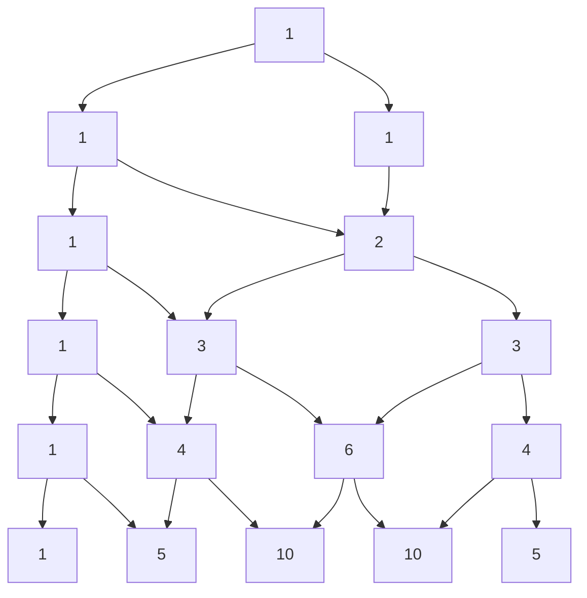

**Binomio de Newton:**
$$(x+y)^n = \sum_{k=0}^{n} \binom{n}{k}\, x^{n-k} y^k$$

> [!example] $(x+y)^3 = x^3 + 3x^2y + 3xy^2 + y^3$
> Los coeficientes $1,3,3,1$ son la fila 3 del triángulo de Pascal. Con $x=y=1$: $2^3 = 1+3+3+1 = 8$ ✅

---

### 5.4 Principio del palomar

Si tienes más **palomas** que **nidos**, al menos un nido tiene dos palomas.

> [!example] Ejemplos clásicos
> - En un grupo de **13 personas**, al menos dos nacieron el mismo mes (13 palomas, 12 nidos).
> - Entre **367 personas**, al menos dos comparten cumpleaños (días del año).
> - En una ciudad con más de 400,000 habitantes, al menos dos tienen el mismo teléfono (pues hay solo $10^6 \times$ prefijos... en general: $n$ objetos > $m$ cajas).

**Versión generalizada:** si repartes $n$ objetos en $k$ cajas, alguna caja tiene al menos $\lceil n/k \rceil$ objetos.

---

### 5.5 Inclusión-exclusión

Para contar uniones sin contar dos veces lo repetido:

$$|A \cup B| = |A| + |B| - |A \cap B|$$

Con tres conjuntos:

$$|A \cup B \cup C| = |A|+|B|+|C| - |A\cap B| - |A\cap C| - |B\cap C| + |A\cap B\cap C|$$

> [!example] Encuesta
> 60 leen el diario A, 40 el diario B, 20 ambos → $|A \cup B| = 60+40-20 = 80$ personas leen al menos uno.

---

### 5.6 Probabilidad discreta

En un espacio con resultados **igualmente probables**:

$$P(\text{evento}) = \frac{\text{casos favorables}}{\text{casos posibles}}$$

> [!example] Dado de 6 caras
> - $P(\text{par}) = 3/6 = 1/2$.
> - $P(\text{mayor que 4}) = 2/6 = 1/3$.
> - $P(\text{par y mayor que 4}) = P(\{6\}) = 1/6$.
> - $P(\text{par o mayor que 4}) = 3/6 + 2/6 - 1/6 = 4/6 = 2/3$ (inclusión-exclusión).

**Probabilidad con combinaciones:** en una lotería de $n$ números, escogiendo $k$:

$$P(\text{ganar}) = \frac{1}{\binom{n}{k}}$$

> [!tip] En la práctica
> La probabilidad de ganar la lotería de 6 de 49 es $1/\binom{49}{6} \approx 1/13{,}983{,}816$: más probable que te caiga un rayo. La combinatoria te deja *ver* esos números antes de comprar el billete.

---

### 5.7 Principios avanzados (vistazo)

- **Principio de inclusión-exclusión generalizado** para $n$ conjuntos: alterna sumas y restas de intersecciones.
- **Permutaciones con repetición de objetos iguales:** con $n$ objetos donde hay $n_1$ iguales, $n_2$ iguales...: $\dfrac{n!}{n_1!\,n_2!\cdots}$ (anagramas de "MISSISSIPPI").
- **Coeficientes multinomiales:** $\dfrac{n!}{n_1!\,n_2!\cdots n_k!}$ reparten $n$ objetos en $k$ grupos de tamaños dados.

> [!example] Anagramas de "SOL"
> Las 3 letras distintas: $3! = 6$ palabras (SOL, SLO, OSL, OLS, LSO, LOS). Con letras repetidas se divide: "ANANÁ" tiene $6!/3! = 120$ anagramas distintos (las 3 A son indistinguibles).

## 🔢 8. Unidad 6 — Teoría de números

La teoría de números estudia los **enteros**: divisores, primos y restos. Es la rama más antigua de las matemáticas y, hoy, la base de la **criptografía moderna** (tu conexión HTTPS, tu tarjeta, tu WhatsApp).

> [!tip] ¿Para qué sirve esta unidad?
> - Cifrar mensajes (RSA, Diffie-Hellman) — sin esto no habría comercio electrónico.
> - Validar identificadores: ISBN de libros, tarjetas de crédito, cédulas (dígito verificador).
> - Relojes, calendarios y cualquier cosa cíclica (aritmética modular).

---

### 8.1 Divisibilidad

$a$ **divide** a $b$ (escribimos $a \mid b$) si existe un entero $k$ tal que $b = a \cdot k$.

- $4 \mid 12$ porque $12 = 4 \cdot 3$. ✔
- $5 \nmid 12$ porque $12 = 5 \cdot k$ **no** tiene solución entera. ✘
- **Propiedades útiles:**
  - Si $a \mid b$ y $b \mid c$, entonces $a \mid c$ (transitiva).
  - Si $a \mid b$ y $a \mid c$, entonces $a \mid (b+c)$ y $a \mid (b-c)$.
  - Todo entero divide a $0$ ($a \mid 0$ para todo $a \neq 0$), y $1$ y $-1$ dividen a todo entero.

> [!example] Divisible por 9
> Un número es divisible por 9 si la suma de sus dígitos es divisible por 9: $123456 \to 1+2+3+4+5+6 = 21 \to 2+1=3$, no divisible.

---

### 8.2 Números primos y el Teorema Fundamental de la Aritmética

Un **primo** es un entero $> 1$ divisible solo por 1 y por sí mismo. Los primeros: $2, 3, 5, 7, 11, 13, 17, 19, \dots$

> [!abstract] Teorema Fundamental de la Aritmética
> Todo entero $n > 1$ se factoriza en primos de **forma única** (salvo el orden):
> $$n = p_1^{e_1} \cdot p_2^{e_2} \cdots p_k^{e_k}$$
>
> Ejemplo: $360 = 2^3 \cdot 3^2 \cdot 5$. No hay otra forma de escribirlo.

**Criba de Eratóstenes** (para hallar primos hasta $n$): tacha los múltiplos de cada primo, lo que queda son primos. Así se encontraron los primos a mano durante siglos.

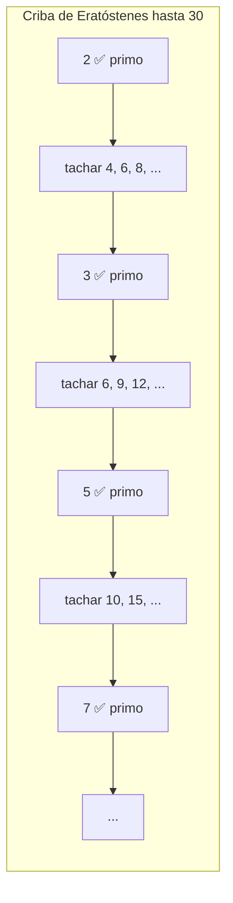

> [!info] ¿Cuántos primos hay?
> **Infinitos** (Euclides lo demostró hace 2300 años: si fueran finitos, el producto de todos más 1 sería un número nuevo sin divisor primo conocido). Todo algoritmo de cifrado serio depende de que **encontrar primos grandes es fácil pero factorizar su producto es difícil**.

---

### 8.3 Máximo común divisor (MCD) y algoritmo de Euclides

El **MCD** de $a$ y $b$ es el divisor más grande que comparten. Ejemplo: $\text{MCD}(48, 18) = 6$.

El **algoritmo de Euclides** (el más antiguo que se conserva) divide y usa el residuo:

$$
48 = 18 \cdot 2 + 12 \qquad 18 = 12 \cdot 1 + 6 \qquad 12 = 6 \cdot 2 + 0
$$

El último residuo no nulo es el MCD: **6**. Es rapidísimo, incluso con números de cientos de dígitos.

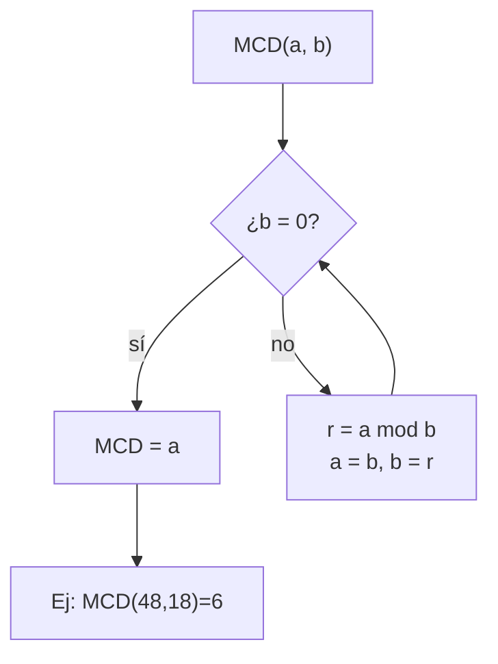

> [!tip] MCD por factorización
> Alternativa: factorizar y tomar los **factores comunes con menor exponente**.
> $48 = 2^4 \cdot 3$, $18 = 2 \cdot 3^2$ → común $2^1 \cdot 3^1 = 6$. Igual resultado, pero factorizar es lento y Euclides no.

**Mínimo común múltiplo (mcm):** el múltiplo más pequeño que comparten. Relación clave: $\text{MCD}(a,b) \cdot \text{mcm}(a,b) = a \cdot b$.
Ejemplo: $\text{mcm}(48,18) = \frac{48 \cdot 18}{6} = 144$.

---

### 8.4 Aritmética modular (los "restos")

Trabajar con **residuos**: "el reloj da vueltas". Las 25:00 son las 1:00 (módulo 24). Escribimos $25 \equiv 1 \ (\text{mod } 24)$.

**Definición formal:** $a \equiv b \ (\text{mod } m)$ si $m \mid (a - b)$, es decir, $a$ y $b$ dejan el mismo resto al dividir por $m$.

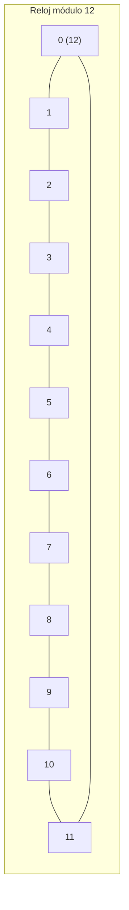

**Reglas de cálculo** (igual que las ecuaciones normales):

- Suma: $a \bmod m + b \bmod m = (a+b) \bmod m$
- Multiplicación: $a \bmod m \cdot b \bmod m = (a \cdot b) \bmod m$
- Potencia: se puede reducir la base antes de elevar.

> [!example] Último dígito de $7^{2026}$
> Como $7^2 = 49 \equiv 9$, $7^4 \equiv 9^2 = 81 \equiv 1 \pmod{10}$, y $2026 = 4 \cdot 506 + 2$: $7^{2026} \equiv 7^2 \equiv 9$. **El último dígito es 9.**

---

### 8.5 Inversos modulares y congruencias lineales

El **inverso de $a$ módulo $m$** es el número $a^{-1}$ tal que $a \cdot a^{-1} \equiv 1 \ (\text{mod } m)$. **Existe si y solo si $\text{MCD}(a,m)=1$.**

Ejemplo: inverso de 3 módulo 7. Probamos $3 \cdot x \equiv 1$:
- $3 \cdot 5 = 15 \equiv 1 \pmod{7}$ → $3^{-1} \equiv 5$.

**Ecuación $a x \equiv b \ (\text{mod } m)$:**
- Si $\text{MCD}(a,m)=1$: multiplica por el inverso: $x \equiv a^{-1} \cdot b$.
- Si no: puede no tener solución o tener varias.

> [!warning] Cuidado
> $2x \equiv 4 \ (\text{mod } 6)$ no se resuelve dividiendo: $x=2$ y $x=5$ son soluciones (dos, porque hay 2 raíces por cada divisor común). La división normal **no es válida** en módulos.

---

### 8.6 Criptografía RSA (aplicación estrella)

RSA cifra mensajes con dos claves (pública y privada). Pasos con números pequeños:

1. **Elige dos primos** $p=17$, $q=11$ → $n = p \cdot q = 187$.
2. Calcula $\varphi(n) = (p-1)(q-1) = 16 \cdot 10 = 160$ (función de Euler).
3. **Clave pública** $e$: primo relativo con $\varphi(n)$, p. ej. $e=7$.
4. **Clave privada** $d$: el inverso de $e$ módulo $\varphi(n)$: $7 \cdot d \equiv 1 \pmod{160}$ → $d=23$ (porque $7 \cdot 23 = 161 = 160+1$).

**Cifrar** un mensaje numérico $M$: $C = M^e \bmod n$. **Descifrar**: $M = C^d \bmod n$.

> [!abstract] ¿Por qué es seguro?
> Conocer $n$ y $e$ (públicos) no basta: para hallar $d$ hay que factorizar $n$. Con primos de 300 dígitos, factorizar toma **miles de años** con computadoras actuales. La seguridad está en la **dificultad de factorizar**.

---

### 8.7 Aplicaciones del mundo real

| Aplicación | Idea matemática |
|------------|-----------------|
| **ISBN-13 / tarjetas de crédito** | Dígito verificador con aritmética módulo 10 (algoritmo de Luhn) |
| **Cédula / DNI** | Un dígito extra calculado con módulo 11 detecta errores de escritura |
| **Criptografía (RSA, ElGamal)** | Primos enormes, inversos modulares, exponenciación módulo $n$ |
| **Calendarios** | El año bisiesto: divisible por 4, no por 100, salvo por 400 (¡módulo 400!) |
| **Hashing / checksums** | Reducir datos enormes a un resto módulo un número (como `crc32`) |

> [!tip] Para practicar
> - Calcula $\text{MCD}(252, 105)$ con Euclides en 3 divisiones.
> - Halla el inverso de 5 módulo 12 (pista: $\text{MCD}(5,12)=1$).
> - Cifra el mensaje $M=5$ con RSA usando $p=3, q=11, e=3$ (hazlo a mano, ¡funciona!).

## 🕸️ 9. Unidad 7 — Grafos y árboles

> [!abstract] ¿De qué trata esta unidad?
> Un **grafo** es un conjunto de **vértices** (puntos) conectados por **aristas** (líneas). Es un mapa abstracto de conexiones: redes sociales, calles, cables, páginas web, moléculas, procesos y tareas.

> [!tip] Analogía
> Una **red social**: cada persona es un vértice y cada amistad una arista. Un grafo también modela calles, cables, páginas web, moléculas, procesos y tareas.

### 7.1 Definición formal

Un grafo es un par $G = (V, E)$, donde:
- $V$ = conjunto de **vértices** (nodos).
- $E$ = conjunto de **aristas** (conexiones entre pares de vértices).

| Concepto | Notación | Ejemplo |
|----------|----------|---------|
| Vértices | $V = \{A, B, C\}$ | 3 nodos |
| Arista | $(A,B) \in E$ | Conexión entre A y B |
| Grado de un vértice | $\deg(A)$ | Número de aristas que tocan a A |
| Grafo completo con $n$ vértices | $K_n$ | $\binom{n}{2}$ aristas (todos conectados con todos) |

> [!example] Suma de grados
> En cualquier grafo, la suma de los grados es el **doble** de las aristas: $\sum \deg(v) = 2|E|$.
> Por eso en un grafo con 4 aristas la suma de grados es 8: ¡cada arista "cuenta" en sus dos extremos!

---

### 7.2 Tipos de grafos (con diagramas)

#### 1. Grafo simple (no dirigido)

Las aristas son de **dos vías** (amistad de Facebook: si A es amigo de B, B es amigo de A). Sin lazos ni aristas múltiples.

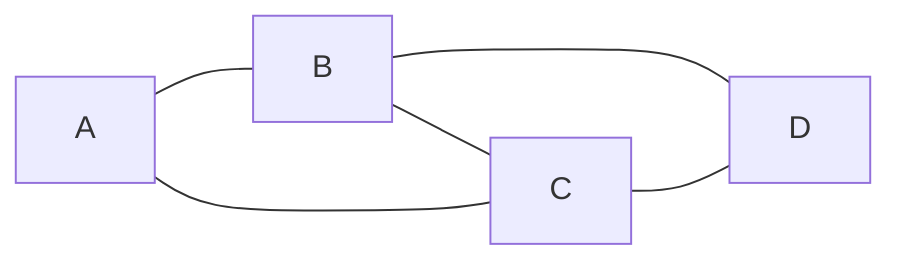

> Amistades: A—B, A—C, B—C, B—D, C—D. Todos los grados: $\deg(A)=2$, $\deg(B)=3$, $\deg(C)=3$, $\deg(D)=2$. Suma $10 = 2 \cdot 5$ aristas ✅

#### 2. Grafo dirigido (digrafo)

Las aristas tienen **flecha** (Instagram: tú sigues a alguien, no al revés). El orden del par importa: $(u,v) \neq (v,u)$.

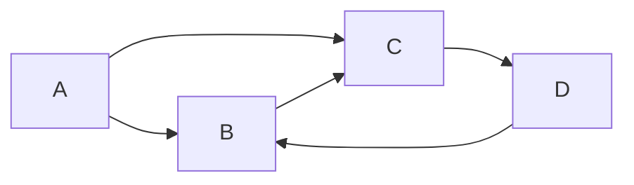

> Aristas: $A \to B$, $A \to C$, $B \to C$, $C \to D$, $D \to B$. Ahora distinguimos **grado de entrada** (flechas que llegan) y **grado de salida** (flechas que salen): $\deg^-(B)=2$ (llegan de A y D), $\deg^+(B)=1$ (sale a C).

#### 3. Grafo ponderado

Cada arista tiene un **peso** (kilómetros, costo, tiempo). Es el modelo de los mapas de navegación y rutas.

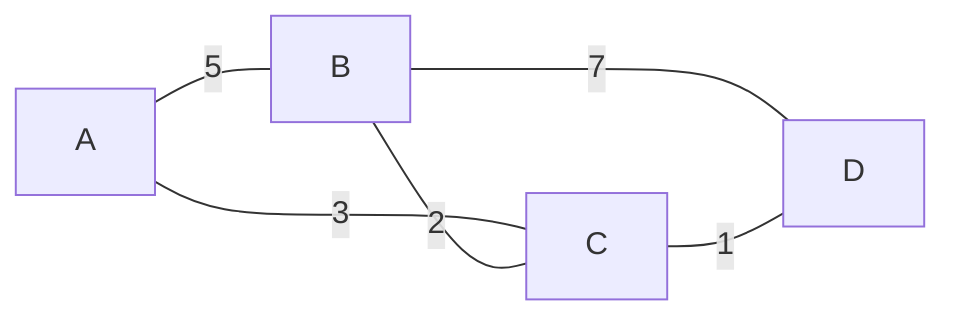

> La ruta más barata de A a D es $A \to C \to D$ con $3+1=4$, ¡más corta que $A \to B \to D$ ($5+7=12$)!

#### 4. Grafo completo $K_n$

Cada vértice está conectado con **todos** los demás. Con $n$ vértices tiene $\binom{n}{2}$ aristas.

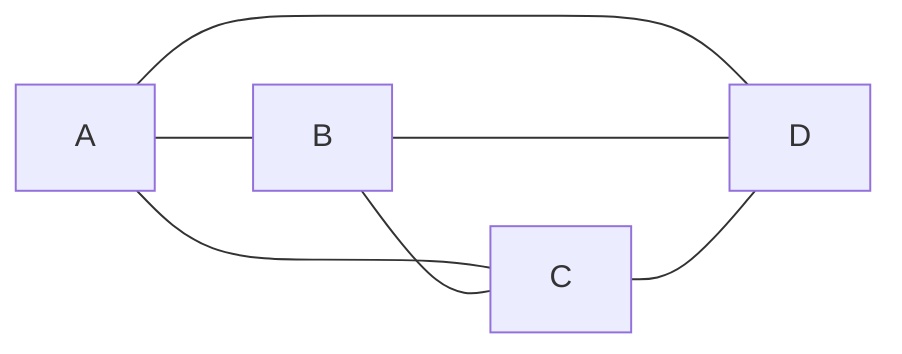

> $K_4$: 4 vértices, $\binom{4}{2} = 6$ aristas. Cada vértice tiene grado $n-1 = 3$.

#### 5. Grafo bipartito

Los vértices se dividen en **dos grupos** (por ejemplo, trabajadores y tareas) y las aristas **solo** conectan un grupo con el otro.

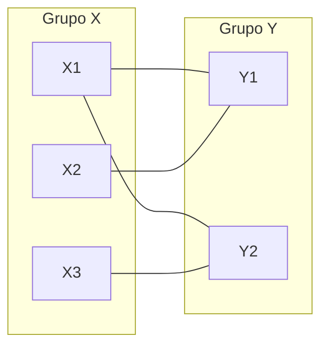

> Modela asignaciones: 3 trabajadores, 2 tareas. Ninguna arista conecta dos personas entre sí ni dos tareas entre sí.

#### 6. Grafo conexo vs. no conexo

- **Conexo:** desde cualquier vértice se llega a cualquier otro (un solo "pedazo").
- **No conexo:** tiene dos o más **componentes** separadas.

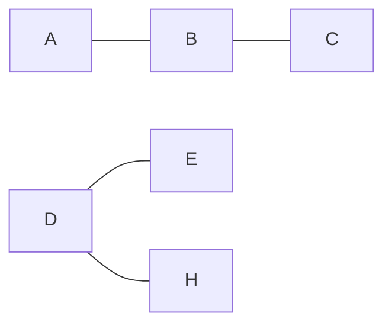

> Este grafo es **no conexo**: la componente $\{A,B,C\}$ y la componente $\{D,E,H\}$ están aisladas. No hay camino de A a D.

#### 7. Ciclo y camino

- Un **camino** recorre vértices distintos sin repetir.
- Un **ciclo** es un camino que empieza y termina en el mismo vértice sin repetir otros.

```mermaid
flowchart LR
    A --- B
    B --- C
    C --- D
    D --- A
    D --- E
```

> $A \to B \to C \to D \to A$ es un **ciclo** de longitud 4. $A \to B \to C \to D \to E$ es un **camino** simple.

#### 8. Grafo con lazo (bucle)

Un **lazo** es una arista que conecta un vértice **consigo mismo**. (En mermaid se dibuja una flecha que regresa al mismo nodo.)

```mermaid
flowchart LR
    A --> A
    B --- A
    B --- C
    C --- C
```

> El vértice A tiene un lazo ($A \to A$) y B tiene otro. Un lazo aporta **2** al grado del vértice.

**Resumen rápido de tipos:**

| Tipo | ¿Flechas? | ¿Pesos? | Ejemplo real |
|------|-----------|---------|--------------|
| Simple | No | No | Mapa de amistades |
| Dirigido | Sí | No | Red social de seguidores |
| Ponderado | Según caso | Sí | GPS / rutas |
| Completo | No | No | Torneo round-robin (todos contra todos) |
| Bipartito | No | No | Asignación trabajador–tarea |
| Conexo / no conexo | Según caso | Según caso | Red de fibra óptica |

---

### 7.3 Representaciones computables

**1) Matriz de adyacencia:** tabla $n \times n$ con $1$ si hay arista, $0$ si no.

> [!example] Para el grafo simple $A-B$, $A-C$ (con vértices A, B, C):
>
> | | A | B | C |
> |---|---|---|---|
> | **A** | 0 | 1 | 1 |
> | **B** | 1 | 0 | 0 |
> | **C** | 1 | 0 | 0 |

**2) Lista de adyacencia:** cada vértice guarda la lista de sus vecinos.

$$A: [B, C],\quad B: [A],\quad C: [A]$$

> [!tip] ¿Matriz o lista?
> **Matriz** → rápida para preguntar "¿hay arista entre u y v?" pero ocupa $O(n^2)$ memoria. **Lista** → ahorra memoria en grafos dispersos (pocas aristas) y es la estándar en DFS/BFS.

---

### 7.4 Caminos, cadenas y ciclos

> [!abstract] Tres tipos de recorridos
> Un **camino**, una **cadena** y un **ciclo** son distintas formas de "recorrer" un grafo. La diferencia está en **qué se permite repetir**: vértices, aristas, o ninguna de las dos.

#### 7.4.1 Longitud de un recorrido

La **longitud** de un recorrido es el número de **aristas** que usa (no de vértices). Un recorrido de $A$ a $D$ por las aristas $(A,B), (B,C), (C,D)$ tiene **longitud 3**.

```mermaid
flowchart LR
    A ---|"1"| B
    B ---|"2"| C
    C ---|"3"| D
```

> El recorrido $A \to B \to C \to D$ tiene longitud 3: usa 3 aristas para visitar 4 vértices.

---

#### 7.4.2 Camino (path)

Un **camino** es un recorrido que **no repite vértices** (y por tanto tampoco aristas). Es la forma "limpia" de ir de un punto a otro sin dar vueltas.

| Propiedad | Valor |
|-----------|-------|
| ¿Repite vértices? | ❌ No |
| ¿Repite aristas? | ❌ No |
| Ejemplo | $A \to B \to C \to D$ |

```mermaid
flowchart LR
    A --- B
    B --- C
    C --- D
    D --- B
    B --- E
```

> El camino $A \to B \to C \to D$ usa 3 aristas y **4 vértices distintos**. No puede volver a pasar por B (ya lo visitó).

> [!tip] Camino más corto
> En Google Maps, la ruta sugerida es el **camino más corto** entre dos vértices en un grafo ponderado: el algoritmo de Dijkstra lo encuentra en tiempo $O(E \log V)$.

---

#### 7.4.3 Cadena (trail)

Una **cadena** es un recorrido que **no repite aristas**, pero **puede repetir vértices**. Es más permisiva que un camino.

| Propiedad | Valor |
|-----------|-------|
| ¿Repite vértices? | ✅ Sí (permitido) |
| ¿Repite aristas? | ❌ No |
| Ejemplo | $A \to B \to C \to B \to D$ |

```mermaid
flowchart LR
    A --- B
    B --- C
    C --- B2["B (vuelta)"]
    B2 --- D
```

> La cadena $A \to B \to C \to B \to D$ **repasa el vértice B** (dos veces), pero cada arista se usa **una sola vez**. Su longitud es 4.

> [!example] En la vida real
> Un cartero que reparte cartas puede **pasar dos veces por la misma esquina** (vértice) pero no debe **recorrer la misma cuadra** (arista) dos veces en un mismo trayecto. Eso es una cadena.

---

#### 7.4.4 Ciclo (cycle)

Un **ciclo** es un camino **cerrado**: empieza y termina en el mismo vértice, sin repetir otros vértices. En un grafo simple, un ciclo tiene longitud **al menos 3**.

| Propiedad | Valor |
|-----------|-------|
| Inicio = final | ✅ Sí |
| ¿Repite vértices? | Solo el primero/último |
| Longitud mínima | 3 (grafo simple) |

```mermaid
flowchart LR
    A --- B
    B --- C
    C --- D
    D --- A
```

> El ciclo $A \to B \to C \to D \to A$ tiene longitud 4: cada vértice se visita **una sola vez** y se regresa al punto de partida.

**Ciclo simple vs circuito:**

| Concepto | Definición |
|----------|------------|
| **Ciclo** | Camino cerrado que **no repite vértices** (salvo el inicial = final) |
| **Circuito** | Cadena cerrada que puede repetir vértices pero **no aristas** (recorrido euleriano cerrado) |

```mermaid
flowchart LR
    A --- B
    B --- C
    C --- A
    A --- D
    D --- E
    E --- B
```

> Recorrido $A \to B \to C \to A \to D \to E \to B \to A$: es un **circuito** (repasa A y B, pero ninguna arista se usa dos veces). No es un ciclo porque repite A y B.

> [!warning] Error común
> Un **ciclo no es "cerrar un camino cualquiera"**: debe empezar y terminar en el mismo vértice **sin repetir otros en el medio**. $A \to B \to C \to A$ es ciclo; $A \to B \to C \to B \to A$ no lo es (B se repite).

---

#### 7.4.5 Resumen de recorridos

| Recorrido | ¿Repite vértices? | ¿Repite aristas? | ¿Cerrado? |
|-----------|:-----------------:|:----------------:|:---------:|
| **Paseo** (walk) | ✅ | ✅ | Opcional |
| **Cadena** (trail) | ✅ | ❌ | Opcional |
| **Camino** (path) | ❌ | ❌ | Opcional |
| **Circuito** | ✅ | ❌ | ✅ |
| **Ciclo** (cycle) | ❌ (salvo inicio=final) | ❌ | ✅ |

> [!tip] Cadena de memoria
> **Camino** = no repito vértices → es el más "limpio". **Cadena** = no repito aristas → puedo volver a un vértice. **Ciclo** = camino cerrado → regreso al inicio.

---

#### 7.4.6 Caminos y ciclos eulerianos y hamiltonianos

Los dos problemas más famosos de la teoría de grafos preguntan por recorridos especiales:

> [!abstract] La gran diferencia
> - **Euleriano:** recorre cada **arista** exactamente una vez (como pintar todas las líneas sin levantar el lápiz).
> - **Hamiltoniano:** visita cada **vértice** exactamente una vez (como recorrer todas las ciudades sin repetir ninguna).

---

#### 7.4.7 Camino y ciclo euleriano

Un **camino euleriano** recorre **cada arista una sola vez**. Si además empieza y termina en el mismo vértice, se llama **ciclo euleriano** (o circuito euleriano).

> [!tip] Criterio de Euler (fácil de verificar)
> En un grafo **conexo**:
> - Hay **ciclo euleriano** si **todos** los vértices tienen grado **par**.
> - Hay **camino euleriano** (abierto) si hay **exactamente 0 o 2** vértices con grado **impar**.

**Ejemplo de ciclo euleriano** (todos los grados pares):

```mermaid
flowchart LR
    A["A (grado 4)"] --- B
    A --- C
    B --- C
    A --- D
    A --- E
    D --- E
```

> Grados: $\\deg(A)=4$, $\\deg(B)=2$, $\\deg(C)=2$, $\\deg(D)=2$, $\\deg(E)=2$ — **todos pares**, así que hay ciclo euleriano. Por ejemplo: $A \\to B \\to C \\to A \\to D \\to E \\to A$. Cada arista se usa una vez.

**Ejemplo de camino euleriano** (exactamente 2 impares):

```mermaid
flowchart LR
    A --- B
    B --- C
    C --- D
```

> Grados: $\\deg(A)=1$ (impar), $\\deg(B)=2$, $\\deg(C)=2$, $\\deg(D)=1$ (impar). Hay camino euleriano de $A$ a $D$: $A \\to B \\to C \\to D$. Como hay 2 impares, el camino **empieza en uno y termina en el otro**.

> [!warning] El problema de los puentes de Königsberg
> La ciudad tenía 4 zonas (orillas e isla) conectadas por 7 puentes. El grafo tiene grados **3, 3, 3, 5**: los **cuatro impares**. Como se necesitan 0 o 2 impares, **no existe** recorrido que cruce cada puente exactamente una vez. Este problema dio origen a la teoría de grafos (Euler, 1736).

---

#### 7.4.8 Camino y ciclo hamiltoniano

Un **camino hamiltoniano** visita **cada vértice exactamente una vez**. Un **ciclo hamiltoniano** vuelve al inicio al final (visita todos los vértices una vez y cierra).

> [!example] Ciclo hamiltoniano
>
> ```mermaid
> flowchart LR
>     A --- B
>     B --- C
>     C --- D
>     D --- E
>     E --- A
> ```
>
> El recorrido $A \\to B \\to C \\to D \\to E \\to A$ visita los 5 vértices una sola vez y regresa al inicio: es un **ciclo hamiltoniano**.

**Problema del vendedor viajero (TSP):** encontrar el ciclo hamiltoniano de **costo mínimo** en un grafo ponderado. Aparece en logística (rutas de reparto), diseño de circuitos y planificación.

> [!warning] A diferencia de Euler, no hay criterio simple
> Decidir si un grafo tiene ciclo hamiltoniano es un problema **NP-completo**: no se conoce algoritmo rápido y, en la práctica, hay que probar muchas combinaciones (casi $n!$ rutas posibles). Hay criterios **suficientes** (Dirac, Ore) que garantizan su existencia en ciertos casos, pero son condiciones fuertes:
>
> - **Teorema de Dirac:** si $n \\geq 3$ y todo vértice tiene grado $\\geq n/2$, hay ciclo hamiltoniano.
> - **Teorema de Ore:** si para todo par de vértices no adyacentes $\\deg(u)+\\deg(v) \\geq n$, hay ciclo hamiltoniano.

---

#### 7.4.9 Comparativa final: Euler vs Hamilton

| Criterio | Euleriano | Hamiltoniano |
|----------|-----------|--------------|
| Qué recorre | Cada **arista** una vez | Cada **vértice** una vez |
| Versión cerrada | Ciclo euleriano | Ciclo hamiltoniano |
| Criterio fácil | Sí: contar grados pares/impares | No: NP-completo |
| Problema famoso | Puentes de Königsberg | Vendedor viajero (TSP) |
| Analogía | Pintar un dibujo sin levantar el lápiz | Tour que visita todas las ciudades |
| Complejidad de decisión | Polinomial (fácil) | NP-completo (difícil) |

> [!tip] Regla práctica
> - ¿El grafo es conexo y tiene **0 o 2 grados impares**? → hay Euler: busca el recorrido con confianza.
> - ¿Necesitas visitar todas las **ciudades** sin repetir? → es Hamilton: no prometas un algoritmo rápido, usa heurísticas (vecino más cercano, 2-opt).
---

#### 7.4.10 El algoritmo de Dijkstra: la ruta más corta 👟

**(Estructura de datos: grafo ponderado con pesos **no negativos**)**

Dijkstra (1959) responde la pregunta estrella de Google Maps:

> *"¿Cuál es el camino **más barato** (menor costo total) desde mi origen **s** hasta cada otro vértice?"*

**Analogía:** cada vértice es una ciudad y cada arista, un vuelo con su precio. Dijkstra empieza con la maleta en la ciudad de salida (distancia 0) y va *desbloqueando* la ciudad más barata de alcanzar; al desbloquear una ciudad, revisa si los vuelos que salen de ella **mejoran** el precio de llegar a las vecinas. Ese ajuste se llama **relajamiento** de la etiqueta.

**Las tres reglas del juego** (se parece a Prim, pero minimiza **distancia desde el origen**, no el costo del árbol):

1. Mantén una etiqueta `d[v]` = mejor distancia conocida desde `s` (∞ al inicio, 0 en `s`).
2. En cada paso **finaliza** el vértice no etiquetado con **menor** `d`: su distancia es *definitiva*.
3. Al finalizar `u`, **relaja** cada arista `(u,v)`: si `d[u] + peso(u,v) < d[v]`, actualiza `d[v]` y guarda a `u` como el *padre* de `v`.

> [!warning] ¿Por qué pesos no negativos?
> Si una arista pesara **-5**, "tardar más" podría *mejorar* el precio (llegar a v y volver a u sale más barato). La regla 2 ("la menor es definitiva") dejaría de ser cierta. Por eso Dijkstra exige pesos ≥ 0.

Usaremos el **mismo grafo de las 7 casas** del MST (los pesos no cambiaron):

```mermaid
flowchart LR
    A["A"] ---|"7"| B["B"]
    A ---|"5"| D["D"]
    B ---|"8"| C["C"]
    B ---|"9"| D
    B ---|"7"| E["E"]
    C ---|"5"| E
    D ---|"15"| E
    D ---|"6"| F["F"]
    E ---|"8"| F
    E ---|"9"| G["G"]
    F ---|"11"| G
```

**Paso a paso desde A** (las celdas en negrita son las definitivas):

| Paso | Finalizado | d[A] | d[B] | d[C] | d[D] | d[E] | d[F] | d[G] | Arista al SPT |
|------|------------|------|------|------|------|------|------|------|---------------|
| 0 | — | **0** | ∞ | ∞ | ∞ | ∞ | ∞ | ∞ | — |
| 1 | A (0) · relaja A-B, A-D | 0 | 7 | ∞ | 5 | ∞ | ∞ | ∞ | — |
| 2 | **D (5)** · relaja D-F, D-E | 0 | 7 | ∞ | **5** | 20 | 11 | ∞ | A-D |
| 3 | **B (7)** · relaja B-C, B-E | 0 | **7** | 15 | 5 | 14 | 11 | ∞ | A-B |
| 4 | **F (11)** · relaja F-G | 0 | 7 | 15 | 5 | 14 | **11** | 22 | D-F |
| 5 | **E (14)** · relaja E-G (no mejora) | 0 | 7 | 15 | 5 | **14** | 11 | 22 | B-E |
| 6 | **C (15)** · sin mejoras | 0 | 7 | **15** | 5 | 14 | 11 | 22 | B-C |
| 7 | **G (22)** | 0 | 7 | 15 | 5 | 14 | 11 | **22** | F-G |

> [!tip] La ruta a G
> Siguiendo los padres: `G ← F ← D ← A`, o sea **A → D → F → G = 5 + 6 + 11 = 22**. La alternativa A → B → E → G daba 23, por eso Dijkstra prefiere la del sur. 🗺️

El árbol de caminos más cortos (SPT) resultante:

```mermaid
flowchart LR
    A["A (0)"] -->|"5"| D["D (5)"]
    A -->|"7"| B["B (7)"]
    D -->|"6"| F["F (11)"]
    B -->|"7"| E["E (14)"]
    B -->|"8"| C["C (15)"]
    F -->|"11"| G["G (22)"]
```

**Pseudo-código:**

```text
función dijkstra(grafo G, origen s):
    d[s] = 0, d[resto] = ∞
    padre[s] = None
    Q = cola de prioridad con todos los vértices (por d)
    mientras Q no esté vacía:
        u = Q.extraer_min()          # vértice con menor d → definitivo
        para cada (v, peso) en vecinos(u):
            si d[u] + peso < d[v]:   # relajamiento
                d[v] = d[u] + peso
                padre[v] = u
                Q.reducir_clave(v, d[v])
    devolver d, padre
```

**Implementación en Python (con heap):**

```python
import heapq

def dijkstra(grafo, origen):
    dist = {v: float("inf") for v in grafo}
    padre = {v: None for v in grafo}
    dist[origen] = 0
    cola = [(0, origen)]
    while cola:
        d, u = heapq.heappop(cola)
        if d > dist[u]:
            continue              # etiqueta obsoleta, no finalizar u otra vez
        for v, w in grafo[u]:
            nueva = d + w
            if nueva < dist[v]:
                dist[v] = nueva
                padre[v] = u
                heapq.heappush(cola, (nueva, v))
    return dist, padre

# El mismo grafo de las 7 casas
G = {
    "A": [("B", 7), ("D", 5)],
    "B": [("A", 7), ("C", 8), ("D", 9), ("E", 7)],
    "C": [("B", 8), ("E", 5)],
    "D": [("A", 5), ("B", 9), ("E", 15), ("F", 6)],
    "E": [("B", 7), ("C", 5), ("D", 15), ("F", 8), ("G", 9)],
    "F": [("D", 6), ("E", 8), ("G", 11)],
    "G": [("E", 9), ("F", 11)],
}
dist, padre = dijkstra(G, "A")
print(dist["G"])                  # 22  → ruta A → D → F → G
```

**Complejidad:** con heap, cada vértice se extrae una vez y cada relajamiento hace un push: **O((n + m) log n)**. Sin heap (buscando el mínimo a mano) sería O(n²), aceptable en grafos densos.

> 🎮 **Ahora practica tú:** haz clic sobre las **aristas** en el orden en que Dijkstra las agrega a su árbol de caminos más cortos (finalizando siempre el vértice de menor distancia). Empieza con la semilla A; con 💡 Ayuda verás la pista.

<div class="grafo-ejercicio" data-tipo="dijkstra" data-nodos="A,B,C,D,E,F,G" data-semilla="A" data-aristas="A-B:7,A-D:5,B-C:8,B-D:9,B-E:7,C-E:5,D-E:15,D-F:6,E-F:8,E-G:9,F-G:11">

#### Precisa los clics: orden de Dijkstra

Haz **clic sobre una arista** que conecte un vértice ya finalizado con el **vértice no finalizado de menor distancia**. Si aciertas, la arista se pone verde y el vértice se finaliza mostrando su distancia real desde A. ¡Termina con la ruta A→D→F→G = 22!

</div>

---

### 7.5 Árboles

Un **árbol** es un grafo **conexo sin ciclos**. Es la estructura natural de las **jerarquías**: sistemas de archivos, DOM de una página, árboles genealógicos, y los árboles de decisión de machine learning.

> [!abstract] Propiedades equivalentes de un árbol con $n$ vértices
> Se dice que las siguientes afirmaciones son equivalentes (si una se cumple, se cumplen todas):
> 1. Es conexo y sin ciclos.
> 2. Tiene exactamente $n-1$ aristas.
> 3. Entre cualquier par de vértices hay **un único** camino.
> 4. Es conexo, pero si quitas una arista cualquiera, se desconecta.

---

#### 7.5.1 Terminología de árboles

- **Raíz:** nodo especial (designado o elegido) que está "arriba" de todo.
- **Padre / Hijo:** si hay arista de $u$ a $v$, el padre de $v$ es $u$.
- **Hermanos:** nodos con el mismo padre.
- **Hoja (nodo hoja):** nodo sin hijos.
- **Nodo interno:** al menos un hijo.
- **Profundidad (nivel):** distancia desde la raíz ($d=0$).
- **Altura:** la mayor profundidad de cualquier nodo (un árbol con un solo nodo tiene altura 0).

```mermaid
flowchart TB
    A["Raíz (d=0)"] --> B["Hijo 1 (d=1)"]
    A --> C["Hijo 2 (d=1)"]
    B --> D["Nieto 1 (d=2) hoja"]
    B --> E["Nieto 2 (d=2)"]
    C --> F["Nieto 3 (d=2) hoja"]
    E --> G["Tataranieto (d=3) hoja"]
```

---

#### 7.5.2 Tipos de árboles

**Árbol binario:** cada nodo tiene **a lo sumo 2 hijos** (izquierdo y derecho). Es el más usado en programación.

```mermaid
flowchart TB
    A["A"] --> B["B"]
    A --> C["C"]
    B --> D["D"]
    B --> E["E"]
    C --> F["F"]
    E --> G["G"]
```

**Árbol binario de búsqueda (BST):** árbol binario con regla: izquierdo < nodo < derecho. Permite buscar en $O(\log n)$ si está balanceado.

```mermaid
flowchart TB
    N8["8"] --> N3["3"]
    N8 --> N10["10"]
    N3 --> N1["1"]
    N3 --> N6["6"]
    N10 --> N14["14"]
    N6 --> N4["4"]
    N6 --> N7["7"]
    N14 --> N13["13"]
```

> [!example] Búsqueda en BST
> Para buscar 7: 8→3→6→7 ✓. Cada paso descarta la mitad (igual que búsqueda binaria en vector ordenado). Complejidad: $O(h)$ donde $h$ es la altura; $h = \log n$ si está balanceado.

**Árbol AVL:** BST que se **re-balancea** automáticamente después de cada inserción/eliminación. Garantiza $h \leq 1.44 \log_2(n+2)$, así que búsqueda siempre $O(\log n)$.

**Árbol N-ario:** cada nodo tiene hasta $N$ hijos (ej. árbol de directorios).

**Montículo (heap):** árbol binario completo (todos los niveles llenos salvo quizás el último, rellenado de izq. a der.) donde el padre es siempre ≥ (max-heap) o ≤ (min-heap) sus hijos. Base de **colas de prioridad**.

**Árbol B:** árbol N-ario balanceado usado en **bases de datos** y sistemas de archivos (ext4, NTFS). Cada nodo contiene varias claves y garantiza altura baja con millones de registros.

---

#### 7.5.3 Recorridos de árboles (DFS y BFS)

En árboles, el recorrido DFS tiene tres variantes según **cuándo se visita** el nodo actual:

```mermaid
flowchart TB
    A["1"] --> B["2"]
    A --> C["3"]
    B --> D["4"]
    B --> E["5"]
    C --> F["6"]
    C --> G["7"]
```

| Recorrido | Orden | Resultado |
|-----------|-------|-----------|
| **Preorden** | Padre → Izq → Der | 1, 2, 4, 5, 3, 6, 7 |
| **Inorden** | Izq → Padre → Der | 4, 2, 5, 1, 6, 3, 7 |
| **Postorden** | Izq → Der → Padre | 4, 5, 2, 6, 7, 3, 1 |
| **Por niveles (BFS)** | Nivel 0, nivel 1, … | 1, 2, 3, 4, 5, 6, 7 |

> [!example] ¿Para qué sirve cada recorrido?
> - **Preorden:** copiar/serializar un árbol (el padre va primero, así lo reconstruyes después).
> - **Inorden:** en un BST, produce los valores **ordenados de menor a mayor**.
> - **Postorden:** borrar un árbol (borras hijos antes del padre) o calcular tamaño de carpetas.

```python
# Preorden (recursivo)
def preorden(nodo):
    if nodo is None: return
    print(nodo.valor)    # visitar padre
    preorden(nodo.izq)
    preorden(nodo.der)

# Inorden (recursivo)
def inorden(nodo):
    if nodo is None: return
    inorden(nodo.izq)
    print(nodo.valor)    # padre entre hijos
    inorden(nodo.der)

# Postorden (recursivo)
def postorden(nodo):
    if nodo is None: return
    postorden(nodo.izq)
    postorden(nodo.der)
    print(nodo.valor)    # padre después
```

**Recorrido por niveles (BFS):** usa una **cola (queue)**, no recursión:

```python
from collections import deque

def bfs(raiz):
    if not raiz: return
    cola = deque([raiz])
    while cola:
        nodo = cola.popleft()
        print(nodo.valor)
        if nodo.izq: cola.append(nodo.izq)
        if nodo.der: cola.append(nodo.der)
```

---

#### 7.5.4 Árboles de expansión mínima (MST)

Dado un grafo **ponderado y conexo**, un **árbol de expansión mínima (MST)** es un subconjunto de aristas que conecta todos los vértices con el **menor costo total**, sin ciclos. Tiene exactamente $n-1$ aristas.

> [!abstract] Propiedad clave
> Si todas las aristas tienen pesos diferentes, el MST es **único**. Si hay empates, puede haber varios MST.

Los dos algoritmos clásicos para encontrarlo son **Kruskal** y **Prim**. Ambos son *greedy* (avaros): en cada paso eligen la mejor opción local con la esperanza de lograr el óptimo global — y en este problema esa estrategia **sí funciona** (se puede demostrar con la propiedad del corte).

---

#### 7.5.4.1 Algoritmo de Prim: crecer un árbol desde una semilla 🪴

**La idea en una frase:** Prim **crece un árbol poco a poco** — empieza en un vértice cualquiera (la *semilla*) y en cada paso agrega la **arista más barata** que conecta el árbol que ya tiene con un vértice que todavía no está dentro. Asociado a un ejemplo del mundo real:

> [!example] Analogía: cablear una colonia 🏘️
> Imagina que hay 7 casas (A–G) y quieres conectarlas a internet con fibra óptica gastando lo **mínimo posible**. Solo puedes tender cables entre casas específicas (las aristas) y cada cable tiene un costo (el peso).
>
> **Kruskal** diría: "pongamos todos los cables posibles, y ordenémoslos de barato a caro; vamos tendiendo el más barato que no forme un ciclo".
> **Prim** diría: "empecemos en mi casa A; desde ahí, tendamos el cable más barato que salga de *mi red actual* hacia una casa nueva, y así hasta cubrir todas".

---

**El grafo de ejemplo (7 casas, 11 cables posibles):**

```mermaid
flowchart LR
    A ---|"7"| B
    A ---|"5"| D
    B ---|"8"| C
    B ---|"9"| D
    B ---|"7"| E
    C ---|"5"| E
    D ---|"15"| E
    D ---|"6"| F
    E ---|"8"| F
    E ---|"9"| G
    F ---|"11"| G
```

**Reglas del juego (los 3 pasos de Prim):**

1. **Elige la semilla** — un vértice inicial cualquiera. (Tomaremos **A**.)
2. **Mira la frontera** — observa todas las aristas que salen del árbol actual y llegan a un vértice **todavía no incluido**. Elige la de **menor peso**.
3. **Agrega** ese vértice y esa arista al árbol. **Repite** el paso 2 hasta incluir los $n$ vértices (tendrás $n-1$ aristas).

> [!warning] Regla de oro
> Nunca agregues una arista que **cierre un ciclo**. Si ambos extremos ya están en el árbol, esa arista sobra (crearía un círculo) → descártala aunque sea barata.

---

**Prim paso a paso (sigue las casillas amarillas 👉):**

| Paso | Árbol actual | ¿Cuál es la arista más barata hacia afuera? | Se agrega | Costo acumulado |
|------|--------------|---------------------------------------------|-----------|-----------------|
| 1 | {A} | A-D = 5 (más barata que A-B = 7) | **A-D** | 5 |
| 2 | {A, D} | D-F = 6 (más barata que A-B=7, D-B=9, D-E=15) | **D-F** | 11 |
| 3 | {A, D, F} | A-B = 7 (D-B=9, F-E=8, F-G=11) | **A-B** | 18 |
| 4 | {A, D, F, B} | B-E = 7 (B-C=8, F-E=8, F-G=11, D-B→ciclo ✘, D-E=15) | **B-E** | 25 |
| 5 | {A, D, F, B, E} | E-C = 5 (más barata que B-C=8, F-G=11, E-G=9) | **E-C** | 30 |
| 6 | {A, D, F, B, E, C} | E-G = 9 (más barata que F-G = 11) | **E-G** | 39 |

**Resultado:** el MST es {A-D, D-F, A-B, B-E, E-C, E-G} con **costo total = 39**. Es el mismo costo que obtendrías con Kruskal (¡debe coincidir! si el MST es único, ambos algoritmos llegan a las mismas aristas).

**Visualización del crecimiento (pasos 1-6):**

```mermaid
flowchart LR
    P1["Paso 1: A-D (5)"] --> P2["Paso 2: +D-F (6)"]
    P2 --> P3["Paso 3: +A-B (7)"]
    P3 --> P4["Paso 4: +B-E (7)"]
    P4 --> P5["Paso 5: +E-C (5)"]
    P5 --> P6["Paso 6: +E-G (9) = 39"]
```

**Pseudo-código:**

```
Prim(grafo, semilla):
    árbol = {semilla}
    aristas_MST = []
    mientras árbol no contenga todos los vértices:
        # arista de menor peso con un extremo dentro y otro fuera
        e = min{ (u,v) con peso w  |  u ∈ árbol  y  v ∉ árbol }
        agregar e a aristas_MST
        agregar v al árbol
    devolver aristas_MST
```

**Implementación en Python (con cola de prioridad):**

```python
import heapq

def prim(grafo, semilla):
    """
    grafo: dict {vértice: [(vecino, peso), ...]}
    Devuelve el costo total del MST y las aristas elegidas.
    """
    visitados = {semilla}
    # frontera: (costo, u, v) con u dentro, v fuera
    frontera = [(w, semilla, v) for v, w in grafo[semilla]]
    heapq.heapify(frontera)
    aristas = []
    costo_total = 0

    while frontera:
        w, u, v = heapq.heappop(frontera)
        if v in visitados:
            continue            # crearía ciclo → descartar
        visitados.add(v)
        aristas.append((u, v, w))
        costo_total += w
        for vecino, peso in grafo[v]:
            if vecino not in visitados:
                heapq.heappush(frontera, (peso, v, vecino))
    return costo_total, aristas

# Grafo del ejemplo (7 casas)
G = {
    "A": [("B",7), ("D",5)],
    "B": [("A",7), ("C",8), ("D",9), ("E",7)],
    "C": [("B",8), ("E",5)],
    "D": [("A",5), ("B",9), ("E",15), ("F",6)],
    "E": [("B",7), ("C",5), ("D",15), ("F",8), ("G",9)],
    "F": [("D",6), ("E",8), ("G",11)],
    "G": [("E",9), ("F",11)],
}
print(prim(G, "A"))   # (39, [('A','D',5), ('D','F',6), ('A','B',7), ...])
```

> 🎮 **Ahora practica tú:** el ejercicio interactivo de abajo usa el **mismo grafo de las 7 casas**. Haz clic en las aristas **en el orden que Prim las elegiría** (empieza en la semilla A). El sistema te dirá si vas bien, y con 💡 Ayuda verás la frontera actual.

<div class="grafo-ejercicio" data-tipo="prim" data-nodos="A,B,C,D,E,F,G" data-semilla="A" data-aristas="A-B:7,A-D:5,B-C:8,B-D:9,B-E:7,C-E:5,D-E:15,D-F:6,E-F:8,E-G:9,F-G:11">

#### Precisa los clics: orden de Prim

Haz **clic sobre una arista** de la frontera (las que salen de tu árbol a un vértice nuevo). Prim siempre elige la **más barata** de esa frontera: si aciertas, la arista se pone verde y el árbol crece. ¡Consigue el costo total 39!

</div>


> [!tip] ¿Por qué funciona Prim? (la propiedad del corte)
> En cualquier momento, el árbol en crecimiento está "dentro" de un corte y el resto del grafo "afuera". El MST global **tiene que** incluir la arista más barata que cruza ese corte (si no la tuviera, cambiarla por esa arista no aumentaría el costo). Prim simplemente toma siempre esa arista → cuando termina, es el MST. Esta misma idea demuestra que Kruskal también es correcto.

**Complejidad:** con una cola de prioridad (heap), cada vértice se inserta y extrae una vez, y cada arista se mira una vez: **O(m log n)**, donde m = aristas y n = vértices.

---

> [!tip] Kruskal vs Prim
> - **Kruskal:** ordena aristas y agrega las baratas si no forman ciclo. Mejor para grafos **dispersos** (pocas aristas relativas a vértices). Complejidad O(m log m).
> - **Prim:** crece un árbol desde una semilla tomando la frontera más barata. Mejor para grafos **densos** (muchas aristas, pocos vértices). Complejidad O(m log n).
> - Ambos son *greedy*, ambos dan el MST correcto, y con los mismos pesos del ejemplo llegan al **mismo costo (39)**.

#### 7.5.4.2 Algoritmo de Kruskal: la estrategia global 🧩

Si Prim es *"crece un árbol desde tu casa"*, **Kruskal** es *"tende los cables de barato a caro en todo el vecindario a la vez"*:

> **Kruskal** ordena **todas** las aristas por peso y las recorre de menor a mayor, agregando cada una **solo si no forma un ciclo**.

**Analogía:** imagina que eres la empresa de fibra y en vez de salir de una casa, compras los tramos por lotes: primero los 5 más baratos, luego los 6, los 7... pero **nunca aceptas un tramo que conecte dos casas que ya quedaron unidas** (eso cerraría un ciclo y gastarías cable de más). Al final todas las casas quedan conectadas con el menor gasto posible. 🧩

**Las tres reglas del juego:**

1. Ordena todas las aristas por peso, de menor a mayor.
2. Recorre la lista y **agrega** la arista si NO forma ciclo (une dos componentes distintas).
3. Cuando hay n−1 aristas agregadas (n = vértices), tienes el MST.

Usamos el **mismo grafo de las 7 casas**. Aristas ordenadas por peso:

> A-D(5), C-E(5), D-F(6), A-B(7), B-E(7), B-C(8), E-F(8), B-D(9), E-G(9), F-G(11), D-E(15)

**Paso a paso (vigilando los ciclos con *union-find*):**

| Paso | Arista (peso) | ¿Ciclo? | Qué une | Componentes |
|------|---------------|---------|---------|-------------|
| 1 | A-D (5) | No | {A} ∪ {D} | {A,D} |
| 2 | C-E (5) | No | {C} ∪ {E} | {A,D}, {C,E} |
| 3 | D-F (6) | No | {A,D} ∪ {F} | {A,D,F}, {C,E} |
| 4 | A-B (7) | No | {A,D,F} ∪ {B} | {A,B,D,F}, {C,E} |
| 5 | B-E (7) | No | {A,B,D,F} ∪ {C,E} | {A,B,C,D,E,F} |
| 6 | B-C (8) | **Sí** | — | (se salta) |
| 7 | E-F (8) | **Sí** | — | (se salta) |
| 8 | B-D (9) | **Sí** | — | (se salta) |
| 9 | E-G (9) | No | {A,B,C,D,E,F} ∪ {G} | ¡todos! |

**Costo total = 5 + 5 + 6 + 7 + 7 + 9 = 39** — el mismo que Prim (¡el MST es único, así que ambas estrategias deben coincidir!).

```mermaid
flowchart LR
    A["A"] ---|"5"| D["D"]
    D ---|"6"| F["F"]
    A ---|"7"| B["B"]
    B ---|"7"| E["E"]
    C["C"] ---|"5"| E
    E ---|"9"| G["G"]
    B -. "8 ✗ ciclo" .- C
    E -. "8 ✗ ciclo" .- F
    B -. "9 ✗ ciclo" .- D
    F -. "11 ✗ ciclo" .- G
    D -. "15 ✗ ciclo" .- E
```

> [!tip] ¿Cómo saber si "forma ciclo" sin dibujar? (union-find)
> Lleva el registro de qué casa pertenece a qué componente. Para una arista (u,v): si u y v **ya están en la misma componente**, agregarla formaría un ciclo → se descarta. Si están en componentes distintas, se **unen** (union) y la arista entra al MST. Esa estructura se llama **union-find** (o DSU) y hace que Kruskal sea muy rápido.

**Pseudo-código:**

```text
función kruskal(nodos, aristas):
    ordenar aristas por peso (menor → mayor)
    crear union-find con los nodos (cada uno en su componente)
    mst = []
    para cada (u, v, peso) en aristas_ordenadas:
        si encontrar(u) ≠ encontrar(v):     # no forman ciclo
            unir(u, v)
            mst.agregar((u, v, peso))
        si mst tiene n−1 aristas:
            parar
    devolver mst
```

**Implementación en Python (con union-find):**

```python
def kruskal(nodos, aristas):
    # aristas = [(u, v, peso), ...]
    padre = {v: v for v in nodos}

    def encontrar(x):
        while padre[x] != x:
            padre[x] = padre[padre[x]]   # compresión de ruta
            x = padre[x]
        return x

    def unir(a, b):
        ra, rb = encontrar(a), encontrar(b)
        if ra != rb:
            padre[ra] = rb
            return True                   # se unieron (no había ciclo)
        return False                      # ya estaban unidos (ciclo)

    mst = []
    costo = 0
    for u, v, w in sorted(aristas, key=lambda e: e[2]):
        if unir(u, v):
            mst.append((u, v, w))
            costo += w
    return costo, mst

# Los 11 tramos de cable del ejemplo
cables = [
    ("A", "B", 7), ("A", "D", 5), ("B", "C", 8), ("B", "D", 9),
    ("B", "E", 7), ("C", "E", 5), ("D", "E", 15), ("D", "F", 6),
    ("E", "F", 8), ("E", "G", 9), ("F", "G", 11),
]
print(kruskal("ABCDEFG", cables))   # (39, [...A-D, C-E, D-F, A-B, B-E, E-G])
```

**Complejidad:** ordenar cuesta **O(m log m)** y las operaciones union-find son casi O(1) cada una → **O(m log m)** en total. Para grafos **dispersos** (m ≈ n), Kruskal suele ganarle a Prim.

> 🎮 **Ahora practica tú:** selecciona las aristas **en el orden que Kruskal las agregaría** (de menor peso a mayor, sin formar ciclos). El sistema acepta cualquier arista del peso mínimo actual que no cierre ciclo.

<div class="grafo-ejercicio" data-tipo="kruskal" data-nodos="A,B,C,D,E,F,G" data-aristas="A-B:7,A-D:5,B-C:8,B-D:9,B-E:7,C-E:5,D-E:15,D-F:6,E-F:8,E-G:9,F-G:11">

#### Precisa los clics: orden de Kruskal

Haz **clic sobre una arista** para agregarla al MST: primero las de peso 5, luego la de 6, luego las de 7... pero **nunca una que forme un ciclo** (el sistema lo detecta). ¡Consigue el mismo costo total 39 que con Prim!

</div>

#### 7.5.5 Aplicaciones de los árboles

| Árbol | Aplicación |
|-------|------------|
| **BST / AVL** | Búsqueda e inserción rápida en colecciones ordenadas |
| **Heap (montículo)** | Colas de prioridad, Dijkstra, heapsort |
| **Árbol B / B+** | Índices en bases de datos (millones de registros en disco) |
| **AST (árbol de sintaxis)** | Compiladores: representar expresiones `(+ (* 2 3) 4)` |
| **DOM (HTML)** | El navegador interpreta el árbol del documento |
| **Directorios (ext4)** | Sistema de archivos en tu computadora |
| **Huffman** | Compresión de datos (ZIP, JPEG, MP3) |
| **Decision Tree** | Machine Learning (Random Forest = muchos árboles) |

> [!tip] Para practicar
> - Dibuja el BST que resulta de insertar: 5, 3, 7, 1, 4, 6, 8.
> - Escribe los recorridos preorden, inorden y postorden de ese BST.
> - Aplica Kruskal al grafo $K_4$ con pesos 1,2,3,4,5,6 y calcula el costo del MST.

### 7.6 Aplicaciones en el mundo real

- **Google Maps:** grafo ponderado de calles + algoritmo de Dijkstra (ruta más corta).
- **Redes sociales:** grafos dirigidos/no dirigidos; "amigos en común" son vecindades compartidas.
- **Internet:** la web es un digrafo donde cada página enlaza a otras; el *PageRank* usa su estructura.
- **Bases de datos:** las relaciones clave–foránea forman un grafo de dependencias.
- **Optimización:** árbol de expansión mínima (cableado con el menor costo total).

### 7.7 🧪 Ejercicios interactivos: matrices de adyacencia e incidencia

> [!tip] ¿Cómo funcionan?
> Se muestra una **matriz** (de adyacencia o de incidencia) en la tabla y debes **conectar los nodos** haciendo clic sobre ellos para que el grafo coincida con la matriz. Pulsa **Comprobar** para verificar tu respuesta. Todo ocurre en tu navegador con Cytoscape.js.

---

#### 🎯 Ejercicio 1 — Matriz de adyacencia (5 vértices)

Conecta los nodos **A–E** de forma que la **matriz de adyacencia** de la tabla coincida con el grafo. Recuerda: un `1` en la fila i, columna j significa que existe la arista entre el vértice i y el vértice j.

<div class="grafo-ejercicio" data-tipo="adyacencia" data-nodos="A,B,C,D,E" data-matriz="0,1,1,0,0|1,0,1,0,0|1,1,0,1,1|0,0,1,0,1|0,0,1,1,0"></div>

---

#### 🎯 Ejercicio 2 — Matriz de incidencia (4 vértices, 5 aristas)

Cada fila `e1 … e5` de la tabla representa una **arista**; las columnas **A–D** son los vértices. Un `1` indica que esa arista toca a ese vértice. Conecta el grafo para que coincida con la matriz de incidencia.

<div class="grafo-ejercicio" data-tipo="incidencia" data-nodos="A,B,C,D" data-matriz="1,1,0,0|1,0,1,0|0,1,1,0|0,0,1,1|1,0,0,1"></div>

---

#### 🎯 Ejercicio 3 — Matriz de adyacencia (4 vértices)

Un segundo ejemplo, esta vez con 4 vértices. Interpreta la matriz y conecta las aristas correspondientes.

<div class="grafo-ejercicio" data-tipo="adyacencia" data-nodos="A,B,C,D" data-matriz="0,1,0,1|1,0,1,1|0,1,0,1|1,1,1,0"></div>


### 7.8 El algoritmo de Floyd-Warshall: todas las rutas de una vez 🔄

**(Estructura de datos: grafo ponderado dirigido; admite pesos negativos si no hay ciclos negativos)**

Dijkstra da la ruta más corta **desde un solo origen**. Floyd-Warshall (1962) responde la pregunta completa:

> *"Dame la distancia más corta entre **cualquier** par de vértices, de una sola vez."*

**Analogía:** tienes el catálogo de vuelos entre todas las ciudades. Descubres que, en vez de volar directo (caro o inexistente), a veces conviene **hacer escala**: A → B → C sale más barato que A → C. Floyd prueba **todas las posibles escalas** y anota el mejor precio de cada par en una tabla.

**La idea (programación dinámica):**
Sea `D[i][j]` la distancia mínima de `i` a `j` usando **solo los primeros k vértices como posibles escalas**. Para pasar de k−1 a k:

```
D[i][j] = min( D[i][j] ,  D[i][k] + D[k][j] )
            (sin usar k)   (usando k como escala)
```

**Ejemplo:** 4 ciudades con vuelos:

```mermaid
flowchart LR
    A["A"] -->|"4"| B["B"]
    B -->|"3"| C["C"]
    C -->|"2"| D["D"]
    A -.->|"11 ✗"| C
    B -.->|"9 ✗"| D
    A -.->|"20 ✗"| D
```

| Distancia | Directo | Mejor con escala |
|-----------|---------|------------------|
| A → C | 11 | **7** = A→B→C |
| A → D | 20 | **9** = A→B→C→D |
| B → D | 9 | **5** = B→C→D |

**Matriz paso a paso** (∞ = no hay vuelo directo):

`D₀` (solo aristas directas):

| D₀ | A | B | C | D |
|----|---|---|---|---|
| A | 0 | 4 | 11 | 20 |
| B | ∞ | 0 | 3 | 9 |
| C | ∞ | ∞ | 0 | 2 |
| D | ∞ | ∞ | ∞ | 0 |

`D_B` (B como escala): A→C mejora a 4+3=**7**; A→D mejora a 4+9=**13**.

| D_B | A | B | C | D |
|-----|---|---|---|---|
| A | 0 | 4 | **7** | **13** |
| B | ∞ | 0 | 3 | 9 |
| C | ∞ | ∞ | 0 | 2 |
| D | ∞ | ∞ | ∞ | 0 |

`D_C` (C como escala): A→D mejora a 7+2=**9**; B→D mejora a 3+2=**5**.

| D_C | A | B | C | D |
|-----|---|---|---|---|
| A | 0 | 4 | 7 | **9** |
| B | ∞ | 0 | 3 | **5** |
| C | ∞ | ∞ | 0 | 2 |
| D | ∞ | ∞ | ∞ | 0 |

`D_D` (D como escala): no mejora nada (D no sale a ningún lado). **Este es el resultado final.**

> [!tip] El atajo mágico 🏆
> A → D **directo cuesta 20**, pero pasando por B y C cuesta 9. Floyd encuentra ese atajo aunque nadie le diga qué escalas usar: prueba todas en orden y conserva el mínimo.

**Pseudo-código:**

```text
función floyd_warshall(nodos, aristas):
    n = tamaño de nodos
    D = matriz n×n llena de ∞
    D[i][i] = 0 para todo i
    para cada (u, v, peso) en aristas:
        D[u][v] = min(D[u][v], peso)
    para k en 1..n:                    # vértice escala
        para i en 1..n:
            para j en 1..n:
                D[i][j] = min(D[i][j], D[i][k] + D[k][j])
    devolver D
```

**Implementación en Python:**

```python
def floyd_warshall(nodos, aristas):
    n = len(nodos)
    idx = {v: i for i, v in enumerate(nodos)}
    INF = float("inf")
    D = [[INF] * n for _ in range(n)]
    for i in range(n):
        D[i][i] = 0
    for u, v, w in aristas:
        D[idx[u]][idx[v]] = min(D[idx[u]][idx[v]], w)
    for k in range(n):                 # vértice escala
        for i in range(n):
            for j in range(n):
                D[i][j] = min(D[i][j], D[i][k] + D[k][j])
    return D

v = ["A", "B", "C", "D"]
e = [("A","B",4), ("A","C",11), ("A","D",20), ("B","C",3), ("B","D",9), ("C","D",2)]
D = floyd_warshall(v, e)
print(D)          # D[A][D] = 9, D[A][C] = 7, D[B][D] = 5, ...
```

**Complejidad:** tres bucles anidados → **O(n³)** en tiempo y **O(n²)** en memoria. Es simple de programar y brutalmente efectivo para grafos con pocos cientos de nodos (todas las distancias de un mapa de carreteras regional caben sin problema).

> 🎮 **Ahora practica tú:** construye la ruta más corta entre cada par de ciudades haciendo clic en las **aristas** (dirigidas). El grafo es el mismo del ejemplo: A→B→C→D = 9, A→B→C = 7, B→C→D = 5.

<div class="grafo-ejercicio" data-tipo="floyd" data-nodos="A,B,C,D" data-aristas="A-B:4,A-C:11,A-D:20,B-C:3,B-D:9,C-D:2" data-pares="A-D,A-C,B-D">

#### Precisa los clics: la ruta de Floyd

Haz **clic sobre una arista** para avanzar de ciudad en ciudad desde el origen hasta el destino (la arista debe salir de la ciudad donde estás). Si llegas con el costo mínimo, Floyd dirá que es óptima y pasamos al siguiente par. ¡Cuidado con A→D: directo cuesta 20, pero hay un atajo por B y C!

</div>

---

### 7.9 Flujo máximo en redes dirigidas 🚰

**(Estructura de datos: red dirigida capacitada: cada arista tiene una capacidad > 0)**

**El problema:** una red de tuberías (o de internet 📡: enlaces con ancho de banda). Todo empieza en un **origen `s`** y termina en un **sumidero `t`**. ¿Cuál es la mayor cantidad de flujo (agua/datos) que puede pasar de s a t **respetando la capacidad de cada tubería**?

**Analogía:** el acueducto de una ciudad. El agua sale de la planta (s), viaja por tuberías con diámetro distinto y llega al tanque (t). En cada cruce (nodo), el agua que entra **debe salir** (ley de conservación). El "flujo máximo" es cuánta agua puedes bombear sin reventar ninguna tubería. 🚰

**Definiciones clave:**

| Concepto | Significado |
|----------|-------------|
| **Capacidad** c(u,v) | Cuánto puede llevar la tubería u→v (etiqueta de la arista) |
| **Flujo** f(u,v) | Cuánto lleva realmente (0 ≤ f ≤ c) |
| **Conservación** | En todo nodo (salvo s y t): lo que entra = lo que sale |
| **Valor del flujo** | Total de agua que sale de s (y llega a t) |
| **Corte (s,t)** | Partir los nodos en dos: S (contiene s) y T (contiene t). Su **capacidad** = suma de capacidades de aristas S→T |
| **Corte mínimo** | El corte de menor capacidad |

> [!tip] **Teorema de Ford-Fulkerson (1956)**
> El **flujo máximo = capacidad del corte mínimo**. Es el resultado más famoso de teoría de redes: si puedes encontrar un "tapón" de capacidad 4, nunca podrás bombear más de 4, sin importar cómo lo intentes.

**La idea del algoritmo (Ford-Fulkerson):**
1. Empieza con flujo 0.
2. Busca un **camino aumentante** s → t usando solo aristas con **capacidad residual** > 0.
3. Por ese camino envía todo lo que el cuello de botella permita (la capacidad residual mínima del camino).
4. Repite hasta que no exista camino aumentante. ¡Ahí terminaste: el flujo es máximo!

**Ejemplo:** red con 5 nodos:

```mermaid
flowchart LR
    s["s (origen)"] -->|"3"| a["a"]
    s -->|"2"| b["b"]
    a -->|"3"| c["c"]
    b -->|"1"| c
    c -->|"4"| t["t (sumidero)"]
```

**Paso a paso:**

| Paso | Camino aumentante | Cuello de botella | Flujo total |
|------|-------------------|-------------------|-------------|
| 1 | s → a → c → t | min(3,3,4) = **3** | 3 |
| 2 | s → b → c → t | min(2,1,1) = **1** | **4** |
| 3 | ¿Queda algún camino s→t? No (c→t quedó saturado). | — | 🏁 máx = **4** |

El corte mínimo: **S = {s, a, b}**, T = {c, t}: las aristas S→T son a→c (3) y b→c (1) → **capacidad 4**. Coincide con el flujo máximo (¡teorema de Ford-Fulkerson!).

> [!warning] ¿Por qué el flujo máximo no es 5 (3+2)?
> s puede *emitir* hasta 5, pero ambas rutas se encuentran en el **cuello de botella c→t (capacidad 4)**. Todo lo que pase por c (venga de a o de b) debe cruzar esa única tubería de salida. Por eso el máximo es 4. El arte del problema es detectar estos *tapones*.

**Pseudo-código (con BFS = Edmonds-Karp, garantiza terminar rápido):**

```text
función flujo_maximo(red, s, t):
    flujo = 0
    mientras exista camino aumentante s→t con residual > 0 (BFS):
        cuello = mínimo residual a lo largo del camino
        para cada arista (u,v) del camino:
            flujo(u,v) += cuello           # adelante
            flujo(v,u) -= cuello           # capacidad residual invertida
        flujo += cuello
    devolver flujo
```

> [!tip] Las aristas residuales hacia atrás
> Cuando envías flujo por u→v, queda **menos** capacidad adelante, pero se crea capacidad *ficticia* v→u (devolver el agua). Esto permite que algoritmos posteriores "corrijan" una mala decisión inicial. Es la clave mágica de Ford-Fulkerson.

**Implementación en Python (Edmonds-Karp con BFS):**

```python
from collections import deque

def flujo_maximo(grafo, s, t):
    # grafo[u][v] = capacidad residual de u→v
    flujo_total = 0
    while True:
        # 1. BFS para encontrar un camino aumentante
        padre = {s: None}
        cola = deque([s])
        while cola and t not in padre:
            u = cola.popleft()
            for v, cap in grafo[u].items():
                if cap > 0 and v not in padre:
                    padre[v] = u
                    cola.append(v)
        if t not in padre:
            break                          # no hay más caminos → máximo
        # 2. cuello de botella
        cuello = float("inf")
        v = t
        while padre[v] is not None:
            u = padre[v]
            cuello = min(cuello, grafo[u][v])
            v = u
        # 3. aplicar el flujo (adelante y atrás)
        v = t
        while padre[v] is not None:
            u = padre[v]
            grafo[u][v] -= cuello
            grafo[v][u] = grafo.get(v, {}).get(u, 0) + cuello
            v = u
        flujo_total += cuello
    return flujo_total

# red del ejemplo: capacidades (incluye residuales 0 iniciales)
g = {u: {} for u in "sabct"}
for u, v, c in [("s","a",3),("s","b",2),("a","c",3),("b","c",1),("c","t",4)]:
    g[u][v] = c
print(flujo_maximo(g, "s", "t"))   # 4
```

**Complejidad:** cada BFS cuesta O(E), y con capacidades enteras acaba en O(V·E²). Para capacidades grandes se usa el algoritmo de preflujo (Dinic, O(V²·E)).

> 🎮 **Ahora practica tú:** elige **caminos aumentantes** de s a t haciendo clic en las aristas (dirigidas). El sistema calcula el cuello de botella de tu camino y lo agrega al flujo. Cuando ya no exista camino aumentante, ¡habrás encontrado el flujo máximo!

<div class="grafo-ejercicio" data-tipo="flujo" data-nodos="s,a,b,c,t" data-fuente="s" data-sumidero="t" data-aristas="s-a:3,s-b:2,a-c:3,b-c:1,c-t:4">

#### Precisa los clics: caminos aumentantes

Haz **clic sobre las aristas** para construir un camino desde s hasta t usando tuberías con capacidad disponible. Al llegar a t, el sistema envía el flujo máximo posible por ese camino (el cuello de botella) y lo muestra en la arista. Intenta llegar al máximo de **4** — ¡ojo con el cuello de botella c→t!

</div>

---

## 🧬 10. Unidad 8 — Estructuras algebraicas *(avanzado)*

Una **estructura algebraica** es un conjunto con una o más operaciones y reglas. Es el lenguaje con el que las matemáticas describen **patrones y simetrías**: desde los movimientos de un cubo de Rubik hasta los códigos que protegen tus datos.

> [!tip] ¿Para qué sirve esta unidad?
> - Criptografía moderna (curvas elípticas, Diffie-Hellman) vive dentro de **grupos**.
> - Códigos detectores y correctores de errores (el ISBN, los códigos QR) usan estructuras algebraicas.
> - Los **isomorfismos** revelan cuándo dos sistemas "son el mismo" con otro nombre.

---

### 10.1 Operación binaria y sus propiedades

Una **operación binaria** $\ast$ en un conjunto $S$ combina dos elementos de $S$ y produce otro de $S$ (clausura): $a \ast b \in S$ para todo $a, b \in S$.

Propiedades que puede tener:

| Propiedad | Definición | Ejemplo (suma en $\mathbb{Z}$) |
|-----------|------------|-------------------------------|
| **Clausura** | $a \ast b \in S$ siempre | $2+3 = 5 \in \mathbb{Z}$ ✔ |
| **Asociativa** | $(a \ast b) \ast c = a \ast (b \ast c)$ | $(2+3)+4 = 2+(3+4)$ ✔ |
| **Conmutativa** | $a \ast b = b \ast a$ | $2+3 = 3+2$ ✔ |
| **Elemento identidad** | $\exists e: a \ast e = e \ast a = a$ | $a + 0 = a$ → $e=0$ ✔ |
| **Inverso** | $\forall a, \exists b: a \ast b = b \ast a = e$ | $a + (-a) = 0$ ✔ |

> [!warning] No todas las operaciones son conmutativas
> La resta en $\mathbb{Z}$ es asociativa solo con cuidado: $8-(3-2) \neq (8-3)-2$ ($7 \neq 3$). La **multiplicación de matrices** no es conmutativa: $AB \neq BA$ en general.

---

### 10.2 Semigrupo, monoide y grupo

Cada estructura añade reglas:

```mermaid
flowchart LR
    A["Semigrupo<br/>operación + asociativa"] --> B["Monoide<br/>+ elemento identidad"]
    B --> C["Grupo<br/>+ inversos"]
    C --> D["Grupo abeliano<br/>+ conmutativa"]
```

- **Semigrupo:** $S$ con operación asociativa (p. ej. $\mathbb{Z}^{+}$ con la suma: sí asociativa, sin neutro ni inversos).
- **Monoide:** semigrupo con identidad (p. ej. $\mathbb{Z}$ con la multiplicación: $e=1$, pero sin inversos).
- **Grupo:** monoide con inversos.
- **Grupo abeliano** (o conmutativo): grupo donde la operación conmuta.

> [!example] El grupo más familiar
> Los enteros con la suma $(\mathbb{Z}, +)$ forman un **grupo abeliano**:
> $e=0$, inverso de $a$ es $-a$, y $a+b=b+a$.
> Los enteros con la multiplicación $(\mathbb{Z}, \cdot)$ **no** son grupo: el 2 no tiene inverso entero (1/2 no es entero).

---

### 10.3 Tablas de Cayley

Una **tabla de Cayley** muestra el resultado de operar cada par. La del grupo $(\mathbb{Z}_4, +)$ módulo 4:

| $+$ | 0 | 1 | 2 | 3 |
|-----|---|---|---|---|
| **0** | 0 | 1 | 2 | 3 |
| **1** | 1 | 2 | 3 | 0 |
| **2** | 2 | 3 | 0 | 1 |
| **3** | 3 | 0 | 1 | 2 |

> [!tip] Cómo "leer" una tabla de Cayley
> - La fila del **identidad** (0) y la columna del 0 repiten el otro operando: ahí se ve $e$.
> - Si la tabla es **simétrica** por la diagonal, el grupo es abeliano (esta lo es ✔).
> - Cada fila/columna es una **permutación** de los elementos: señal de que hay inversos.

---

### 10.4 Subgrupos, orden y grupos cíclicos

**Subgrupo:** un subconjunto $H \subseteq G$ que es grupo con la misma operación. Ejemplo: los pares $\{0, 2, 4, \dots\}$ forman un subgrupo de $(\mathbb{Z}, +)$.

**Orden de un elemento:** el menor $k > 0$ tal que $a^k = e$. En $(\mathbb{Z}_4, +)$, el elemento 2 tiene orden 2 (porque $2+2 = 0$).

**Grupo cíclico:** un grupo donde existe un elemento $g$ (el **generador**) tal que sus potencias producen todo el grupo: $G = \{g^0, g^1, \dots, g^{n-1}\}$.

```mermaid
flowchart LR
    G["g=1 genera Z4"] --> P["1 → 2 → 3 → 0 → 1 → ..."]
    P --> Todo["{0,1,2,3} = todo el grupo"]
```

> [!info] Los grupos cíclicos son la llave de la criptografía
> El grupo $\mathbb{Z}_p^*$ (enteros no nulos módulo un primo grande) es cíclico. El **logaritmo discreto** (dado $g$ y $g^x$, hallar $x$) es fácil de calcular pero **difícil de invertir**, y de ahí nacen Diffie-Hellman y ElGamal.

---

### 10.5 Anillos, cuerpos y dominios

| Estructura | Dos operaciones | Ejemplo |
|------------|-----------------|---------|
| **Anillo** | $(R,+,\cdot)$: suma abeliana + multiplicación asociativa y distributiva | $\mathbb{Z}$ con + y · |
| **Dominio íntegro** | Anillo conmutativo sin divisores de cero ($ab=0 \Rightarrow a=0$ o $b=0$) | $\mathbb{Z}$ no tiene divisores de cero |
| **Cuerpo (campo)** | Anillo donde todo elemento $\neq 0$ tiene inverso multiplicativo | $\mathbb{Q}$, $\mathbb{R}$, $\mathbb{Z}_p$ con primos |

> [!abstract] Propiedad clave de los cuerpos
> En un cuerpo se puede **dividir**. $\mathbb{Z}_p = \{0,1,\dots,p-1\}$ con la aritmética módulo $p$ es un cuerpo **si y solo si** $p$ es primo. Por eso RSA usa primos: para poder calcular inversos $e^{-1}$.
>
> Ejemplo: en $\mathbb{Z}_7$, el inverso de 3 es 5 porque $3 \cdot 5 = 15 \equiv 1$.

---

### 10.6 Homomorfismos e isomorfismos

Un **homomorfismo** es una función que "respeta" la operación: $f(a \ast b) = f(a) \cdot f(b)$.

Un **isomorfismo** es un homomorfismo biyectivo: los dos grupos son **estructuralmente iguales**, solo cambian los nombres.

> [!example] El mismo grupo con otro nombre
> $(\mathbb{Z}_4, +)$ y las **rotaciones de un cuadrado** (90°, 180°, 270°, 0°) son isomorfos:
> - $-f(1) = \text{rotar } 90°$, $f(2) = 180°$, etc.
> - Girar 90° + girar 180° = girar 270° ↔ $1 + 2 = 3 \pmod{4}$. **Las tablas de Cayley coinciden.**

```mermaid
flowchart LR
    Z4["Z4: 0,1,2,3"] -- "f" --> R["Rotaciones: 0°,90°,180°,270°"]
    R -- "f⁻¹" --> Z4
```

> [!tip] ¿Para qué sirven los isomorfismos?
> Si ya entiendes una estructura, **todas sus isomorfas** se comportan igual. Los códigos de corrección de errores y la teoría de Galois (¿se puede resolver una ecuación con radicales?) viven de esta idea.

---

### 10.7 Aplicaciones

| Aplicación | Estructura usada |
|------------|------------------|
| **Curvas elípticas / ECC** | Grupos de puntos sobre cuerpos finitos |
| **Códigos QR / Reed-Solomon** | Cuerpos $GF(2^m)$ (Extensión de campos) |
| **Verificación ISBN** | Aritmética módulo 11 |
| **Cubo de Rubik** | Grupo de permutaciones (¡43 trillones de posiciones!) |
| **Cristalografía** | Grupos de simetrías |

> [!tip] Para practicar
> - Construye la tabla de Cayley de $\mathbb{Z}_5$ con la suma y verifica que cada fila sea una permutación.
> - Verifica que los pares forman un subgrupo de $(\mathbb{Z}, +)$ probando las 4 propiedades.
> - Decide si $\{0, 2, 4\}$ es un grupo módulo 6 (pista: 2 tiene inverso? 2·? ≡ 1).

## 🤖 11. Unidad 9 — Autómatas y lenguajes *(avanzado)*

Un **autómata finito** es una máquina abstracta con un número finito de **estados** que cambia según la **entrada**. Está en el corazón de los compiladores, la validación de formularios, los buscadores y hasta el semáforo de la calle.

> [!tip] ¿Para qué sirve esta unidad?
> - Los **compiladores** de C, Python o Java usan autómatas y gramáticas para entender tu código.
> - Cada vez que validas un email o un teléfono con `regex`, usas un autómata.
> - La **máquina de Turing** define qué puede (y qué **no**) calcular una computadora.

---

### 11.1 Autómata finito determinista (DFA)

Un **DFA** (Deterministic Finite Automaton) es una quíntupla $(Q, \Sigma, \delta, q_0, F)$:

- $Q$: conjunto finito de **estados**.
- $\Sigma$: **alfabeto** (símbolos de entrada).
- $\delta$: **función de transición** (estado + símbolo → estado).
- $q_0$: **estado inicial**.
- $F$: **estados de aceptación** (finales).

> [!example] El semáforo
> Estados: {🟢, 🟡, 🔴}. Alfabeto: {tick} (el tiempo avanza). Aceptación: no hay (nunca "termina").

```mermaid
flowchart LR
    V["🟢 Verde"] --> Y["🟡 Amarillo"] --> R["🔴 Rojo"] --> V
```

---

### 11.2 Reconocimiento de cadenas

El autómata **lee** la cadena símbolo a símbolo. Si al terminar está en un estado de aceptación, la **acepta**; si no, la **rechaza**.

> [!example] Paridad de unos (detector de número par de 1s)
> Estados: $q_0$ (par), $q_1$ (impar). Alfabeto $\{0, 1\}$. Aceptación: $q_0$.

```mermaid
flowchart LR
    q0[("q0 ✔ par")] -- "1" --> q1[("q1 impar")]
    q1 -- "1" --> q0
    q0 -- "0" --> q0
    q1 -- "0" --> q1
    Inicio(["inicio"]) --> q0
```

- Cadena `1101`: $q_0 \xrightarrow{1} q_1 \xrightarrow{1} q_0 \xrightarrow{0} q_0 \xrightarrow{1} q_1$ → termina en $q_1$ → **rechaza** (3 unos = impar).
- Cadena `1010`: termina en $q_0$ → **acepta** (2 unos = par).

> [!note] Lenguaje aceptado
> El **lenguaje** $L(M)$ de un autómata es el conjunto de todas las cadenas que acepta. Los lenguajes que acepta un DFA se llaman **lenguajes regulares**.

---

### 11.3 NFA y equivalencia con DFA

Un **NFA** (autómata finito no determinista) puede tener **varias transiciones** para el mismo símbolo (o transiciones $\varepsilon$ sin consumir símbolo). "Adivina" o explora todos los caminos a la vez.

```mermaid
flowchart LR
    q0[("q0")] -- "0" --> q0
    q0 -- "1" --> q1[("q1 ✔")]
    q1 -- "0,1" --> q1
```

> [!abstract] Teorema clave
> **Todo NFA se puede convertir a un DFA equivalente** (construcción de subconjuntos). Los NFA no añaden poder, solo **comodidad**: son más fáciles de diseñar y los DFA más fáciles de implementar. Ambos reconocen exactamente los **lenguajes regulares**.

---

### 11.4 Expresiones regulares (regex)

Una **expresión regular** es una forma compacta de describir un lenguaje regular. Con ellas se construyen los autómatas automáticamente.

| Operador | Significado | Ejemplo |
|----------|-------------|---------|
| $\mid$ (unión) | "o" | `ab\|cd` acepta `ab` o `cd` |
| $\ast$ (estrella) | 0 o más veces | `ab*` acepta `a`, `ab`, `abb`, ... |
| $+$ | 1 o más veces | `a+` acepta `a`, `aa`, ... |
| `?` | 0 o 1 vez | `colou?r` acepta `color`, `colour` |

> [!example] Teléfono
> `^\d{3}-\d{4}$` acepta `555-1234` pero rechaza `5551234`, `555-123`, `abc-defg`. El `\d` significa "dígito" y `{3}` "exactamente 3".

```mermaid
flowchart LR
    subgraph Regex["Patrón: \d{3}-\d{4}"]
        D1["3 dígitos"] --> Guion["-"] --> D2["4 dígitos"] --> OK["✔ acepta"]
    end
```

> [!warning] Regex no puede "contar"
> No existe una regex que acepte exactamente las cadenas con el **mismo número** de `a` y `b` (`aⁿbⁿ`). Ese lenguaje no es regular: se necesitan **gramáticas** más potentes (context-free).

---

### 11.5 Gramáticas formales y jerarquía de Chomsky

Una **gramática** $G = (V, \Sigma, P, S)$ genera cadenas aplicando **reglas de producción**. Ejemplo para un teléfono:

```
<S>  →  <d> <d> <d> "-" <d> <d> <d> <d>
<d>  →  0 | 1 | 2 | ... | 9
```

Aplicando las reglas: `<S>` → `555-1234`. ✔

**Jerarquía de Chomsky** (poder creciente):

| Tipo | Nombre | Reconocido por | Ejemplo |
|------|--------|----------------|---------|
| 3 | **Regular** | Autómatas finitos / regex | `ab*c` |
| 2 | **Libre de contexto** | Autómatas con pila | `aⁿbⁿ` |
| 1 | **Sensible al contexto** | Autómatas lineales acotados | `aⁿbⁿcⁿ` |
| 0 | **Recursivamente enumerable** | Máquina de Turing | Lenguajes de programación |

> [!info] ¿Dónde entran los lenguajes de programación?
> Python, C, Java son **libres de contexto** en su sintaxis (esto permite escribir sus **compiladores** con herramientas como Yacc/Bison). Las **reglas de tipos** (que `int + string` sea error) van más allá y necesitan análisis semántico adicional.

---

### 11.6 Máquina de Turing

La **máquina de Turing** (1936) es el modelo más general de computación: una cinta infinita, un cabezal lector/escritor y una tabla de reglas. Es el "abuelo" de las computadoras.

```mermaid
flowchart LR
    subgraph Cinta["Cinta infinita"]
        C1["□"] --- C2["1"] --- C3["0"] --- C4["1"] --- C5["□"]
    end
    Cabezal["Cabezal lee/lee/escribe/mueve"] --> C3
    Reglas["Tabla de reglas<br/>(estado, símbolo) → (nuevo estado, escribir, mover)"]
```

> [!abstract] Tesis de Church–Turing
> **Toda** función computable puede calcularla una máquina de Turing. Y existen problemas **indecidibles**: el problema de la **parada** (¿termina este programa alguna vez?) no tiene algoritmo que lo resuelva para todos los programas. Es la frontera de lo que una computadora puede hacer.

---

### 11.7 Aplicaciones

| Aplicación | Autómata / gramática |
|------------|----------------------|
| **Compiladores** | Analizadores léxico (DFA) + sintáctico (gramática libre de contexto) |
| **Buscadores / regex** | Autómatas finitos (librerías `re`, `grep`, validación web) |
| **Protocolos de red** | Autómatas de estados (TCP: SYN → SYN-ACK → ACK...) |
| **IA conversacional** | Máquinas de estados para diálogos |
| **Teoría de la computación** | Máquina de Turing, problemas indecidibles |

> [!tip] Para practicar
> - Diseña un DFA que acepte cadenas que **terminen en `01`** (pista: 3 estados).
> - Escribe la regex para un correo simplificado: `usuario@dominio.ext`.
> - Explica por qué `aⁿbⁿ` **no** se puede reconocer con un autómata finito.

## 🎯 12. Cómo estudiar matemática discreta (método)

1. **Un concepto → un ejemplo propio.** No repitas el del libro; invéntate uno (tu deporte, tu música, tu trabajo).
2. **Dibuja.** Los grafos, conjuntos y tablas de verdad se entienden dibujando. Lápiz y papel > leer.
3. **Practica en espiral.** Repasa cada unidad a los 1, 3 y 7 días. La matemática discreta se olvida rápido si no se usa.
4. **Técnica Feynman:** explica el tema en voz alta como si se lo enseñaras a alguien. Si te trabas, es que falta entender.
5. **Errores comunes que debes evitar:**
   - Confundir el "o" inclusivo ($\lor$) con el "o" excluyente (o uno u otro, pero no ambos).
   - Creer que $p \to q$ es lo mismo que "p causa q".
   - Usar inducción sin verificar la **base** (el dominó sin primera ficha no cae).
   - Llamar "árbol" a cualquier grafo (un árbol **no tiene ciclos**).
   - Olvidar restar la intersección al contar uniones (inclusión-exclusión).

---

## ✅ 13. Autoevaluación general

A continuación se presentan las preguntas de opción múltiple sobre la guía. En la web se responden de forma interactiva (quiz.js).

### Pregunta 1

¿Cuál de los siguientes enunciados es una **proposición**?

a) ¡Cierra la puerta!
b) 2 + 2 = 5
c) x + 3
d) ¿Qué hora es?
> **b) 2 + 2 = 5** — es una oración con valor de verdad (falso, pero lo tiene). Las preguntas, órdenes y expresiones con variables no son proposiciones.

### Pregunta 2

La expresión $p \lor q$ es verdadera cuando…

a) Solo cuando p y q son verdaderas
b) Al menos una de las dos es verdadera
c) Solo cuando ambas son falsas
d) Nunca es verdadera
> **b)** — $\lor$ es el "o" inclusivo: basta con que una sea verdadera (o ambas).

### Pregunta 3

"Todos los estudiantes aprobaron" se escribe correctamente como…

a) $\exists x\ \text{Estudiante}(x) \land \text{Aprobó}(x)$
b) $\forall x\ \text{Estudiante}(x) \to \text{Aprobó}(x)$
c) $\forall x\ \text{Estudiante}(x) \land \text{Aprobó}(x)$
d) $\exists x\ \text{Estudiante}(x) \to \text{Aprobó}(x)$
> **b)** — el cuantificador universal $\forall$ con condicional: "para todo x, si es estudiante entonces aprobó".

### Pregunta 4

¿Qué dos partes necesita siempre una demostración por **inducción**?

a) La base y el paso inductivo
b) Solo la base
c) Solo el paso inductivo
d) Ninguna, se hace por intuición
> **a)** — base (primera ficha del dominó) + paso inductivo (cada ficha tumba a la siguiente).

### Pregunta 5

Un **árbol** en teoría de grafos es…

a) Un grafo con ciclos
b) Un grafo conexo sin ciclos
c) Cualquier conjunto de puntos conectados
d) Un grafo con aristas dirigidas
> **b)** — conexo (todo está comunicado) y sin ciclos (no hay "círculos").

### Pregunta 6

El **MCD** de 48 y 18 es…

a) 6
b) 3
c) 12
d) 2
> **a)** — $48 = 2^4 \cdot 3$, $18 = 2 \cdot 3^2$; lo común es $2 \cdot 3 = 6$. También sale con el algoritmo de Euclides.

---

## 🔣 14. Glosario de símbolos

| Símbolo | Significado |
|---------|-------------|
| $\neg p$ | Negación: "no p" |
| $p \land q$ | Conjunción: "p y q" |
| $p \lor q$ | Disyunción: "p o q" |
| $p \to q$ | Condicional: "si p, entonces q" |
| $p \leftrightarrow q$ | Bicondicional: "p si y solo si q" |
| $\forall$ | Cuantificador universal: "para todo" |
| $\exists$ | Cuantificador existencial: "existe" |
| $\in$, $\notin$ | Pertenece / no pertenece |
| $\subseteq$ | Subconjunto |
| $\cup$, $\cap$ | Unión, intersección |
| $A \setminus B$ | Diferencia: elementos de A que no están en B |
| $A^c$ (o $\bar{A}$) | Complemento respecto al universo |
| $A \triangle B$ | Diferencia simétrica (en uno u otro, no en ambos) |
| $\mathcal{P}(A)$ | Conjunto potencia (todos los subconjuntos de A) |
| $\Omega$ | Conjunto universal |
| $\emptyset$ | Conjunto vacío |
| $\mathbb{N}, \mathbb{Z}, \mathbb{Q}, \mathbb{R}$ | Naturales, enteros, racionales, reales |
| $a \mid b$ | "a divide a b" |
| $\text{MCD}(a,b)$ | Máximo común divisor |
| $a \equiv b \ (\text{mod } n)$ | Congruencia módulo n (mismo residuo) |
| $O(f(n))$ | Notación de complejidad: "del orden de" |
| $p \oplus q$ | O exclusivo (XOR): verdadero con exactamente una entrada verdadera |
| $\binom{n}{k}$ | Combinación: $C(n,k)$ |

---

## 📚 15. Recursos recomendados

- **Kenneth Rosen** — *Matemática Discreta y sus Aplicaciones* (el clásico completo; ideal como libro de cabecera).
- **Ralph Grimaldi** — *Matemáticas Discreta y Combinatoria* (buena profundidad en combinatoria).
- **Seymour Lipschutz** — *Matemáticas Discretas* (serie Schaum; muchos ejercicios resueltos).
- **Cursos en video**: busca "discrete mathematics" en plataformas abiertas; los temas 1–7 suelen estar cubiertos en listas de reproducción gratuitas, igual que tu curso de estadística.
- **Práctica online**: sitios de problemas de lógica y combinatoria de nivel introductorio.

> [!success] Siguiente paso
> Cuando domines el mapa general, elige una unidad y conviértela en tu primer tema profundo. La **lógica** (Unidad 1) es la mejor puerta de entrada: corta, concreta y te sirve para todo lo demás.